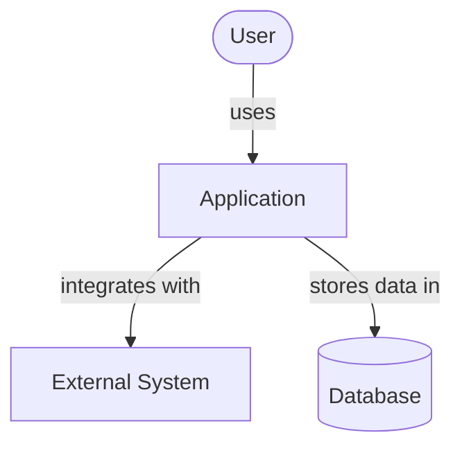
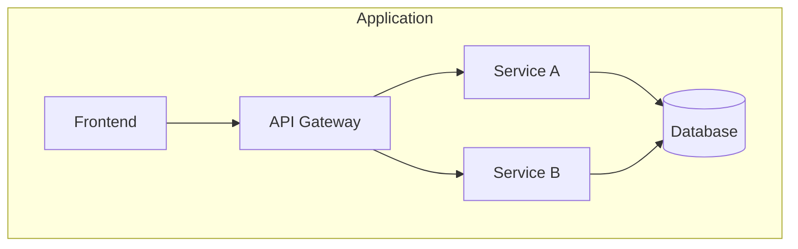
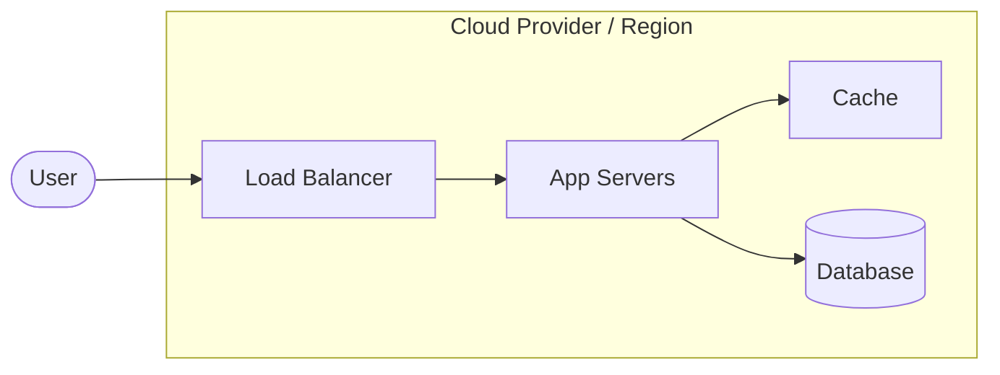
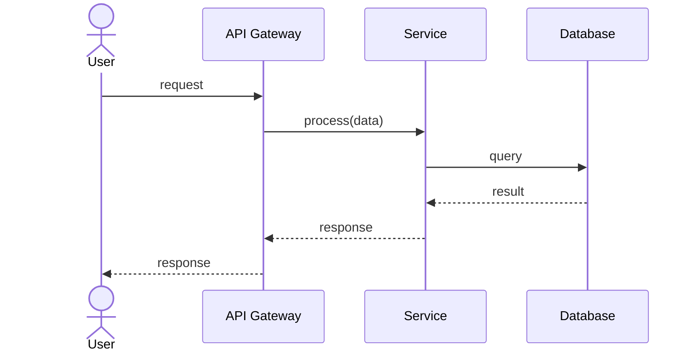

# Architecture Overview: <Project Name>

Last Updated: YYYY-MM-DD
Version: 1
Status: Draft

## Summary

<2-3 sentence description of the overall architecture approach>

## System Context

## Component Map

## Deployment Model

## Key Data Flows

### Flow: <Primary User Flow Name>

## Architecture Decisions

| ID | Decision | Rationale | Date |
|---|---|---|---|
| ADR-001 | | | YYYY-MM-DD |

## Open TODOs

<!-- - [ ] TODO-NNN: description (added YYYY-MM-DD) -->

## Change History

| Date | Change | GitHub Issue |
|---|---|---|
| YYYY-MM-DD | Initial architecture | — |
