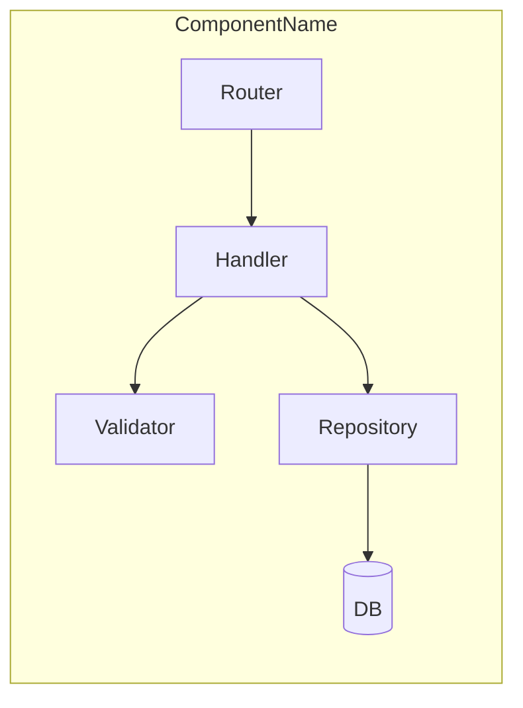
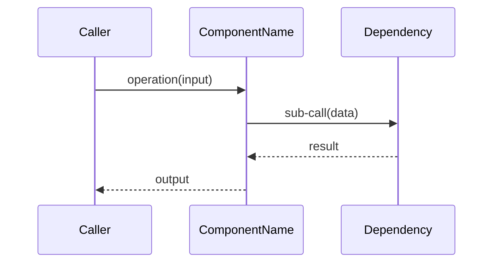
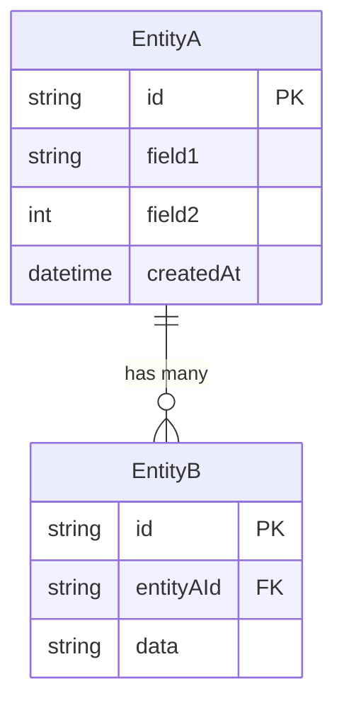

# Component Design: <Component Name>

Slug: `<component-slug>`
Last Updated: YYYY-MM-DD
Version: 1
Status: Draft

## Responsibility

<1-2 sentence statement of what this component does and what data/behavior it owns>

## Boundaries

- **Owns**: <data, state, or behavior this component is authoritative for>
- **Does NOT own**: <explicitly excluded responsibilities>

## Internal Structure

## Key Operations

### Operation: <Name>

## Data Models

## Public Interface

### REST API

| Method | Path | Auth | Request Body | Response | Description |
|---|---|---|---|---|---|
| GET | /resource/{id} | Required | — | ResourceDTO | Fetch resource by ID |
| POST | /resource | Required | CreateResourceDTO | ResourceDTO | Create resource |

### Events (if applicable)

| Event Name | Producer | Consumers | Schema |
|---|---|---|---|
| resource.created | This | ServiceB | `{ id, timestamp, data }` |

## Configuration

| Variable | Required | Default | Description |
|---|---|---|---|
| DATABASE_URL | Yes | — | PostgreSQL connection string |
| PORT | No | 8080 | HTTP listen port |

## Dependencies

| Dependency | Type | Purpose |
|---|---|---|
| ServiceName | Runtime | Provides X |
| LibraryName | Build | Used for Y |

## Open TODOs

<!-- - [ ] TODO-NNN: description (added YYYY-MM-DD) -->

## Change History

| Date | Change | GitHub Issue |
|---|---|---|
| YYYY-MM-DD | Initial design | — |
