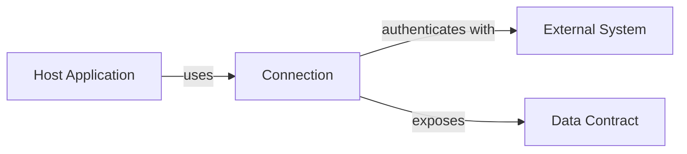

# Connections API Reference: <Project Name>

Last Updated: YYYY-MM-DD

## Overview

<1-2 sentence description of what a connection is and what external systems it can connect to>

## Connection Model



## Authentication

<Describe the supported authentication methods>

| Method | When to Use | Configuration |
|---|---|---|
| OAuth 2.0 | User-delegated access | `clientId`, `clientSecret`, `scopes` |
| API Key | Service-to-service | `apiKey` |

## Data Contract

Every connection must implement the following interface:

```typescript
interface Connection {
  id: string
  name: string
  authenticate(): Promise<AuthToken>
  read(query: Query): Promise<Result>
  write(payload: Payload): Promise<WriteResult>
  test(): Promise<ConnectionStatus>
}
```

## Error Handling

| Error Type | Cause | Host Behavior |
|---|---|---|
| `AuthError` | Invalid credentials | Prompt user to re-authenticate |
| `TimeoutError` | Request exceeded timeout | Retry with exponential backoff |
| `RateLimitError` | API rate limit hit | Pause and retry after cooldown |

## Configuration Schema

| Field | Type | Required | Default | Description |
|---|---|---|---|---|
| | | Yes/No | | |

## Change History

| Date | Change |
|---|---|
| YYYY-MM-DD | Initial |
