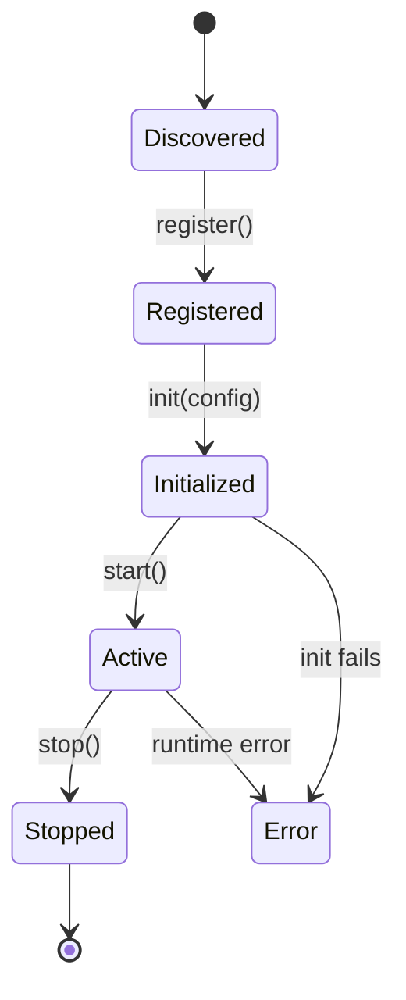

# Plugin API Reference: <Project Name>

Last Updated: YYYY-MM-DD

## Overview

<1-2 sentence description of what a plugin is and what it can do>

## Plugin Lifecycle



## Registration

<How a plugin registers itself with the host>

```typescript
// Example registration
```

## Configuration Schema

| Field | Type | Required | Default | Description |
|---|---|---|---|---|
| | | Yes/No | | |

## Lifecycle Hooks

| Hook | Signature | Called When |
|---|---|---|
| `register` | `() => PluginManifest` | On discovery |
| `init` | `(config: Config) => Promise<void>` | Before first use |
| `start` | `() => Promise<void>` | When host activates plugin |
| `stop` | `() => Promise<void>` | On teardown |

## Permissions & Sandboxing

<Description of what resources a plugin can access and any sandboxing constraints>

## Change History

| Date | Change |
|---|---|
| YYYY-MM-DD | Initial |
