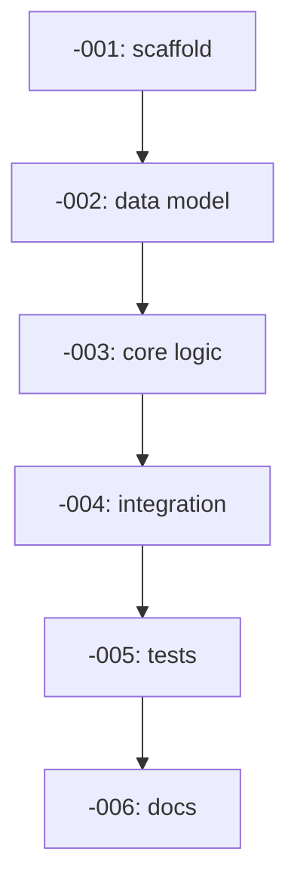

# `<COMPONENT>` Implementation Plan

> Derived from `design/components/<component>/design.md` on `<date>`.
> Source of truth: the design doc and `design/architecture/`.
> This plan is owned by the `implement-component` skill; regenerate fresh whenever the design changes.

## Summary

One paragraph: what the component does, where it sits in the architecture, why the implementation is split this way.

## Conventions

- Task prefix: `<PREFIX>-` (e.g. `WF-IMPL-`).
- Numbering starts at `<PREFIX>-<NNN>` (next free id after a `gh issue list --label component:<component>` scan).
- One task = one PR = one GitHub issue.
- Phases run sequentially; tasks within a phase may run in parallel if dependencies allow.

## Dependency graph

## Phase A — `<phase name>`

### `<PREFIX>-001`: `<imperative summary>`

- **Scope**:
  - `<file or module>` — `<what changes>`.
  - `<API or function>` — `<what it does>`.
- **Acceptance criteria**:
  - `<testable bullet 1>`.
  - `<testable bullet 2>`.
- **Depends on**: _(none)_.
- **Complexity**: S | M | L.

### `<PREFIX>-002`: `<imperative summary>`

- **Scope**: …
- **Acceptance criteria**: …
- **Depends on**: `<PREFIX>-001`.
- **Complexity**: S | M | L.

## Phase B — `<phase name>`

### `<PREFIX>-003`: `<imperative summary>`

- **Scope**: …
- **Acceptance criteria**: …
- **Depends on**: `<PREFIX>-002`.
- **Complexity**: S | M | L.

_(Repeat for each phase.)_

## Out of scope (deferred)

- `<item>` — `<why deferred>`.

## Open questions

- `<question 1>`.
- `<question 2>`.
