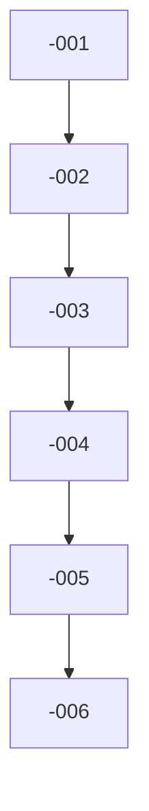

# `<PREFIX>-000-<COMPONENT>` — `<component>` implementation tracker

Coordinating issue for the `<component>` implementation. Generated by the
`implement-component` skill from
[`design/components/<component>/implementation-plan.md`](../blob/main/design/components/<component>/implementation-plan.md).

## References

- Design: [`design/components/<component>/design.md`](../blob/main/design/components/<component>/design.md)
- Implementation plan: [`design/components/<component>/implementation-plan.md`](../blob/main/design/components/<component>/implementation-plan.md)
- Architecture: [`design/architecture/components.md`](../blob/main/design/architecture/components.md)

## Phases & tasks

### Phase A — `<phase name>`

- [ ] #<NNN> — `<PREFIX>-001`: `
`
- [ ] #<NNN> — `<PREFIX>-002`: `
`

### Phase B — `<phase name>`

- [ ] #<NNN> — `<PREFIX>-003`: `
`
- [ ] #<NNN> — `<PREFIX>-004`: `
`

### Phase C — `<phase name>`

- [ ] #<NNN> — `<PREFIX>-005`: `
`
- [ ] #<NNN> — `<PREFIX>-006`: `
`

## Dependency graph

## Execution notes

- The `implement-component` skill walks this list top to bottom, skipping any
  task whose dependencies are not yet closed.
- One PR per task; one PR closes one task issue via `Closes #NNN`.
- This tracker is auto-ticked after each task merges and auto-closed when all
  boxes are checked.
