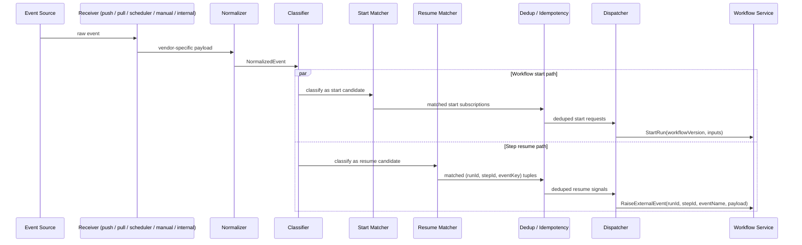

# Change: incon-005-trigger-pipeline

Date: 2026-05-17
Type: architecture
Sequence: 005
GitHub Issue: #30
Status: open

## Summary

Replace the trigger pipeline sequence diagram and supporting text in `design/architecture/overview.md` § Trigger Pipeline with a version that reflects REQ-080 (internal workflow-to-workflow triggers) and REQ-081 (dual-purpose event delivery: start + resume). The new diagram introduces the **Internal Event Receiver**, the **Classifier**, a split **Start Matcher / Resume Matcher** path, and the dual dispatch contract (`StartRun` and `RaiseExternalEvent`). Also fix the stale "modes declared in describe()" sentence to point at `events.delivery` on the connector manifest, per Connector Service changes 003/004.

## Before

Single linear pipeline `Receiver → Normalizer → Trigger Matcher → Dedup → Dispatcher → WF` with `StartRun` as the only dispatch target. No Classifier, no Resume Matcher, no Internal Event Receiver. Closing paragraph asserted that connector types "declare supported modes (push, pull, or both) in `describe()`" — stale after Connector Service changes 003/004.

## After

Receiver inventory expanded to push / pull / scheduler / manual / **internal**. New text:
- Describes the Internal Event Receiver (subscribes to `custos.workflow.events`).
- Defines the Classifier and its two-way fan-out to Start / Resume Matchers.
- Notes that a single event can match both paths concurrently.
- Calls out the Workflow Service's ownership of `RegisterResumeSubscription` / `CancelResumeSubscription`.
- Replaces the stale `describe()` modes assertion with: delivery modes come from `events.delivery` on the connector manifest.
- Forward-references `design/components/trigger-service/design.md` as the normative spec.

## Impact

- Closes the last of the five HIGH inconsistencies. Overview now correctly represents that the trigger pipeline serves both workflow-start and step-resume traffic.
- Surfaces the `RegisterResumeSubscription` and `custos.workflow.events` interfaces in the architecture overview — preparing the ground for the upcoming Workflow Service detailed design.
- Removes a contradiction between the overview's mode-declaration text and Connector Service changes 003 (remove `supportedModes`) and 004 (move event-delivery vocabulary into `events.delivery`).
- Two related lower-severity issues remain open and will be cleaned up separately: INCON-008 (#33, `describe()` hook description elsewhere in overview), INCON-016 (#42, trigger pipeline text restating the same stale rule in a different location).

## Related Requirements

- REQ-079, REQ-080 (#15), REQ-081 (#16)
- `design/components/trigger-service/design.md` § Internal Structure, § Key Operations (authoritative)
- `design/requirements/changes/2026-05-16-005-trigger-service-scope-additions.md`
- Issues: #30 (this change), #33 (INCON-008), #42 (INCON-016)
