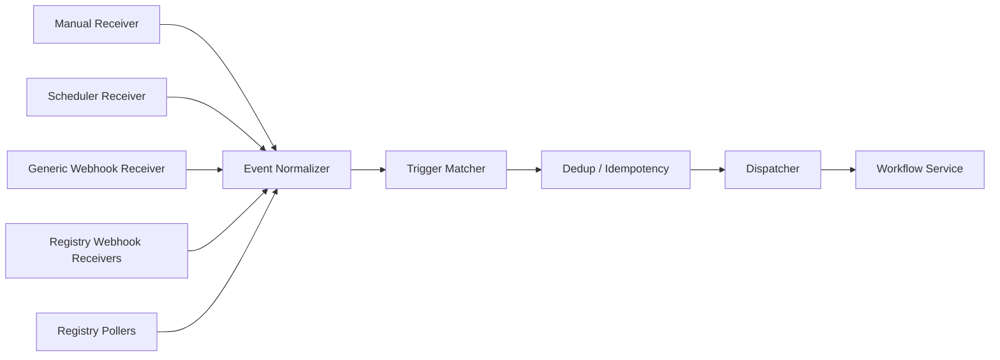
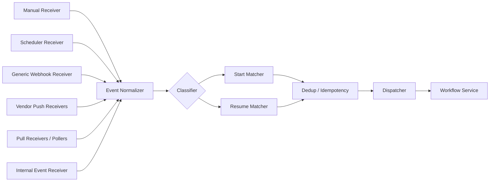

# Change: incon-006-comp-004-trigger-receivers

Date: 2026-05-17
Type: architecture
Sequence: 007
GitHub Issue: #31
Status: open

## Summary

Update the COMP-004 Trigger Service internal-architecture diagram in `design/architecture/components.md` to match the current Trigger Service component design. Generalize the receiver labels away from registry-specific names, add the Internal Event Receiver (REQ-080), and lift the Classifier + dual Start/Resume matcher path (REQ-081) so the registry-only abstraction is gone from the architecture-level view.

## Before

Caption: "Vendor-specific receivers are loaded dynamically from configured connectors that implement `listen()` (ADR-013)."

## After

Caption expanded to mention REQ-079 source generality, REQ-080 internal events, and REQ-081 dual delivery.

## Impact

- Architecture-level view now agrees with `design/components/trigger-service/design.md` § Internal Structure.
- Removes registry-specific framing that contradicted REQ-079 (push/pull for all source categories).
- Surfaces the Internal Event Receiver and `custos.workflow.events` topic at the architecture overview's COMP-004 entry, helping the upcoming Workflow Service design session.
- Closes one of the two MEDIUM trigger-pipeline architecture inconsistencies remaining after INCON-005 was merged.

## Related Requirements

- `design/components/trigger-service/design.md` § Internal Structure (authoritative)
- `design/architecture/changes/2026-05-17-005-incon-005-trigger-pipeline.md`
- REQ-079, REQ-080, REQ-081
- Issues: #31 (this change), #30 (INCON-005, related overview-level fix)
