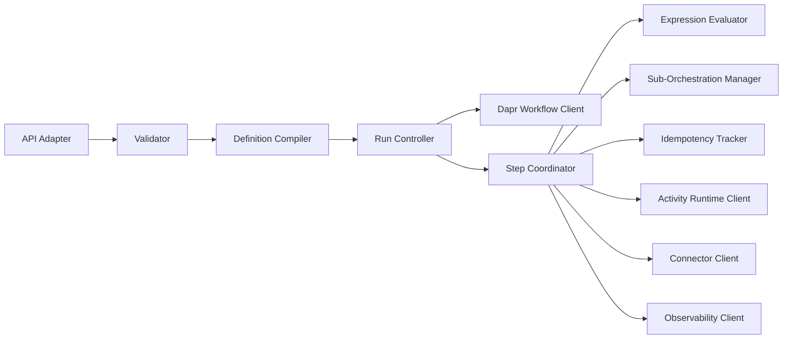
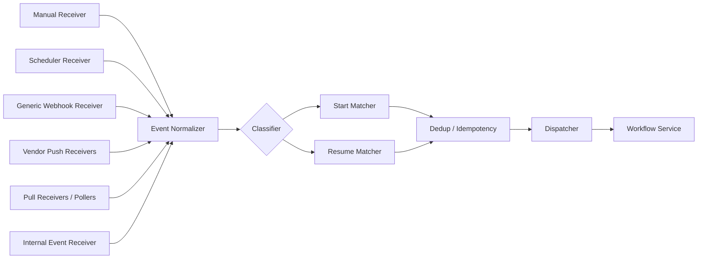
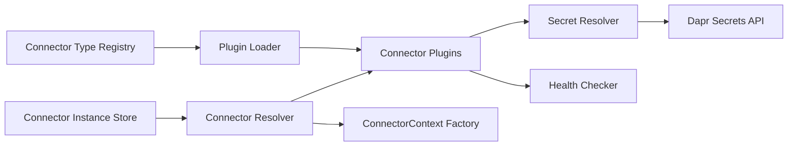
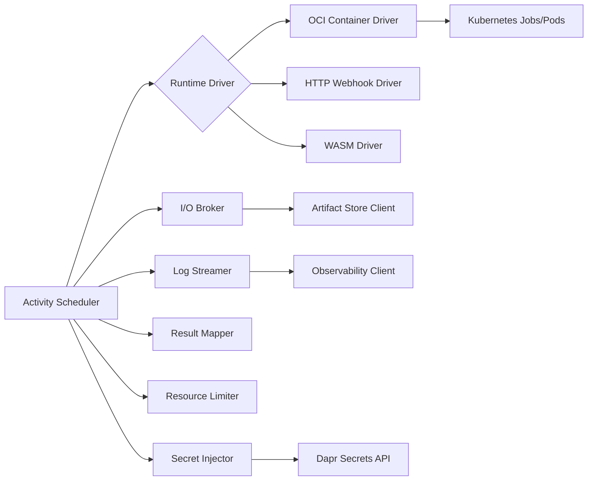
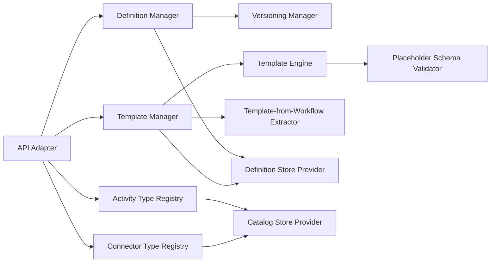
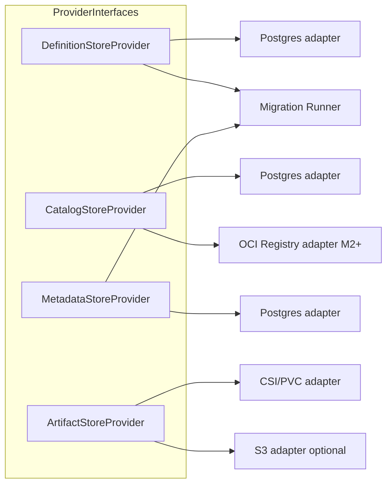
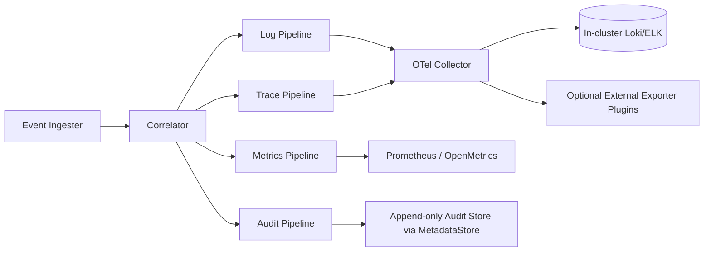

# Component Registry: Custos

Last Updated: 2026-05-17

## Components

| ID | Name | Slug | Responsibility | Tech Stack | Status |
|---|---|---|---|---|---|
| COMP-001 | API Gateway | api-gateway | Unified entrypoint for UI, CLI, SDK, and automation APIs | Python, FastAPI, Dapr sidecar | Designed |
| COMP-002 | AuthN/AuthZ Service | auth-service | OIDC login, service token auth, RBAC enforcement | Python, OIDC libs, Dapr | Designed |
| COMP-003 | Workflow Service | workflow-service | Workflow validation, versioning, orchestration lifecycle | Python, Dapr Workflow | Designed |
| COMP-004 | Trigger Service | trigger-service | Generic push/pull trigger ingestion, normalization, and dispatch across source categories | Python, Dapr Pub/Sub | Designed |
| COMP-005 | Connector Service | connector-service | Connector runtime and connector plugin loading/execution | Python plugin runtime, Dapr Secrets | Designed |
| COMP-006 | Activity Runtime Manager | activity-runtime-manager | Activity resolution, execution, lifecycle, and result mapping | Python, Kubernetes Jobs, Dapr | Designed |
| COMP-007 | Definition/Template/Catalog Service | catalog-service | Workflow definitions, template lifecycle, activity/connector catalog metadata | Python, provider abstractions | Designed |
| COMP-008 | Storage Provider Layer | storage-provider-layer | Abstraction and adapters for definitions, metadata, catalog, and artifacts | Python interfaces, provider plugins | Designed |
| COMP-009 | Observability and Audit Service | observability-audit-service | Structured execution events, audit records, logs/traces/metrics export | OpenTelemetry, Kubernetes logging stack | Designed |
| COMP-010 | Web UI and Template Designer | web-ui | Workflow authoring, template authoring, run inspection and ops UX | React, TypeScript | Defined |

## Internal Architecture

Sub-module breakdowns for the major control-plane components. Each diagram defines the surface area for future detailed component-design sessions.

### COMP-003 Workflow Service

Key sub-modules:
- `Definition Compiler` turns YAML/SDK definitions into an internal execution graph.
- `Run Controller` drives one Dapr Workflow per Custos run (start, pause, resume, cancel).
- `Step Coordinator` selects the right primitive for each graph node.
- `Expression Evaluator` is a sandboxed CEL-like evaluator (ADR-011).
- `Sub-Orchestration Manager` handles dynamic loops and approval gates (ADR-007).
- `Idempotency Tracker` issues deterministic keys per `(runId, stepId, attempt)`.

### COMP-004 Trigger Service

Vendor-specific push and pull receivers are loaded dynamically from configured connectors that implement `listen()` (ADR-013); receivers are source-agnostic per REQ-079. The Internal Event Receiver subscribes to the `custos.workflow.events` Dapr Pub/Sub topic and feeds workflow lifecycle events into the same pipeline (REQ-080). The Classifier routes each normalized event onto the start path, the resume path, or both, supporting REQ-081 dual-purpose delivery.

### COMP-005 Connector Service

Plaintext credentials never traverse the API; plugins receive opaque secret handles.

### COMP-006 Activity Runtime Manager

Adding a new runtime = adding a new `Runtime Driver`. The contract above the driver layer stays unchanged.

### COMP-007 Catalog / Template Service

`Template-from-Workflow Extractor` consumes a workflow version plus a set of selectors and emits a `WorkflowTemplate`.

### COMP-008 Storage Provider Layer

Each interface is small and stable. New backends are adapters; the rest of the platform is unaware of them.

### COMP-009 Observability and Audit Service

Audit is structurally separate so it can carry stronger retention and tamper-evidence rules (ADR-010).

## Component Relationships

| From | To | Relationship |
|---|---|---|
| COMP-010 | COMP-001 | UI calls REST APIs |
| COMP-001 | COMP-002 | Delegates authentication and authorization checks |
| COMP-001 | COMP-003 | Starts and manages workflow runs |
| COMP-001 | COMP-004 | Registers and manages trigger configurations |
| COMP-001 | COMP-005 | Manages connector type registration and connector instance lifecycle |
| COMP-001 | COMP-007 | Creates/reads workflow definitions and templates |
| COMP-003 | COMP-005 | Resolves and uses connector instances |
| COMP-003 | COMP-006 | Schedules and observes activity execution |
| COMP-003 | COMP-008 | Reads/writes workflow state and metadata via abstractions |
| COMP-003 | COMP-009 | Emits execution telemetry and audit events |
| COMP-006 | COMP-005 | Uses connector contexts for activity calls |
| COMP-006 | COMP-008 | Persists step outputs and artifacts via abstractions |
| COMP-007 | COMP-008 | Stores definitions, templates, and catalog entries via provider interfaces |
| COMP-009 | COMP-008 | Persists audit metadata and references |
