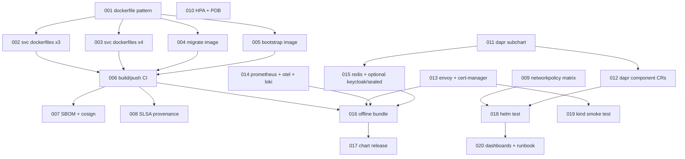

# Deployment Implementation Plan — `DEPLOY-IMPL`

Turns the approved [reference deployment design](./reference-deployment.md) (v2, #75)
into a phased, GitHub-tracked implementation plan. The deployment is already
~60% scaffolded (umbrella chart, 8 service subcharts, migrate/bootstrap hooks,
4 profile overlays). This plan **completes the gaps** — container images, image
build/publish CI with supply-chain attestations, per-service chart templates,
Dapr wiring, vendored infra subcharts, offline packaging, and verification — it
does not redesign what exists.

Prefix: `DEPLOY-IMPL`. Tracker: `DEPLOY-IMPL-000`.

## Decisions carried from the design (issue answers)

- **D1** — Dapr stays the service-to-service layer (no Istio/Linkerd).
- **D2** — All Custos-authored images standardize on `python:3.14-slim`.
- **D3** — Dapr pub/sub backend = Redis (vendored broker) + Postgres-backed component.
- **D4** — `custos-bootstrap` is a dedicated image (from `src/jobs/bootstrap/`).
- **D5** — Built-in actions (vuln-scan / signature-verify) are out of scope (tracked separately).
- **OCI annotations** — immutable image-manifest annotations:
  `org.opencontainers.image.{created,version,revision,source,title,licenses}` +
  vendor `vnd.custos.build.{tag,actor,agent,run-id,run-url}`.
- **Attestations** — Syft SBOM (SPDX + CycloneDX), SLSA Build L3 provenance,
  keyless cosign (Fulcio + Rekor) signatures over image + SBOM + provenance.

## Phases & tasks

### Phase A — Container images

- **DEPLOY-IMPL-001** — Standard multi-stage Dockerfile pattern + `.dockerignore`
  on `api-gateway` (reference impl): `python:3.14-slim`, repo-root build context
  installing declared `custos-*` path libs + the service wheel, non-root UID 1000,
  console-script entrypoint, probes, OCI annotation build args. (M)
- **DEPLOY-IMPL-002** — Dockerfiles for `auth-service`, `workflow-service`,
  `trigger-service` following the 001 pattern. (M)
- **DEPLOY-IMPL-003** — Dockerfiles for `connector-service`,
  `activity-runtime-manager`, `catalog-service`, `observability-audit-service`. (M)
- **DEPLOY-IMPL-004** — `custos-migrate` job image: populate `src/jobs/migrate/`
  (entrypoint runs SPL strict `migrate up`). (M)
- **DEPLOY-IMPL-005** — `custos-bootstrap` job image: populate `src/jobs/bootstrap/`
  (idempotent permissions/roles + default tenant/workspace + admin binding). (M)

### Phase B — Image build/publish CI + supply chain

- **DEPLOY-IMPL-006** — Reusable `build-images` workflow: `docker buildx build --push`
  to `ghcr.io/toddysm/custos/<name>`, matrix over the 10 images, immutable OCI
  manifest annotations via `--annotation`. (L)
- **DEPLOY-IMPL-007** — SBOM (Syft SPDX + CycloneDX) generation + keyless cosign
  signing + attach for every image and the connector bundle. (M)
- **DEPLOY-IMPL-008** — SLSA Build L3 provenance generation + cosign attest +
  documented offline verification policy. (M)

### Phase C — Per-service Helm template completion

- **DEPLOY-IMPL-009** — NetworkPolicy template across all 8 services implementing
  the design's allow matrix (resolves design TODO-004); keep deny-all default. (M)
- **DEPLOY-IMPL-010** — HPA + PDB templates (HA-profile-gated) across all services. (M)

### Phase D — Dapr wiring

- **DEPLOY-IMPL-011** — Vendor Dapr as a subchart (`dapr.install` toggle) + values
  wiring (resolves design TODO-006). (M)
- **DEPLOY-IMPL-012** — Dapr Component CRs (statestore=CNPG, secretstore, pubsub=Redis
  + Postgres) + Subscription CRs for trigger/observability consumers. (L)

### Phase E — Infra subcharts

- **DEPLOY-IMPL-013** — Vendor Envoy Gateway + cert-manager subcharts (install toggles). (M)
- **DEPLOY-IMPL-014** — Vendor Prometheus + OTel Collector + Loki subcharts. (M)
- **DEPLOY-IMPL-015** — Vendor Redis subchart (pub/sub broker); optional Keycloak +
  Sealed Secrets subcharts (default off, resolves design TODO-001). (M)

### Phase F — Packaging & release

- **DEPLOY-IMPL-016** — Offline bundle automation: real `make bundle` +
  `deploy/offline/Makefile` + `offline-bundle` CI (vendored charts + `docker save`
  archives + connectors + checksums). (L)
- **DEPLOY-IMPL-017** — Helm chart OCI package/release workflow on tag. (S)

### Phase G — Verification & docs

- **DEPLOY-IMPL-018** — `helm test` synthetic scenarios: login → create workspace →
  register connector → start workflow → inspect run (resolves design TODO-003). (M)
- **DEPLOY-IMPL-019** — kind-based install smoke test in CI. (M)
- **DEPLOY-IMPL-020** — Grafana dashboard bundle (design TODO-005) + breaking-schema
  upgrade runbook (design TODO-007). (S)

## Dependency graph

## Out of scope (tracked separately)

- Built-in actions vuln-scan (REQ-016) / signature-verify (REQ-018) images.
- Web UI (COMP-010) deployment (M2+).
- policy-eval action (M2).

## References

- Design: [`design/architecture/reference-deployment.md`](./reference-deployment.md)
- Origin: #75
