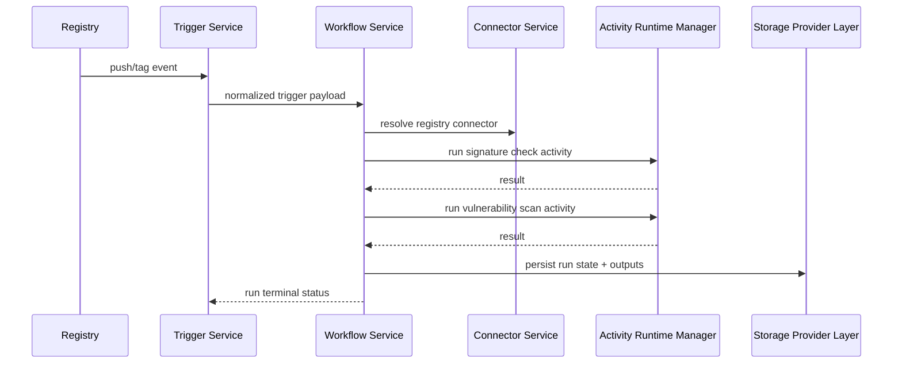
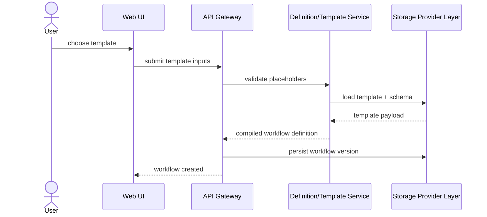
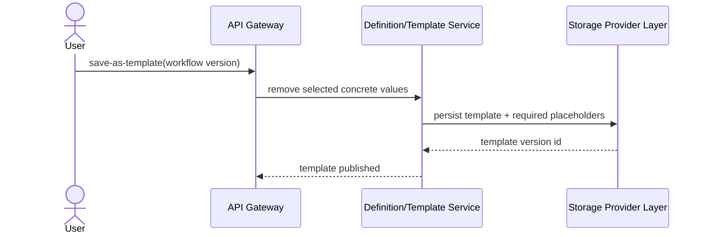

# Architecture Overview: Custos

Last Updated: 2026-05-14
Version: 1
Status: Draft

## Summary

Custos is a Kubernetes-native workflow platform for supply-chain security operations, built around durable orchestration with Dapr Workflow and strict extensibility boundaries for connectors, activities, and storage providers.

The architecture is intentionally split into a thin control plane and a pluggable extension plane. The platform must run fully self-contained on a single Kubernetes cluster by default, while still allowing optional external/cloud integrations.

## System Context


## Component Map

```mermaid
graph TD
    subgraph Custos Control Plane
        UI[Web UI + Template Designer]
        API[API Gateway]
        Auth[AuthN/AuthZ Service]
        WF[Workflow Service]
        Trig[Trigger Service]
        Conn[Connector Service]
        Act[Activity Runtime Manager]
        Cat[Definition/Template/Catalog Service]
        Obs[Observability and Audit Service]
        Store[Storage Provider Layer]
    end

    subgraph Dapr Runtime
        DWF[Dapr Workflow]
        DPUB[Dapr Pub/Sub]
        DSEC[Dapr Secrets API]
    end

    subgraph In-Cluster Dependencies (Default)
        SQL[(In-cluster PostgreSQL)]
        REDIS[(In-cluster Redis)]
        ART[(Kubernetes-backed Artifact Store)]
        LOG[(Kubernetes Logging Stack)]
    end

    subgraph Extension Plane
        CPlugins[Connector Plugins]
        APlugins[Activity Plugins]
        SPlugins[Storage Provider Plugins]
        LPlugins[Log Exporter Plugins]
    end

    UI --> API
    API --> Auth
    API --> WF
    API --> Trig
    API --> Cat

    WF --> DWF
    Trig --> DPUB
    WF --> Conn
    WF --> Act
    WF --> Cat
    WF --> Obs
    WF --> Store

    Conn --> CPlugins
    Act --> APlugins
    Store --> SPlugins
    Obs --> LPlugins

    Store --> SQL
    Store --> REDIS
    Store --> ART
    Obs --> LOG

    Conn --> DSEC
    Act --> DSEC
```

## Deployment Model


## Key Data Flows

### Flow: Registry Event to Policy Gate



### Flow: Create Workflow from Template



### Flow: Create Template from Existing Workflow



## Architecture Decisions

| ID | Decision | Rationale | Date |
|---|---|---|---|
| ADR-001 | Keep control plane thin and extension-driven | Prevent domain logic from hard-coding into the core platform | 2026-05-14 |
| ADR-002 | Single-cluster self-contained deployment is the hard baseline | Satisfies portability and self-hosting requirement (REQ-077) | 2026-05-14 |
| ADR-003 | Introduce storage provider abstractions for definitions, catalog, metadata, and artifacts | Avoid hard lock-in to one database or object store (REQ-048, REQ-050) | 2026-05-14 |
| ADR-004 | Use Kubernetes-native logging/audit pipeline by default with pluggable exporters | Keeps default ops model cluster-local while enabling cloud sinks later (REQ-078) | 2026-05-14 |
| ADR-005 | Separate connectors from activities | Connectors model access; activities model operations (REQ-074, REQ-075) | 2026-05-14 |
| ADR-006 | Support first-class workflow templates | Speeds workflow authoring and reuse (REQ-076) | 2026-05-14 |

## Open TODOs

- [ ] Finalize activity isolation strategy for OCI activity pods (issue #4)
- [ ] Finalize registry trigger strategy (webhook vs polling mix) (issue #5)
- [ ] Finalize versioned activity contract schema and compatibility rules (issue #6)

## Change History

| Date | Change | GitHub Issue |
|---|---|---|
| 2026-05-14 | Initial architecture draft with single-cluster baseline, templates, and provider abstractions | — |
