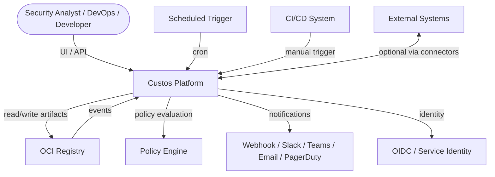
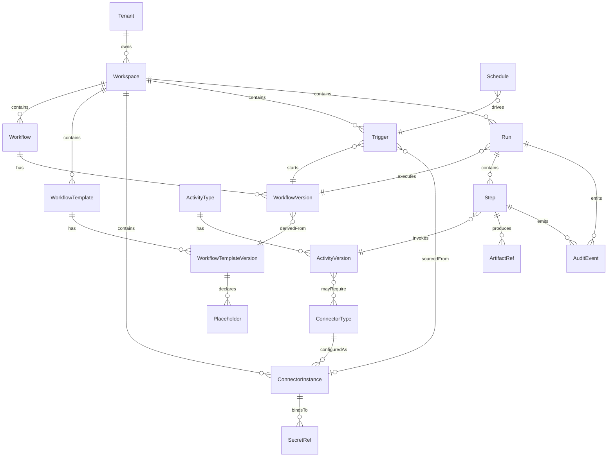
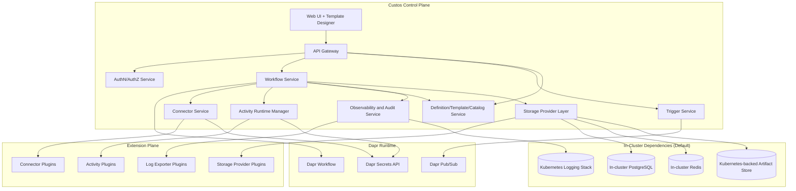
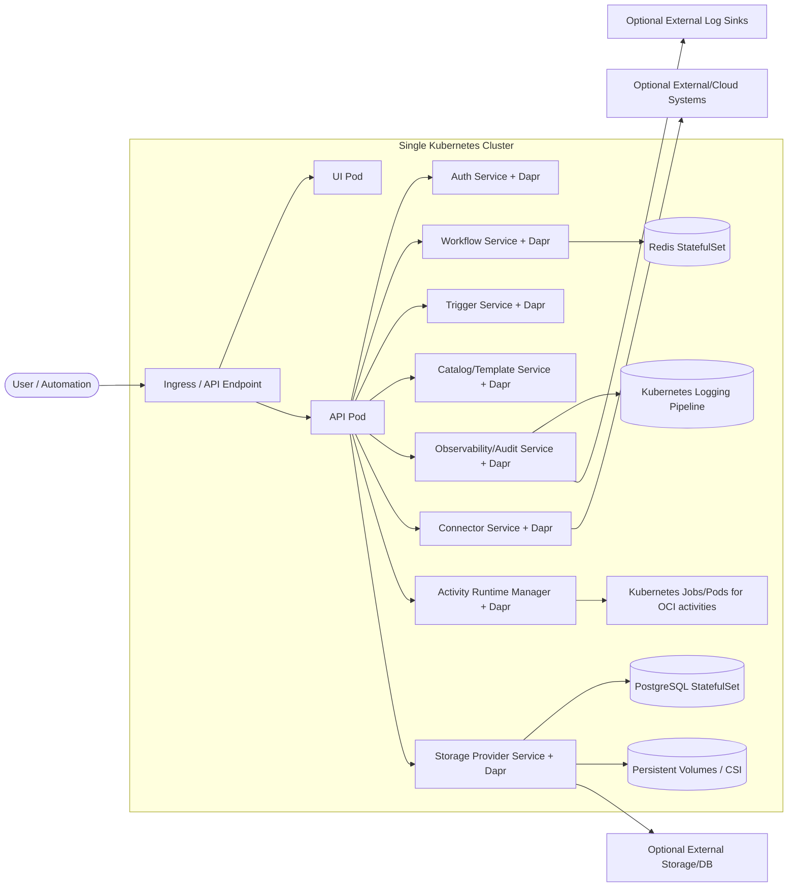
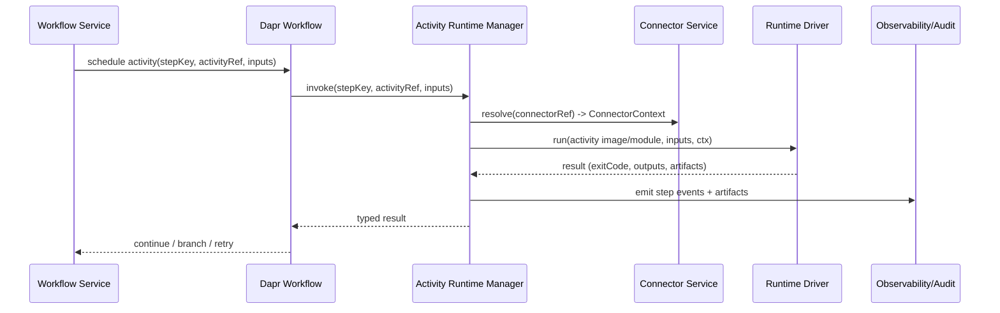
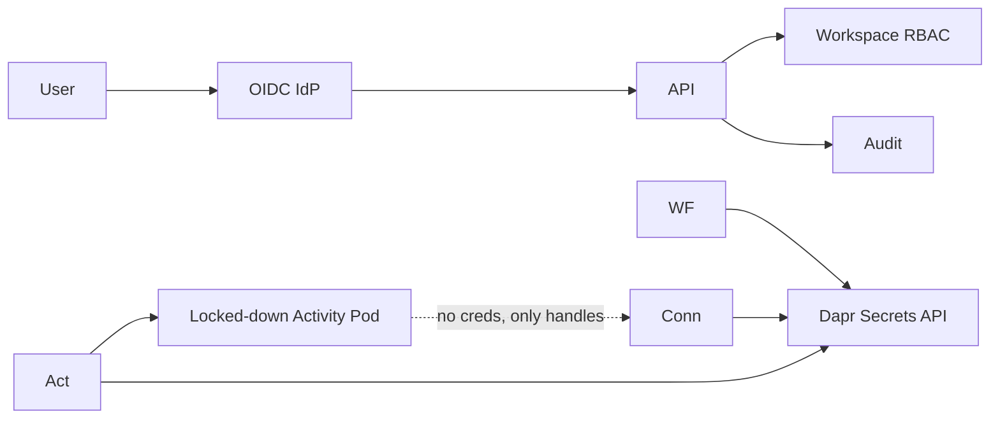
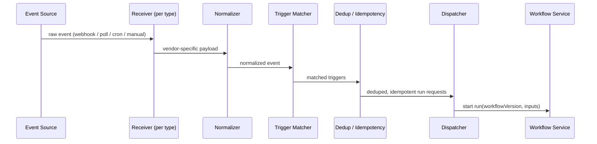
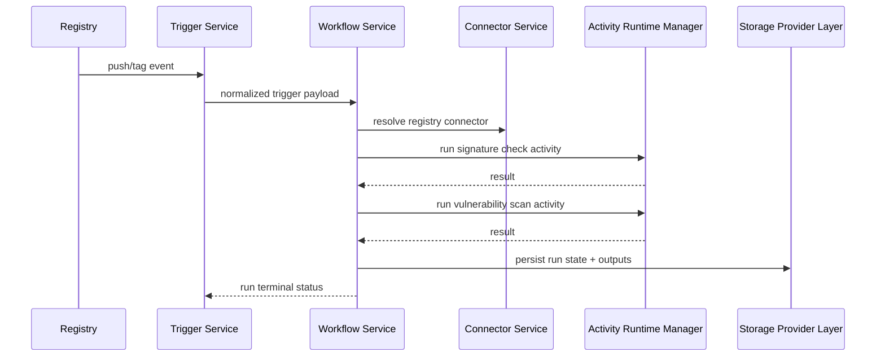
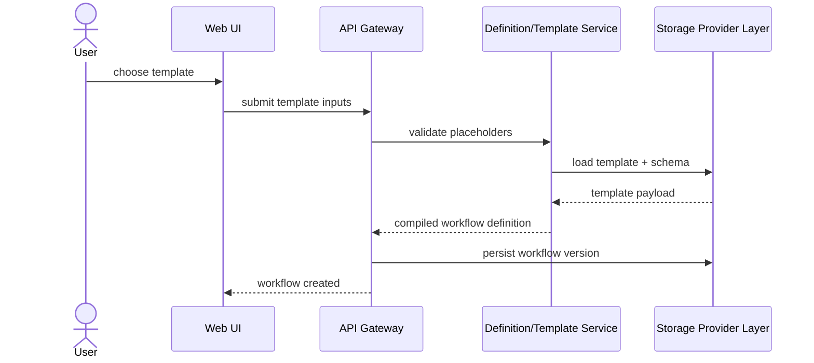
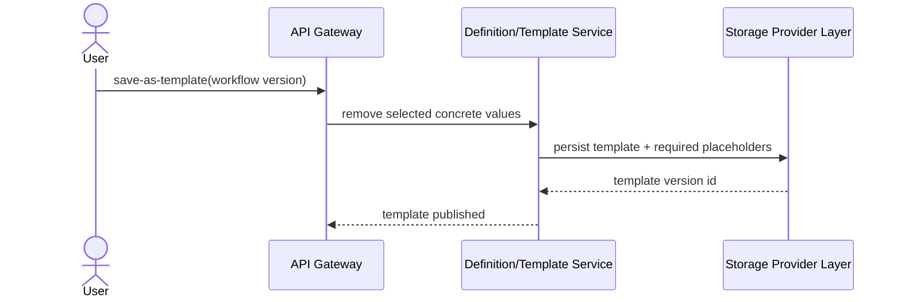

# Architecture Overview: Custos

Last Updated: 2026-05-17
Version: 3
Status: Draft

## Summary

Custos is a Kubernetes-native workflow platform for supply-chain security operations, built around durable orchestration with Dapr Workflow and strict extensibility boundaries for connectors, activities, and storage providers.

The architecture is intentionally split into a thin control plane and a pluggable extension plane. The platform must run fully self-contained on a single Kubernetes cluster by default, while still allowing optional external/cloud integrations.

## Architectural Principles

1. **Thin core, fat extensions.** The platform owns only definitions, execution state, trigger ingestion, connector mediation, activity execution, storage abstraction, and observability. Everything else is a plugin.
2. **Versioned contracts everywhere.** Activity contract, connector contract, storage-provider contract, workflow schema, and audit-event schema all carry explicit versions and compatibility rules.
3. **Single-cluster baseline (REQ-077).** v1 must run end-to-end on one Kubernetes cluster with no external dependencies. External backends are adapters/exporters.
4. **Idempotency at step boundaries.** Steps are the durability unit. Activity execution must be safe to retry against the same step key.
5. **Connectors model access; activities model operations.** Activities never embed credentials or transport details; they receive a `ConnectorContext`.
6. **Templates are workflows with placeholders.** Templates share the workflow schema; they are not a parallel model.

## System Context



## Domain Model



`Tenant` and `Workspace` are present in the data model from day one even though multi-tenancy ships in M3 (ADR-012). `WorkflowVersion` and `WorkflowTemplateVersion` are immutable. `ArtifactRef` is always content-addressed; blobs never live inline in metadata.

## Component Map



## Deployment Model



## Workflow and Template Schema

Workflows and templates share one YAML schema. Templates declare `placeholders` that must be supplied when a workflow is materialized from the template (ADR-009). Expressions use a pure CEL-like language; arbitrary Python `eval` is never used at orchestration time (ADR-011).

Example workflow:

```yaml
apiVersion: custos.dev/v1
kind: Workflow
metadata:
  name: registry-quarantine
  workspace: default
spec:
  triggers:
    - type: registry.push
      connector: prod-registry
  inputs:
    image:
      type: string
  steps:
    - id: scan
      activity: vuln-scan@2
      connector: prod-registry
      with:
        image: ${{ inputs.image }}
    - id: gate
      if: ${{ steps.scan.outputs.critical > 0 }}
      activity: quarantine@1
      connector: prod-registry
      with:
        image: ${{ inputs.image }}
        reason: ${{ steps.scan.outputs.summary }}
```

Equivalent template:

```yaml
apiVersion: custos.dev/v1
kind: WorkflowTemplate
metadata:
  name: registry-quarantine-template
spec:
  placeholders:
    - name: registryConnector
      type: connectorRef
      connectorType: oci-registry
      required: true
    - name: scanActivity
      type: activityRef
      activityType: vuln-scan
      default: vuln-scan@2
  workflow:
    triggers:
      - type: registry.push
        connector: ${{ placeholders.registryConnector }}
    steps:
      - id: scan
        activity: ${{ placeholders.scanActivity }}
        connector: ${{ placeholders.registryConnector }}
```

## Execution Model

Custos primitives map onto Dapr Workflow primitives:

| Custos concept | Dapr Workflow primitive |
|---|---|
| Run | Workflow instance |
| Step (activity invocation) | Activity task |
| Parallel block | `when_all` / fan-out fan-in |
| Loop / dynamic fan-out | Sub-orchestration (ADR-007) |
| Approval gate | Sub-orchestration with external event |
| Wait / sleep | Durable timer |
| Retry policy | Workflow-level retry plus activity-level retry |

Step execution sequence:



## Activity Contract v1

Activities receive inputs and a `ConnectorContext` and return typed outputs plus optional artifacts. They never see plaintext credentials. Filesystem layout inside an activity container:

| Path | Purpose |
|---|---|
| `/custos/in/inputs.json` | Resolved step inputs |
| `/custos/in/ctx.json` | `ConnectorContext` (opaque handles, endpoints, capabilities) |
| `/custos/in/secrets/<name>` | Mounted secret materials (per binding, never logged) |
| `/custos/out/outputs.json` | Typed step outputs |
| `/custos/out/artifacts/` | Files captured as `ArtifactRef`s |
| `/custos/out/audit.jsonl` | Optional structured activity audit events |

Result codes (ADR-008):

| Exit code | Meaning |
|---|---|
| 0 | Success |
| 1 | Retryable failure (network, transient registry error) |
| 2 | Permanent failure (invalid input, policy violation) |
| 3 | Cancelled or timed out |

Example manifest for a built-in activity (illustrative; full normative spec lives in the ARM component design):

```yaml
apiVersion: custos.dev/v1
kind: ActivityManifest
metadata:
  type: scan-image
  version: 1.2.0
  namespace: custos.builtin
  description: "Scan an OCI image for vulnerabilities using Trivy."
  labels:
    category: security
    engine: trivy
  owner: "custos-maintainers"
spec:
  contractVersion: "1"
  runtime:
    kind: oci-container
    image: ghcr.io/custos/scan-image:1.2.0
    digest: sha256:abc...             # required; pinned at publish time
    isolation:
      minTier: microvm                # process | vm | microvm
      preferred: microvm-firecracker
  inputs:
    schema:
      $schema: "https://json-schema.org/draft/2020-12/schema"
      type: object
      required: [image]
      properties:
        image:    { $ref: "custos://types/ImageRef" }
        severity: { type: string, enum: [low, medium, high, critical], default: high }
  outputs:
    schema:
      $schema: "https://json-schema.org/draft/2020-12/schema"
      type: object
      required: [findings, reportRef]
      properties:
        findings: { type: integer }
        reportRef: { $ref: "custos://types/ArtifactRef" }
    artifacts:
      - name: report
        mediaType: application/vnd.cyclonedx+json
        required: true
  connectors:
    - name: registry
      type: oci-registry
      required: true
      capabilities: [pull]
  resources:
    cpu:    { request: "500m", limit: "2" }
    memory: { request: "512Mi", limit: "2Gi" }
    timeout: PT15M                    # required (ISO-8601 duration)
  errors:
    - code: registry.unauthorized
      class: permanent
```

Key contract points (see [Activity Runtime Manager design — Activity Manifest v1](../components/activity-runtime-manager/design.md#activity-manifest-v1) for the normative specification):

- `kind` is `ActivityManifest`; JSON is the on-disk and wire format (YAML for examples only).
- `(metadata.namespace, metadata.type, metadata.version)` is the primary key; each version is a separate manifest artifact.
- Three namespace tiers — `custos.builtin`, `<vendor>`, `<workspaceId>` — with reserved prefixes (`custos.*`, `system.*`, `platform.*`, `builtin.*`).
- `runtime.digest` is **required**; tag drift cannot silently change activity behavior.
- `runtime.isolation.minTier` and `isolation.preferred` carry RuntimeClass hints (`process` / `vm` / `microvm`).
- Input/output schemas are inline JSON Schema (Draft 2020-12) and may `$ref` platform types via `custos://types/<Name>`.
- File outputs are declared separately in `spec.outputs.artifacts[]`.
- Connector slots are named with `name`, `type`, `required`, and capability list.
- `spec.resources.timeout` is **required** and ISO-8601 (`PT15M`); `cpu`/`memory` are optional.
- `spec.errors[]` documents per-activity error codes; ADR-008 exit codes still apply.
- v1 workflow/template references are fully qualified (`acme/scan-image@1`); short-form resolution is deferred.

## Connector Contract v1

A connector plugin implements four hooks:

| Hook | Purpose |
|---|---|
| `describe()` | Return connector type, supported capabilities, config schema |
| `validate(config)` | Validate an instance configuration and required secrets |
| `bind(instance) -> ConnectorContext` | Produce a context activities can use (endpoints, opaque secret handles, capabilities) |
| `listen(instance) -> EventStream` | Optional: emit normalized trigger events for this instance |

`ConnectorContext` shape (illustrative):

```json
{
  "connectorType": "oci-registry",
  "instanceId": "prod-registry",
  "endpoints": { "api": "https://registry.example.com" },
  "secrets": { "auth": "secret-handle://..." },
  "capabilities": ["push", "pull", "tag", "copy"],
  "version": "1"
}
```

_Note: deeper specification (capability negotiation, listen-stream semantics, error model, lifecycle, plugin packaging) is deferred to a dedicated component-design session — see Open TODOs below._

## Storage Provider Contract

Four small interfaces isolate the platform from any specific backend (ADR-003):

| Interface | Owns | v1 adapter | M2+ options |
|---|---|---|---|
| `DefinitionStoreProvider` | Workflow + template definitions and versions | PostgreSQL | OCI registry, Git |
| `CatalogStoreProvider` | Activity types, connector types, capability metadata | PostgreSQL | OCI registry |
| `MetadataStoreProvider` | Runs, steps, audit events, trigger state | PostgreSQL | Managed Postgres, cloud DBs |
| `ArtifactStoreProvider` | Step artifacts (SBOMs, scan reports, attestations) | CSI/PVC | S3-compatible, OCI artifact store |

Migrations live with the interface, not with adapters; adapters declare which migration revisions they implement.

## Security Architecture



- **AuthN**: OIDC for humans, service tokens / workload identity for automation.
- **AuthZ**: workspace-scoped RBAC; built-in roles plus custom roles.
- **Secrets**: only Dapr Secrets API; activities receive opaque handles.
- **Workspace isolation**: every API call, run, artifact, and audit event is tagged with a workspace; cross-workspace access is denied by default.
- **Activity isolation**: each activity invocation runs in a dedicated pod with non-root user, read-only root FS, no host networking, CPU/memory limits, and per-step ephemeral volumes (final policy deferred to issue #4 / TODO-002).
- **Audit**: append-only stream, separate retention from ops logs (ADR-010).

## Observability and Audit

Four independent pipelines share correlation fields (`run_id`, `step_id`, `workflow_version`, `workspace`, `tenant`):

| Pipeline | Default v1 | Pluggable exporter |
|---|---|---|
| Logs | In-cluster Loki/ELK via OTel Collector | Cloud log services |
| Metrics | Prometheus / OpenMetrics scrape | Managed metrics backends |
| Traces | OTel Collector → in-cluster Tempo/Jaeger | OTLP exporters |
| Audit | MetadataStoreProvider (append-only) | External SIEM exporters |

v1 metrics (illustrative):

- `custos_runs_total{workflow,workspace,status}`
- `custos_run_duration_seconds{workflow,workspace}`
- `custos_step_duration_seconds{activity,status}`
- `custos_activity_failures_total{activity,reason}`
- `custos_trigger_events_total{type,connector,result}`
- `custos_connector_health{connector_type,instance}`

Audit event examples: `run.started`, `step.completed`, `activity.failed`, `connector.bound`, `template.materialized`, `workflow.version.published`.

## Trigger Pipeline



Vendor-specific knowledge about OCI registries (Docker Hub, GHCR, ACR, ECR, GAR, Harbor, …) lives only in receivers and connector plugins (ADR-013). The rest of the pipeline operates on a normalized event schema.

Receivers come in two flavors for **every** source category, not just registries (REQ-079):

- **Push receivers** — inbound webhooks / event subscriptions / pub-sub consumers. Used when the source can reliably emit events.
- **Pull receivers (pollers)** — long-poll or interval-poll loops driven by a connector’s `listen()` implementation. Used when the source cannot push, or when push delivery is unreliable.

Both flavors emit into the same `Normalizer → Matcher → Dedup → Dispatcher` chain, so downstream code is mode-agnostic. Connector types declare supported modes (`push`, `pull`, or both) in `describe()`, and trigger configuration selects the active mode per instance. Pollers persist their cursor / last-seen state via the `MetadataStoreProvider` so polling is durable across restarts.

## Failure Modes

| Failure | Detection | Containment | Recovery |
|---|---|---|---|
| Activity pod OOM / crash | Driver exit code + pod status | Step marked retryable (exit 1) | Workflow-level retry policy |
| Connector backend unreachable | `bind()` or activity error | Step retry; circuit-break per instance | Operator alert via `custos_connector_health` |
| Trigger duplicate event | Dedup key in MetadataStore | No new run started | N/A |
| Workflow Service pod restart | Dapr Workflow durable state | Run resumes from last step | Automatic |
| Postgres unavailable | StorageProvider health check | API returns 503; runs pause at next step boundary | Restore from backup; runs resume |
| Artifact store full | ArtifactStoreProvider error | Step fails permanent (exit 2) | Operator clears space; user reruns |
| Activity image pull failure | Driver pull error | Step retries with backoff | Fix image / registry credentials |
| Secret missing | Connector `validate()` fails | Run never starts | Operator fixes secret binding |
| Stuck approval gate | Sub-orchestration timeout | Gate sub-orchestration cancels | Run terminates with `cancelled` |

## Install and Bootstrap Model

The default install is a single Helm chart that deploys:

- All control-plane Deployments (API, Auth, Workflow, Trigger, Connector, ARM, Catalog, Observability, Storage).
- Dapr control plane and per-pod sidecars.
- In-cluster PostgreSQL StatefulSet, Redis StatefulSet, and CSI-backed PVCs.
- In-cluster logging stack (Loki/ELK) plus OTel Collector.
- Ingress + cert-manager wiring.
- Built-in connector and activity plugin bundles (OCI registries, vuln-scan, SBOM, sign/verify, attest, policy, promote).

Values let operators "go external" without changing the platform:

- Swap `DefinitionStoreProvider` / `MetadataStoreProvider` to a managed Postgres.
- Swap `ArtifactStoreProvider` to S3-compatible.
- Add log exporter plugins for cloud sinks.
- Add connector plugins for cloud registries and notification systems.

A dedicated CRD model is intentionally deferred; v1 keeps state in the MetadataStoreProvider so the platform stays portable. CRDs can be introduced later as an alternate `DefinitionStoreProvider`.

## Key Data Flows

### Flow: Registry Event to Policy Gate



### Flow: Create Workflow from Template



### Flow: Create Template from Existing Workflow



## Architecture Decisions

| ID | Decision | Rationale | Date |
|---|---|---|---|
| ADR-001 | Keep control plane thin and extension-driven | Prevent domain logic from hard-coding into the core platform | 2026-05-14 |
| ADR-002 | Single-cluster self-contained deployment is the hard baseline | Satisfies portability and self-hosting requirement (REQ-077) | 2026-05-14 |
| ADR-003 | Introduce storage provider abstractions for definitions, catalog, metadata, and artifacts | Avoid hard lock-in to one database or object store (REQ-048, REQ-050) | 2026-05-14 |
| ADR-004 | Use Kubernetes-native logging/audit pipeline by default with pluggable exporters | Keeps default ops model cluster-local while enabling cloud sinks later (REQ-078) | 2026-05-14 |
| ADR-005 | Separate connectors from activities | Connectors model access; activities model operations (REQ-074, REQ-075) | 2026-05-14 |
| ADR-006 | Support first-class workflow templates | Speeds workflow authoring and reuse (REQ-076) | 2026-05-14 |
| ADR-007 | Use sub-orchestrations for dynamic loops and approval gates | Keeps the main orchestrator deterministic; sub-orchestrations isolate dynamic fan-out | 2026-05-14 |
| ADR-008 | Activity result codes are 4-state (success / retryable / permanent / cancelled-or-timeout) | Predictable retry semantics across all runtimes | 2026-05-14 |
| ADR-009 | Workflow and WorkflowTemplate share one schema; templates declare placeholders against that schema | Avoids parallel models; enables round-trip workflow ↔ template | 2026-05-14 |
| ADR-010 | Four independent observability pipelines (logs / metrics / traces / audit) with common correlation fields | Lets audit evolve with stronger retention/tamper-evidence than ops telemetry | 2026-05-14 |
| ADR-011 | Expression language is pure (CEL-like), not Python `eval` | Sandboxing, determinism, no arbitrary code at orchestration time | 2026-05-14 |
| ADR-012 | Tenant + Workspace exist in the data model from day 1 even though multi-tenancy ships in M3 | Avoids a painful schema migration later | 2026-05-14 |
| ADR-013 | Vendor-specific OCI registry knowledge lives only in trigger receivers and connector plugins | Keeps the core registry-agnostic | 2026-05-14 |

## Open TODOs

- [ ] Finalize activity isolation strategy for OCI activity pods (issue #4)
- [ ] Finalize registry trigger strategy (webhook vs polling mix) (issue #5)
- [ ] Finalize versioned activity contract schema and compatibility rules (issue #6)
- [ ] Deep-dive component-design session: **Activity manifest** (schema details, versioning rules, capability negotiation, manifest validation) — extends issue #6
- [ ] Deep-dive component-design session: **Connector contract** (capability negotiation, listen-stream semantics, error model, lifecycle, plugin packaging) — new

## Change History

| Date | Change | GitHub Issue |
|---|---|---|
| 2026-05-14 | Initial architecture draft with single-cluster baseline, templates, and provider abstractions | — |
| 2026-05-14 | Detailed architecture revision: principles, domain model, schema, execution model, activity/connector/storage contracts, security, observability, trigger pipeline, failure modes, install model, ADR-007 through ADR-013 | — |
| 2026-05-14 | Clarified trigger pipeline supports hybrid push/pull receivers for every source category (REQ-079) | — |
| 2026-05-17 | INCON-001: Replaced stale Activity Contract v1 manifest example with ARM-aligned `ActivityManifest` schema; added forward reference to ARM design as normative source | #26 |
