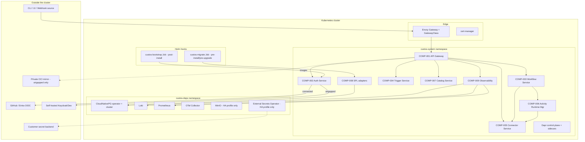
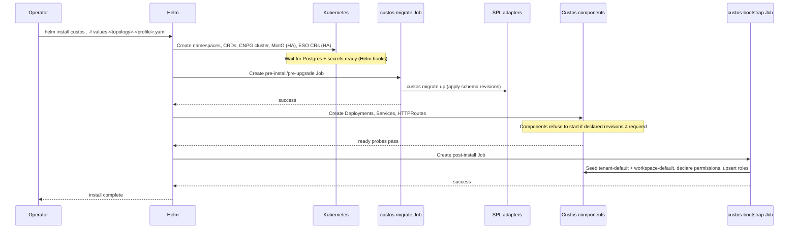

# Reference Deployment: Custos

Last Updated: 2026-05-18
Version: 2
Status: Draft

## Summary

The reference deployment ships Custos as a single Helm chart with two topology variants — **connected** and **air-gapped** — and two sizing profiles per topology — **eval** and **HA**. In M1 the chart deploys the nine in-scope control-plane components (COMP-001..009) plus their direct infrastructure dependencies onto a Kubernetes cluster. The Web UI (COMP-010) is contract-defined but deferred to M2+ and is **not** deployed in M1 (`web-ui.enabled` defaults to `false`). Cloud-provider IaC (Terraform/Bicep modules) is out of scope for M1 and deferred to M2+.

The goal: an operator can go from "git clone" to "running Custos" in one `helm install` command on any conformant Kubernetes cluster, with no manual prerequisite provisioning beyond the cluster itself. An OIDC issuer is contract-locked but **not** an M1 prerequisite — M1 uses pre-provisioned API tokens (REQ-035) and the OIDC code paths in Auth Service / API Gateway are disabled; an OIDC issuer becomes a prerequisite at M3 (REQ-034/056/057/058).

## Scope and Non-Goals

**In scope (M1):**
- One Helm chart at `deploy/helm/custos/` with conditionals for topology and profile.
- Two topologies: `connected` (GitHub / Azure Entra ID OIDC SaaS) and `airgapped` (self-hosted OIDC issuer, all images mirrored, no internet egress).
- Two profiles per topology: `eval` (single-replica, PV-backed deps) and `HA` (3+ replicas, CloudNativePG cluster, MinIO, PDBs, anti-affinity).
- Air-gapped offline-install tarball (chart + image archives + checksums) as a CI artifact.
- Helm pre-install/pre-upgrade migration job enforcing SPL's strict migration policy.
- Default tenant + workspace pre-provisioned at install.

**Out of scope (M2+):**
- Terraform modules for AWS / Azure / GCP infrastructure (cluster, RDS, S3, IAM).
- Multi-cluster federation.
- Per-tenant Kubernetes namespaces (multi-tenancy stays application-layer in v1).
- Operator (CRD-driven) install path; v1 is Helm-only.
- Cross-region DR runbook.

## Topology Matrix

| Dimension | `connected` | `airgapped` |
|---|---|---|
| OIDC issuer | GitHub OIDC and/or Azure Entra ID (SaaS) | Self-hosted Keycloak or Dex (operator-installed prereq) |
| Container images | Public registries (GHCR / MCR) or customer mirror | **Mandatory** mirror to private registry |
| Connector bundle | Pulled from public OCI registry by default | Pre-loaded into private OCI registry |
| Dependency Helm charts | Pulled from upstream repos | **Vendored** under `deploy/helm/custos/charts/` |
| External secret backend (HA) | AWS Secrets Manager / Azure Key Vault / GCP Secret Manager / self-hosted Vault | Self-hosted Vault (or Sealed Secrets as no-vault alternative) |
| Telemetry export | Any OTel exporter target (Datadog / Splunk / etc. allowed) | Internal sinks only (in-cluster Loki/Prometheus + customer's internal log/metrics platform) |
| Call-home | None by default | None (enforced; not a default) |
| Install artifact | `helm install` from chart repo | `tar.gz` offline-install bundle |

## Profile Matrix (orthogonal to topology)

| Dimension | `eval` | `HA` |
|---|---|---|
| Custos component replicas | 1 each | 3 for stateless (Gateway, Workflow, Trigger, Connector, ARM, Catalog, Observability, Auth, SPL adapters), 1 active for SPL stateful (driven by Postgres) |
| Postgres | CloudNativePG single instance | CloudNativePG 3-node cluster with PITR |
| Object storage | _(none)_ — PV-backed artifacts and audit | MinIO 4-node distributed mode (or external S3/Blob/GCS) |
| Log storage | Loki single-binary, filesystem | Loki distributed, object-storage chunks |
| Metrics | Prometheus single instance, PV | Prometheus with remote-write to operator-chosen LTS |
| PodDisruptionBudgets | _(none)_ | Per-component, `maxUnavailable=1` |
| HorizontalPodAutoscalers | _(none)_ | On Gateway, Workflow, Connector |
| Anti-affinity / topology spread | _(none)_ | Required across zones (where the cluster has zone labels) |
| Network policies | Deny-all default + permissive component-to-component allow rules | Same |
| Resource requests/limits | Modest (sum ~6 vCPU / 12 GiB) | Production sizing (sum ~24 vCPU / 64 GiB, excluding deps) |
| Secrets backend | Helm-managed K8s Secrets | External Secrets Operator + chosen backend |
| Backups | Postgres → PV, no off-cluster copy | Postgres → MinIO/S3 (PITR), retention policy configurable |

## High-Level Architecture (in-cluster)



## Component / Image Inventory

| Component | Image | Connected default | Airgapped path |
|---|---|---|---|
| API Gateway | `ghcr.io/custos/api-gateway:VERSION` | GHCR pull | Mirror to `${registry}/custos/api-gateway:VERSION` |
| Auth Service | `ghcr.io/custos/auth-service:VERSION` | GHCR pull | Mirror |
| Workflow Service | `ghcr.io/custos/workflow-service:VERSION` | GHCR pull | Mirror |
| Trigger Service | `ghcr.io/custos/trigger-service:VERSION` | GHCR pull | Mirror |
| Connector Service | `ghcr.io/custos/connector-service:VERSION` | GHCR pull | Mirror |
| Activity Runtime Mgr | `ghcr.io/custos/activity-runtime:VERSION` | GHCR pull | Mirror |
| Catalog Service | `ghcr.io/custos/catalog-service:VERSION` | GHCR pull | Mirror |
| SPL adapters bundle | `ghcr.io/custos/spl-postgres:VERSION` | GHCR pull | Mirror |
| Observability Service | `ghcr.io/custos/observability:VERSION` | GHCR pull | Mirror |
| Migration runner | `ghcr.io/custos/migrate:VERSION` | GHCR pull | Mirror |
| Core connector bundle (OCI artifact) | `ghcr.io/custos/connectors-core:VERSION` | GHCR pull | Mirror to internal OCI registry |
| Envoy Gateway | upstream | upstream | Mirror |
| cert-manager | upstream | upstream | Mirror |
| Dapr control plane + sidecar injector | upstream | upstream | Mirror |
| CloudNativePG operator | upstream | upstream | Mirror |
| Loki | upstream | upstream | Mirror |
| Prometheus | upstream | upstream | Mirror |
| OTel Collector | upstream | upstream | Mirror |
| MinIO (HA only) | upstream | upstream | Mirror |
| External Secrets Operator (HA only) | upstream | upstream | Mirror |

The chart parameterizes every image reference on `global.imageRegistry` so a one-line override redirects all pulls to the customer's mirror.

## Networking

### Ingress — Envoy Gateway

Custos uses the Kubernetes **Gateway API** (`gateway.networking.k8s.io/v1`) with **Envoy Gateway** as the GatewayClass implementation. nginx-ingress is explicitly rejected: it is in maintenance mode as of 2025 and the K8s ecosystem is consolidating on Gateway API.

- One `Gateway` resource per cluster (in `custos-system`), with listeners for `HTTPS:443` (UI + API) and `HTTPS:8443` (webhook ingress).
- `HTTPRoute` resources per externally-exposed surface: `/v1/*` → API Gateway, `/ui/*` → Web UI (M2+), `/v1/webhooks/*` → API Gateway webhook bypass.
- TLS material: `cert-manager` with an `Issuer` (Let's Encrypt for `connected`, self-signed CA or operator-supplied CA for `airgapped`).

### East-west traffic

- Service-to-service via **Dapr service invocation** with metadata propagation (`x-custos-call-context`, `x-correlation-id`). Already locked in the API Gateway design.
- No Istio. Dapr already does service invocation, pub/sub, and secrets; adding a service mesh on top would mean two sidecars per pod and overlapping concerns.

### NetworkPolicies

Deny-all default in `custos-system` and `custos-deps`. Explicit allow rules:
- API Gateway ↔ all internal services
- Workflow Service ↔ Connector Service, Activity Runtime Manager, SPL
- Connector Service ↔ Activity Runtime Manager, SPL, Dapr secret stores
- Observability ↔ SPL, Loki, Prometheus
- All services → Dapr sidecar on localhost (sidecar pattern)
- All services → CNPG cluster service

## Secrets Architecture

Two distinct layers, deliberately kept separate.

### Layer 1 — Runtime connector secrets

Connectors receive opaque secret handles via Dapr's Secret Store API. Plaintext credentials never traverse Custos APIs. Already designed in COMP-005 and ADR-013. Backend choices (configured via Dapr Secret Store component):

- `kubernetes` (eval default; secrets live as K8s Secret objects)
- `hashicorp.vault` (HA airgapped default)
- `aws.secretmanager`, `azurekeyvault`, `gcpsecretmanager` (HA connected options)

### Layer 2 — Platform infrastructure secrets

Secrets the chart must materialize **before** components start: Postgres credentials, OIDC client secret, MinIO root user, SMTP credentials, backup-target credentials, TLS material if not cert-manager-managed.

| Profile | Mechanism | Notes |
|---|---|---|
| eval | Helm-managed K8s Secrets | Operator passes values at install time; secrets land as K8s Secret objects directly. |
| HA | **External Secrets Operator (ESO)** with operator-chosen backend | Chart ships `ExternalSecret` CRs referencing a `ClusterSecretStore`. The operator installs ESO and configures the store before `helm install`. |

### Layer alignment (critical)

The Dapr Secret Store component is wired to the **same backend** as ESO. This means an operator manages one secret store, not two. Example for HA connected on AWS:

```
External Secrets Operator → AWS Secrets Manager
Dapr Secret Store component → AWS Secrets Manager
Custos chart → ExternalSecret CRs + Dapr component CR
```

### Airgapped Layer 2 alternatives

- **ESO + self-hosted Vault** (recommended). Vault becomes the single source of truth for both layers.
- **Sealed Secrets** (no-vault alternative). Encrypted ciphertext lives in Git; controller decrypts in-cluster. Lighter operationally but secret rotation requires re-encrypt + re-commit; key custody is the operator's backup/DR concern.

Both options are documented; Sealed Secrets is for operators who don't want to run Vault.

## Persistence

### Postgres (CloudNativePG)

- `eval`: 1-instance `Cluster` CR with a single PVC (default 20 GiB).
- `HA`: 3-instance `Cluster` CR with synchronous streaming replication, PITR enabled, `barmanObjectStore` backups to MinIO (default 100 GiB PVC per instance).
- Two databases: `custos_state` (ops state) and `custos_audit` (audit partition per ADR-010 and SPL design). Same physical cluster; schemas are logically separate and use distinct roles (`custos_app` vs `audit_retention`).

### Object storage (HA only)

MinIO 4-node distributed mode. Buckets:
- `custos-postgres-backups` — CNPG PITR target.
- `custos-loki-chunks` — Loki long-term storage.
- `custos-artifacts` — **optional** for customers electing the SPL `s3` artifact adapter over the default `csi-pvc`.
- `custos-oci-cache` — M2+ when the OCI registry catalog adapter ships.

### Artifact store

Default: SPL `csi-pvc` adapter. One PVC per workspace, sized from `CUSTOS_ARTIFACT_PVC_SIZE` (default 50 GiB).

HA option: swap to `s3` adapter pointing at MinIO `custos-artifacts` bucket. Cleaner backup story; same code path.

### Log/metric storage

- Loki: filesystem (eval), `custos-loki-chunks` MinIO bucket (HA).
- Prometheus: PV-backed TSDB (eval and HA). HA optionally configures `remote_write` to a customer-chosen long-term metrics store.

## Install Flow



### Migration job ordering

The `custos-migrate` Job is a Helm `pre-install,pre-upgrade` hook with `hook-weight=0` and `hook-delete-policy=before-hook-creation`. SPL's strict migration policy (refuse-to-start on missing revision) is preserved end-to-end: the Job runs `custos migrate up`; on failure, the install aborts; components never start against an unmigrated DB.

### Bootstrap job

Runs once post-install (`hook=post-install`) and is idempotent:
- Upserts permissions from each component's bundled `permissions.yaml`.
- Seeds the canonical roles.
- Creates `tenant-default` and `workspace-default`.
- Creates the initial admin role binding for the operator-supplied OIDC subject (`CUSTOS_BOOTSTRAP_ADMIN_OIDC_SUBJECT`).

## Air-Gapped Offline-Install Bundle

A `make offline-bundle` target produces a CI artifact:

```
custos-${VERSION}-airgapped.tar.gz
├── chart/                           # Helm chart with vendored dep subcharts
│   └── custos/
│       ├── charts/                  # vendored: CNPG, ESO, Loki, Prometheus, OTel, MinIO, cert-manager, Envoy Gateway, Dapr
│       └── ...
├── images/                          # docker save -o per image
│   ├── custos-api-gateway-${VERSION}.tar
│   ├── custos-auth-service-${VERSION}.tar
│   └── ... (one per row in the image inventory above)
├── connectors/
│   └── connectors-core-${VERSION}.tar  # OCI artifact tarball
├── checksums.sha256
└── INSTALL-AIRGAPPED.md             # operator runbook
```

Operator runbook:
1. Verify checksums.
2. `skopeo copy` (or equivalent) each image tarball into the private registry.
3. Push `connectors-core` OCI artifact into the customer's internal OCI registry.
4. Install Vault (or configure Sealed Secrets); populate Layer 2 secrets.
5. Install OIDC issuer (Keycloak or Dex); configure GitHub/Entra federation if desired.
6. `helm install custos chart/custos -f values-airgapped-${profile}.yaml --set global.imageRegistry=${private_registry}`.

## Sizing

### eval profile (single cluster, dev/PoC)

| Resource | Reservation | Headroom for jobs |
|---|---|---|
| CPU | ~6 vCPU | + Activity Job workloads |
| Memory | ~12 GiB | + Activity Job workloads |
| Storage | ~50 GiB (Postgres 20 + artifacts 20 + logs/metrics 10) | + per-workspace artifact PVC growth |
| Nodes | 1 (≥ 8 vCPU / 16 GiB) | |

### HA profile (production baseline)

| Resource | Reservation (control plane) | Notes |
|---|---|---|
| CPU | ~24 vCPU | Excludes Activity Job pods (those land on worker nodes) |
| Memory | ~64 GiB | Excludes Activity Job pods |
| Storage | ~500 GiB (Postgres 3×100 + MinIO 4×40 + logs/metrics ~50) | Tune up for retention/scale |
| Nodes | 3+ (≥ 8 vCPU / 16 GiB each) across ≥ 2 zones | Anti-affinity prevents component co-location |

## Configuration

The chart's `values.yaml` exposes a structured tree; only the cross-cutting variables that change between topologies/profiles are listed here.

| Key | Required | Default | Description |
|---|---|---|---|
| `global.topology` | Yes | `connected` | `connected` or `airgapped`. Drives default values for dependent options. |
| `global.profile` | Yes | `eval` | `eval` or `HA`. |
| `global.imageRegistry` | No | `ghcr.io` (connected) | Set to the private registry path for airgapped. |
| `global.imagePullSecrets` | No | `[]` | Required when the registry needs auth. |
| `auth.oidc.issuerUrl` | Yes | — | GitHub / Entra / Keycloak / Dex issuer URL. |
| `auth.oidc.clientId` | Yes | — | Provided by the OIDC application registration. |
| `auth.oidc.clientSecretSecretName` | Yes | — | K8s Secret name containing `clientSecret` key. |
| `auth.bootstrapAdmin.oidcSubject` | Yes | — | OIDC `sub` for the first admin (gets the cluster-admin role binding). |
| `secrets.layer2.mechanism` | Yes | `helm` (eval) / `eso` (HA) | `helm` / `eso` / `sealed-secrets`. |
| `secrets.layer2.eso.clusterSecretStoreName` | Conditional | — | Required when `mechanism=eso`. |
| `secrets.layer1.daprSecretStoreComponent` | Yes | `kubernetes` (eval) / `vault` (HA airgapped) / cloud equivalent (HA connected) | Dapr Secret Store component name. |
| `postgres.mode` | Yes | `cnpg-single` (eval) / `cnpg-cluster` (HA) | — |
| `postgres.storage.size` | No | `20Gi` (eval) / `100Gi` (HA) | Per instance. |
| `objectStorage.enabled` | Yes | `false` (eval) / `true` (HA) | Provisions MinIO. |
| `objectStorage.mode` | Conditional | `minio` | `minio` or `external` (provide `endpoint`, `bucket`, `credentialsSecretName`). |
| `artifacts.adapter` | Yes | `csi-pvc` | `csi-pvc` or `s3`. |
| `gateway.gatewayClassName` | Yes | `envoy` | The Gateway API GatewayClass to bind. |
| `gateway.hostname` | Yes | — | External hostname for the Custos API/UI. |
| `gateway.tls.issuerRef` | Yes | — | cert-manager `Issuer` or `ClusterIssuer` reference. |
| `observability.logQueryProvider` | Yes | `loki` | Concern B log adapter; `loki` / `opensearch` / `noop`. |
| `observability.metricsQueryProvider` | Yes | `prometheus` | Concern B metrics adapter; `prometheus` / `noop`. |
| `observability.externalLogsUrl` | Conditional | — | Required when `logQueryProvider=noop`. |
| `observability.externalMetricsUrl` | Conditional | — | Required when `metricsQueryProvider=noop`. |
| `airgapped.callHome.enabled` | No | `false` | Hard-coded to `false` when `topology=airgapped`. |
| `tenancy.defaultTenantId` | No | `tenant-default` | Pre-provisioned at bootstrap. |
| `tenancy.defaultWorkspaceId` | No | `workspace-default` | Pre-provisioned at bootstrap. |

## Backup and Restore

| Subject | Mechanism | Eval | HA |
|---|---|---|---|
| Postgres state + audit | CloudNativePG `barmanObjectStore` PITR | PV snapshot (operator-managed) | Continuous WAL → MinIO/S3; retention configurable. |
| Artifacts (csi-pvc) | CSI volume snapshots (operator-managed) | Manual | Scheduled `VolumeSnapshot` CRs (CSI snapshotter must be present). |
| Artifacts (s3) | Object-store native versioning + lifecycle | n/a | Per bucket policy. |
| OIDC client secret + Layer 2 secrets | Customer's vault | Operator-managed | ESO re-materializes on cluster rebuild. |

## Upgrade Flow

1. Operator runs `helm upgrade custos .` with the new chart version.
2. Helm runs `custos-migrate` pre-upgrade hook against current DB. SPL revision check: if the new release requires a revision the current adapter doesn't have, the Job fails and the upgrade aborts (state intact).
3. On migration success, Helm performs rolling update of stateless Deployments (Gateway, Workflow, Trigger, Connector, ARM, Catalog, Observability, Auth). Anti-affinity + PDBs in HA prevent simultaneous loss of all replicas.
4. Bootstrap Job re-runs idempotently to upsert any newly declared permissions.

No downtime in HA when migrations are forward-compatible. Schema breaks require operator-orchestrated maintenance windows (documented; not v1 automated).

## Prerequisites (operator-supplied)

| Topology / profile | Prerequisite |
|---|---|
| All | Kubernetes ≥ 1.29 with CSI driver, VolumeSnapshot CRDs (HA), Gateway API CRDs (`gateway.networking.k8s.io/v1`) |
| All | `kubectl`, `helm` ≥ 3.13 on the operator's workstation |
| connected | OIDC application registration in GitHub or Entra (client ID + secret) |
| airgapped | OIDC issuer (Keycloak / Dex) reachable from the cluster |
| airgapped | Private OCI registry reachable from the cluster |
| HA | External Secrets Operator backend (Vault / cloud vault) provisioned and reachable |
| HA connected | Cloud vault credentials for ESO (IRSA / Workload Identity / SP) |
| HA | CSI snapshotter for artifact PVC snapshots (if using `csi-pvc` adapter) |

The chart **does not** install: the cluster itself, the OIDC issuer (airgapped), the vault backend, the OCI registry (airgapped). These are explicit operator prerequisites because they're customer-environment-specific.

## Observability of the Reference Deployment Itself

- Liveness, readiness, startup probes on every component.
- Prometheus scrapes every component's `/metrics` (Custos components already self-instrument per COMP-009 design).
- A pre-built Grafana dashboard bundle ships alongside the chart as a ConfigMap; operators with Grafana installed can import it directly.
- Helm release health check via `helm test` runs synthetic API calls through the Gateway.

## Failure Modes

| Failure | Surface | Operator action |
|---|---|---|
| Migration Job fails | Helm install aborts; state DB unchanged | Inspect Job logs; fix the version mismatch; retry. |
| ESO can't reach backend | `ExternalSecret` stays Pending; dependent Pods crash-loop on missing Secret | Check `ClusterSecretStore` connectivity and IAM. |
| OIDC issuer unreachable | Auth Service login flow fails; existing tokens continue to work until expiry | Restore issuer reachability or rotate to a working issuer. |
| MinIO unavailable (HA) | Postgres backups pause; Loki write path stalls | CNPG queues WAL locally up to its disk limit; restore MinIO before exhaustion. |
| Postgres failover (HA) | SPL operations briefly return `BackendUnavailable`; CNPG promotes new primary within seconds | None; clients retry per SPL contract. |
| Bootstrap Job fails on re-run | Permissions/roles partially upserted | Job is idempotent; re-running on next upgrade reconciles. |

## Open TODOs

- [ ] TODO-001: Decide whether to ship a pre-baked Keycloak chart for airgapped, or stay strictly "operator prereq". Tradeoff: install simplicity vs operator lock-in. (added 2026-05-17)
- [ ] TODO-002: Define the connector-bundle OCI artifact format and signing model (cosign keys, verification policy). (added 2026-05-17)
- [ ] TODO-003: Define the `helm test` synthetic test scenarios (login → create workspace → register connector → start workflow → inspect run). (added 2026-05-17)
- [ ] TODO-004: Define the network policy matrix precisely (which component talks to which on which port). (added 2026-05-17)
- [ ] TODO-005: Define the Grafana dashboard bundle contents (per-component dashboards, audit-event dashboard, drainer-lag dashboard). (added 2026-05-17)
- [ ] TODO-006: Decide whether the chart owns Dapr installation as a vendored subchart or treats it as an operator prereq. Current lean: vendored subchart for one-command install. (added 2026-05-17)
- [ ] TODO-007: Document the upgrade-with-breaking-schema runbook (maintenance window, read-only fallback for the migration window, rollback procedure). (added 2026-05-17)

## Open Questions

_(none — all v1 reference deployment design questions resolved this session.)_

## Change History

| Date | Change | GitHub Issue |
|---|---|---|
| 2026-05-17 | Initial reference deployment design: single Helm chart with two topologies (`connected`, `airgapped`) × two profiles (`eval`, `HA`). Envoy Gateway + cert-manager + Gateway API for ingress (nginx-ingress rejected). CloudNativePG for Postgres. MinIO for HA-only object storage. External Secrets Operator with Vault/cloud-vault backend for HA Layer-2 secrets; Sealed Secrets documented as no-vault airgapped alternative. Dapr Secret Store wired to same backend as ESO for Layer-1/Layer-2 alignment. Helm pre-install migration Job preserving SPL strict migration policy. Post-install bootstrap Job seeds default tenant/workspace and admin binding. Single namespace `custos-system` (multi-tenancy stays application-layer in v1). Air-gapped offline-install tarball with vendored charts and image archives. | #75 |
