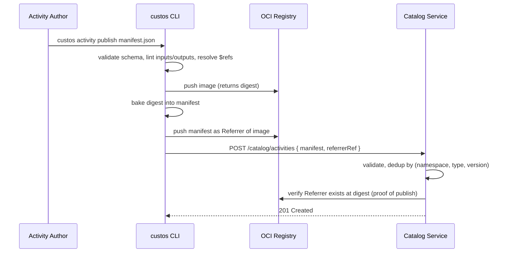

# Component Design: Activity Runtime Manager

Slug: `activity-runtime-manager`
Last Updated: 2026-05-17
Version: 1
Status: Draft

> This document captures the design decisions locked in so far. Sections marked **(pending)** will be filled out in subsequent design iterations.

## Responsibility

The Activity Runtime Manager (ARM) is the component that **executes activities** on behalf of the Workflow Service. Activities are the pluggable units of real work in Custos (vulnerability scanning, SBOM generation, signature verification, image promotion, custom user code, etc.). ARM resolves the activity definition, materializes its inputs, runs it in a sandboxed runtime, captures outputs and logs, and returns a structured result to the orchestrator.

It owns activity execution. It does **not** own orchestration control flow, connector credential resolution, or workflow data transformation.

## Boundaries

- **Owns**:
  - Activity resolution (type + version → executable image/handler).
  - Inputs materialization on the activity sandbox filesystem.
  - Sandbox lifecycle (start, monitor, cancel, timeout).
  - Outputs parsing and validation against the activity's declared output schema.
  - Artifact upload to the artifact store.
  - Log streaming to Observability.
  - Result mapping (exit code + outputs envelope → orchestrator-facing result).
  - Resource limiting and secret injection at the sandbox boundary.
- **Does NOT own**:
  - Orchestration state machine, retries, fan-out, approval gates — Workflow Service (ADR-007).
  - Inter-step data transformation or expression evaluation — Workflow Service Expression Evaluator (ADR-011).
  - Connector plugin loading, credential resolution, or context issuance — Connector Service (ADR-005, ADR-013).
  - Trigger ingestion — Trigger Service.

## Activity Contract v1

The contract between the orchestrator and an activity is **file-based**. The orchestrator never speaks to activity code in-process: it writes inputs to a known filesystem location, starts the activity sandbox, and reads outputs back when the activity exits. This keeps activities language-agnostic and runtime-agnostic (OCI container today; HTTP, WASM later).

### Sandbox filesystem layout

| Path | Direction | Owner | Description |
|---|---|---|---|
| `/custos/in/inputs.json` | orchestrator → activity | ARM writes | Inputs envelope (see below). Read-only to activity. |
| `/custos/in/ctx.json` | orchestrator → activity | ARM writes | Execution context: `runId`, `stepId`, `attempt`, `workspaceId`, activity type/version, connector handles (no credentials), deadline. Read-only. |
| `/custos/in/secrets/<name>` | orchestrator → activity | ARM writes | One file per injected secret. Plaintext credentials live ONLY here, never in `inputs.json`. Read-only, tmpfs-mounted. |
| `/custos/out/outputs.json` | activity → orchestrator | activity writes | Outputs envelope (see below). Required at success. |
| `/custos/out/artifacts/` | activity → orchestrator | activity writes | Files produced by the activity (SBOMs, scan reports, signed manifests, etc.). Activity writes at `/custos/out/artifacts/<name>` keyed by `spec.outputs.artifacts[].name` from its manifest. ARM uploads to artifact store after the sandbox exits and rewrites `outputs.json` to insert store-assigned IDs (see §Two-phase output finalization). |
| `/custos/out/audit.jsonl` | activity → orchestrator | activity appends | Optional structured audit lines. Forwarded to Observability/Audit. |

### `inputs.json` envelope

```json
{
  "schemaVersion": "1",
  "contractVersion": "1",
  "activity": { "type": "scan-image", "version": "1.2.0" },
  "step": { "runId": "...", "stepId": "...", "attempt": 1 },
  "inputs": {
    "image": { "ref": "ghcr.io/acme/app:v1", "digest": "sha256:..." },
    "severity": "high"
  }
}
```

The `inputs` field is shaped by the activity's declared input JSON Schema (Draft 2020-12). Secrets MUST NOT appear in `inputs` — they are injected via `/custos/in/secrets/`. The activity references a secret by logical name (declared in its manifest), and ARM mounts the resolved value file.

### `outputs.json` envelope — success (as written by activity)

The activity cannot know artifact-store IDs at write time — ARM assigns them after the sandbox exits. The activity therefore references its artifacts by their **manifest-declared `name`**, and ARM rewrites the envelope before schema validation (see §Two-phase output finalization below).

```json
{
  "schemaVersion": "1",
  "contractVersion": "1",
  "status": "success",
  "outputs": {
    "findings": 12,
    "reportRef": { "kind": "ArtifactRef", "name": "report" }
  }
}
```

After ARM finalization (what Workflow Service sees):

```json
{
  "schemaVersion": "1",
  "contractVersion": "1",
  "status": "success",
  "outputs": {
    "findings": 12,
    "reportRef": {
      "kind": "ArtifactRef",
      "name": "report",
      "id": "art-9f3a...",
      "mediaType": "application/vnd.cyclonedx+json",
      "digest": "sha256:...",
      "size": 84231
    }
  },
  "produced": [
    { "kind": "ArtifactRef", "name": "report", "id": "art-9f3a...",
      "mediaType": "application/vnd.cyclonedx+json",
      "digest": "sha256:...", "size": 84231 }
  ]
}
```

`produced[]` is **ARM-synthesized**, never written by the activity. The activity is responsible only for:
1. Writing files into `/custos/out/artifacts/<name>` (file) or `/custos/out/artifacts/<name>/` (tree), where `<name>` matches a `spec.outputs.artifacts[].name` in its manifest.
2. Referencing those artifacts inside `outputs` by `{ "kind": "ArtifactRef", "name": "<name>" }`.

### `outputs.json` envelope — failure

```json
{
  "schemaVersion": "1",
  "contractVersion": "1",
  "status": "failure",
  "error": {
    "code": "registry.unauthorized",
    "class": "permanent",
    "message": "no credentials for ghcr.io/acme/app",
    "details": { "registry": "ghcr.io" }
  },
  "outputs": {}
}
```

`error.class` aligns with ADR-008 exit-code semantics. Full envelope and exit-code mapping is in **§Error Envelope & Exit Codes** below.

### Two-phase output finalization

ARM owns artifact-store ID assignment. The activity cannot — it would need to read its own output back. So the contract has two phases:

**Phase 1 — Activity writes (sandbox active):**
- Activity writes structured data into `outputs.outputs`, referencing artifacts by `{ kind: "ArtifactRef", name: "<manifest-name>" }`.
- Activity writes files at `/custos/out/artifacts/<name>` (or a directory `<name>/` for trees).
- Activity exits.

**Phase 2 — ARM finalizes (sandbox exited):**
1. ARM reads `outputs.json` and parses it (syntactic validation only; **schema validation deferred**).
2. ARM walks `spec.outputs.artifacts[]` from the manifest. For each declared artifact:
   - Locates the matching file/tree at `/custos/out/artifacts/<name>`.
   - If `required: true` and missing → rewrite envelope to `output.invalid_artifact_ref`, class `permanent`. Stop.
   - Computes digest, size, mediaType (declared, sniffed if absent).
   - Uploads via `ArtifactStoreProvider`. Receives store-assigned `id`.
3. ARM rewrites the envelope in two ways:
   - Walks `outputs` recursively. Every `ArtifactRef` with a `name` matching a manifest artifact is **expanded in place** to include `id`, `digest`, `mediaType`, `size`.
   - Appends a fully-populated `produced[]` enumerating all uploaded artifacts.
4. **Now** ARM validates the rewritten envelope's `outputs` against the activity's output JSON Schema. Any reference to an `ArtifactRef.name` not declared in the manifest fails as `output.invalid_artifact_ref`, class `permanent`.
5. ARM returns the finalized envelope to Workflow Service.

The activity-author surface stays simple ("declare your artifacts in the manifest, write the files, reference by name"). The orchestrator-facing schema stays strict (every `ArtifactRef` is fully populated when Workflow Service sees it).

### Schema validation

Activity input and output schemas are validated **twice**:

1. **At publish time** (when an activity is registered into the Catalog) — schema is parsed and structurally validated. This is the compile-time gate.
2. **At runtime** — ARM validates the materialized `inputs.json` against the activity's input schema before starting the sandbox, and validates the **finalized** `outputs.json` (post-rewrite, with ArtifactRef IDs populated) against the output schema before returning to Workflow Service. Defense-in-depth: a broken activity that emits malformed outputs is caught at the ARM boundary, not propagated into the orchestrator.

## Platform Types

Activity authors compose inputs/outputs from platform-defined types so that activities interoperate without each one reinventing the wheel. The initial v1 platform types:

| Type | Purpose |
|---|---|
| `ImageRef` | An OCI image reference. Fields: `ref` (string, fully-qualified), `digest` (optional, `sha256:...`). Always normalized to `registry/repo[:tag][@digest]` form at the ARM boundary. |
| `OciDescriptor` | Mirrors the OCI distribution descriptor. Fields: `ref`, `mediaType`, `digest`, `size`, `artifactType`, `annotations`. The canonical "an artifact in a registry" shape that list/discover activities should emit and downstream activities should consume. |
| `ConnectorRef` | Opaque handle to a connector instance. ARM resolves it to a `ConnectorContext` for activities that need to talk to external systems. Exposes `host`, `endpoint`, `type`, `labels` to expressions — never credentials. |
| `ArtifactRef` | Opaque handle to a file produced by an upstream activity, materialized on the consumer's filesystem when the input is bound. |
| `Duration` | ISO-8601 duration string. |

**Design convention:** list/discover activities MUST return `OciDescriptor` (or a list thereof), not bare strings. This guarantees downstream activities have the digest, mediaType, and annotations they need without reparsing or re-fetching.

## Workflow-Level Primitives Supporting Activities

Activity inputs/outputs alone are not enough; the workflow author needs ways to transform, filter, and fan out between activities. The platform provides three layers of capability, used in this order of preference.

### Layer 1 — Inline CEL in `with:` bindings (cheapest)

Most adapter cases are a one-line expression in the consumer's `with:` block. Example:

```yaml
- id: scan
  activity: scan-image@1
  with:
    image: ${{ imageRef(item.ref, connector("ghcr-prod").host) }}
```

This handles the ~90% case of "the shape is almost right, just normalize one field."

### Layer 2 — `let` step (first-class)

A `let` step is a no-container, pure-data step. It exists to give a name to a reusable or complex transformation so it doesn't have to be duplicated across multiple `with:` blocks, and so it shows up in run inspection as its own step.

```yaml
- id: normalize
  let:
    fullyQualified: ${{ list.outputs.items |> map(d => imageRef(d.ref, connector("ghcr-prod").host)) }}
```

`let` is a workflow primitive. It does not invoke ARM. It runs in the Workflow Service Expression Evaluator. Outputs are durable like any other step output.

### Layer 3 — Dedicated activity

When the transformation/filter requires external I/O (calling a registry, hitting a policy service), crosses a policy boundary, needs cross-workflow reuse, or needs an audit trail of decisions, it becomes a real activity. The canonical filter activity is the built-in `policy-eval@1` (REQ-020), used in two modes:

- `mode: filter` — input `items[]` + `rules`; output `kept[]`, `excluded[]`, `decisions[]`.
- `mode: gate` — input single subject + `rules`; output `allow`/`deny` + reason.

This unifies filtering and gating: same activity, same rule language, two surfaces.

### `forEach` and `where:` clause

`forEach` is the fan-out primitive: it expands a step over a list, scheduling N parallel attempts.

`where:` is syntactic sugar on `forEach` for the common case of "filter then fan out." It compiles to an inline CEL filter on the input list — Layer 1 — so it has no new runtime machinery.

```yaml
- id: scan
  forEach: ${{ list.outputs.items }}
  where: ${{ item.mediaType == "application/vnd.oci.image.manifest.v1+json" }}
  activity: scan-image@1
  with:
    image: ${{ item }}
```

### Push-down `selector` on list activities

List/discover activities SHOULD accept an optional `selector` input that the activity itself can push down to the source (registry tag filter, label selector, etc.) for efficiency. The selector is **advisory**: the authoritative filter is whatever the workflow expresses in CEL (Layer 1) or via `policy-eval` (Layer 3). The orchestrator does not assume the source-side filter is exact.

### Decision tree

```
Need to adapt data between activities?
├── One field, no I/O, no audit needed?            → Layer 1: inline CEL
├── Same transform used in 2+ places, no I/O?      → Layer 2: let step
├── External call, policy decision, or audit?      → Layer 3: dedicated activity
└── Filter before fan-out?                         → forEach + where: (Layer 1 sugar)
```

## Custos CEL Function Set

Expressions in `with:`, `let`, and `where:` use CEL (Common Expression Language) extended with a Custos-specific function library. Trigger selector syntax is defined by the Trigger Service design and is intentionally not fixed by this document. The full set is defined in ADR-011; the v1 surface is grouped into six categories:

| Category | Functions |
|---|---|
| String | `concat`, `split`, `join`, `replace`, `lower`, `upper`, `trim`, `startsWith`, `endsWith`, `contains`, `matches`, `extract`, `format` |
| Collection | `map`, `filter`, `flatten`, `distinct`, `length`, `first`, `last`, `contains`, `groupBy` |
| Object | `keys`, `values`, `merge`, `pick`, `omit`, `has` |
| OCI / supply-chain | `imageRef`, `parseRef`, `digestOf`, `tagOf`, `repoOf`, `registryOf`, `mediaTypeMatches`, `isImage`, `isIndex`, `isSbom`, `isSignature`, `isAttestation`, `annotation`, `hasAnnotation` |
| Time | `now()` (frozen at run start — see Determinism), `parseTime`, `formatTime`, `addDuration`, `before`, `after` |
| Encoding | `base64`, `base64Decode`, `hex`, `hexDecode`, `jsonEncode`, `jsonDecode`, `sha256` |

**Explicitly excluded** from the expression sandbox: `eval()`, any file or network I/O, `secret()` accessors, `random()`, and live-clock arithmetic. Anything that would couple expressions to live external state belongs in an activity, not in CEL.

### Determinism rules

- `now()` is frozen at workflow run start. Every evaluation of `now()` within a single run returns the same value. Activities that need a live clock get one inside the sandbox; the workflow-level expression layer is deterministic.
- All Custos-defined functions are pure: same inputs → same outputs.
- This makes replay safe and `let`-step outputs reproducible.

## Connector Metadata Exposure

When `connector("name")` is used in an expression, the resolved object exposes a deliberately narrow surface:

| Field | Purpose |
|---|---|
| `host` | Hostname of the target system (e.g. `ghcr.io`). Used by transforms like `imageRef`. |
| `endpoint` | Full base URL/endpoint where applicable. |
| `type` | Connector type (e.g. `oci-registry`, `github`). Useful for selectors. |
| `labels` | Map of arbitrary key/value pairs set on the connector instance at registration time (Kubernetes-style labels, e.g. `env=prod`, `tier=public`). Used for selecting between connector instances in policy or routing logic. |

Credentials are never reachable from expressions. Activities that need to authenticate receive secrets via `/custos/in/secrets/` only.

## Error Envelope & Exit Codes

The error envelope is the structured failure surface every activity produces; exit codes are the coarse signal the sandbox returns. They have to agree because the orchestrator needs a deterministic answer to one question per attempt: **retry, fail permanently, or treat as cancelled.**

### Exit code semantics (ADR-008, 4 states)

| Code | Meaning | Orchestrator behavior |
|---|---|---|
| `0` | Success | Step succeeds; `outputs.json` MUST be present with `status: "success"`. |
| `1` | Retryable failure | Apply retry policy (backoff, max attempts). Examples: registry 5xx, transient network, rate-limit. |
| `2` | Permanent failure | No retry. Step fails. Examples: schema mismatch, auth denied, invalid input, image not found. |
| `3` | Cancelled / timed out | Treated as cancelled. No retry; depending on context counts as `cancelled` (run cancel) or `timeout` (deadline exceeded). |

Any other exit code (including SIGKILL/137, SIGSEGV/139, OOM) is mapped to **`1` (retryable)** by default — an uncategorized crash is more likely transient than logically permanent. Activity authors who know better override the default via `outputs.json`.

### Source of truth: `outputs.json` wins when present

The exit code is the **fallback** signal. The authoritative answer is `outputs.json.error.class` when a valid envelope is written. Resolution rules:

1. Exit `0` + valid `outputs.json` with `status: "success"` → **success**.
2. Exit non-zero + valid `outputs.json` with `status: "failure"` → use `error.class` from the envelope. Exit code is logged but not interpreted.
3. Exit non-zero with **no** valid `outputs.json` → fall back to exit-code mapping. ARM synthesizes a minimal envelope with `code: "activity.no_output"` and `class` derived from exit code.
4. Exit `0` but `outputs.json` is missing or invalid → **permanent failure** (`code: "activity.contract_violation"`). A clean exit without a parseable envelope is a contract bug, not a transient.
5. Exit `0` with `status: "failure"` in envelope → trust the envelope; the activity self-reported a failure but exited cleanly. Class from envelope.

### Error envelope schema

```json
{
  "code": "registry.unauthorized",
  "class": "permanent",
  "message": "no credentials for ghcr.io/acme/app",
  "details": { "registry": "ghcr.io", "repo": "acme/app" },
  "retryAfter": "PT30S",
  "cause": {
    "code": "http.401",
    "message": "unauthorized"
  }
}
```

| Field | Required | Purpose |
|---|---|---|
| `code` | yes | Stable, machine-readable identifier. Dot-namespaced: `<domain>.<reason>`. Used by workflows for `on_error` matching and by Observability for grouping. |
| `class` | yes | One of `retryable`, `permanent`, `cancelled`. Drives orchestrator behavior. |
| `message` | yes | Human-readable short summary. Shown in run inspection. |
| `details` | no | Free-form structured context. MUST NOT contain secrets. Size cap: **4 KiB**. Larger context belongs in an artifact. |
| `retryAfter` | no | ISO-8601 duration. **Lower-bound hint** to the retry scheduler; clamped by the workflow's backoff policy. Only meaningful when `class: retryable`. |
| `cause` | no | Nested envelope for the underlying error. Preserves chains (e.g. transport → HTTP → API error) without flattening. Max depth: **3**. |

### Error code namespaces

A small set of platform-reserved namespaces; everything else is activity-defined.

| Namespace | Owner | Examples |
|---|---|---|
| `activity.*` | ARM-synthesized | `activity.no_output`, `activity.contract_violation`, `activity.timeout`, `activity.cancelled`, `activity.oom_killed`, `activity.image_pull_failed` |
| `input.*` | ARM-synthesized | `input.schema_violation`, `input.missing_secret`, `input.missing_connector` |
| `output.*` | ARM-synthesized | `output.schema_violation`, `output.too_large`, `output.invalid_artifact_ref` |
| `system.*` | ARM-synthesized | `system.sandbox_failure`, `system.runtime_unavailable` |
| `registry.*`, `scan.*`, `sbom.*`, `signature.*`, `attestation.*`, `policy.*`, `promotion.*` | activity-defined; built-ins set the precedent | `registry.unauthorized`, `scan.engine_failed`, `signature.invalid` |
| `<vendor>.<...>` | third-party activity authors | `acme.quota_exceeded` |

Workflow authors match on `code` prefix or `class` in `on_error` blocks:

```yaml
- id: scan
  activity: scan-image@1
  with: { image: ${{ item }} }
  on_error:
    - match: { codePrefix: "registry." }
      do: skip
    - match: { class: "retryable" }
      do: retry
      maxAttempts: 5
```

### ARM behavior per terminal state

| State | ARM actions |
|---|---|
| Success | Validate outputs schema → upload artifacts → return result to Workflow Service. |
| Retryable failure | Persist attempt record + envelope → return to Workflow Service with `class: retryable`. Workflow Service applies retry policy (ARM does not retry). |
| Permanent failure | Same persistence, return with `class: permanent`. No further attempts unless workflow overrides via `on_error`. |
| Cancelled / timeout | If ARM initiated (deadline exceeded, cancel requested): synthesize envelope with `activity.timeout` or `activity.cancelled`. If activity self-reported exit `3`: trust it. Either way, no retry. |
| Output schema violation | ARM rewrites the envelope to `output.schema_violation`, class `permanent`. The activity's claimed outputs are discarded. |
| OOM / SIGKILL / uncategorized crash | Synthesize `activity.oom_killed` or `activity.sandbox_failure`, class `retryable`. |

### Locked defaults

- **Default class for uncategorized non-zero exit:** `retryable`.
- **`details` size cap:** 4 KiB. Larger context belongs in an artifact referenced by `ArtifactRef`.
- **`cause` max depth:** 3.
- **`retryAfter` semantics:** lower-bound hint, clamped by workflow backoff policy.

## Activity Manifest v1

The **activity manifest** is the contract document for an activity — everything the platform needs to know about it without running it. The Catalog Service reads it at publish time, the Workflow Service reads it at compile time to type-check workflows, and ARM reads it at execution time to wire up the sandbox.

The manifest is the **only** place an activity declares: what inputs it accepts, what outputs it produces, what connectors it needs, what runtime it requires, what resources it wants, and what version of the contract it speaks.

### On-disk and wire format

- **JSON** on disk and on the wire. YAML may be used for documentation/examples only.
- Catalog stores normalized JSON; manifests attached as OCI Referrers are JSON artifacts.

### Where the manifest lives

Two distribution modes, same schema:

1. **Co-located with the OCI image** — manifest is attached to the activity's container image as an OCI Referrer (subject = image digest, artifactType = `application/vnd.custos.activity.manifest.v1+json`). Canonical publication path.
2. **Catalog-registered directly** — uploaded to the Catalog Service. Fallback for registries without Referrers API support (v1.0 with subject-manifest tag scheme).

Discovery from a workflow always goes through the Catalog Service. The Referrer attachment is the **publication** mechanism; the Catalog is the **lookup** index.

### Namespace model

`(namespace, type, version)` is the primary key for an activity. Three distinct tiers:

| Tier | Format | Owner | Publish gate | Default trust |
|---|---|---|---|---|
| Platform | `custos.builtin` | Custos maintainers | Release pipeline only | High |
| Vendor | `<vendor>` (e.g. `snyk`, `aquasec`) | Verified third-party orgs | Verified-vendor onboarding flow | Medium |
| Workspace | `<workspaceId>` | One tenant | Workspace admin | Low |

**Reserved prefixes** (only the platform may publish into these): `custos.*`, `system.*`, `platform.*`, `builtin.*`.

**v1 workflow references are fully qualified** — `acme/scan-image@1`, never `scan-image@1`. Short-form resolution is deferred to a later milestone.

### Versioning (semver)

| Change | Bump |
|---|---|
| Add optional input field | minor |
| Add optional output field | minor |
| Remove or rename any field | major |
| Tighten input validation (narrower enum, smaller max) | major |
| Loosen input validation (wider enum, larger max) | minor |
| Change `runtime.image` digest, same behavior | patch |
| Change `spec.contractVersion` | major (always) |
| Change `runtime.kind` | major |

Workflows pin majors (`@1`). Catalog resolves to the latest non-deprecated minor/patch by default; pinning exact `@1.2.0` is allowed.

### Manifest schema

```yaml
# Authoring example (YAML for readability; JSON is the actual format).
apiVersion: custos.dev/v1
kind: ActivityManifest
metadata:
  type: scan-image
  version: 1.2.0
  namespace: custos.builtin
  description: "Scan an OCI image for vulnerabilities using Trivy."
  labels:
    category: security
    engine: trivy
  owner: "custos-maintainers"

spec:
  contractVersion: "1"

  runtime:
    kind: oci-container               # v1: oci-container only
    image: ghcr.io/custos/scan-image:1.2.0
    digest: sha256:abc...             # required; pinned at publish time
    isolation:
      minTier: microvm                # process | vm | microvm
      preferred: microvm-firecracker  # optional concrete hint

  inputs:
    schema:
      $schema: "https://json-schema.org/draft/2020-12/schema"
      type: object
      required: [image]
      properties:
        image:    { $ref: "custos://types/ImageRef" }
        severity: { type: string, enum: [low, medium, high, critical], default: high }

  outputs:
    schema:
      $schema: "https://json-schema.org/draft/2020-12/schema"
      type: object
      required: [findings, reportRef]
      properties:
        findings: { type: integer }
        reportRef: { $ref: "custos://types/ArtifactRef" }
    artifacts:
      - name: report
        mediaType: application/vnd.cyclonedx+json
        required: true

  connectors:
    - name: registry
      type: oci-registry
      required: true
      capabilities: [oci.pull]        # advisory; connector enforces. Tokens MUST be dot-namespaced.

  resources:
    cpu:    { request: "500m", limit: "2" }      # optional
    memory: { request: "512Mi", limit: "2Gi" }   # optional; warn at publish if absent for security category
    ephemeralStorage: { limit: "5Gi" }           # optional
    timeout: PT15M                                # REQUIRED

  errors:
    - code: registry.unauthorized
      class: permanent
    - code: scan.engine_failed
      class: retryable

  determinism: side-effecting         # pure | side-effecting (default)
  idempotency: by-input-hash          # by-input-hash | none (default none)
```

### Field reference

#### `metadata`

| Field | Required | Purpose |
|---|---|---|
| `type` | yes | Activity type, unique within its namespace. |
| `version` | yes | Semver. |
| `namespace` | yes | One of `custos.builtin` / `<vendor>` / `<workspaceId>`. |
| `description` | yes | Human-readable summary. |
| `labels` | no | Free-form key/value pairs. Used for catalog filtering, Web UI grouping, and category-based linter rules (e.g. `category: security` triggers stricter publish-time checks). |
| `owner` | yes | Contact/team identifier. |

#### `spec.runtime`

| Field | Required | Purpose |
|---|---|---|
| `kind` | yes | `oci-container` in v1. `http`, `wasm`, `hyperlight` reserved for later milestones. |
| `image` | yes | OCI image reference (registry/repo:tag form). |
| `digest` | yes | Image pinned by digest at publish time. Tag drift cannot silently change activity behavior. |
| `isolation.minTier` | no | Sandbox lower bound: `process` (runc + seccomp/AppArmor), `vm` (Kata with shared-kernel hypervisors like CLH/MSHV), `microvm` (Kata + Firecracker). Defaults to the cluster-configured default tier. |
| `isolation.preferred` | no | Soft hint at a specific operator-mapped RuntimeClass (e.g. `microvm-firecracker`). ARM falls back to any class meeting `minTier` if unavailable. |

**No `workdir` and no `command`/`args`.** v1 is one-image-one-activity; ARM runs the image as built using its `ENTRYPOINT` + `CMD`.

#### `spec.inputs`

- `schema` — JSON Schema Draft 2020-12 describing the `inputs` field inside `inputs.json`. May `$ref` platform types via `custos://types/<Name>`.
- Inputs MUST NOT include credentials. Secrets do not appear in `inputs.json`.
- Connector references reach the activity via `ctx.json`, not `inputs`.

#### `spec.outputs`

- `schema` — JSON Schema for the `outputs` field inside `outputs.json` (structured data, small values, refs).
- `artifacts[]` — declared file outputs written to `/custos/out/artifacts/<name>`. Each entry: `name`, `mediaType`, `required`. The activity references artifacts by `name` only; ARM uploads via `ArtifactStoreProvider` post-exit, assigns store IDs, and rewrites every `ArtifactRef` in the envelope to include `id`, `digest`, `mediaType`, `size` before output-schema validation (see §Two-phase output finalization in the Activity Contract). `required: true` + missing file on success → `output.invalid_artifact_ref` (permanent).
- Per-artifact content schema validation (e.g. CycloneDX schema URL) is **deferred to M2**.

#### `spec.connectors[]`

Declares connector slots the activity needs. Workflow binds concrete connector instances to these slots at compile time. ARM mounts only the bound instances.

| Field | Required | Purpose |
|---|---|---|
| `name` | yes | Logical slot name referenced from the workflow's `connectors:` binding. |
| `type` | yes | Connector type (e.g. `oci-registry`, `github`). |
| `required` | yes | Whether the workflow must bind an instance. |
| `capabilities` | no | Advisory list of **data-plane verbs** the activity needs from the bound connector (e.g. `[oci.pull]`, `[oci.push, oci.tag]`, `[s3.read]`). Tokens MUST follow the dot-delimited lowercase convention defined by the Connector Service. The connector itself enforces; the Binder fails bind if a required capability is missing on the bound connector type version. `event.*` and bare tokens like `pull`/`push` are not valid here. |

#### No `spec.secrets[]` in v1

All credentials flow through connectors in v1. Standalone secret slots (cosign signing keys, license tokens, HMAC secrets) are **deferred to M2** when attestation creation (REQ-019) lands.

The `/custos/in/secrets/` directory in the Activity Contract still exists, but in v1 is populated only by connector-borne credentials when the connector type requires materialized creds, at `/custos/in/secrets/<connector-name>/<key>`.

#### `spec.resources`

Optional layered defaults; **only `timeout` is required.**

Hierarchy (each layer can only tighten within the layer above):

```
Cluster LimitRange / ResourceQuota (operator policy)   ← absolute ceiling
        ↓
Platform defaults (Custos config)                       ← applied when manifest silent
        ↓
Manifest spec.resources                                 ← activity author's recommendation
        ↓
Workflow step.resources override                        ← per-step tuning
        ↓
Kubernetes Pod resources at scheduling                  ← what actually runs
```

| Field | v1 manifest | If absent |
|---|---|---|
| `cpu.request` | optional | platform default |
| `cpu.limit` | optional | platform default |
| `memory.request` | optional | platform default |
| `memory.limit` | optional (publish-time linter warns for `category: security`) | platform default |
| `ephemeralStorage.limit` | optional | platform default |
| `timeout` | **required** | — |

Workflow may upgrade `isolation.minTier` per step but cannot downgrade below the manifest's floor.

#### `spec.errors[]`

Documented error codes the activity may emit. Surfaced in run inspection and `on_error` autocomplete. Not enforced — activities can still emit other codes, but undocumented codes raise a publish-time warning.

#### `spec.determinism`

- `pure` — same inputs ⇒ same outputs (e.g. `policy-eval`). Enables result caching in M2+.
- `side-effecting` (default) — no caching assumptions.

#### `spec.idempotency`

- `by-input-hash` — ARM may skip re-execution when `(activity, inputs)` already succeeded. Gives Workflow Service a memoization hook.
- `none` (default) — always execute.

### Publishing flow



The OCI registry is the source of truth; the Catalog is a derived, query-friendly index.

### Deferred to later milestones

- **Manifest signing** (cosign-signed Referrer with Catalog verification before accepting publish): deferred to M2+.
- **Per-artifact content schema validation**: deferred to M2.
- **`spec.secrets[]` for standalone secret slots**: deferred to M2 (driven by REQ-019 attestation creation).
- **`runtime.kind: http | wasm | hyperlight`**: deferred to M3/M4+.
- **Short-form (non-fully-qualified) activity references**: deferred to a later milestone.

## Internal Structure (pending)

The sub-module breakdown (Scheduler, Runtime Driver dispatcher, OCI Container Driver, I/O Broker, Artifact Store Client, Log Streamer, Result Mapper, Resource Limiter, Secret Injector — per components.md COMP-006) will be filled out in the next iteration.

## Key Operations (pending)

To be filled out:
- Execute activity (happy path).
- Cancel running activity (run cancelled, timeout exceeded).
- Activity failure (retryable vs permanent).
- Artifact upload and `ArtifactRef` materialization on downstream activity.

## Data Models (pending)

To be filled out: activity execution record, attempt record, artifact record relationships.

## Public Interface (pending)

Internal RPC surface (Workflow Service ⇄ ARM):
- `ScheduleActivity(runId, stepId, attempt, activityRef, inputs, connectorRefs, deadline)`
- `CancelActivity(runId, stepId)`
- Activity completion callback delivery to Workflow Service.

## Configuration (pending)

## Dependencies

| Dependency | Type | Purpose |
|---|---|---|
| Workflow Service | Runtime | Scheduling source and completion sink. |
| Connector Service | Runtime | Resolves `ConnectorRef` → `ConnectorContext` (handles, not credentials) and provides scoped sidecar/API access to resolved connector material for activities. |
| Storage Provider Layer | Runtime | Artifact upload via `ArtifactStoreProvider`; step output persistence via `MetadataStoreProvider`. |
| Observability/Audit | Runtime | Log streaming and audit event emission. |
| Catalog Service | Runtime | Activity type/version resolution and schema retrieval. |
| Kubernetes API | Runtime | Sandbox lifecycle (Jobs/Pods) for OCI Container Driver. |

## Failure Modes (pending)

## Open TODOs

- [ ] TODO-002: Manifest signing (cosign-signed Referrer with Catalog verification) — deferred to M2+ (added 2026-05-16).
- [ ] TODO-003: Per-artifact content schema validation (e.g. CycloneDX schema URL) — deferred to M2 (added 2026-05-16).
- [ ] TODO-004: `spec.secrets[]` for standalone secret slots — deferred to M2 alongside REQ-019 attestation creation (added 2026-05-16).
- [ ] TODO-005: Short-form (non-fully-qualified) activity references — deferred to a later milestone (added 2026-05-16).
- [ ] TODO-006: Decide sandbox technology per REQ-039 / TODO-002 in requirements (gVisor, Kata-CLH, Kata-MSHV, Kata-FC, runc+seccomp, or Kubernetes Jobs only) — manifest surface (`isolation.minTier`, `isolation.preferred`) is locked; concrete RuntimeClass set and cluster-default tier still pending (added 2026-05-16).
- [ ] TODO-007: Specify Runtime Driver dispatcher contract; OCI Container Driver for v1, HTTP/WASM/Hyperlight later (added 2026-05-16).
- [ ] TODO-008: Sub-module deep dive (Scheduler, I/O Broker, Artifact Store Client, Log Streamer, Result Mapper, Resource Limiter, Secret Injector) (added 2026-05-16).
- [ ] TODO-009: Finalize platform event taxonomy mapping for activity lifecycle events with Observability. **Coordinated with Trigger Service TODO-001 (#18)** — the trigger `kind` namespace and the ARM-emitted activity lifecycle audit event namespace MUST share one taxonomy so cross-cutting events like `workflow.completed`, `step.completed`, `activity.failed` carry one canonical name from emission through trigger matching, audit storage, and consumer dashboards. See INCON-013 (#38). (added 2026-05-16, scope expanded 2026-05-17).
- [ ] TODO-010: Lock the canonical built-in `policy-eval@1` activity manifest (filter/gate modes) as the reference for the Layer-3 filter pattern (added 2026-05-16).

## Change History

| Date | Change | GitHub Issue |
|---|---|---|
| 2026-05-16 | Initial draft: Activity Contract v1 (file-based), platform types (`ImageRef`, `OciDescriptor`, `ConnectorRef`, `ArtifactRef`, `Duration`), three-layer pattern for transforms and filters, `let` as first-class step, `where:` sugar on `forEach`, push-down selector convention, filter/policy-eval unification, Custos CEL function set and determinism rules, connector metadata exposure surface | pending |
| 2026-05-16 | Locked Error Envelope & Exit Codes: 4-state exit codes, envelope-wins resolution rules, error code namespaces, ARM behavior per terminal state, default uncategorized exit → retryable, 4 KiB `details` cap, `cause` depth 3, `retryAfter` as lower-bound hint | pending |
| 2026-05-16 | Locked Activity Manifest v1: JSON on-disk format, three-tier namespace (`custos.builtin` / `<vendor>` / `<workspaceId>`) with reserved prefixes, fully-qualified workflow refs, OCI Referrer publication + Catalog index, full field reference (no `workdir`/`command`, no `spec.secrets[]` in v1), `runtime.isolation.minTier`/`preferred` for sandbox tier selection, `timeout` required + other resources optional, semver versioning rules; manifest signing, per-artifact content schema validation, standalone secrets, and short-form refs deferred to later milestones | pending |
| 2026-05-16 | Fixed Activity Contract v1: activities reference artifacts by manifest-declared name (`{ kind: ArtifactRef, name }`), and ARM performs two-phase output finalization — uploads artifacts, rewrites every ArtifactRef to include `id`/`digest`/`mediaType`/`size`, synthesizes `produced[]`, then validates the finalized envelope against the output schema. Producers can now satisfy the envelope deterministically | pending |
| 2026-05-17 | INCON-010: Activity Manifest v1 `spec.connectors[].capabilities` must use dot-delimited tokens (e.g. `oci.pull`) matching the Connector Service naming rule; bare tokens like `pull`/`push` are no longer valid | #35 |
| 2026-05-17 | INCON-013: TODO-009 scope expanded — activity lifecycle event taxonomy is unified with Trigger Service TODO-001 (#18) so connector event kinds and ARM-emitted audit event kinds share one dot-namespaced namespace | #38 |
