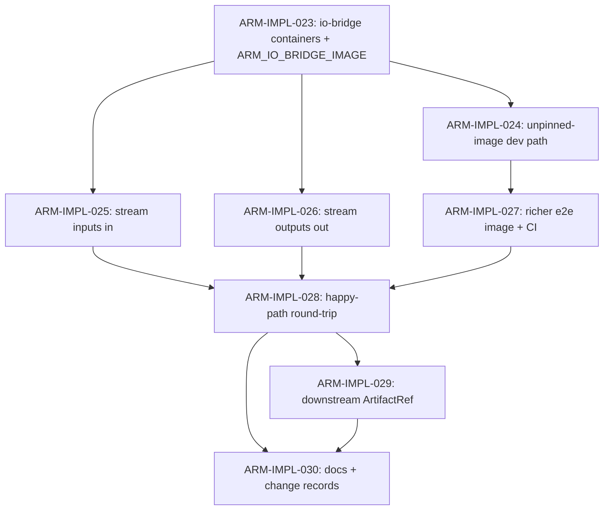

# activity-runtime-manager — I/O Bridge Implementation Plan

> Derived from [`design.md`](design.md) on 2026-06-06.
> Source of truth: the design doc and `design/architecture/`.
> This plan is owned by the `implement-component` skill; regenerate fresh whenever the design changes.

## Summary

The Activity Runtime Manager (COMP-006) M1 milestone
([#591](https://github.com/toddysm/custos/issues/591), ARM-IMPL-001..022) shipped
the full attempt state machine and the OCI Container Driver, but two integration
scenarios were intentionally deferred under
[#613](https://github.com/toddysm/custos/issues/613) because there is **no
ARM↔pod I/O bridge**. Today
[`OciContainerDriver.prepare`](../../../src/services/activity-runtime-manager/src/custos_arm/runtime/oci/lifecycle.py)
creates host-local staging trees (`staging_root/<job>/in` and `/out`) on ARM's
filesystem while
[`build_activity_job`](../../../src/services/activity-runtime-manager/src/custos_arm/runtime/oci/job.py)
mounts **separate** per-pod `emptyDir` (tmpfs) volumes for `/custos/in` and
`/custos/out`; `hostPath` is forbidden by the hardened security context, so the
two filesystems are disjoint. Nothing copies ARM's `in/` into the pod, and
`collect()` reads ARM's `out/` — which the pod never writes to. A `/bin/true`
activity therefore finalizes as exit-0-without-outputs →
`activity.contract_violation` (permanent). A second blocker is registry-less
digest pinning: the Scheduler always renders `image@digest`, which a locally
`kind load`ed image (no registry manifest digest) can never satisfy.

This plan implements the bridge — an init-container input injector plus a
native-sidecar output collector, both streamed via Kubernetes `pods/exec` +
`tar`, with no `hostPath` and the activity container's hardened security context
untouched — relaxes digest pinning behind an explicit test/dev flag (production
stays strictly digest-pinned), adds a contract-aware e2e activity image, and
lands the two deferred integration scenarios (happy-path output round-trip and
downstream `ArtifactRef` materialization).

The Activity Contract file layout (`/custos/in/*`, `/custos/out/*`) is locked in
[`design.md`](design.md) § Activity Contract v1; the design is deliberately
silent on the **transport mechanism** between ARM and the pod, so the bridge is
implementation work. Two new Configuration knobs (`ARM_IO_BRIDGE_IMAGE`,
`ARM_ALLOW_UNPINNED_IMAGES`) are introduced via change records under
[`changes/`](changes/) with production digest-pinning kept mandatory.

## Conventions

- Task prefix: `ARM-IMPL-`. Numbering starts at `ARM-IMPL-023` (next free id; the
  M1 milestone used `ARM-IMPL-001..022`, highest existing = 022 / #590).
- One task = one PR = one GitHub issue.
- Labels (matching the established ARM convention): tasks carry
  `type:implementation`, `phase:implementation`,
  `component:activity-runtime-manager`; the tracker carries
  `component:activity-runtime-manager`, `kind:tracking`.
- Phases run sequentially; tasks within a phase may run in parallel if
  dependencies allow.
- Quality gates from `src/services/activity-runtime-manager`
  (`ruff format . && ruff check . && mypy src tests && pytest -q`,
  `--cov-fail-under=90`). The `integration`-marked suite runs only in the
  dedicated `activity-runtime-manager-integration` kind CI job.

## Dependency graph

## Phase A — Pod plumbing + image-ref relaxation

### `ARM-IMPL-023`: Add io-bridge helper containers to the activity Job

- **Scope**:
  - [`runtime/oci/job.py`](../../../src/services/activity-runtime-manager/src/custos_arm/runtime/oci/job.py)
    — add (a) an **init container** mounting `/custos/in` writable that blocks
    until a `.ready` sentinel appears, and (b) a **native sidecar**
    (`restartPolicy: Always` init container) mounting `/custos/out` that idles
    for the pod lifetime; both hardened (runAsNonRoot, all caps dropped,
    seccomp RuntimeDefault, read-only rootfs) from a new `ARM_IO_BRIDGE_IMAGE`.

    > **Delivered scope (ARM-IMPL-023):** to keep every PR green, this task ships
    > the manifest plumbing only — the input injector **completes immediately**
    > (`sh -c true`) rather than blocking on the sentinel, and the output
    > collector is a genuine idling native sidecar. The block-until-`.ready`
    > gate and the `pods/exec` + `tar` streaming land atomically in ARM-IMPL-025
    > so the existing kind integration suite never hangs behind a blocking init
    > container.
  - [`config.py`](../../../src/services/activity-runtime-manager/src/custos_arm/config.py)
    — new `Settings.io_bridge_image` over `ARM_IO_BRIDGE_IMAGE` (digest-pinned
    busybox-with-tar default).
- **Acceptance criteria**:
  - Unit tests assert the rendered Job has the two helper containers sharing the
    `/custos/in` and `/custos/out` `emptyDir` volumes, both with the hardened
    SecurityContext and no `hostPath`.
  - The activity container spec is otherwise unchanged; its `ARM_IO_BRIDGE_IMAGE`
    default is digest-pinned.
- **Depends on**: _(none)_.
- **Complexity**: M.

### `ARM-IMPL-024`: Test/dev unpinned-image rendering path

- **Scope**:
  - [`runtime/oci/job.py`](../../../src/services/activity-runtime-manager/src/custos_arm/runtime/oci/job.py)
    `_image_reference` + [`config.py`](../../../src/services/activity-runtime-manager/src/custos_arm/config.py)
    — add `ARM_ALLOW_UNPINNED_IMAGES` (default **false**). When false, behavior
    is unchanged (digest mandatory). When true, a manifest without a digest
    renders a **tag-only** reference + `imagePullPolicy: IfNotPresent`.
- **Acceptance criteria**:
  - Unit tests cover both flag states: off → a digest-less manifest still fails
    as today; on → the rendered ref is tag-only with `IfNotPresent`.
  - Production default keeps strict digest pinning.
- **Depends on**: `ARM-IMPL-023`.
- **Complexity**: S.

## Phase B — Driver I/O streaming (the bridge)

### `ARM-IMPL-025`: Stream inputs into the pod (`exec tar -x` + sentinel)

- **Scope**:
  - [`runtime/oci/lifecycle.py`](../../../src/services/activity-runtime-manager/src/custos_arm/runtime/oci/lifecycle.py)
    — new Kubernetes `pods/exec` streaming helper; in `start()` (after un-suspend,
    before the activity container runs) `tar -x` ARM's staging `in/` into the
    init container, then write the `.ready` sentinel. Ordering is guaranteed by
    the init container completing before the activity container starts.
- **Acceptance criteria**:
  - Unit tests with a fake exec channel assert the input tree is streamed and the
    sentinel written.
  - Exec failures surface `SandboxFailureError`; the path is exercised
    end-to-end by Phase C.
- **Depends on**: `ARM-IMPL-023`.
- **Complexity**: L.

### `ARM-IMPL-026`: Stream outputs out of the pod (`exec tar -c` from sidecar)

- **Scope**:
  - [`runtime/oci/lifecycle.py`](../../../src/services/activity-runtime-manager/src/custos_arm/runtime/oci/lifecycle.py)
    `collect()` — after the activity terminates, `tar -c /custos/out` from the
    still-alive sidecar into ARM's staging `out/`, then return the `OutputBundle`.
    The existing
    [`IOBroker.finalize_outputs`](../../../src/services/activity-runtime-manager/src/custos_arm/io/broker.py)
    + `FilesystemArtifactReader` then work unchanged.
- **Acceptance criteria**:
  - Unit tests assert `collect()` populates the host `out/` from the streamed
    tar; empty and over-size cases are guarded.
  - Exercised end-to-end by Phase C.
- **Depends on**: `ARM-IMPL-023`.
- **Complexity**: L.

## Phase C — Richer e2e image + deferred scenarios

### `ARM-IMPL-027`: Richer e2e activity image + CI load

- **Scope**:
  - [`.github/workflows/python-services.yml`](../../../.github/workflows/python-services.yml)
    `activity-runtime-manager-integration` job + a test asset Dockerfile — a
    non-root entrypoint that reads `/custos/in/inputs.json` and writes
    `/custos/out/outputs.json` plus `/custos/out/artifacts/<name>`. Build +
    `kind load`; expose via `CUSTOS_ARM_E2E_IMAGE` (plus a contract-aware
    variant env if needed).
- **Acceptance criteria**:
  - CI builds and loads the image.
  - A smoke integration test confirms the pod produces `outputs.json` through the
    bridge.
- **Depends on**: `ARM-IMPL-024`.
- **Complexity**: M.

### `ARM-IMPL-028`: Happy-path output round-trip scenario

- **Scope**:
  - [`tests/integration/test_scheduler_integration.py`](../../../src/services/activity-runtime-manager/tests/integration/test_scheduler_integration.py)
    — real `ActivityScheduler` + real `OciContainerDriver` against kind: the
    activity writes outputs, ARM reads them back through the bridge, Result
    Mapper → **success**. Remove the corresponding "deferred" docstring note.
- **Acceptance criteria**:
  - `@pytest.mark.integration` test asserts a success envelope carrying the
    activity's `outputs`.
- **Depends on**: `ARM-IMPL-025`, `ARM-IMPL-026`, `ARM-IMPL-027`.
- **Complexity**: M.

### `ARM-IMPL-029`: Downstream `ArtifactRef` materialization scenario

- **Scope**:
  - [`tests/integration/test_scheduler_integration.py`](../../../src/services/activity-runtime-manager/tests/integration/test_scheduler_integration.py)
    — producer emits `/custos/out/artifacts/<name>`; ARM uploads + rewrites the
    ref (real/stub `ArtifactStore`); a consumer attempt reads it from
    `/custos/in`. Remove the second "deferred" docstring note.
- **Acceptance criteria**:
  - Integration test asserts the rewritten `ArtifactRef` carries
    `id`/`digest`/`size`/`mediaType` and the consumer reads the materialized
    file.
- **Depends on**: `ARM-IMPL-028`.
- **Complexity**: M.

## Phase D — Docs + design change records

### `ARM-IMPL-030`: Developer docs, README, and design change records

- **Scope**:
  - [`docs/developers/activity-author.md`](../../../docs/developers/activity-author.md)
    + the ARM `README.md` (status / layout) — describe the bridge and the two new
    Configuration knobs.
  - Two change records under
    [`changes/`](changes/) for `ARM_IO_BRIDGE_IMAGE` and
    `ARM_ALLOW_UNPINNED_IMAGES`, referencing #613, with production digest-pinning
    kept mandatory.
- **Acceptance criteria**:
  - Docs describe the bridge mechanism + new knobs.
  - Change records reference #613; the README "Deferred (#613)" note is removed.
- **Depends on**: `ARM-IMPL-028`, `ARM-IMPL-029`.
- **Complexity**: S.

## Out of scope (deferred)

- **`vm` / `microvm` tier bridge specifics (Kata)** — the bridge targets the
  `process` tier / runc first; the exec/tar mechanism is tier-agnostic but only
  validated on kind in this phase. Tracked as a separate backlog issue, **not**
  implemented here.
- **Registry-backed digest path for kind** — computing + pushing a real manifest
  digest for a locally built image is heavier than the test/dev unpinned path
  and would weaken the "production is always digest-pinned" invariant.

## Open questions

- **Native sidecars require Kubernetes ≥ 1.28.** The output collector uses a
  `restartPolicy: Always` init container (native sidecar). Confirm the target
  cluster floor, or fall back to a plain helper container kept alive by the
  driver.
