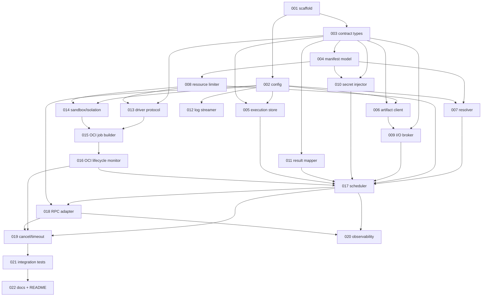

# Activity Runtime Manager Implementation Plan

> Derived from [design/components/activity-runtime-manager/design.md](../../architecture/../components/activity-runtime-manager/design.md) (v6) on 2026-06-02.
> Source of truth: the design doc and `design/architecture/`.
> This plan is owned by the `implement-component` skill; regenerate fresh whenever the design changes.

## Summary

The Activity Runtime Manager (ARM, COMP-006) executes activities on behalf of the Workflow Service: it resolves an `activityRef` to a pinned activity image + schemas, materializes inputs on a sandbox filesystem, runs the activity in an isolated Kubernetes workload, finalizes and validates outputs (uploading artifacts), and returns a typed `ActivityResultEnvelope`. The implementation is split scaffold → contracts → persistence → runtime-agnostic sub-modules → runtime driver + sandbox → scheduler/RPC → observability/tests/docs, so the runtime-kind-agnostic machinery (I/O, secrets, artifacts, result mapping) is built and tested before the OCI driver, and the orchestration state machine lands only once its collaborators exist.

## Conventions

- Task prefix: `ARM-IMPL-`.
- Numbering starts at `ARM-IMPL-001` (the `ARM-IMPL` namespace was previously unused).
- One task = one PR = one GitHub issue.
- Phases run sequentially; tasks within a phase may run in parallel if dependencies allow.
- Package source root: `src/services/activity-runtime-manager` (import package `custos_arm`). Quality gates run there.

## Decisions (gate-1 answers)

1. **Real Dapr adapters.** Catalog resolution (`ARM-IMPL-007`), Connector `RefreshLease` (`ARM-IMPL-010`), and the inbound `ScheduleActivity` / `CancelActivity` surface (`ARM-IMPL-018`) ship as real Dapr Service-Invocation adapters, not Protocol + fake. Protocols still exist for unit-test seams, but production wiring is real.
2. **Real kind / k8s integration.** The OCI Container Driver and the integration suite exercise a real `kind` cluster in CI (not a fake Kubernetes client).
3. **OCI driver split.** The OCI Container Driver is two tasks: `ARM-IMPL-015` (Job builder — translate a `SandboxPlan` into a Kubernetes `Job` spec) and `ARM-IMPL-016` (lifecycle monitor — `start`/`await_terminal`/`cancel`/`collect`/`cleanup` against a real cluster).

## Dependency graph

## Phase A — Scaffold & contracts

### ARM-IMPL-001: Scaffold the service package

- **Scope**:
  - `src/services/activity-runtime-manager/` — `custos_arm` package, `pyproject.toml` (deps on `custos-common`, `custos-callctx`, `storage-provider-layer`), `src/`/`tests/` layout, `py.typed`.
  - `app.py` + `__main__.py` — ASGI app, `/healthz` + `/readyz`, `HOST`/`PORT` binding.
  - CI / quality-gate wiring (ruff, mypy, pytest with the coverage floor) mirroring `workflow-service`.
- **Acceptance criteria**:
  - `ruff format . && ruff check . && mypy src tests && pytest -q` pass from the package root.
  - `/healthz` and `/readyz` return 200.
  - Package imports as `custos_arm`.
- **Depends on**: _(none)_.
- **Complexity**: M.

### ARM-IMPL-002: Configuration & AuthZ dev-shim

- **Scope**:
  - `custos_arm/config.py` — typed `Settings` over the `ARM_*` env-var table (stores, endpoints, sandbox namespace, tier→RuntimeClass mapping, default resources, timeouts, size caps, idempotency TTL, sidecar image).
  - Call-context middleware with the `ARM_AUTHZ_ENDPOINT` dev-shim that warns per request and refuses to start when `ENVIRONMENT=production`.
- **Acceptance criteria**:
  - Required vars missing → fail-fast at startup with a clear message.
  - Dev-shim emits a per-request WARNING and refuses to boot in production.
  - ISO-8601 durations (`ARM_MAX_TIMEOUT`, `ARM_IDEMPOTENCY_TTL`) parse and validate.
- **Depends on**: `ARM-IMPL-001`.
- **Complexity**: M.

### ARM-IMPL-003: Activity Contract v1 types

- **Scope**:
  - `custos_arm/contract/` — `inputs.json` / `ctx.json` / `outputs.json` envelope models, platform types (`ImageRef`, `OciDescriptor`, `ConnectorRef`, `ArtifactRef`, `Duration`).
  - Error envelope model + reserved namespaces (`activity.*` / `input.*` / `output.*` / `system.*`) + ADR-008 4-state exit-code mapping helpers.
- **Acceptance criteria**:
  - Round-trip (de)serialization of all three envelopes matches the design's JSON examples.
  - `details` 4 KiB cap and `cause` depth-3 cap enforced.
  - Exit-code → class mapping table matches the design (uncategorized non-zero → retryable).
- **Depends on**: `ARM-IMPL-001`.
- **Complexity**: M.

### ARM-IMPL-004: Activity Manifest v1 model + parser

- **Scope**:
  - `custos_arm/manifest/` — `metadata` / `spec.runtime` / `inputs` / `outputs` / `connectors` / `resources` / `errors` / `determinism` / `idempotency` models; JSON canonical form; `runtime.kind: oci-container` validation (reject `http`/`wasm` in v1).
  - Semver helpers and namespace/reserved-prefix validation.
- **Acceptance criteria**:
  - The design's authoring example parses; `timeout` required, `digest` required.
  - Reserved-prefix publish (`custos.*` etc.) is identified.
  - Dot-namespaced `capabilities` enforced; bare tokens rejected.
- **Depends on**: `ARM-IMPL-003`.
- **Complexity**: M.

## Phase B — Data model & persistence

### ARM-IMPL-005: ActivityExecution store

- **Scope**:
  - `custos_arm/store/execution.py` — `ActivityExecution` model + state machine (`pending`→…→terminal) keyed by `(runId, stepId, attempt)`.
  - `MetadataStoreProvider`-backed repository with `ARM_IDEMPOTENCY_TTL` retention and terminal-record lookup for replay dedup.
- **Acceptance criteria**:
  - Insert/transition/get round-trips through the SPL `MetadataStoreProvider`.
  - Duplicate `(runId, stepId, attempt)` is detected for idempotent replay.
  - Illegal state transitions are rejected.
- **Depends on**: `ARM-IMPL-002`, `ARM-IMPL-003`.
- **Complexity**: M.

### ARM-IMPL-006: ArtifactRecord + Artifact Store Client

- **Scope**:
  - `custos_arm/store/artifact.py` — `ArtifactRecord` model + Artifact Store Client over `ArtifactStoreProvider`.
  - Upload/fetch with digest/size/mediaType computation and `ARM_ARTIFACT_MAX_BYTES` enforcement.
- **Acceptance criteria**:
  - Upload returns store-assigned `id`/`digest`/`mediaType`/`size`.
  - Over-cap upload fails before transfer completes.
  - Fetch-by-id materializes bytes for downstream consumption.
- **Depends on**: `ARM-IMPL-002`, `ARM-IMPL-003`.
- **Complexity**: M.

## Phase C — Core sub-modules (runtime-kind-agnostic)

### ARM-IMPL-007: Activity Resolver (real Dapr Catalog adapter)

- **Scope**:
  - `custos_arm/resolve/` — resolver Protocol + real Dapr Service-Invocation Catalog client returning `ActivityTypeVersion` (pinned digest, input/output schemas, connectors, resources, isolation floor).
  - Immutable resolution cache; `activity.unresolved` on 404.
- **Acceptance criteria**:
  - A fully-qualified `namespace/type@version` resolves to a pinned digest + schemas via the real Dapr adapter.
  - Unknown ref → `activity.unresolved` (permanent).
  - Resolved immutable versions are cached.
- **Depends on**: `ARM-IMPL-002`, `ARM-IMPL-004`.
- **Complexity**: M.

### ARM-IMPL-008: Resource Limiter

- **Scope**:
  - `custos_arm/limit/` — compute the effective resource envelope (cluster ceiling → platform default → manifest → step override) and select the isolation tier.
- **Acceptance criteria**:
  - Each layer can only tighten within the layer above.
  - Platform defaults applied when the manifest is silent.
  - Selected tier = `max(manifest.minTier, step.minTier)`; downgrade never selected.
- **Depends on**: `ARM-IMPL-004`.
- **Complexity**: M.

### ARM-IMPL-009: I/O Broker (two-phase finalization)

- **Scope**:
  - `custos_arm/io/` — materialize + schema-validate `inputs.json`/`ctx.json`; after exit, read `outputs.json`, run two-phase finalization (walk `spec.outputs.artifacts[]`, upload, rewrite `ArtifactRef`s, synthesize `produced[]`), validate the finalized envelope.
  - `output.schema_violation` / `output.too_large` / `output.invalid_artifact_ref`.
- **Acceptance criteria**:
  - Input validated before start; finalized output validated after rewrite.
  - Missing `required` artifact → `output.invalid_artifact_ref` (permanent).
  - `outputs.json` over `ARM_OUTPUT_MAX_BYTES` → `output.too_large`.
- **Depends on**: `ARM-IMPL-003`, `ARM-IMPL-006`.
- **Complexity**: L.

### ARM-IMPL-010: Secret Injector (real Connector RefreshLease adapter)

- **Scope**:
  - `custos_arm/secrets/` — materialize `/custos/in/secrets/<connector>/<key>` on tmpfs from pre-resolved `ConnectorContexts`, mint the `0400` `/custos/in/sidecar-token` scoped to `(runId, stepId, attempt)`, inject the connector sidecar.
  - Real Dapr Connector `RefreshLease` adapter for long-running steps.
- **Acceptance criteria**:
  - Secret files land on tmpfs with correct namespacing and permissions; never in `inputs.json`.
  - Token minted/revoked per attempt.
  - `RefreshLease` invoked via the real Dapr adapter for long steps.
- **Depends on**: `ARM-IMPL-003`, `ARM-IMPL-004`.
- **Complexity**: L.

### ARM-IMPL-011: Result Mapper

- **Scope**:
  - `custos_arm/result/` — apply the locked § Error Envelope resolution rules to `(exitCode, finalizedOutputs)` → `ActivityResultEnvelope{class_, outputs|error, attempt}`.
- **Acceptance criteria**:
  - All five resolution rules covered (envelope-wins, exit-fallback, contract-violation, self-reported failure, cancelled).
  - `class_` constrained to `{success, retryable, permanent, cancelled}`.
- **Depends on**: `ARM-IMPL-003`.
- **Complexity**: M.

### ARM-IMPL-012: Log Streamer

- **Scope**:
  - `custos_arm/logs/` — stream sandbox stdout/stderr and forward `/custos/out/audit.jsonl` lines to Observability/Audit.
- **Acceptance criteria**:
  - stdout/stderr streamed without buffering the whole run in memory.
  - `audit.jsonl` lines forwarded as structured events.
- **Depends on**: `ARM-IMPL-002`.
- **Complexity**: S.

## Phase D — Runtime driver & sandbox

### ARM-IMPL-013: RuntimeDriver Protocol + dispatcher

- **Scope**:
  - `custos_arm/runtime/driver.py` — `RuntimeDriver` Protocol (`prepare`/`start`/`await_terminal`/`cancel`/`collect`/`cleanup`) + `SandboxPlan`/`SandboxHandle`/`SandboxOutcome`/`OutputBundle` types; dispatcher selecting by `runtime.kind` (v1 registers OCI only).
- **Acceptance criteria**:
  - Dispatcher selects the OCI driver for `oci-container` and raises for unregistered kinds.
  - Types are frozen/typed and mypy-clean.
- **Depends on**: `ARM-IMPL-003`, `ARM-IMPL-008`.
- **Complexity**: M.

### ARM-IMPL-014: Sandbox & isolation model

- **Scope**:
  - `custos_arm/runtime/isolation.py` — tier→`RuntimeClass` config resolution, hardened baseline `SecurityContext` builder, no-silent-downgrade rule → `system.runtime_unavailable`.
- **Acceptance criteria**:
  - `process` always available; `vm`/`microvm` only when their `RuntimeClass` is configured.
  - Unsatisfiable tier → `system.runtime_unavailable` (permanent) before any sandbox is created.
  - Hardened `SecurityContext` matches the design baseline.
- **Depends on**: `ARM-IMPL-002`, `ARM-IMPL-008`.
- **Complexity**: M.

### ARM-IMPL-015: OCI Container Driver — Job builder

- **Scope**:
  - `custos_arm/runtime/oci/job.py` — translate a `SandboxPlan` into a Kubernetes `Job` spec: sandbox Pod + connector sidecar, tmpfs mounts for `/custos/in/*` + `/custos/out`, `RuntimeClass`, `SecurityContext`, resources, deadline.
- **Acceptance criteria**:
  - Generated `Job` spec mounts the contract paths as tmpfs and applies the hardened `SecurityContext` + selected `RuntimeClass`.
  - Sidecar + token mount wired; resources reflect the effective envelope.
  - Spec validates against the Kubernetes API schema (unit-level, no cluster).
- **Depends on**: `ARM-IMPL-013`, `ARM-IMPL-014`.
- **Complexity**: L.

### ARM-IMPL-016: OCI Container Driver — lifecycle monitor (kind/k8s integration)

- **Scope**:
  - `custos_arm/runtime/oci/lifecycle.py` — `prepare`/`start`/`await_terminal`/`cancel`/`collect`/`cleanup` against a real cluster; deadline enforcement, image-pull failure + OOM/SIGKILL signal mapping, resource reaping.
  - CI: real `kind` cluster integration job.
- **Acceptance criteria**:
  - End-to-end run on a `kind` cluster: prepare → start → terminal → collect → cleanup.
  - Image-pull failure → `activity.image_pull_failed`; OOM → `activity.oom_killed`.
  - `cancel` and `cleanup` are idempotent; no orphaned `Job`s after cleanup.
- **Depends on**: `ARM-IMPL-015`.
- **Complexity**: L.

## Phase E — Orchestration & RPC

### ARM-IMPL-017: Activity Scheduler

- **Scope**:
  - `custos_arm/scheduler/` — end-to-end attempt state machine (resolve → limit → materialize → inject → run via driver → finalize → map → persist) + idempotent replay and crash reconciliation against the live `Job`.
- **Acceptance criteria**:
  - Happy path drives all sub-modules in order and persists the execution record.
  - Replay of a terminal triple returns the cached envelope without a second sandbox.
  - A non-terminal record reconciles against the live `Job` (resume or relaunch).
- **Depends on**: `ARM-IMPL-007`, `ARM-IMPL-008`, `ARM-IMPL-009`, `ARM-IMPL-010`, `ARM-IMPL-011`, `ARM-IMPL-005`, `ARM-IMPL-016`.
- **Complexity**: L.

### ARM-IMPL-018: RPC Adapter (real Dapr ScheduleActivity/CancelActivity)

- **Scope**:
  - `custos_arm/rpc/` — Dapr Service-Invocation handlers for `ScheduleActivity` / `CancelActivity`, call-context verification, `Idempotency-Key` dedup, `ActivityResultEnvelope` (de)serialization, `404`/`409` cancel semantics.
- **Acceptance criteria**:
  - `ScheduleActivity` dispatches to the Scheduler and returns the envelope; bad callctx rejected.
  - `Idempotency-Key` header drives dedup.
  - `CancelActivity` returns 404 (unknown) / 409 (terminated) as designed.
- **Depends on**: `ARM-IMPL-017`, `ARM-IMPL-002`.
- **Complexity**: M.

### ARM-IMPL-019: Cancel + deadline/timeout

- **Scope**:
  - Wire `CancelActivity` to driver `cancel(reason=cancelled)`; enforce deadline (clamped by `ARM_MAX_TIMEOUT` + step deadline) → `cancel(reason=deadline)`; synthesize `activity.cancelled` / `activity.timeout`.
- **Acceptance criteria**:
  - Run-cancel terminates the live attempt and yields class `cancelled`.
  - Deadline exceeded yields `activity.timeout` (class `cancelled`); no retry.
  - Cancellation is idempotent end-to-end.
- **Depends on**: `ARM-IMPL-017`, `ARM-IMPL-016`, `ARM-IMPL-018`.
- **Complexity**: M.

## Phase F — Observability, tests & docs

### ARM-IMPL-020: Observability

- **Scope**:
  - OTel spans across the attempt lifecycle + counters; failure-mode → error-code/class mapping surfaced in metrics; activity-lifecycle audit events.
- **Acceptance criteria**:
  - Spans cover resolve/materialize/run/finalize; counters labelled by `class_`.
  - Each failure mode in the design's table maps to its documented code/class.
- **Depends on**: `ARM-IMPL-017`, `ARM-IMPL-018`.
- **Complexity**: M.

### ARM-IMPL-021: Integration suite (kind/k8s)

- **Scope**:
  - `tests/integration/` — happy path, cancel/timeout, failure classification, idempotent replay, downstream `ArtifactRef` materialization, all against a real `kind` cluster.
- **Acceptance criteria**:
  - All scenarios pass on `kind` in CI.
  - Coverage stays at or above the package floor.
- **Depends on**: `ARM-IMPL-019`.
- **Complexity**: L.

### ARM-IMPL-022: Developer docs + README

- **Scope**:
  - `docs/developers/` ARM guide (activity-author contract, sandbox/isolation, `ARM_*` config) + `src/services/activity-runtime-manager/README.md` (status block, layout, milestone pointer), pinned by a doc-example test.
- **Acceptance criteria**:
  - README status/layout/config accurate; doc examples pinned by a test.
  - Developer guide cross-links the design doc.
- **Depends on**: `ARM-IMPL-021`.
- **Complexity**: M.

## Out of scope (deferred per design)

- `runtime.kind: http` (M3) / `wasm` (M4+); HTTP/WASM drivers.
- Manifest signing, per-artifact content-schema validation, `spec.secrets[]` (M2).
- Short-form activity references; result caching from `determinism: pure` / `idempotency: by-input-hash`.
- The connector **sidecar API** itself (Connector Service owns it); ARM only mints the token and calls `RefreshLease`.

## Open questions

- _(resolved at gate 1: real Dapr adapters; real kind/k8s integration; OCI driver split into job-builder + lifecycle-monitor.)_
