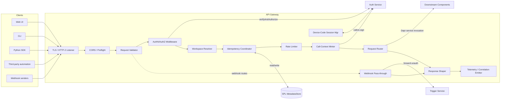
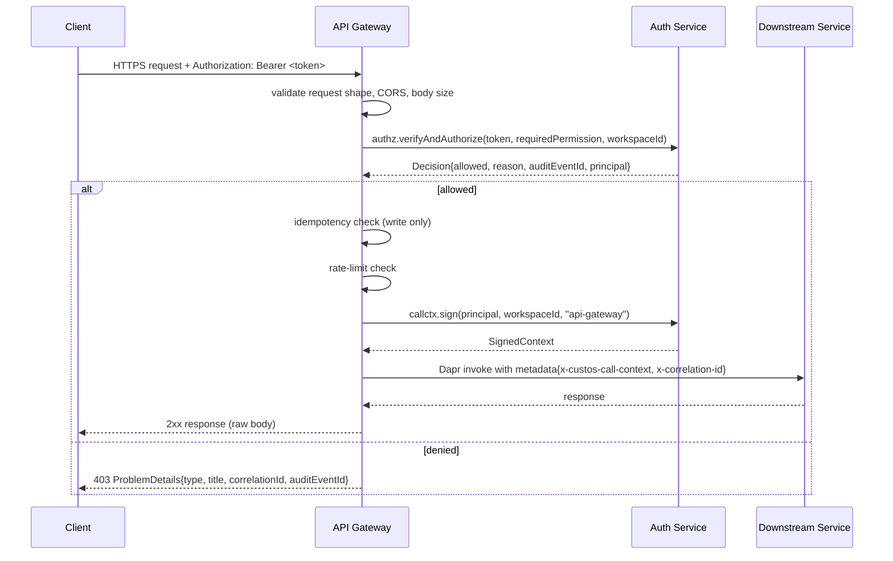

# Component Design: API Gateway

Slug: `api-gateway`
Last Updated: 2026-05-17
Version: 1
Status: Draft

## Responsibility

API Gateway is the single, uniform HTTPS entrypoint for every external caller of Custos — UI, CLI, SDK, third-party automation, and inbound webhooks. It terminates TLS, validates request shape, delegates every authentication and authorization decision to Auth Service, mints the signed call context that internal RPCs travel on, deduplicates idempotent writes, applies coarse rate limits, normalizes errors into a single envelope, and routes the request to the owning downstream component via Dapr service invocation. It contains no domain logic.

## Boundaries

- Owns:
  - The external HTTP surface: TLS, HTTP/2, CORS, request validation, body-size limits, content-type enforcement.
  - The OpenAPI 3.1 specification emitted at `/openapi.json`, generated from FastAPI route introspection.
  - The idempotency-key dedup cache for write endpoints (RFC 9110 `Idempotency-Key`).
  - Coarse per-principal and per-workspace rate limiting on write endpoints.
  - The signed-call-context handoff: minted at ingress for every authenticated request, propagated through Dapr service-invocation metadata.
  - The uniform error envelope (RFC 7807 Problem Details + `correlationId` + `auditEventId`).
  - The correlation-id contract: generated at ingress if absent; propagated through every downstream call and into every audit event.
  - The OIDC device-code flow endpoints used by the CLI (the Auth Service still owns the OIDC token verification; the gateway owns the device-code session state).
  - The CORS allowlist (config-driven).
  - The webhook ingress side-path that bypasses authn (signature validation belongs to Trigger Service / connector plugins).
- Does NOT own:
  - Authentication or authorization decisions (delegated to Auth Service).
  - Webhook signature verification (Trigger Service + per-connector plugin).
  - Business validation of request payloads (each downstream service owns its own).
  - API versioning beyond URL-prefix routing — there is no schema-translation layer in v1.
  - Live rate-limit policy storage; limits are config-driven and reloaded on platform restart in v1.
  - Multi-region routing or geo-failover (M2+).

## Internal Structure



## URL Shape and Workspace Addressing

Workspace-scoped endpoints carry `workspaceId` in the URL path:

```
/v1/workspaces/{workspaceId}/runs
/v1/workspaces/{workspaceId}/triggers
/v1/workspaces/{workspaceId}/connectors
/v1/workspaces/{workspaceId}/workflows
```

Workspace-discovery and self endpoints are unscoped:

```
/v1/workspaces                       # list workspaces I can see
/v1/principals/me                    # current principal
/v1/auth/login/oidc/callback
/v1/auth/login/device/{code}         # device-code flow polling
```

Tenant- and platform-scoped admin endpoints carry their own scope segment:

```
/v1/tenants/{tenantId}/workspaces
/v1/tenants
```

The Workspace Resolver extracts `{workspaceId}` from the path and supplies it to `authz.verifyAndAuthorize` and to the call-context minter. Requests where the URL implies workspace `A` but the body references workspace `B` are rejected with `400 WorkspaceMismatch` — the URL is always authoritative.

## AuthN / AuthZ Path

Every request except webhook ingress and the OIDC callback runs through:



The required permission for each route is declared at route-registration time (FastAPI dependency); the gateway never invents permission names — they must exist in the Auth Service permission registry (validated at startup via `GET /v1/permissions`; gateway refuses to start if it references an undeclared permission).

## Idempotency Coordinator

Applies to every write endpoint (`POST`, `PUT`, `PATCH`, `DELETE`). The client SHOULD supply `Idempotency-Key: <opaque-string>`; if absent, the gateway generates one (so server-side retries the gateway itself performs are safe).

```
key = (workspaceId, principalId, route, idempotencyKey)
```

Atomic reserve-or-read via `MetadataStoreProvider.reserveIdempotencyRecord(key, requestHash, ttlSeconds)`. The method returns one of four outcomes; the gateway acts as follows:

| Outcome | Action |
|---|---|
| `Reserved` | The row is newly inserted as `status=in-progress`. Proceed with the request, then call `completeIdempotencyRecord(key, responseSnapshot)` to record the response and flip `status=completed`. |
| `ExistingCompleted(response)` (stored `requestHash` matches) | Return the stored `responseSnapshot`. |
| `ExistingInFlight` (row exists with `status=in-progress`) | Return `409 IdempotencyInFlight` with `Retry-After`. |
| `KeyReuse` (stored `requestHash` differs from the current request) | Return `409 IdempotencyKeyReuse`. |

Expired rows are treated as absent by `reserveIdempotencyRecord` itself (the adapter overwrites them in the same atomic step); the gateway never observes an expired row.

`requestHash` is `SHA-256(method || route || workspaceId || sorted-headers-subset || body)`. Default TTL is 24h. Storage lives in the SPL via a new `IdempotencyRecord` entity on `MetadataStoreProvider` (delta on COMP-008).

## Rate Limiter

Per-principal token bucket on write endpoints; per-workspace cap on top:

| Bucket | Default | Configurable | Scope |
|---|---|---|---|
| Per-principal writes | 20 req/s, burst 40 | per principal class (user vs service-account) | Per replica (approximate; v1) |
| Per-workspace writes | 200 req/s, burst 400 | per tenant | Per replica (approximate; v1) |
| Per-principal reads | unlimited in v1 | — | — |

V1 implementation is in-memory per replica: an N-replica deployment grants up to N× the configured limit in the worst case. This is acceptable because:

- The limit's purpose is to protect Workflow Service and Connector Service from runaway clients, not to bill or strictly enforce quotas.
- Switching to a Dapr-state-backed coordinated limiter (or Redis) is a drop-in replacement: the interface stays `tryConsume(bucketKey, cost) -> Allow | Deny + RetryAfter`. Deferred to M2.

On deny: `429 Too Many Requests` with `Retry-After` and the `RateLimit-*` headers.

## Call-Context Minting

For every authenticated request, the gateway invokes:

```python
ctx = auth_service.callctx.sign(
    principal=decision.principal,
    workspaceId=workspaceId,
    callerComponent="api-gateway",
)
```

and propagates `ctx` to the downstream via Dapr service-invocation metadata under header `x-custos-call-context`. Downstream components verify the signature locally (Auth Service publishes the JWKS); they do not call back to Auth Service per request.

The correlation-id header `x-correlation-id` is generated at ingress (`uuid7`) if absent and propagated alongside the call context. Every audit event the request triggers carries this id.

## OIDC Device-Code Flow

CLI users authenticate via OIDC device-code (RFC 8628). The gateway owns the session-state endpoints; token verification is still in Auth Service.

| Method | Path | Description |
|---|---|---|
| POST | `/v1/auth/login/device` | Returns `{deviceCode, userCode, verificationUri, interval, expiresIn}`. Stores a pending session keyed by `deviceCode`. |
| POST | `/v1/auth/login/device/{deviceCode}/poll` | CLI polls. Returns `authorization_pending`, `slow_down`, or `{accessToken, refreshToken?}` once the user completes the browser flow against the configured OIDC issuer (GitHub or Entra preset). |
| GET | `/v1/auth/login/device/{userCode}` | Browser-facing landing page (delegates the actual login to the configured OIDC issuer; the gateway is purely a relay). |

Device-code sessions are stored in the SPL `MetadataStoreProvider` (same `IdempotencyRecord` table semantics — short-lived per-row state — with an explicit `DeviceCodeSession` entity, see COMP-008 delta). TTL = 15 minutes.

## Webhook Pass-through

Webhook ingress is the single exception to the authn rule. It enters at:

```
POST /v1/webhooks/{connectorInstanceId}
```

The gateway:

1. Terminates TLS.
2. Enforces a 1 MB body size cap (configurable per connector type via downstream advice, but the cap is gateway-enforced).
3. Generates a correlation id.
4. Forwards the request to Trigger Service via Dapr invocation — body, headers (minus `Authorization`), and source IP.
5. Does NOT mint a call context (the request is anonymous at ingress; Trigger Service mints an internal context after signature verification).

The gateway never inspects or alters the body of a webhook. Signature verification belongs to the per-connector plugin.

## Public Interface

The gateway's "public interface" is the union of every other component's externally-facing REST surface, mounted under `/v1/`. Each route is registered with:

- `requiredPermission` (validated against the Auth Service registry at startup)
- `requiresIdempotencyKey: bool` (write endpoints default true)
- `maxBodyBytes` (default 1 MB; workflow/template publish overridden to 5 MB)
- `rateLimitClass` (`write` | `read` | `webhook` | `auth`)

### Route registry (M1 set)

| Source | Prefix | Notes |
|---|---|---|
| Auth Service | `/v1/auth/*`, `/v1/principals/*`, `/v1/tenants/*`, `/v1/workspaces/*` (mgmt subset), `/v1/service-accounts/*`, `/v1/roles`, `/v1/permissions` | Auth-management routes; some unscoped, some tenant-scoped. |
| Catalog Service | `/v1/workspaces/{ws}/workflows/*`, `/v1/workspaces/{ws}/templates/*`, `/v1/workspaces/{ws}/activity-types/*`, `/v1/workspaces/{ws}/connector-types/*` | Workflow and template authoring; activity/connector type registry reads. |
| Workflow Service | `/v1/workspaces/{ws}/runs/*` | Start, inspect, cancel, re-run; idempotent on `Idempotency-Key`. |
| Trigger Service | `/v1/workspaces/{ws}/triggers/*`, `/v1/workspaces/{ws}/triggers/{id}:fire` | Trigger CRUD and manual-fire. |
| Connector Service | `/v1/workspaces/{ws}/connectors/*`, `/v1/workspaces/{ws}/connectors/{id}/leases/*`, `/v1/workspaces/{ws}/connectors/{id}/cursor` | Instance lifecycle, lease admin, cursor rewind. |
| Observability | `/v1/workspaces/{ws}/audit/*`, `/v1/workspaces/{ws}/runs/{id}/logs` | Audit query, log tail. |
| Gateway-owned | `/v1/webhooks/{connectorInstanceId}`, `/v1/auth/login/device*`, `/openapi.json`, `/healthz`, `/readyz` | Webhook pass-through, device-code flow, spec, health probes. |

The exact per-component routes are owned by each downstream component's design; the gateway mounts them and applies the cross-cutting middleware.

## OpenAPI

A single OpenAPI 3.1 document is emitted at `/openapi.json`. FastAPI introspection produces it from the route registry plus per-route Pydantic models exported by each downstream component as a thin client package (`custos-<service>-routes`). The SDK and CLI are generated from this document.

The spec includes:
- All routes, methods, request/response models.
- The shared `ProblemDetails+CustosError` schema.
- Security schemes: `BearerAuth` (OIDC or service token), `WebhookNoAuth` (for the webhook path).
- `x-custos-required-permission` and `x-custos-idempotent` extension fields on each operation.

## Configuration

| Variable | Required | Default | Description |
|---|---|---|---|
| `CUSTOS_GATEWAY_LISTEN_ADDR` | No | `:8443` | TLS listen address. |
| `CUSTOS_GATEWAY_TLS_CERT_REF` | Yes | — | Dapr secret reference for the TLS cert. |
| `CUSTOS_GATEWAY_TLS_KEY_REF` | Yes | — | Dapr secret reference for the TLS key. |
| `CUSTOS_GATEWAY_CORS_ALLOWED_ORIGINS` | Yes | — | JSON list of allowed origins for the UI. No wildcard. |
| `CUSTOS_GATEWAY_BODY_MAX_BYTES_DEFAULT` | No | `1048576` | Global default body size cap. |
| `CUSTOS_GATEWAY_BODY_MAX_BYTES_PUBLISH` | No | `5242880` | Override for workflow/template publish. |
| `CUSTOS_GATEWAY_RATE_LIMIT_PRINCIPAL_WRITES_RPS` | No | `20` | Per-principal write rps. |
| `CUSTOS_GATEWAY_RATE_LIMIT_PRINCIPAL_WRITES_BURST` | No | `40` | Per-principal write burst. |
| `CUSTOS_GATEWAY_RATE_LIMIT_WORKSPACE_WRITES_RPS` | No | `200` | Per-workspace write rps. |
| `CUSTOS_GATEWAY_RATE_LIMIT_WORKSPACE_WRITES_BURST` | No | `400` | Per-workspace write burst. |
| `CUSTOS_GATEWAY_IDEMPOTENCY_TTL` | No | `24h` | Idempotency-record TTL. |
| `CUSTOS_GATEWAY_DEVICE_CODE_TTL` | No | `15m` | Device-code session TTL. |
| `CUSTOS_GATEWAY_DEVICE_CODE_POLL_INTERVAL` | No | `5s` | Hint returned to CLI. |
| `CUSTOS_GATEWAY_OIDC_DEFAULT_ISSUER` | Yes-when-device-code-enabled | — | Issuer alias from `CUSTOS_AUTH_OIDC_ISSUERS` to use for the device-code landing page (e.g. `github` or `entra`). |

## Dependencies

| Dependency | Type | Purpose |
|---|---|---|
| COMP-002 Auth Service | Runtime | `verifyAndAuthorize`, `callctx.sign`, device-code OIDC relay. |
| COMP-008 SPL `MetadataStoreProvider` | Runtime | `IdempotencyRecord` and `DeviceCodeSession` persistence. |
| Dapr service invocation | Runtime | Routing to downstream components. |
| Dapr Secrets API | Runtime | TLS cert/key resolution. |
| FastAPI | Build | HTTP framework + OpenAPI emission. |

## Failure Modes

| Failure | Surface | Caller expectation |
|---|---|---|
| `invalid-token` (401) | AuthN | Re-authenticate. |
| `permission-denied` (403) | AuthZ | Terminal; `auditEventId` in body. |
| `workspace-mismatch` (400) | URL-vs-body workspace divergence | Programming error; not retryable. |
| `idempotency-in-flight` (409) | Idempotency Coordinator | Retry after `Retry-After`. |
| `idempotency-key-reuse` (409) | Idempotency Coordinator | Caller reused a key for a different payload. Not retryable. |
| `rate-limited` (429) | Rate Limiter | Honor `Retry-After`. |
| `body-too-large` (413) | Validator | Reduce payload or split. |
| `unsupported-media-type` (415) | Validator | Set `Content-Type: application/json`. |
| `downstream-unavailable` (503) | Router | Retry with backoff; `correlationId` carries trace. |
| `webhook-route-not-found` (404) | Webhook Pass-through | `{connectorInstanceId}` does not resolve in Trigger Service. |
| `device-code-expired` (400) | Device-Code Session Mgr | Restart device-code flow. |
| `gateway-startup-permission-missing` (panic) | Startup | Programming error: a route declared a permission name absent from Auth Service's registry. Refuses startup. |

## Error Envelope

All non-2xx responses use RFC 7807 with the following extensions:

```json
{
  "type": "https://custos.dev/errors/permission-denied",
  "title": "Permission denied",
  "status": 403,
  "detail": "principal 'usr_…' lacks 'workflow:execute' in workspace 'ws_…'",
  "instance": "/v1/workspaces/ws_…/runs",
  "correlationId": "01h…",
  "auditEventId": "evt_…",
  "code": "permission-denied"
}
```

Success responses are returned raw to keep SDK codegen simple. The `x-correlation-id` response header carries the correlation id on every response (success or error).

## Audit

The gateway emits no audit events of its own — every event the gateway's actions cause is emitted by the component that actually mutates state (Auth Service emits `authn.*`, `authz.decision`; Workflow Service emits `run.created`; etc.). The gateway's contribution is the `correlationId` and the `x-custos-call-context`, which downstream events carry, allowing Observability Service to stitch a single request across components.

## Observability

- Every request emits an OpenTelemetry span with attributes `{http.method, http.route, workspaceId, principalId, correlationId, decisionAuditEventId}`.
- Counters: `gateway_requests_total{route,method,status}`, `gateway_rate_limit_denials_total`, `gateway_idempotency_replays_total`.
- Histograms: `gateway_request_duration_seconds`, `gateway_downstream_duration_seconds`.

## Open TODOs

- [ ] Specify the per-component thin client package layout (`custos-<service>-routes`) that the gateway imports for route + Pydantic model registration.
- [ ] Define the OpenAPI extension schema (`x-custos-required-permission`, `x-custos-idempotent`) and pin its semver.
- [ ] Decide whether the OIDC device-code landing page is server-rendered by the gateway or a redirect into the Web UI (M1 vs M2).
- [ ] Specify the coordinated rate-limiter design for M2 (Dapr state-backed or Redis).
- [ ] Specify the multi-region routing model (M2+).
- [ ] Add a conformance test suite that exercises every cross-cutting middleware against a stub downstream.

## Open Questions

_(none — all v1 design questions resolved this session.)_

## Change History

| Date | Change | GitHub Issue |
|---|---|---|
| 2026-05-17 | Initial component design: thin gateway with TLS termination, request validation, Auth Service delegation for every authn/authz decision, signed call-context minting at ingress, idempotency-key dedup backed by SPL MetadataStore, per-principal + per-workspace token-bucket rate limiting (in-memory v1), webhook pass-through without signature validation, OIDC device-code flow for CLI (M1), OpenAPI 3.1 emission, RFC 7807 error envelope with correlation and audit event ids, workspace-in-URL addressing | #69 |
