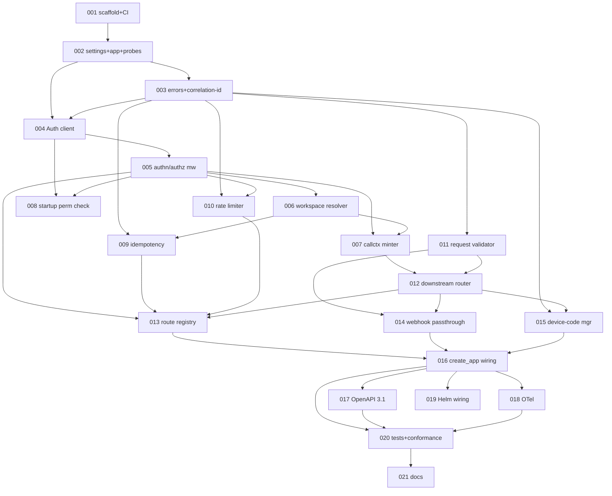
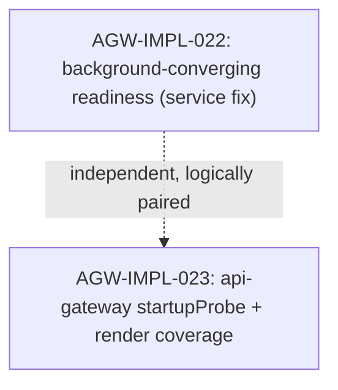

# API Gateway Implementation Plan

> Derived from `design/components/api-gateway/design.md` on 2026-06-05.
> Source of truth: the design doc + `design/architecture/` + the bundle-i routes change record.
> This plan is owned by the `implement-component` skill; regenerate fresh whenever the design changes.

## Summary

The API Gateway (COMP-001) is the single uniform HTTPS entrypoint for every external Custos
caller (UI, CLI, SDK, automation, inbound webhooks). It contains **no domain logic**: it
terminates TLS, validates request shape, delegates every authn/authz decision to the Auth
Service, mints the signed call context internal RPCs travel on, deduplicates idempotent writes,
applies coarse rate limits, normalizes errors into one RFC 7807 envelope, and routes each
request to the owning downstream component via Dapr service invocation. The implementation is
split scaffold → auth-delegation/call-context → cross-cutting write-path middleware →
routing/webhook/device-code → app-wiring/OpenAPI/observability → verification/docs, mirroring
the conventions established by `trigger-service`.

Grounding facts established during planning:

- `src/services/api-gateway/` has **no source yet**; only the Helm chart
  (`deploy/helm/charts/api-gateway`) is scaffolded.
- SPL already provides `IdempotencyRecord`, `DeviceCodeSession`,
  `reserve_idempotency_record()`, `complete_idempotency_record()`,
  `delete_expired_idempotency_records()`, and `put_device_code_session()`
  (`src/libs/storage-provider-layer/src/custos_spl/interfaces/metadata_store.py`).
  **No COMP-008 delta is required.**
- Auth Service exposes `/rpc/authz.verifyAndAuthorize`, `/rpc/callctx.sign`, and
  `GET /v1/permissions`. The gateway verifies the inbound bearer with Auth, then **mints** a
  fresh `x-custos-callctx`; it does not verify inbound call contexts.
- `custos-common` does not exist; the gateway mirrors `trigger-service` conventions in-package.
- Per the design's M1 note, device-code routes are wired but return `503` while OIDC is disabled.

## Conventions

- Task prefix: `AGW-IMPL-`.
- Numbering starts at `AGW-IMPL-001` (no prior `AGW-IMPL` issues exist).
- One task = one PR = one GitHub issue.
- Phases run sequentially; tasks within a phase may run in parallel if dependencies allow.
- Quality gates from `src/services/api-gateway`: `ruff format . && ruff check . && mypy src tests && pytest -q`, coverage floor `--cov-fail-under=90`.
- Python `>=3.11`, ruff `line-length=100` / `py311` / `E W F I B UP SIM RUF`, mypy `strict=true` `namespace_packages=true`, pytest `asyncio_mode=auto`, `integration` marker excluded by default.

## Dependency graph

## Phase A — Scaffold & foundations

### `AGW-IMPL-001`: Scaffold `custos-gateway` package + CI gate

- **Scope**:
  - `src/services/api-gateway/pyproject.toml` — package metadata, deps (`fastapi`, `httpx`, `opentelemetry-api`, `custos-callctx`, `custos-spl`, dev: `pytest`, `pytest-asyncio`, `ruff`, `mypy`), ruff/mypy/pytest config, `--cov-fail-under=90`.
  - `src/services/api-gateway/src/custos_gateway/__init__.py` + `__main__.py` — `python -m custos_gateway` entry point.
  - `.github/workflows/python-services.yml` — add `api-gateway` to the CI matrix.
- **Acceptance criteria**:
  - `pip install -e .` succeeds; `python -m custos_gateway --help` runs.
  - `ruff check . && mypy src tests && pytest -q` pass on an empty test scaffold.
  - CI matrix runs the gateway gate.
- **Depends on**: _(none)_.
- **Complexity**: M.

### `AGW-IMPL-002`: Settings + `create_app` skeleton + health probes

- **Scope**:
  - `custos_gateway/settings.py` — `Settings` dataclass + `load_settings(env)` covering every `CUSTOS_GATEWAY_*` variable from the design Configuration table plus `DAPR_HTTP_HOST` / `DAPR_HTTP_PORT`.
  - `custos_gateway/app.py` — `create_app(*, settings, ...)` factory with test-injection seams + lifespan skeleton.
  - `custos_gateway/health.py` — `GET /healthz` (always 200), `GET /readyz` (503 until `app.state.ready`).
- **Acceptance criteria**:
  - Missing required vars (`*_TLS_CERT_REF`, `*_TLS_KEY_REF`, `*_CORS_ALLOWED_ORIGINS`) raise at load.
  - `/healthz` returns 200; `/readyz` returns 503 before and 200 after readiness gate.
  - Defaults match the design table.
- **Depends on**: `AGW-IMPL-001`.
- **Complexity**: M.

### `AGW-IMPL-003`: Error envelope + taxonomy + correlation-id middleware

- **Scope**:
  - `custos_gateway/errors.py` — RFC 7807 `ProblemDetails+CustosError` model + locked taxonomy (`invalid-token`, `permission-denied`, `workspace-mismatch`, `idempotency-in-flight`, `idempotency-key-reuse`, `rate-limited`, `body-too-large`, `unsupported-media-type`, `downstream-unavailable`, `webhook-route-not-found`, `device-code-expired`, `gateway-startup-permission-missing`).
  - `custos_gateway/middleware/correlation.py` — generate `x-correlation-id` (uuid7) at ingress if absent; set on every response (success or error).
  - Exception handlers mapping each error to its `problem+json` body.
- **Acceptance criteria**:
  - Every taxonomy `code` has a stable `type` URI + HTTP status, asserted by a grid test.
  - Responses always carry `x-correlation-id`; an inbound id is propagated unchanged.
  - All non-2xx bodies are `application/problem+json` with `correlationId` populated.
- **Depends on**: `AGW-IMPL-002`.
- **Complexity**: M.

## Phase B — Auth delegation & call-context minting

### `AGW-IMPL-004`: `AuthServiceClient` over Dapr service invocation

- **Scope**:
  - `custos_gateway/clients/auth.py` — `AuthServiceClient` with `verify_and_authorize()`, `callctx_sign()`, `get_permissions()` over `http://{host}:{port}/v1.0/invoke/custos-auth/method/...`.
  - Request/response models mirroring Auth Service `VerifyAndAuthorizeRequest/Response`, `CallctxSignRpcRequest/Response`, `DeclaredPermission`.
  - `NoopAuthServiceClient` + `FakeAuthServiceClient` test doubles.
- **Acceptance criteria**:
  - Lifespan-owned `httpx.AsyncClient`; transient (408/429/5xx) classified retryable, 4xx permanent.
  - Fakes return canned decisions/contexts and record calls.
  - mypy-clean against the Auth Service wire shapes.
- **Depends on**: `AGW-IMPL-002`, `AGW-IMPL-003`.
- **Complexity**: M.

### `AGW-IMPL-005`: AuthN/AuthZ middleware + per-route required permission

- **Scope**:
  - `custos_gateway/middleware/auth.py` — extract bearer, call `verify_and_authorize(token, requiredPermission, workspaceId)`, attach `principal` + `auditEventId` to request state.
  - Per-route `requiredPermission` declaration mechanism (FastAPI dependency).
  - Bypass families: webhook ingress + auth-bootstrap routes.
- **Acceptance criteria**:
  - `401 invalid-token` on missing/invalid bearer; `403 permission-denied` envelope carries `auditEventId`.
  - Bypass routes never call Auth `verify_and_authorize`.
  - Allowed requests expose `principal` + `auditEventId` downstream.
- **Depends on**: `AGW-IMPL-004`.
- **Complexity**: M.

### `AGW-IMPL-006`: Workspace Resolver

- **Scope**:
  - `custos_gateway/middleware/workspace.py` — extract `{workspaceId}` from the path; URL is authoritative.
  - Reject URL-vs-body workspace divergence with `400 workspace-mismatch`.
- **Acceptance criteria**:
  - Workspace id from path supplied to authz + minter.
  - Body referencing a different workspace → `400 workspace-mismatch` (not retryable).
  - Unscoped routes resolve to no workspace cleanly.
- **Depends on**: `AGW-IMPL-005`.
- **Complexity**: S.

### `AGW-IMPL-007`: Call-Context Minter

- **Scope**:
  - `custos_gateway/middleware/callctx_mint.py` — call `callctx.sign(principal, workspaceId, "api-gateway")`; attach the signed token + correlation id to outbound Dapr invocation metadata (`x-custos-callctx`, `x-correlation-id`).
- **Acceptance criteria**:
  - Every authenticated (non-bypass) request mints exactly one context.
  - `x-custos-callctx` + `x-correlation-id` present on the downstream invocation metadata.
  - Bypass routes mint no context.
- **Depends on**: `AGW-IMPL-005`, `AGW-IMPL-006`.
- **Complexity**: M.

### `AGW-IMPL-008`: Startup permission validation

- **Scope**:
  - `custos_gateway/startup.py` — at startup, fetch `GET /v1/permissions`; cross-check every registered route's `requiredPermission` against the registry.
  - Refuse to start (`gateway-startup-permission-missing`) on any undeclared permission.
- **Acceptance criteria**:
  - Startup fails fast when a route references a permission absent from the registry.
  - Startup succeeds when all referenced permissions are declared.
  - The check runs in the lifespan before readiness flips.
- **Depends on**: `AGW-IMPL-004`, `AGW-IMPL-005`.
- **Complexity**: S.

## Phase C — Cross-cutting write-path middleware

### `AGW-IMPL-009`: Idempotency Coordinator

- **Scope**:
  - `custos_gateway/middleware/idempotency.py` — `key=(workspaceId, principalId, route, idempotencyKey)`; `requestHash=SHA-256(method || route || workspaceId || sorted-headers-subset || body)`; auto-generate the key when absent.
  - `reserve_idempotency_record()` → four-outcome handling; `complete_idempotency_record()` on response.
- **Acceptance criteria**:
  - `Reserved` → proceeds then completes; `ExistingCompleted` → replays stored snapshot; `ExistingInFlight` → `409 idempotency-in-flight` + `Retry-After`; `KeyReuse` → `409 idempotency-key-reuse`.
  - Applies only to write methods (`POST`/`PUT`/`PATCH`/`DELETE`); reads skip the coordinator.
  - TTL honored from `CUSTOS_GATEWAY_IDEMPOTENCY_TTL` (default 24h).
- **Depends on**: `AGW-IMPL-003`, `AGW-IMPL-006`.
- **Complexity**: L.

### `AGW-IMPL-010`: Rate Limiter

- **Scope**:
  - `custos_gateway/middleware/ratelimit.py` — in-memory per-principal + per-workspace token buckets, config-driven; `tryConsume(bucketKey, cost) -> Allow | Deny+RetryAfter`.
- **Acceptance criteria**:
  - Exceeding either bucket → `429` with `Retry-After` + `RateLimit-*` headers.
  - RPS/burst read from `CUSTOS_GATEWAY_RATE_LIMIT_*`.
  - Reads are unlimited in v1; only write endpoints are limited.
- **Depends on**: `AGW-IMPL-003`, `AGW-IMPL-005`.
- **Complexity**: M.

### `AGW-IMPL-011`: Request Validator

- **Scope**:
  - `custos_gateway/middleware/validate.py` — body-size caps (default 1 MB; publish routes 5 MB) → `413`; content-type enforcement → `415`; route-prefix detection routing webhook + auth-bootstrap families to their bypass handlers.
- **Acceptance criteria**:
  - Oversized body → `413 body-too-large`; non-JSON content type on JSON routes → `415 unsupported-media-type`.
  - Publish routes accept up to 5 MB.
  - Webhook + auth-bootstrap prefixes are detected and dispatched to bypass paths.
- **Depends on**: `AGW-IMPL-003`.
- **Complexity**: S.

## Phase D — Routing, webhook & device-code

### `AGW-IMPL-012`: Downstream Router + Response Shaper

- **Scope**:
  - `custos_gateway/router.py` — Dapr service invocation to the owning app-id; raw 2xx body pass-through; transient failure → `503 downstream-unavailable` with `correlationId`.
  - Lifespan-owned `httpx.AsyncClient`; propagate `x-custos-callctx` + `x-correlation-id` metadata.
- **Acceptance criteria**:
  - 2xx downstream responses returned raw (body + status + relevant headers).
  - Downstream 5xx/transport error → `503 downstream-unavailable`.
  - Correct app-id + method-path constructed per route mapping.
- **Depends on**: `AGW-IMPL-007`, `AGW-IMPL-011`.
- **Complexity**: L.

### `AGW-IMPL-013`: Route registry — full M1 contract set

- **Scope**:
  - `custos_gateway/routes/registry.py` — declarative mount of all M1 contract prefixes (Auth, Catalog, Workflow, Trigger, Connector, Observability) with per-route `requiredPermission`, `requiresIdempotencyKey`, `maxBodyBytes`, `rateLimitClass`.
  - Thread every route through the full middleware chain (validate → authn/authz → workspace → idempotency → rate-limit → mint → route → shape).
- **Acceptance criteria**:
  - Every prefix in the design's M1 route table is mounted with the documented attributes.
  - Each route's `requiredPermission` participates in the startup registry check.
  - A table-driven test asserts the mounted set matches the design contract.
- **Depends on**: `AGW-IMPL-005`, `AGW-IMPL-009`, `AGW-IMPL-010`, `AGW-IMPL-011`, `AGW-IMPL-012`.
- **Complexity**: L.

### `AGW-IMPL-014`: Webhook Pass-through

- **Scope**:
  - `custos_gateway/routes/webhook.py` — `POST /v1/webhooks/{connectorInstanceId}`; anonymous forward to Trigger Service; 1 MB cap; strip `Authorization`; no call context; body untouched; generate correlation id.
- **Acceptance criteria**:
  - Forwards body + headers (minus `Authorization`) + source IP to Trigger Service via Dapr.
  - No call context minted; correlation id generated and propagated.
  - Unknown `{connectorInstanceId}` surfaces `404 webhook-route-not-found` from downstream.
- **Depends on**: `AGW-IMPL-011`, `AGW-IMPL-012`.
- **Complexity**: M.

### `AGW-IMPL-015`: Device-Code Session Manager (M1 503 stub)

- **Scope**:
  - `custos_gateway/routes/devicecode.py` — wire `/v1/auth/login/device`, `/v1/auth/login/device/{deviceCode}/poll`, `GET /v1/auth/login/device/{userCode}` as auth-bootstrap (no call context).
  - `DeviceCodeSession` SPL persistence scaffolding; **M1 handlers return `503 Service Unavailable`** per the design note (OIDC disabled).
- **Acceptance criteria**:
  - Routes are mounted, bypass authn, and return `503` in M1.
  - The `DeviceCodeSession` persistence seam exists behind the handlers for M3 activation.
  - TTL config (`CUSTOS_GATEWAY_DEVICE_CODE_TTL`, default 15m) is wired but unused in M1.
- **Depends on**: `AGW-IMPL-003`, `AGW-IMPL-012`.
- **Complexity**: M.

## Phase E — App wiring, OpenAPI, observability

### `AGW-IMPL-016`: Full `create_app` wiring

- **Scope**:
  - `custos_gateway/app.py` — assemble the full middleware ordering (CORS → validate → correlation → authn/authz → workspace → idempotency → rate-limit → mint → route → shape).
  - Lifespan owns the `httpx.AsyncClient`, the SPL `MetadataStoreProvider`, the Auth client, runs the startup permission check, then flips readiness.
- **Acceptance criteria**:
  - End-to-end request flows through every middleware in the documented order.
  - Lifespan startup/shutdown cleanly opens/closes the httpx client + provider.
  - Test-injection seams allow fakes for Auth + SPL.
- **Depends on**: `AGW-IMPL-013`, `AGW-IMPL-014`, `AGW-IMPL-015`.
- **Complexity**: M.

### `AGW-IMPL-017`: OpenAPI 3.1 emission

- **Scope**:
  - `custos_gateway/openapi.py` — single document at `/openapi.json` with security schemes (`BearerAuth`, `WebhookNoAuth`), `x-custos-required-permission` / `x-custos-idempotent` operation extensions, shared `ProblemDetails+CustosError` schema.
- **Acceptance criteria**:
  - `/openapi.json` is valid OpenAPI 3.1.
  - Every operation carries the two `x-custos-*` extensions reflecting its registry attributes.
  - Security schemes present and referenced by the right routes.
- **Depends on**: `AGW-IMPL-016`.
- **Complexity**: M.

### `AGW-IMPL-018`: OTel observability

- **Scope**:
  - `custos_gateway/_telemetry.py` — per-request span attrs (`http.method`, `http.route`, `workspaceId`, `principalId`, `correlationId`, `decisionAuditEventId`); counters `gateway_requests_total{route,method,status}`, `gateway_rate_limit_denials_total`, `gateway_idempotency_replays_total`; histograms `gateway_request_duration_seconds`, `gateway_downstream_duration_seconds`.
- **Acceptance criteria**:
  - `opentelemetry-api`-only; no-op when no SDK installed.
  - In-memory exporter test asserts each counter/histogram + span-attr set.
  - Rate-limit denials + idempotency replays increment their counters.
- **Depends on**: `AGW-IMPL-016`.
- **Complexity**: M.

## Phase F — Verification & docs

### `AGW-IMPL-019`: Helm subchart wiring

- **Scope**:
  - `deploy/helm/charts/api-gateway/` — env vars + ConfigMap + ExternalSecret + TLS cert/key secret refs + Dapr sidecar annotations matching the Configuration table.
- **Acceptance criteria**:
  - `helm template` renders the gateway Deployment/Service/ConfigMap with all `CUSTOS_GATEWAY_*` env wired.
  - TLS cert/key secret refs + Dapr app-id annotation present.
  - Chart lint passes.
- **Depends on**: `AGW-IMPL-016`.
- **Complexity**: M.

### `AGW-IMPL-020`: Unit + integration + conformance suite

- **Scope**:
  - `tests/` unit coverage of every middleware + client + error path.
  - `tests/integration/` conformance suite exercising every cross-cutting middleware against a stub downstream + fake Auth + in-memory SPL.
- **Acceptance criteria**:
  - Conformance suite covers authn/authz, workspace, idempotency (all four outcomes), rate-limit, validation, routing, webhook, device-code 503.
  - Coverage ≥ 90% (`--cov-fail-under=90`).
  - `ruff`/`mypy`/`pytest` all green.
- **Depends on**: `AGW-IMPL-016`, `AGW-IMPL-017`, `AGW-IMPL-018`.
- **Complexity**: L.

### `AGW-IMPL-021`: Developer documentation

- **Scope**:
  - `docs/developers/api-gateway.md` — entrypoint contract, auth delegation, call-context minting, idempotency semantics, rate limits, error envelope, route registry, webhook + device-code behavior, configuration.
  - Doc-example test pinning fenced examples to the running code.
- **Acceptance criteria**:
  - Doc covers every cross-cutting concern + the M1 503 device-code note.
  - `tests/test_docs_examples.py` (or equivalent) executes the documented examples.
  - Linked from `docs/developers/README.md`.
- **Depends on**: `AGW-IMPL-020`.
- **Complexity**: M.

## Out of scope (deferred)

- **SPL `IdempotencyRecord` / `DeviceCodeSession` entities** — already exist; no COMP-008 work.
- **Live OIDC device-code grant** — Auth Service has no device-code endpoints yet; gateway routes return `503` until M3 (REQ-034 / REQ-056–058).
- **Extracting a shared `custos-common` lib** — gateway mirrors `trigger-service` conventions in-package; a shared lib is a separate refactor.
- **Coordinated (Redis / Dapr-state) rate limiter**, **multi-region routing**, **schema-translation versioning** — all M2+.

## Open questions

_(none — resolved at gate 1: prefix `AGW-IMPL`, full-contract route registry as one task, device-code 503 stub retained.)_

---

# Follow-up: Resilient startup (#815)

> Derived from `design/components/api-gateway/design.md`, `src/services/api-gateway/src/custos_gateway/{app,startup,health,clients/auth}.py`, and issue #815 on 2026-06-08.
> Scope: the single bug in #815 (gateway crash-loops when auth-service / Dapr sidecar aren't yet reachable at startup). Extends the already-delivered AGW-IMPL-001..021 component build; not a redesign.

## Summary

The gateway lifespan eagerly runs `validate_route_permissions`, which calls `AuthServiceClient.get_permissions()` over the Dapr sidecar. On a cold cluster the sidecar/auth-service aren't up yet, the call raises `AuthServiceClientTransportError` (a **retryable** error), the lifespan propagates it, and uvicorn exits with *"Application startup failed"* — crash-looping until dependencies happen to start first. The fix makes startup resilient: transient/retryable failures during the initial permission cross-check become non-fatal and converge in the background, with `/readyz` reporting 503 (plus an operator-actionable detail) until the first successful validation. A genuine permission drift (`GatewayStartupError`, non-retryable) keeps the pod up but permanently not-ready (rather than crash-looping), surfacing an operator-actionable detail. A companion deploy task adds a `startupProbe` to the api-gateway subchart for cold-start budget (mirrors the #816 workflow-service hardening).

## Conventions (follow-up)

- Task prefix: `AGW-IMPL-`.
- Numbering continues at `AGW-IMPL-022` (next free id after a `component:api-gateway` scan; highest existing is AGW-IMPL-021).
- The two follow-up tasks are independently mergeable.

## Resolved decisions

1. **Permission-drift behavior**: stay-up-but-permanently-not-ready with an operator detail (option a). Avoids crash-looping (the point of #815) while making drift diagnosable. The pod does not exit on `GatewayStartupError`.
2. **Retry budget**: unbounded background retry for retryable (transport/5xx) errors, with the Kubernetes `startupProbe` from AGW-IMPL-023 providing the outer time bound.

## Dependency graph (follow-up)

## Phase A2 — Resilient gateway startup (service)

### `AGW-IMPL-022`: Make startup permission validation non-fatal and background-converging

- **Scope**:
  - `src/services/api-gateway/src/custos_gateway/app.py` — in the lifespan, stop `await`-ing `validate_route_permissions` as a boot-blocking, crash-on-failure call. Instead: attempt it once; on a **retryable** `AuthServiceClientError` (transport / 408 / 429 / 5xx) leave `app.state.ready = False`, set `app.state.ready_detail`, log a warning, and launch a background retry task that re-runs the check on a backoff until it succeeds (then flips `ready = True`). Cancel + await the task on lifespan shutdown.
  - `src/services/api-gateway/src/custos_gateway/startup.py` — add a small reusable coroutine (e.g. `converge_route_permissions(app, client, *, backoff…)`) that wraps `validate_route_permissions`, classifies errors via the existing `AuthServiceClientError.retryable` flag, and owns the retry/backoff loop. Keep `validate_route_permissions` itself unchanged (single-shot, raises) so the pure cross-check stays unit-testable.
  - `src/services/api-gateway/src/custos_gateway/health.py` — surface `app.state.ready_detail` in the `/readyz` 503 body (replacing the static "has not finished startup" string) so operators can see *why* it's not ready.
  - `src/services/api-gateway/src/custos_gateway/settings.py` — add optional knobs for the startup convergence budget (initial delay, max backoff), with safe defaults.
- **Acceptance criteria**:
  - With an auth-service client that raises `AuthServiceClientTransportError` on the first N calls then succeeds, `create_app()` starts cleanly (no exception out of the lifespan), `/readyz` returns 503 with a transport detail while unreachable, and flips to 200 after the client recovers.
  - A non-retryable `GatewayStartupError` (permission drift) keeps `/readyz` at 503 with the drift detail and does **not** crash the process (no infinite background retry on a permanent error).
  - The background task is cancelled and awaited on shutdown (no "task was destroyed" warnings; no leaked task).
  - New/adjusted unit tests in `tests/test_startup.py` / `tests/test_app.py` cover: initially-unreachable→recovers, permanent permission-drift→stays-not-ready, and shutdown-cancels-the-task.
  - Quality gates green from `src/services/api-gateway` (`ruff format . && ruff check . && mypy src tests && pytest -q`, coverage floor `--cov-fail-under=90`).
- **Depends on**: _(none — builds on the delivered AGW-IMPL-002/008)_.
- **Complexity**: M.

## Phase B2 — Deploy cold-start hardening

### `AGW-IMPL-023`: Add a `startupProbe` to the api-gateway subchart with render coverage

- **Scope**:
  - `deploy/helm/charts/api-gateway/values.yaml` — add a configurable `startupProbe` block (enabled by default; `periodSeconds` × `failureThreshold` cold-start budget), matching the pattern landed for workflow-service in #816.
  - `deploy/helm/charts/api-gateway/templates/deployment.yaml` — render the `startupProbe` (→ `/healthz`) gating liveness/readiness so the readiness convergence window doesn't trip liveness restarts on a slow cold start.
  - `deploy/helm/charts/api-gateway/README.md` — document the probe + the resilient-startup behavior.
  - `tests/helm/test_api_gateway_render.py` — assert the `startupProbe` renders with an adequate budget across all four profiles.
- **Acceptance criteria**:
  - `helm template` for all four profiles renders an api-gateway `startupProbe` hitting `/healthz` with `periodSeconds × failureThreshold ≥ 60s`.
  - New render test passes; existing api-gateway render tests stay green.
- **Depends on**: _(none — independent of 022, but sequenced after it)_.
- **Complexity**: S.

## Out of scope (follow-up)

- Re-enabling the `deploy-smoke` workflow as a required `pull_request` gate — that's the umbrella follow-up once both #815 and #816 are green (tracked in DEPLOY-IMPL-019 / #792), not part of this fix.
- Switching the readiness model to a Dapr-state/health-API-backed probe — M2.
