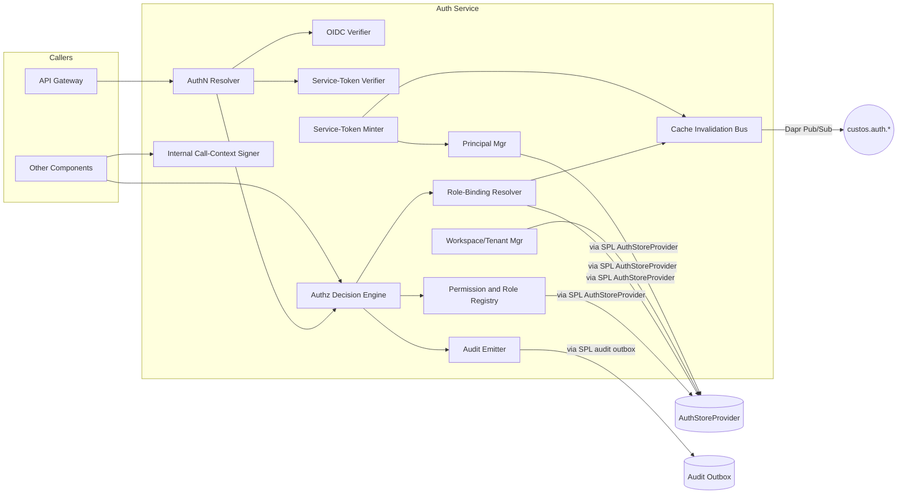
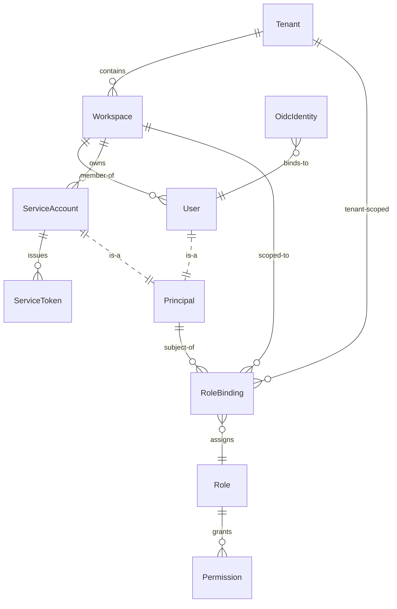

# Component Design: Auth Service

Slug: `auth-service`
Last Updated: 2026-05-17
Version: 1
Status: Draft

## Responsibility

Auth Service owns identity issuance, identity verification, and authorization decisions for every human and programmatic caller of Custos. It is the single source of truth for "may principal P perform action A on resource R in workspace W?". It mediates external OIDC providers, mints platform-native service tokens, owns the tenancy data model (`Tenant`, `Workspace`, `User`, `ServiceAccount`, `Role`, `Permission`, `RoleBinding`), and emits an audit event for every authentication and authorization decision.

## Boundaries

- Owns:
  - The principal model (Users + Service Accounts) and their lifecycles.
  - The tenant / workspace data model and the management endpoints that mutate it.
  - The OIDC integration (issuer config, JWKS, identity linking).
  - The service-token mint/verify/revoke pipeline.
  - The permission registry (ingested at platform startup from each component's `permissions.yaml`).
  - The role registry (built-in v1 roles; custom roles deferred to M2+).
  - The role-binding store.
  - The authorization decision engine.
  - The internal call-context signing key and propagation contract.
- Does NOT own:
  - Plaintext secret material (Dapr Secrets API is the boundary; signing key is referenced, never embedded).
  - Workflow / activity / connector authorization semantics (Auth Service decides "yes / no"; the calling component decides what to do with that decision).
  - Per-component permission name semantics (each component declares its permission names in its own `permissions.yaml`; Auth Service stores and resolves them).
  - Audit retention and tamper-evidence (delegated to Observability Service per ADR-010).
  - Workload identity at the cluster level (SPIFFE/SPIRE deferred to M3; v1 uses signed JWT call contexts).

## Internal Structure



## Data Model



### Core entities

- **Tenant**: top-level isolation boundary; exists from day 1 (ADR-012) though tenant-level enforcement ships in M3.
- **Workspace**: the day-1 scoping unit for all RBAC bindings, secrets, workflows, connectors, runs, triggers, audit. Lives inside a tenant.
- **Principal**: discriminated union over `User` and `ServiceAccount`; `principalId` namespace is shared.
- **User**: human, bound to one or more `OidcIdentity` records `(issuer, subject)`.
- **ServiceAccount**: machine principal, owns zero or more `ServiceToken` rows.
- **ServiceToken**: only the bcrypt-style hash is persisted; the plaintext is returned once at mint time and never again.
- **OidcIdentity**: stable `(issuer, subject) → userId` mapping so platform identity survives provider rotations.
- **Permission**: `(name, description, declaredBy)`; populated at startup from every component's `permissions.yaml`.
- **Role**: named bundle of permissions. v1 ships six built-in roles (below).
- **RoleBinding**: `(principalId, roleId, scope)` where `scope` is `workspaceId`, `tenantId`, or `*` (platform).

### Scope rules

| Role | Allowed scopes |
|---|---|
| `workspace.viewer`, `workspace.author`, `workspace.operator`, `workspace.admin` | workspace only |
| `tenant.admin` | tenant only |
| `platform.admin` | platform (`*`) only |

Bindings outside the allowed scope are rejected by the role-binding endpoint with `400 InvalidRoleScope`.

## Identity Sources

GitHub and Azure Entra ID are the **priority OIDC presets** for v1 — they ship first, are exercised end-to-end before any other identity source is enabled, and drive the shape of the generic OIDC configuration. Every other identity source builds on the contract these two prove out.

| Source | Status v1 | Priority | Use |
|---|---|---|---|
| **GitHub OIDC preset** (human login + GitHub Actions workload tokens) | **M1** | **P0** | Default human identity and CI workload identity (REQ-057) |
| **Azure Entra ID OIDC preset** (human login + workload identity) | **M1** | **P0** | Default enterprise human identity and workload identity (REQ-058) |
| OIDC (generic, RFC-compliant) | **M1** | P1 | Any other RFC-compliant issuer; configured per-tenant once the GitHub/Entra presets are proven |
| Platform-issued service tokens | **M1** | P1 | Fallback for CI/automation that cannot present an OIDC token |
| SPIFFE / SPIRE workload identity | **M3** | — | REQ-059 — replaces the v1 signed-JWT internal call-context |

**Implementation order within M1**: GitHub preset → Entra preset → generic OIDC → service tokens. The two presets are not optional add-ons; they are the first concrete configurations the platform supports, and the generic OIDC path is hardened by anything the presets uncover.

### OIDC provisioning policy

On first successful OIDC verification for a `(issuer, subject)` pair not yet linked to a `User`:

1. Auth Service creates a new `User` row.
2. The new `User` has **zero workspace bindings** — they can authenticate but cannot perform any workspace operation until an admin grants a binding.
3. `oidc.identity-linked` audit event records the linkage.

This is policy (a) from the design session: least-surprising, no implicit grants. Operators who want auto-onboarding can write a small automation against the role-binding endpoint.

## Permission and Role Model

### Permission registry

Permissions are **declared in code** by the components that enforce them. Each component package ships a `permissions.yaml`:

```yaml
- name: connector:read
  description: Read connector instance state and live leases
  declaredBy: connector-service
- name: admin:connector
  description: Mutate connector instances; revoke leases; pause loops
  declaredBy: connector-service
- name: audit:read
  description: Query audit history
  declaredBy: connector-service|observability-service
```

At platform startup, Auth Service ingests every component's `permissions.yaml` and upserts them into the `Permission` table. Any role definition that references an undeclared permission → startup refuses (consistent with COMP-008's strict migration policy).

### Built-in roles (v1)

Hard-coded in the Auth Service binary; not editable at runtime in v1. Custom-role authoring deferred to M2+.

| Role | Scope | Permissions |
|---|---|---|
| `workspace.viewer` | workspace | `workflow:read`, `template:read`, `connector:read`, `audit:read`, `run:read` |
| `workspace.author` | workspace | viewer + `workflow:create`, `template:create`, `workflow:execute`, `run:cancel` |
| `workspace.operator` | workspace | author + `admin:connector`, `admin:trigger` |
| `workspace.admin` | workspace | operator + `admin:role-binding`, `admin:service-account` |
| `tenant.admin` | tenant | cross-workspace within tenant: `admin:workspace`, `admin:role-binding` |
| `platform.admin` | platform | global; reserved for cluster operator. Cannot be assigned by non-`platform.admin`. |

### Authorization decision

```
authorize(principalId, permission, workspaceId) → Allow | Deny + reason
```

1. Resolve all role bindings for `principalId` at scope `workspaceId`, the workspace's tenant, and platform-global.
2. Resolve permissions granted by those roles.
3. Allow if `permission ∈ resolved set`; else deny.
4. `platform.admin` short-circuits; everything else respects the scope hierarchy (platform > tenant > workspace).
5. Every decision (allow and deny) is emitted as an `authz.decision` audit event with `{principalId, permission, workspaceId, decision, reason, callerComponent}` via the SPL audit outbox.

## Internal vs External Auth — Trust Model

**External callers** (UI, CLI, SDK, third-party automation) reach the API Gateway. Gateway calls `authn.verifyAndAuthorize(token, requiredPermission, workspaceId)` for every request.

**Internal callers** (WF → Connector, ARM → SPL, TS → WF) do **not** consult Auth Service per call. Instead:

- Every internal RPC carries a **signed call context**: `{actingPrincipalId, workspaceId, callerComponent, issuedAt, exp}`.
- API Gateway mints the call context at ingress from the user's authenticated request, signs it with the platform call-context key, and propagates it through Dapr service-invocation metadata.
- Receiving components verify the signature locally (no Auth Service round-trip) using the published JWKS.
- The signing key is rotated weekly; old keys remain in the JWKS for 2× rotation period to absorb in-flight requests.

**Migration path to SPIFFE/SPIRE (anticipated M2/M3):**

- The call-context interface stays the same: `verifyCallContext(metadata) → CallContext`. Implementations swap from "verify signed JWT against published JWKS" to "verify SPIFFE SVID against trust bundle". Component code does not change.
- A feature flag `CUSTOS_AUTH_INTERNAL_IDENTITY_MODE = jwt | spiffe` lets us bridge the transition. Both modes co-exist during cutover; `spiffe` becomes the only mode once all components are SPIRE-attested.

## Service-Token Lifecycle (M1)

| Operation | Endpoint | Permission |
|---|---|---|
| Create service account | `POST /v1/service-accounts` | `admin:service-account` in workspace |
| Mint token | `POST /v1/service-accounts/{id}/tokens` | `admin:service-account` in workspace |
| Revoke single token | `DELETE /v1/tokens/{tokenId}` | `admin:service-account` in workspace |
| Revoke all tokens | `DELETE /v1/service-accounts/{id}/tokens` | `admin:service-account` in workspace |
| List tokens | `GET /v1/service-accounts/{id}/tokens` | `admin:service-account` in workspace |

- Token format: `custos_<base64url-random>` (32 bytes of entropy).
- Storage: only the bcrypt-style hash; plaintext returned once at mint.
- Default TTL: 90 days, configurable per-mint.
- Verification cache: in-memory, ≤30s; evicted immediately on `custos.auth.token-revoked` event (see Cache Invalidation Bus below).
- Audit events: `token.issued`, `token.used` (first use after rotation only, not every request), `token.revoked`, `token.expired`.
- No automatic refresh in v1 — clients re-mint before TTL.

## Cache Invalidation Bus

Two caches live inside Auth Service:

| Cache | Key | TTL | Eviction event |
|---|---|---|---|
| Authn (token-verification) | `tokenHash` | 30s | `custos.auth.token-revoked { tokenId }` |
| Authz (decision) | `(principalId, roleVersion, workspaceId)` | 60s | `custos.auth.binding-changed { principalId, workspaceId }` |

Events are published on Dapr Pub/Sub when:

- A token is revoked → `custos.auth.token-revoked` (immediate eviction across all Auth Service replicas; revoke is effectively instant rather than waiting ≤30s for cache expiry).
- A role binding is granted or revoked → `custos.auth.binding-changed`.
- A role definition is upgraded → `custos.auth.role-version-bumped` (rare; on platform restart only in v1).

Subscribers: every Auth Service replica subscribes to all three topics. Other components do not subscribe — they query `authorize` and trust the result.

## Public Interface

### REST API (gateway-facing and admin)

| Method | Path | Permission | Description |
|---|---|---|---|
| POST | `/v1/auth/login/oidc/callback` | — | OIDC callback handler (server-side flow). |
| POST | `/v1/auth/verify` | — | Internal: verify a bearer token, return `Principal` or 401. |
| GET | `/v1/principals/me` | authenticated | Current principal + workspace memberships. |
| POST | `/v1/tenants` | `platform.admin` | Create tenant. |
| GET | `/v1/tenants` | `platform.admin` or `tenant.admin` | List tenants visible to caller. |
| POST | `/v1/tenants/{id}/workspaces` | `tenant.admin`/`platform.admin` | Create workspace. |
| GET | `/v1/workspaces` | authenticated | Workspaces where caller has at least one binding. |
| GET | `/v1/workspaces/{id}` | any binding in workspace | Workspace details. |
| POST | `/v1/workspaces/{id}/role-bindings` | `admin:role-binding` | Grant binding. |
| DELETE | `/v1/workspaces/{id}/role-bindings/{bindingId}` | `admin:role-binding` | Revoke binding. |
| POST | `/v1/service-accounts` | `admin:service-account` | Create SA. |
| POST | `/v1/service-accounts/{id}/tokens` | `admin:service-account` | Mint token (plaintext returned once). |
| DELETE | `/v1/tokens/{tokenId}` | `admin:service-account` | Revoke. |
| GET | `/v1/permissions` | authenticated | List declared permissions (read-only registry view). |
| GET | `/v1/roles` | authenticated | List built-in roles + permission sets. |

### Internal RPC (consumed by every other component)

```python
authn.verifyToken(rawToken) -> Principal | None
authz.authorize(principalId, permission, workspaceId) -> Decision
authz.verifyAndAuthorize(rawToken, permission, workspaceId) -> Decision   # API Gateway convenience
callctx.sign(principal, workspaceId, callerComponent) -> SignedContext
callctx.verify(signedContext) -> CallContext | InvalidContext
```

`Decision` carries `{allowed: bool, reason: string, auditEventId: uuid}` so callers can correlate denials with the audit record.

### Pub/Sub topics published

| Topic | Payload |
|---|---|
| `custos.auth.token-revoked` | `{ tokenId, principalId, revokedBy, reason }` |
| `custos.auth.binding-changed` | `{ principalId, workspaceId, changeKind: granted|revoked }` |
| `custos.auth.role-version-bumped` | `{ roleId, newVersion }` |

## Storage

Auth Service persists exclusively through the new `AuthStoreProvider` interface in COMP-008 Storage Provider Layer (see the parallel COMP-008 delta for the contract). The interface owns: `Tenant`, `Workspace`, `Principal` (User / ServiceAccount discriminator), `OidcIdentity`, `ServiceToken`, `Role`, `Permission`, `RoleBinding`. No other component writes to these tables.

## Configuration

| Variable | Required | Default | Description |
|---|---|---|---|
| `CUSTOS_AUTH_OIDC_ISSUERS` | Yes | — | JSON list of OIDC issuer URLs, JWKS URIs, allowed audiences, provisioning policy. |
| `CUSTOS_AUTH_SERVICE_TOKEN_TTL_DEFAULT` | No | `90d` | Default lifetime for new service tokens. |
| `CUSTOS_AUTH_CALL_CONTEXT_KEY_REF` | Yes | — | Dapr secret reference for the call-context signing key. |
| `CUSTOS_AUTH_CALL_CONTEXT_KEY_ROTATION` | No | `7d` | Rotation interval for the call-context signing key. |
| `CUSTOS_AUTH_INTERNAL_IDENTITY_MODE` | No | `jwt` | `jwt` (v1) or `spiffe` (M2/M3 cutover). |
| `CUSTOS_AUTH_AUTHZ_CACHE_TTL` | No | `60s` | Authz decision cache TTL. |
| `CUSTOS_AUTH_AUTHN_CACHE_TTL` | No | `30s` | Token-verification cache TTL. |
| `CUSTOS_AUTH_PLATFORM_ADMIN_BOOTSTRAP` | Yes-at-install | — | First-boot platform admin principal id; ignored after first successful binding. |

## Dependencies

| Dependency | Type | Purpose |
|---|---|---|
| COMP-008 SPL `AuthStoreProvider` | Runtime | Persistence for principals, workspaces, role bindings. |
| Dapr Secrets API | Runtime | Resolves the call-context signing key. |
| Dapr Pub/Sub | Runtime | Cache invalidation bus. |
| External OIDC providers | Runtime | Human identity. |

## Failure Modes

| Failure | Surface | Caller expectation |
|---|---|---|
| `invalid-token` (401) | `verifyToken` | Client re-authenticates. |
| `token-revoked` (401) | `verifyToken` | Client re-authenticates. |
| `token-expired` (401) | `verifyToken` | Client re-mints. |
| `permission-denied` (403) | `authorize` | Terminal; audit captures reason. |
| `workspace-not-found` (404) | `authorize` | Terminal; never disclose existence cross-tenant. |
| `oidc-issuer-unreachable` | `verifyToken` | Transient; gateway returns 503. |
| `unknown-permission` (500) | `authorize` | Programming error — referenced permission was never declared. Refuses startup if found at boot; raised as 500 if dynamically introduced. |
| `invalid-call-context` | `callctx.verify` | Internal; receiver returns 500 and logs the signature failure. |
| `invalid-role-scope` (400) | `POST /role-bindings` | Caller used a workspace-scoped role at tenant scope (or vice versa). |

## Audit

All events flow through the SPL audit outbox in the same transaction as the state mutation that produced them.

| Event | When |
|---|---|
| `authz.decision` | every `authorize` call (allow and deny) |
| `authn.success` / `authn.failure` | every token / OIDC verification at the gateway |
| `token.issued` / `token.used` / `token.revoked` / `token.expired` | service-token lifecycle |
| `principal.created` / `principal.disabled` | user / service-account lifecycle |
| `role-binding.granted` / `role-binding.revoked` | RBAC mutations |
| `oidc.identity-linked` | first OIDC login binding `(issuer, subject) → User` |
| `tenant.created` / `workspace.created` | tenancy lifecycle |
| `call-context.invalid` | signed call-context verification failure (security-relevant) |

`authn.failure` and `call-context.invalid` carry the failure code but never the raw token or secret material.

## Open TODOs

- [ ] Define the exact JWT claim shape for signed call contexts (claim names, audience, signing algorithm — proposed EdDSA).
- [ ] Specify the OIDC issuer config schema for `CUSTOS_AUTH_OIDC_ISSUERS` (per-issuer provisioning policy options).
- [ ] Specify the **GitHub OIDC preset** (default issuer URL, JWKS endpoint, audience claim shape, GitHub Actions `aud`/`sub`/`repository` claim handling for workload tokens, human-login vs workload-token distinction — **M1, P0**).
- [ ] Specify the **Azure Entra ID OIDC preset** (default authority URL, tenant-vs-multitenant audience handling, group-claim → role-binding mapping rules — **M1, P0**).
- [ ] Cross-region replication strategy for Auth Service state (multi-region M2+).
- [ ] Custom role authoring API (M2+).
- [ ] SPIFFE/SPIRE cutover plan (M2/M3).

## Open Questions

_(none — all v1 design questions resolved this session.)_

## Change History

| Date | Change | GitHub Issue |
|---|---|---|
| 2026-05-17 | Initial component design: built-in v1 roles (workspace.viewer/author/operator/admin + tenant.admin + platform.admin), permission registry ingested from per-component `permissions.yaml`, OIDC provisioning policy "create with zero bindings", **GitHub and Azure Entra ID OIDC presets prioritized as P0 in M1** (both human login and workload tokens; generic OIDC and service tokens follow), signed-JWT call context (with SPIFFE migration path via `CUSTOS_AUTH_INTERNAL_IDENTITY_MODE`), every-call `authz.decision` audit, workspace/tenant/platform scope hierarchy, new `AuthStoreProvider` interface in SPL, immediate cache eviction via `custos.auth.token-revoked` and `custos.auth.binding-changed` pub/sub events | #67 |
