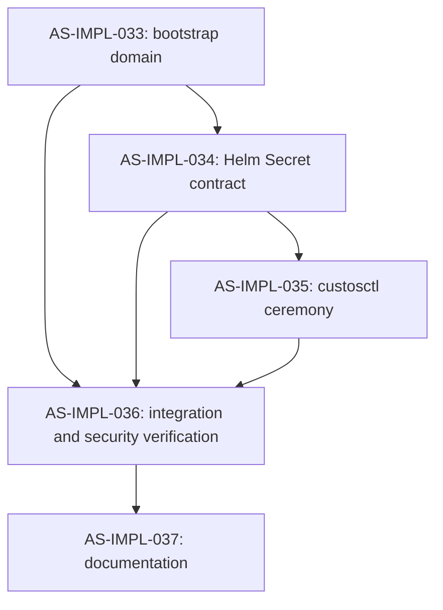

# `auth-service` Implementation Plan: First-Admin Token Bootstrap

> Derived from the approved Auth Service change for #980 on 2026-08-11.
> Source of truth: `design/components/auth-service/design.md`, `changes/2026-08-11-003-first-admin-service-token-bootstrap.md`, and `design/architecture/`.

## Summary

This plan closes the fresh-install authentication loop by introducing an operator-seeded, normal Custos service token for a dedicated platform-admin service account. Work is split across bootstrap domain logic, the Helm Secret contract, the `custosctl` operator ceremony, cross-component verification, and documentation for connected, air-gapped, evaluation, and HA deployments.

## Conventions

- Task prefix: `AS-IMPL-`.
- Numbering starts at `AS-IMPL-033`, after the closed `AS-IMPL-032` task.
- Each task has a dedicated issue and commit. Per owner direction, all tasks are delivered on one branch and one final PR.
- Bootstrap quality gate: `ruff format . && ruff check . && mypy src tests && pytest -q`.
- CLI quality gate: `ruff format . && ruff check . && mypy src tests && pytest -q --cov=custosctl --cov-fail-under=90`.
- Helm quality gate: focused bootstrap render tests followed by `tests/helm`.

## Dependency Graph

## Phase A: Credential Domain

### `AS-IMPL-033`: Implement bootstrap-admin token state transitions

- **Scope**:
  - `src/jobs/bootstrap` parses the typed bootstrap mode and token input.
  - Reuse canonical Auth Service token validation and hashing.
  - Create the dedicated service account, global platform-admin binding, and hashed token row; implement explicit recovery revocation.
  - Add unit tests for init, replay rejection, malformed input, disabled mode, recovery, and idempotent non-credential seeding.
- **Acceptance criteria**:
  - Plaintext never enters persisted rows or logs.
  - `init` cannot replace an existing bootstrap account or token.
  - `recover` revokes all live prior tokens and installs one replacement.
  - Bootstrap lint, strict typing, tests, and coverage pass.
- **Depends on**: none.
- **Complexity**: L.

## Phase B: Deployment Contract

### `AS-IMPL-034`: Wire the bootstrap token Secret through Helm

- **Scope**:
  - Replace the unused free-form Auth chart bootstrap value with typed umbrella bootstrap-admin values.
  - Project only Secret name/key references and non-secret mode, identity, and TTL settings into the bootstrap Job.
  - Add render tests for disabled, init, recover, malformed, and all deployment profiles.
- **Acceptance criteria**:
  - Plaintext cannot be supplied through Helm values.
  - Disabled mode renders no token Secret reference.
  - Init/recover require a non-empty Secret name and key.
  - Existing installs render unchanged by default.
- **Depends on**: `AS-IMPL-033`.
- **Complexity**: M.

## Phase C: Operator Ceremony

### `AS-IMPL-035`: Add `custosctl bootstrap-admin init` and `recover`

- **Scope**:
  - Generate canonical tokens locally and create the short-lived Kubernetes Secret without shell interpolation.
  - Drive the bootstrap Job/release upgrade, verify the token through the API Gateway, and delete the Secret after success by default.
  - Require explicit confirmation for recovery and support `--show-token`.
- **Acceptance criteria**:
  - Tokens are redacted from normal output and subprocess errors.
  - Failed verification leaves the Secret available for operator diagnosis.
  - Recovery cannot run without confirmation or `--yes`.
  - CLI lint, strict typing, unit tests, and 90% coverage pass.
- **Depends on**: `AS-IMPL-034`.
- **Complexity**: L.

## Phase D: Verification

### `AS-IMPL-036`: Verify bootstrap security and cross-component behavior

- **Scope**:
  - Add Postgres-backed state-transition coverage where practical.
  - Extend Helm/API smoke fixtures to consume the resulting token.
  - Test expiry, replay, recovery revocation, missing Secret, and cleanup behavior across bootstrap, chart, and CLI boundaries.
- **Acceptance criteria**:
  - The generated token verifies through the normal Auth/Gateway path.
  - A recovered token invalidates every earlier bootstrap-admin token.
  - No test snapshot or command output contains plaintext credentials.
  - Relevant integration and Helm suites pass.
- **Depends on**: `AS-IMPL-033`, `AS-IMPL-034`, `AS-IMPL-035`.
- **Complexity**: M.

## Phase E: Documentation

### `AS-IMPL-037`: Document bootstrap, recovery, and first use

- **Scope**:
  - Update Auth design/API docs and bootstrap, Helm, and `custosctl` references.
  - Fix first-workflow and copy-image walkthrough prerequisites.
  - Add connected, air-gapped, HA, secret-retention, expiry, and recovery procedures.
- **Acceptance criteria**:
  - A clean local installation can be followed without an assumed token.
  - Direct Helm and `custosctl` procedures are both documented.
  - Documentation states where plaintext exists and how it is removed.
  - Links and documented command examples are validated.
- **Depends on**: `AS-IMPL-036`.
- **Complexity**: M.

## Out of Scope

- Interactive OIDC/device-code UX.
- General service-account lifecycle redesign.
- An unauthenticated HTTP bootstrap exchange endpoint.
- Development call-context shims as a supported credential path.