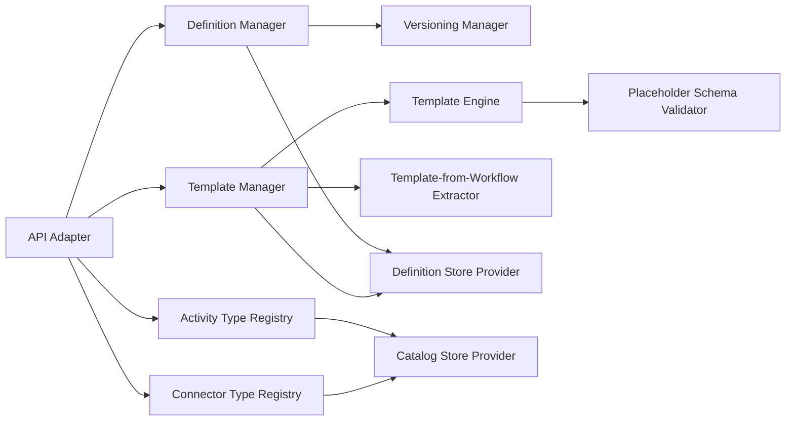
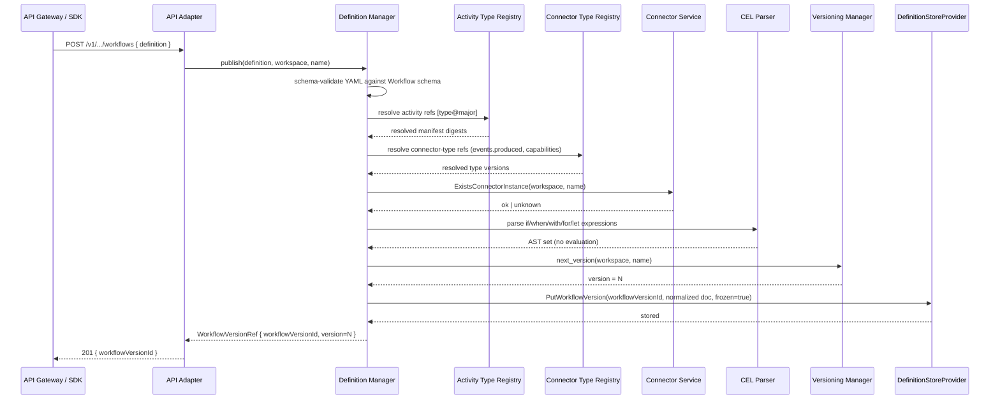
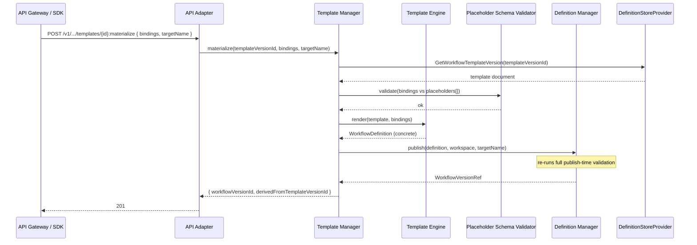
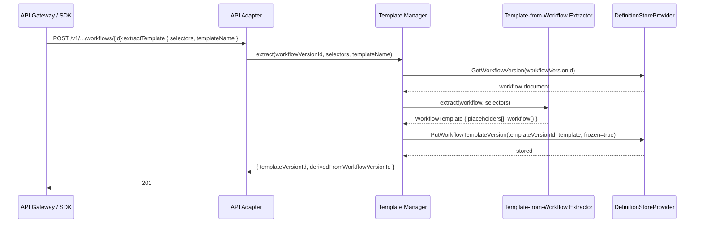
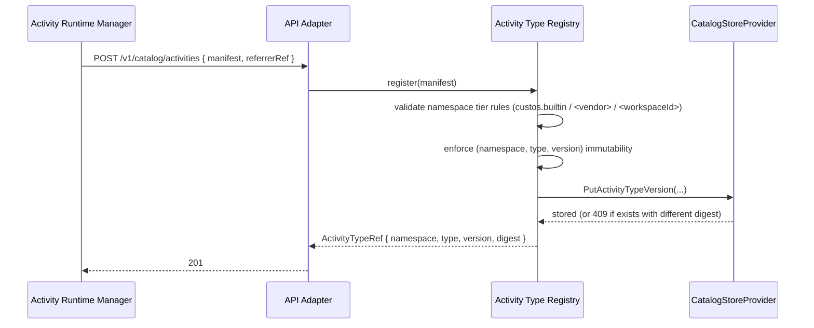
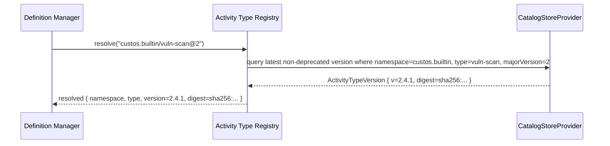
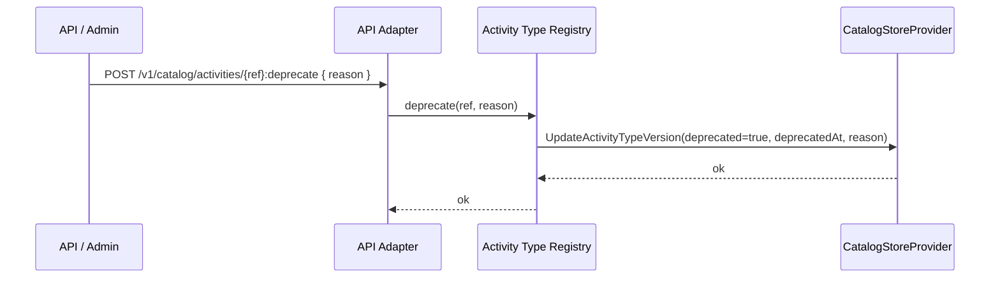
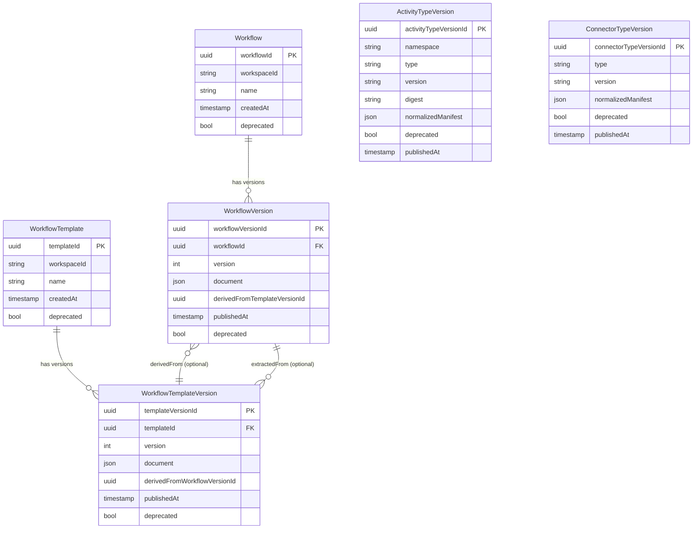

# Component Design: Catalog Service

Slug: `catalog-service`
Component ID: COMP-007
Last Updated: 2026-05-17
Version: 1
Status: Draft

## Responsibility

The Catalog Service owns **workflow definitions, workflow templates, and the read-side metadata index for activity types and connector types**. It is the authoring-time and publish-time entry point for everything that ends up as an immutable `WorkflowVersion` or `WorkflowTemplateVersion`, and it is the lookup service that the rest of the platform (Workflow Service, Trigger Service, Activity Runtime Manager, Connector Service, UI) consults to resolve typed references at compile time and at run start.

## Boundaries

- **Owns**:
  - `Workflow`, `WorkflowVersion`, `WorkflowTemplate`, `WorkflowTemplateVersion` and their immutability (REQ-025).
  - Workflow / template **publish-time validation**: YAML schema, placeholder schema (ADR-009), reference resolution (activity type, connector type, sub-workflow), CEL expression parsing (not evaluation).
  - **Template materialization**: producing a new `WorkflowVersion` from a `WorkflowTemplateVersion` + placeholder bindings (REQ-076).
  - **Template extraction**: producing a new `WorkflowTemplateVersion` from an existing `WorkflowVersion` + a placeholder-selector set (REQ-076).
  - **Activity-type catalog index** (`ActivityTypeRef`): names, versions, namespaces, manifest digests, deprecation flags. The index is a *read-side projection* — ARM is the writer.
  - **Connector-type catalog index** (`ConnectorTypeRef`): names, versions, declared capabilities, `events.delivery`, `events.produced`. The index is a *read-side projection* — Connector Service is the writer.
  - Semver resolution rules for `<namespace>/<type>@<major>` pins.
  - Deprecation lifecycle for activity types, connector types, and workflow versions (forward-only flag; existing runs unaffected).

- **Does NOT own**:
  - Activity manifest **normative spec** or runtime execution — Activity Runtime Manager (COMP-006).
  - Connector manifest **normative spec** or plugin runtime — Connector Service (COMP-005).
  - CEL expression **evaluation** at run time — Workflow Service (COMP-003) Expression Evaluator. Catalog only parses for syntactic validation at publish time.
  - Workflow compilation into an `ExecutionGraph` — Workflow Service Definition Compiler. Catalog stores the normalized `WorkflowVersion` document; it does not produce a runtime graph.
  - Run state, step state, run history — Workflow Service.
  - Trigger configurations attached to a workflow — Trigger Service (COMP-004). Catalog stores `triggers:` blocks as part of the workflow document, but trigger-instance registration lives in TS.
  - Storage adapter logic — `DefinitionStoreProvider` / `CatalogStoreProvider` from the Storage Provider Layer (COMP-008).
  - Audit retention and trace export — Observability/Audit Service (COMP-009).

### Source-of-truth split

| Domain object | Writer | Catalog role |
|---|---|---|
| `WorkflowVersion`, `WorkflowTemplateVersion` | Catalog Service | Source of truth |
| Activity manifest (`ActivityManifestv1` document) | Activity Runtime Manager (`POST /catalog/activities`) | Read-side index; Catalog persists a normalized projection (name, version, namespace, digest, input/output schemas, declared connector slots, deprecation flag) |
| Connector manifest (`ConnectorManifestv1` document) | Connector Service (registers `ConnectorTypeVersion` on plugin load) | Read-side index; Catalog persists a normalized projection (type, version, capabilities, `events.delivery`, `events.produced`, deprecation flag) |
| Connector instance configuration | Connector Service | Catalog does **not** index instances. Workflow references like `connector: prod-registry` resolve against Connector Service at workflow publish time for existence checks only. |

The two `Connector Type Registry` sub-modules in `components.md` are not duplicates: COMP-005's is the **runtime plugin loader** (loads code into memory, calls `describe()`, mounts secrets); COMP-007's is the **metadata index** (a Postgres-backed lookup table populated when COMP-005 registers a plugin version).

## Internal Structure



Sub-module responsibilities (matches `design/architecture/components.md` § COMP-007):

| Sub-module | Owns |
|---|---|
| API Adapter | Inbound REST and Internal RPC surface; maps wire requests to internal calls; enforces auth/authz delegation. |
| Definition Manager | `Workflow` and `WorkflowVersion` lifecycle: create, list, get, deprecate. Coordinates publish-time validation across reference resolution (activity-type, connector-type, sub-workflow) and CEL parse. Invokes Versioning Manager to mint immutable versions. |
| Template Manager | `WorkflowTemplate` and `WorkflowTemplateVersion` lifecycle. Coordinates Template Engine (materialize template → workflow) and Template-from-Workflow Extractor (workflow → template). |
| Versioning Manager | Mints monotonically increasing `version` integers per `(workspace, name)` for both Workflow and WorkflowTemplate. Enforces immutability — once a version exists, its document is content-frozen and the row is append-only. |
| Template Engine | Materializes a `WorkflowTemplateVersion` + placeholder bindings into a normalized `WorkflowVersion` document. Substitution is **textual at the YAML AST level**, not CEL evaluation — placeholders are typed slots, not expressions. |
| Template-from-Workflow Extractor | Consumes a `WorkflowVersion` + a selector set (which concrete values to abstract) and emits a `WorkflowTemplateVersion` with declared `placeholders[]`. Round-trip: re-materializing with the original values reproduces the source workflow byte-for-byte (after canonicalization). |
| Placeholder Schema Validator | Validates that placeholder bindings supplied at materialization match the placeholder declarations: required vs. optional, type compatibility (`connectorRef`, `activityRef`, `string`, `int`, `bool`, enum). |
| Activity Type Registry | Read-side index of activity types and versions. **Writer is ARM** via `POST /catalog/activities`. Resolves `<namespace>/<type>@<major>` references at workflow publish time. Indexes manifest digest so digest-pinned references are validated end-to-end. |
| Connector Type Registry | Read-side index of connector types and versions. **Writer is Connector Service** at plugin-load time. Resolves `connectorType` references and `events.produced` lookups for trigger validation. |
| Definition Store Provider client | Persists `WorkflowVersion` and `WorkflowTemplateVersion` documents via `DefinitionStoreProvider` (REQ-048; Postgres in v1, OCI registry adapter in M2+). |
| Catalog Store Provider client | Persists activity-type and connector-type index rows via `CatalogStoreProvider` (Postgres in v1). |

## Key Operations

### Operation: Publish Workflow Version



Publish-time validation is the **only** validation gate before runtime. Once a `WorkflowVersion` exists, Workflow Service trusts it: the Validator (WF design § Validator) does not re-validate the document, only the `StartRun` request envelope. This means Catalog must be exhaustive at publish — any class of error caught only at run time would have been catchable here.

**CEL parsing, not evaluation.** Expression bindings at publish time are unknown (`steps.scan.outputs.critical` does not exist yet), so Catalog cannot evaluate. It parses each expression with the same grammar the WF Expression Evaluator uses and rejects syntactic errors at publish. Type-binding errors (referencing a step that does not exist in the workflow, or a placeholder that is not declared) **are** caught at publish, because both the step graph and the placeholder set are known.

### Operation: Materialize Workflow from Template



Materialization always emits a new `WorkflowVersion` and that version goes through the **same publish-time validation** as a hand-authored workflow. Templates are convenience over validity — a template that materializes to an invalid workflow fails at this step, not at run time. The `derivedFromTemplateVersionId` link is persisted on `WorkflowVersion` so the lineage is queryable (ADR-009 round-trip).

### Operation: Extract Template from Workflow



Selectors identify which concrete values to abstract: a JSONPath-style path into the workflow document (e.g. `spec.steps[0].connector`, `spec.steps[*].activity`), each annotated with the placeholder name, type, and whether it is required. The extractor rewrites those paths with `${{ placeholders.<name> }}` and constructs the `placeholders[]` declaration block.

Round-trip property (ADR-009): for any `(workflow, selectors)`, materializing the extracted template with the original concrete values **reproduces the source workflow document byte-for-byte after canonicalization** (sorted keys, normalized whitespace). The Extractor is responsible for ensuring this — any selector that would break round-trip is rejected.

### Operation: Register Activity Type Version



ARM is the writer for activity-type metadata; Catalog only receives the registration call and persists the normalized index entry. The OCI registry (when used) remains the source of truth for the manifest blob — Catalog stores the projection plus a referrer pointer (ARM design § Activity Catalog).

`(namespace, type, version)` is the primary key. A second registration with the same key but a different `runtime.digest` is rejected with 409 — versions are immutable end-to-end.

### Operation: Resolve Activity Reference at Workflow Publish



**Semver resolution rules** (M1):

| Reference form | Resolution |
|---|---|
| `<ns>/<type>@<major>` (e.g. `custos.builtin/vuln-scan@2`) | Latest non-deprecated `minor.patch` within the major. Locked into the `WorkflowVersion` document at publish time — subsequent activity-type publishes do not affect existing workflow versions (REQ-025 immutability). |
| `<ns>/<type>@<major>.<minor>.<patch>` (e.g. `custos.builtin/vuln-scan@2.4.1`) | Exact version; rejected if deprecated. |
| `<ns>/<type>@<major>.<minor>` | Reserved for future use; **rejected in M1**. The two supported forms are major-pinned and exact. |
| Short form without namespace (e.g. `vuln-scan@2`) | **Rejected in M1**. Short-form resolution is post-M1 (architecture overview § Workflow and Template Schema). |

The resolved `digest` is recorded on the `WorkflowVersion` document so the activity binding is digest-pinned for the life of the workflow version. ARM at run time fetches by digest, not by name; tag drift cannot change activity behavior post-publish.

### Operation: Sub-Workflow Reference Resolution

A `workflow:` step kind references **a fully-qualified `workflowVersionId`** — never a `workflowName@major` and never a template-with-inline-values. This resolves WF-TODO-003 (#53).

**Rules locked in this design**:

1. The `workflow:` step kind invokes a specific `WorkflowVersion`. The reference form is the immutable `workflowVersionId` produced at publish time (or, equivalently, a `<workspace>/<name>@<version>` triple that resolves uniquely to one `workflowVersionId`).
2. A user wanting to invoke "a template with these placeholder values" performs that as **two steps at the authoring layer**: (a) materialize the template into a concrete `WorkflowVersion` (one-time, persistent, REQ-025); (b) reference the resulting `workflowVersionId` from the calling workflow's `workflow:` step.
3. Catalog validates at workflow publish time that the referenced `workflowVersionId` exists, is not deprecated, and is reachable in the same workspace (or in an explicitly cross-workspace-allowed namespace; cross-workspace policy itself is deferred to M3 RBAC).
4. There is no inline-placeholder invocation path. This keeps the runtime model simple: a sub-workflow is just another workflow run with its own immutable definition, identical to a top-level run except for the parent linkage.

This is the **simpler** of the two designs considered. The alternative — inline placeholder values at the call site — was rejected because it would produce a runtime `WorkflowVersion`-equivalent without a corresponding immutable record, violating REQ-025 and complicating the Definition Compiler.

### Operation: Deprecate Activity Type Version



**Deprecation is forward-only**: existing `WorkflowVersion` documents that reference the deprecated activity continue to work (the binding is digest-pinned and immutable per REQ-025). New workflow publishes that try to resolve to the deprecated version are rejected; new publishes that pin a major where the deprecated version was the latest fall back to the next-latest non-deprecated within the major.

Deprecation is a flag, not a delete — the row remains for in-flight runs and for audit. A future M2+ purge policy can hard-delete rows with no extant `WorkflowVersion` references, but that is out of v1 scope.

### Operation: List Activity Types for Workflow Authoring UX

The Web UI (COMP-010) and CLI list activity types when an author is composing a workflow. Catalog exposes filterable queries:

```
GET /v1/catalog/activities?namespace=custos.builtin&deprecated=false&capability=oci.pull
```

Filters include `namespace`, `category` (from manifest `metadata.labels.category`), `deprecated`, and required capability slot. The response paginates by `(namespace, type, version)`.

### Operation: Register Connector Type Version

Mirrors Register Activity Type Version. Connector Service calls `POST /v1/catalog/connector-types { manifest }` at plugin-load time. Catalog persists the normalized projection (type, version, declared `capabilities[]`, `events.delivery`, `events.produced[]`, config schema digest). Connector Service remains the writer; Catalog is the index.

### Operation: Pod Restart / Recovery

Catalog is **stateless between requests**. All durable state lives in `DefinitionStoreProvider` and `CatalogStoreProvider`. A pod restart loses nothing; the next request restores any per-request state (validation context, parsed AST cache) from scratch. Parsed-CEL ASTs and resolved-reference results are not cached across pods in v1 — the cost of re-parsing on every publish is well under the cost of a publish itself.

## Data Models



Persistence split:

- `Workflow`, `WorkflowVersion`, `WorkflowTemplate`, `WorkflowTemplateVersion` → `DefinitionStoreProvider` (REQ-048; Postgres v1, OCI registry adapter M2+).
- `ActivityTypeVersion`, `ConnectorTypeVersion` → `CatalogStoreProvider` (Postgres v1).

Both providers are abstractions per REQ-048; the OCI registry adapter for `DefinitionStoreProvider` is deferred to M2+ per the requirements timeline.

`WorkflowVersion.document` is a **normalized** JSON form of the workflow definition: canonical key ordering, fully-qualified references (no short forms), digest-pinned activity references, resolved sub-workflow references. The on-the-wire YAML or SDK input is normalized at publish time and the normalized form is what gets stored, hashed, and replayed.

## Public Interface

### REST API (via API Gateway, COMP-001)

| Method | Path | Request | Response | Description |
|---|---|---|---|---|
| POST | `/v1/workspaces/{ws}/workflows` | `{ definition }` (YAML or JSON) | `WorkflowVersionRef` (201) | Publish a new workflow version. |
| GET | `/v1/workspaces/{ws}/workflows/{name}` | — | `Workflow + [WorkflowVersionRef]` | List versions of a workflow. |
| GET | `/v1/workspaces/{ws}/workflows/{name}@{version}` | — | `WorkflowVersion` | Fetch a specific version. |
| GET | `/v1/workflows/{workflowVersionId}` | — | `WorkflowVersion` | Fetch by immutable ID. |
| POST | `/v1/workspaces/{ws}/workflows/{name}@{version}:deprecate` | `{ reason }` | 200 | Deprecate a workflow version. |
| POST | `/v1/workspaces/{ws}/workflows/{workflowVersionId}:extractTemplate` | `{ selectors, templateName }` | `WorkflowTemplateVersionRef` (201) | Extract a template from a workflow version. |
| POST | `/v1/workspaces/{ws}/templates` | `{ definition }` | `WorkflowTemplateVersionRef` (201) | Publish a template version directly. |
| GET | `/v1/workspaces/{ws}/templates/{name}@{version}` | — | `WorkflowTemplateVersion` | Fetch a template version. |
| POST | `/v1/workspaces/{ws}/templates/{templateVersionId}:materialize` | `{ bindings, targetName }` | `WorkflowVersionRef` (201) | Materialize a template into a workflow version. |
| POST | `/v1/catalog/activities` | `{ manifest, referrerRef? }` | `ActivityTypeRef` (201) | Register an activity type version. (Writer: ARM) |
| GET | `/v1/catalog/activities` | filters | `[ActivityTypeRef]` | List activity types. |
| GET | `/v1/catalog/activities/{namespace}/{type}@{version}` | — | `ActivityTypeVersion` | Fetch an activity type version's normalized manifest. |
| POST | `/v1/catalog/activities/{namespace}/{type}@{version}:deprecate` | `{ reason }` | 200 | Deprecate an activity type version. |
| POST | `/v1/catalog/connector-types` | `{ manifest }` | `ConnectorTypeRef` (201) | Register a connector type version. (Writer: Connector Service) |
| GET | `/v1/catalog/connector-types` | filters | `[ConnectorTypeRef]` | List connector types. |
| GET | `/v1/catalog/connector-types/{type}@{version}` | — | `ConnectorTypeVersion` | Fetch a connector type version. |

### Internal RPC (inbound — Catalog as callee)

| RPC | Caller | Purpose |
|---|---|---|
| `GetWorkflowVersion(workflowVersionId)` | Workflow Service (Validator → Definition Compiler) | Read-only fetch at `StartRun`. |
| `ResolveActivityRef(ref)` | Workflow Service (publish-time validation, if WF acts as a publish proxy) | Resolve `<ns>/<type>@<major>` to a digest-pinned version. (M1: this path goes through the publish API; this RPC reserved for future direct call.) |
| `ResolveConnectorTypeRef(ref)` | Workflow Service, Trigger Service | Resolve a connector type version for `events.produced` lookups. |

Most read paths from other services are HTTP GETs through the API Gateway in v1; an Internal RPC surface is reserved for future high-volume paths.

### Internal RPC (outbound — Catalog as caller)

| RPC | Callee | Purpose |
|---|---|---|
| `ExistsConnectorInstance(workspaceId, instanceName)` | Connector Service | Publish-time existence check for `connector: <name>` references in workflow definitions. |

Catalog otherwise does not initiate calls — it is a read-heavy service that produces and serves immutable documents.

### Publish-Time Validation Scope

The publish-time validation pipeline runs every check that can be done without runtime values:

| Check | Source of truth | Catalog action |
|---|---|---|
| YAML / JSON Schema conformance | `design/architecture/overview.md` § Workflow and Template Schema | Reject with structured errors at field path. |
| Activity reference resolution | Activity Type Registry | Reject if unresolved, deprecated, or pinned to a non-existent exact version. Lock digest into normalized doc. |
| Connector type reference resolution | Connector Type Registry | Reject if unresolved or deprecated. |
| Connector instance existence | Connector Service `ExistsConnectorInstance` | Reject if `connector: <name>` refers to no instance in the workspace. |
| Sub-workflow reference resolution | Definition Manager (this service) | Reject if `workflowVersionId` does not exist, is deprecated, or is cross-workspace without permission. |
| CEL expression parse (`if`, `when`, `with`, `for`, `let`) | Shared CEL grammar with WF Expression Evaluator | Reject with parse error and position. **No evaluation** — runtime bindings unknown. |
| Expression name-binding (refs to `steps.<id>`, `inputs.<n>`, `placeholders.<n>`) | Workflow's own step graph + placeholder block | Reject if a reference points to a non-existent step or undeclared placeholder. |
| Placeholder schema (templates only) | Placeholder Schema Validator | Reject malformed placeholder declarations. |
| `triggers:` blocks | Connector Type Registry's `events.produced` | Reject trigger event names not declared by the referenced connector type version. |

The publish-time validator is exhaustive: any failure that *could* be caught here must be caught here, not deferred to run time. This is the single most important design property of Catalog — it is the engine's compile-time gate.

## Configuration

| Variable | Required | Default | Description |
|---|---|---|---|
| `CAT_DEFINITION_STORE` | Yes | — | `DefinitionStoreProvider` binding (Postgres DSN in v1). |
| `CAT_CATALOG_STORE` | Yes | — | `CatalogStoreProvider` binding (Postgres DSN in v1). |
| `CAT_CONNECTOR_ENDPOINT` | Yes | — | Connector Service endpoint for `ExistsConnectorInstance`. |
| `CAT_AUTHZ_ENDPOINT` | Yes | — | AuthN/AuthZ Service endpoint. |
| `CAT_PUBLISH_MAX_BODY_MB` | No | `4` | Maximum workflow/template document size at publish. |
| `CAT_CEL_PARSE_TIMEOUT_MS` | No | `500` | Per-expression parse timeout at publish (separate from runtime evaluation timeout in WF). |
| `CAT_DEFAULT_NAMESPACE_TIER_VENDOR` | No | — | Optional default vendor namespace for short-form publishes (unused in M1 since short-form is rejected). |

## Dependencies

| Dependency | Type | Purpose |
|---|---|---|
| DefinitionStoreProvider (COMP-008) | Runtime | Persistence for `Workflow`, `WorkflowVersion`, `WorkflowTemplate`, `WorkflowTemplateVersion`. |
| CatalogStoreProvider (COMP-008) | Runtime | Persistence for `ActivityTypeVersion`, `ConnectorTypeVersion`. |
| Connector Service (COMP-005) | Runtime (read) | Publish-time existence check for connector instance references. Registers connector-type versions into Catalog (Catalog is callee for that). |
| Activity Runtime Manager (COMP-006) | Runtime (write) | Registers activity-type versions into Catalog (Catalog is callee). |
| AuthN/AuthZ Service (COMP-002) | Runtime | Inbound REST authorization delegation. |
| Observability/Audit Service (COMP-009) | Runtime | Emits `workflow.version.published`, `template.materialized`, `activity.type.registered`, etc. |

Catalog has **no runtime dependency on Workflow Service**: it produces and serves `WorkflowVersion` documents and is unaware of runs.

## Failure Modes

| Failure | Detection | Containment | Recovery |
|---|---|---|---|
| Connector Service unreachable on `ExistsConnectorInstance` | RPC timeout | Publish API returns 503 with `validation.dependency_unavailable`; client retries | Restore Connector Service; re-publish |
| DefinitionStoreProvider unavailable | Provider health check | All publish + read endpoints return 503 | Restore store; in-flight reads from WF use compiled-graph cache |
| CatalogStoreProvider unavailable | Provider health check | Activity-type registration (ARM) and resolution endpoints return 503 | Restore store; ARM retries registration |
| Activity-type version conflict (same `(ns, type, version)`, different digest) | Constraint check at register | 409 returned to ARM with both digests in the error body | ARM operator resolves; never silently overwrite |
| Workflow publish: invalid CEL parse | CEL parser | 400 with parse error position; document not stored | Author fixes expression |
| Workflow publish: unresolved activity ref | Activity Type Registry lookup | 400 with `unresolved_reference` and the ref string | Register the activity type first, then re-publish |
| Workflow publish: unresolved sub-workflow ref | Definition Manager lookup | 400 with `unresolved_reference` | Publish the referenced workflow version first |
| Template materialization: placeholder bindings malformed | Placeholder Schema Validator | 400 with field-level errors | Caller fixes bindings |
| Template materialization: materialized document fails workflow publish-time validation | Definition Manager publish path | 400 with chained error: template ref + workflow validation error | Caller fixes template or bindings |
| Deprecation race (concurrent publish referencing a version being deprecated) | Read-modify-write conflict on `deprecated` flag | Last-writer-wins; the publish completes if it observed the flag as `false`, and the deprecation completes too (already-published WorkflowVersion remains valid per REQ-025) | No recovery needed; deprecation is forward-only |
| Round-trip extractor produces a workflow that does not byte-equal the source | Extractor self-check | Extract API returns 500 with `roundtrip_violation` and the diff | Bug fix; extraction itself is not destructive (source workflow unchanged) |

## Open TODOs

(none — see Closed TODOs)

## Closed TODOs

(none yet — this is the initial design)

## Change History

| Date | Change | GitHub Issue |
|---|---|---|
| 2026-05-17 | Initial component design covering responsibility/boundaries (with source-of-truth split table), sub-modules, key operations (publish, materialize, extract, register-activity, resolve-ref, deprecate, list, register-connector, pod-restart), data model, REST + Internal RPC surface, publish-time validation scope, configuration, dependencies, failure modes; resolves COMP-007 design gap and answers WF-TODO-003 (#53) with the `workflow:`-only-references-WorkflowVersion rule | #55 |
