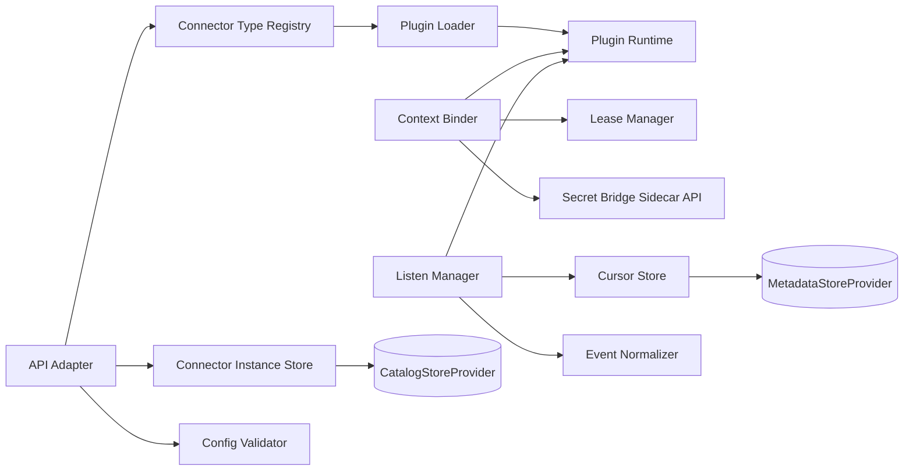
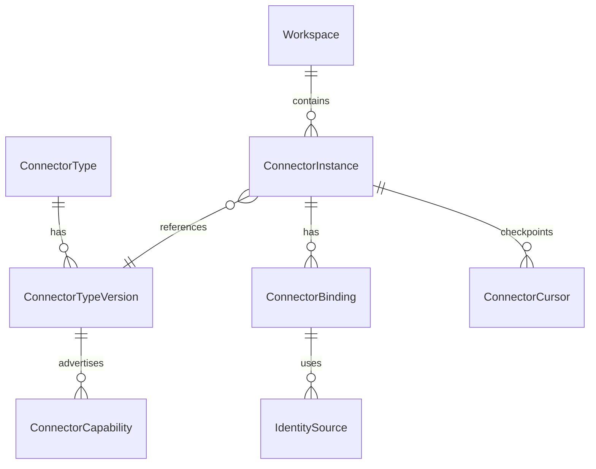
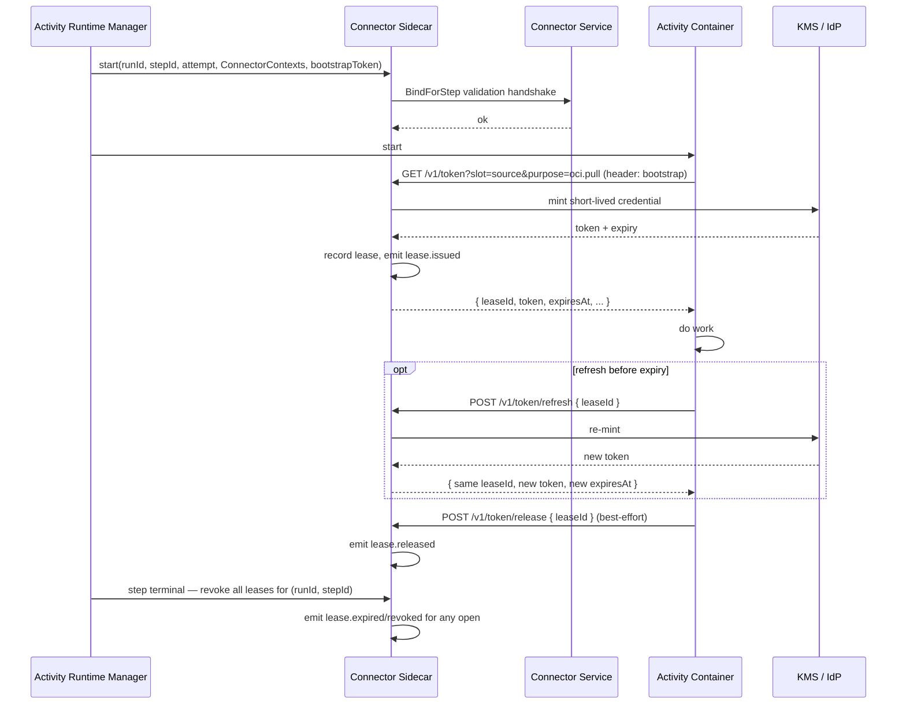
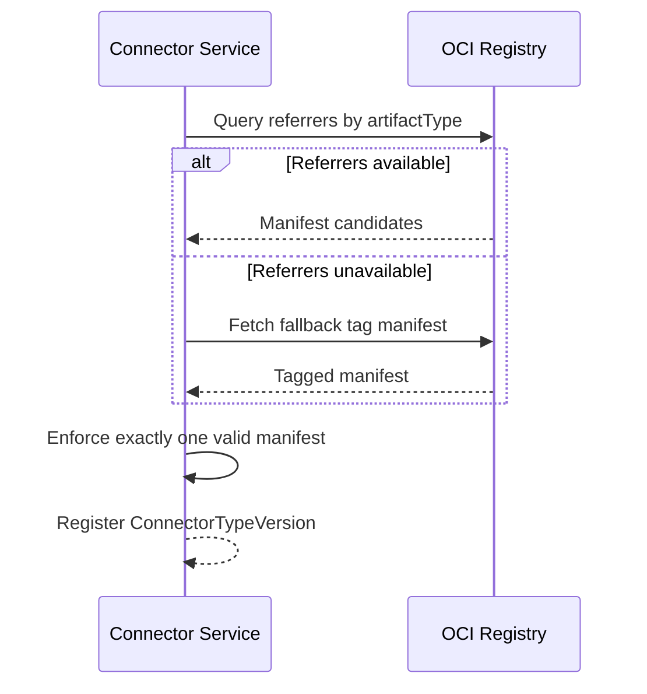
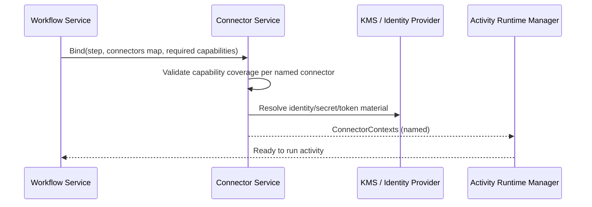

# Component Design: Connector Service

Slug: connector-service
Last Updated: 2026-05-17
Version: 7
Status: Draft

## Responsibility

The Connector Service is the access broker between workflows/activities and external systems.
It owns connector type metadata, connector instance lifecycle, capability matching, context issuance, and trigger event listen streams.

## Boundaries

- Owns:
  - Connector plugin contract and compatibility checks
  - Connector type registration (by version)
  - Connector instance configuration, validation, activation state, and health state
  - Connector context issuance for activity steps
  - Trigger listen streams (push and pull modes)
  - Identity-to-secret/token mediation for connector workloads
- Does NOT own:
  - Workflow orchestration state machine
  - Activity execution runtime internals
  - End-user authentication and RBAC policy engine

## Internal Structure



## Data Models



### Core entities

- ConnectorType: logical plugin family (for example `oci-registry`, `policy-engine`, `notification`).
- ConnectorTypeVersion: immutable plugin version descriptor.
- ConnectorInstance: workspace-scoped configured connection.
- ConnectorBinding: runtime binding between a step and one connector instance.
- ConnectorCursor: durable cursor/checkpoint for pull streams and reconnect. Fields: `encoding` (string, from manifest), `value` (opaque, plugin-managed, nullable; `null` is the uninitialized sentinel), `advancedAt` (timestamp of the last cursor write — initialization, advance, or operator rewind; never null once the row exists), `leaseHolder` (string, single-writer enforcement), `leaseExpiresAt` (timestamp). See § Pull Cursor Model.
- IdentitySource: one of KMS-backed secret, workload identity, federated identity.

## Plugin Packaging and Discovery

Connector plugins are OCI images. Connector metadata is not embedded in the image filesystem.

### Manifest artifact rules

- Preferred discovery mode: OCI Referrers API (Distribution Spec v1.1).
- Fallback discovery mode: digest-derived tag convention.
- Exactly one valid connector manifest must resolve.

Manifest selection algorithm:
1. Query referrers filtered by `artifactType = application/vnd.custos.connector.manifest.v1+json`.
2. If referrers are unsupported or unavailable, fetch the fallback tag (see § Fallback tag naming below).
3. If both sources produce manifests, referrer result wins; fallback is ignored and `connector.manifest.fallback-ignored` is audited.
4. Zero or multiple valid manifests is a hard validation failure.

### Fallback tag naming

When the OCI Referrers API is unsupported or returns no results, Connector Service computes a deterministic tag from the image digest and resolves the manifest via that tag.

**Tag format (v1):**

```
custos-connector-manifest-v1_<algorithm>-<hex>
```

- The `custos-connector-manifest-v1` prefix is the scheme version. Changing the format (different separator, different algorithm support set, different normalization) requires bumping to `custos-connector-manifest-v2_...` and a transition window during which both schemes coexist.
- `_` separator (not `.`) to avoid collisions with file-extension parsers in registry tooling.
- `<algorithm>-<hex>` mirrors the OCI digest format with `:` replaced by `-`. Example: digest `sha256:abc123...def` → tag `custos-connector-manifest-v1_sha256-abc123...def`.

**Digest normalization rules:**

1. Lowercase the hex portion.
2. Replace the `:` separator with `-`.
3. Reject if the hex portion contains characters outside `[0-9a-f]` after lowercasing → `invalid-digest-format`.
4. Reject if the hex portion length does not match the algorithm's expected length (sha256 = 64, sha512 = 128) → `invalid-digest-format`.

**Algorithm support (v1):**

The platform maintains an internal **registered digest algorithms** set. In v1 this set contains **`sha256` only**. An image whose primary digest uses any other algorithm is rejected at plugin-load time with `unsupported-digest-algorithm`.

The platform does **not** compute its own hash to substitute for an unsupported algorithm — the fallback tag must match the digest the registry advertises, otherwise the tag points to a manifest the registry cannot resolve.

**Extending the algorithm set (M2+):**

The tag format `<algorithm>-<hex>` is intentionally algorithm-agnostic. Adding `sha512` (or any future algorithm) requires only:

1. Adding the algorithm name and expected hex length to the registered algorithms set in Connector Service config.
2. Confirming the resulting tag length stays within the OCI distribution-spec 128-char cap. Budget per algorithm:

   | Algorithm | Hex len | Tag length | Within 128? |
   |---|---|---|---|
   | sha256 | 64 | 101 | ✅ |
   | sha512 | 128 | 165 | ❌ — requires scheme bump to v2 |
   | sha384 | 96 | 133 | ❌ — requires scheme bump to v2 |

Algorithms whose tag length exceeds 128 cannot use the v1 scheme; supporting them is a v2 scheme task (different format, e.g. base32-truncated hex or a two-tag indirection). v1 stays sha256-only by construction.

**Length budget for sha256 (v1):**

```
custos-connector-manifest-v1_sha256-<64 hex chars>
└────────── 29 ──────────┘└─┘└─ 7 ─┘└──── 64 ────┘ = 101 chars
                          │
                          └ '_' separator
```

OCI distribution-spec tag cap is 128. v1 leaves 27 chars of headroom for future minor additions within the scheme.

**Collision policy:**

A single image digest yields exactly one fallback tag by construction. The platform does not introspect multiple manifests under the same tag — the OCI registry returns at most one. If for any reason multiple valid manifests resolve through the combined Referrers + fallback paths, the "exactly one valid manifest" rule in the selection algorithm catches it as a hard validation failure (already documented above).

**Audit events:**

| Event | Trigger |
|---|---|
| `connector.manifest.fallback-used` | Referrers API was unavailable/empty; fallback tag was successfully resolved. Carries registry endpoint, image reference, normalized digest, computed tag. |
| `connector.manifest.fallback-ignored` | Both Referrers and fallback produced manifests; the fallback was discarded in favor of Referrers. |
| `connector.manifest.fallback-rejected` | Fallback failed validation. Carries failure code: `unsupported-digest-algorithm` \| `invalid-digest-format` \| `tag-not-found`. |

A sudden spike in `connector.manifest.fallback-used` is an operational signal that a registry has regressed in its Referrers API support.

## Plugin Manifest v1 (artifact payload)

```json
{
  "apiVersion": "custos.dev/connector-manifest/v1",
  "kind": "ConnectorManifest",
  "metadata": {
    "type": "oci-registry",
    "version": "2.3.1",
    "contractVersion": "1"
  },
  "spec": {
    "description": "OCI registry connector",
    "capabilities": [
      "oci.pull",
      "oci.push"
    ],
    "target": {
      "kind": "oci-registry",
      "endpoint": "https://ghcr.io",
      "verifyTls": true,
      "config": {
        "repositoryNamespace": "my-org"
      }
    },
    "credentials": {
      "authenticationType": "oidc",
      "authentication": {
        "provider": "oidc",
        "issuer": "https://token.actions.githubusercontent.com",
        "audience": "https://ghcr.io",
        "subjectTemplate": "repo:my-org/my-repo:ref:{ref}"
      }
    },
    "events": {
      "delivery": [
        "push",
        "pull"
      ],
      "produced": [
        "oci.image.pushed",
        "oci.tag.updated"
      ]
    }
  }
}
```

#### Sink connector example (no `events` block)

A connector whose only role is to receive data — for example, a Slack/Teams notifier or a write-only object-storage sink — omits the `events` block entirely. The Listen Manager skips trigger wiring for such connector type versions; the Binder still validates `capabilities` at step bind time.

```json
{
  "apiVersion": "custos.dev/connector-manifest/v1",
  "kind": "ConnectorManifest",
  "metadata": {
    "type": "slack-notifier",
    "version": "1.0.0",
    "contractVersion": "1"
  },
  "spec": {
    "description": "Slack notification sink",
    "capabilities": [
      "slack.post"
    ],
    "target": {
      "kind": "slack-webhook",
      "endpoint": "https://hooks.slack.com",
      "verifyTls": true,
      "config": {}
    },
    "credentials": {
      "authenticationType": "azure-key-vault",
      "authentication": {
        "vaultUri": "https://kv.example.com",
        "secretName": "slack-webhook-token"
      }
    }
  }
}
```

### Normative JSON Schema

The strict schema for this manifest is defined in `design/components/connector-service/schemas/connector-manifest.v1.schema.json`.
Concrete examples are maintained in `design/components/connector-service/examples/` and must be updated whenever the schema changes.

Validation requirements:
- Closed objects (`additionalProperties: false`) at all levels.
- Strict constants for `apiVersion`, `kind`, and `metadata.contractVersion`.
- SemVer validation for `metadata.version`.
- Inline `target` block defines the endpoint URI and resource type (`oci-registry`, `azure-blob-storage`, or `amazon-s3-bucket`).
- Common target fields (`kind`, `endpoint`, `verifyTls`) are kind-agnostic; type-specific fields live inside a generic `target.config` property bag interpreted by `target.kind`.
- Per-kind `target.config` schemas are enforced:
  - `oci-registry` requires `config.repositoryNamespace`.
  - `azure-blob-storage` requires `config.storageAccount` and `config.container`.
  - `amazon-s3-bucket` requires `config.bucket` and `config.region`.
- Inline `credentials` block defines auth mode via concrete `authenticationType` (`azure-key-vault`, `amazon-kms`, `azure-managed-identity`, `oidc`) and a generic `authentication` property bag.
- `credentials.authentication` is interpreted according to `credentials.authenticationType` and remains extensible for future auth types.
- Manifest payload is self-contained; target and credential requirements are defined inline.
- Identity category (KMS-backed, workload, federated) is derived from `credentials.authenticationType` by the Connector Service; manifests do not declare it. Vendor `x-*` auth types register their category at plugin-registration time, out of band.
- `capabilities` enumerates **data-plane verbs** the connector can perform (e.g. `oci.pull`, `s3.read`). `event.*` tokens MUST NOT appear in `capabilities` — event-stream concerns live entirely in `events`.
- The `events` block is **optional**. Sink/data-plane-only connectors (e.g. Slack, Teams, Email notification connectors, write-only blob targets) omit it entirely. The Listen Manager treats connector type versions with no `events` block as non-event-producing and skips trigger wiring for them.
- When the `events` block is present:
  - `events.delivery` enumerates the **delivery mechanisms** the Trigger Service must wire up: `push` (target delivers events to us) and/or `pull` (we poll the target). At least one entry is required.
  - `events.produced` enumerates the **catalog of normalized event types** the connector emits. Workflow trigger definitions reference these names. At least one entry is required.
- Capability and event tokens follow dot-delimited lowercase naming rules.

## Capabilities and Events

`capabilities` and `events` answer separate questions for different consumers and at different points in the system lifecycle.

### `capabilities` — data-plane verbs

A flat list of operations the connector type can perform against its target. Tokens are dot-delimited lowercase, e.g. `oci.pull`, `oci.push`, `oci.copy`, `s3.read`, `s3.write`, `blob.read`, `blob.write`.

Consumed by:

- **Activity authors** — activities declare their required capabilities per connector input.
- **Binder (Connector Service)** — at step bind time, validates that each named connector advertises all required capabilities. Missing capability ⇒ bind failure before the activity runs.
- **Catalog / UI** — surfaces filterable verb metadata when authoring workflows.

`capabilities` is purely about data-plane operations. Event-stream concerns are not expressed here.

#### Namespace governance

Capability tokens are governed by a two-tier namespace:

**Tier 1 — Reserved core prefixes (curated).** Owned by the platform; defined in `design/architecture/capabilities.md`. Initial reserved prefixes: `oci.*`, `s3.*`, `blob.*`, `http.*`, `sql.*`, `event.*`, `notification.*`. Adding a new core prefix or a new verb within a core prefix is a platform-level change that goes through the architecture change process.

**Tier 2 — Vendor extension prefix `x-<vendor>.<verb>`.** Anything matching `^x-[a-z][a-z0-9-]*\.[a-z][a-z0-9.-]*$` is accepted. No platform-side validation beyond syntax. Activities requiring `x-*` capabilities are explicitly coupling themselves to that vendor's connector type; the coupling is surfaced in catalog/UI and bind audit.

**Plugin-registration validation:**

| Check | Failure code |
|---|---|
| Tier 1 token is in the curated registry | `unknown-core-capability` |
| Token matches the `x-*` syntax (if not Tier 1) | `invalid-capability-syntax` |
| Capabilities set is a strict superset of the prior `ConnectorTypeVersion` within the same major (semver patch/minor bump) | `capability-regression` |

Failed registrations emit `connector.registration.rejected` with the failure code and the offending token.

#### Compatibility policy (semver-aligned)

- **Patch or minor version bump** (`2.3.0 → 2.3.1`, `2.3.0 → 2.4.0`): the new version's capabilities set MUST be a strict superset of the prior version's. Dropping a capability is forbidden — registration is rejected with `capability-regression`.
- **Major version bump** (`2.x.x → 3.0.0`): capabilities may change freely. The major bump is the signal that bindings must be re-validated. Activities pinning a connector type's major version see no surprises mid-major.
- The regression check runs at registration time as a SQL diff against the prior `ConnectorTypeVersion` row.

#### Deprecation flow

A capability may be marked `deprecated: true` within a major version. Deprecated capabilities still bind but emit `connector.capability.deprecated` on each bind. Removal of a deprecated capability is only permitted on the next major version bump.

Manifest example with a deprecated capability:

```json
"capabilities": [
  "oci.pull",
  "oci.push",
  { "name": "oci.legacy-copy", "deprecated": true, "since": "2.4.0", "removeIn": "3.0.0" }
]
```

A capability entry may be either a plain string (live) or an object with `name`, `deprecated`, optional `since`, optional `removeIn`. The Binder treats both equivalently for matching; the difference is audit emission.

### `events.delivery` — how events arrive

The `events` block as a whole is optional; connectors that do not produce events (sinks, notification targets, write-only data planes) omit it. When present, `events.delivery` is an array drawn from `["push", "pull"]` and declares the delivery mechanisms the connector supports:

- `push`: target pushes events to the platform (webhook, message bus, change-feed subscription).
- `pull`: the platform polls/lists the target on a cadence to detect new events.

Consumed by:

- **Listen Manager (Connector Service)** — selects the runtime wiring per delivery mode at trigger activation: spin up a webhook receiver, a polling loop, or a message-bus consumer.
- **Operator audit** — confirms which delivery surfaces are exposed by a given connector type version.

A single connector type may support both modes. The same `events.produced` catalog is available through any declared delivery mode; per-event delivery mapping is intentionally out of scope for v1.

When `pull` is included in `events.delivery`, the manifest MUST also include an `events.pull` block declaring cursor semantics:

```json
"events": {
  "delivery": ["pull"],
  "pull": {
    "cursorEncoding": "oci-list-tags-v1",
    "initialCursorBehavior": "now"
  },
  "produced": [ "oci.image.pushed", "oci.tag.updated" ]
}
```

- `events.pull.cursorEncoding` — string identifier the plugin uses to validate persisted cursor envelopes. Bumping this value triggers the encoding-migration flow (see § Pull Cursor Model → Encoding migration).
- `events.pull.initialCursorBehavior` — one of `now` (start from current upstream time), `beginning` (replay all history the upstream retains), `custom` (plugin computes its own starting position on first tick).

Pull-mode connectors MUST emit events with a stable `eventId` field (see § Pull Cursor Model → Event emission requirement).

### `events.produced` — event catalog

A flat list of normalized event types the connector emits, e.g. `oci.image.pushed`, `oci.tag.updated`, `s3.object.created`, `blob.object.deleted`.

Consumed by:

- **Workflow validator** — at workflow save time, confirms every trigger reference resolves to an event produced by some connector type in the workspace.
- **Trigger Service** — subscribes to these event types and matches them to workflow triggers at runtime.
- **Trigger UI / CLI** — autocomplete and discovery.
- **Audit / Catalog Service** — record of which event types are emitted by which connector type version.

### Why capabilities and events are kept separate

| Field | What it encodes | Primary consumer | When consumed |
|---|---|---|---|
| `capabilities` | Data-plane verbs (nouns: operations) | Binder | Step bind time |
| `events.delivery` | Event delivery mechanisms | Listen Manager | Trigger activation |
| `events.produced` | Event-type catalog (nouns: event names) | Workflow validator, Trigger Service | Workflow save + trigger runtime |

These are orthogonal axes. Knowing a connector can `oci.pull` images does not tell you whether it can deliver `oci.image.pushed` events, and vice versa. Conflating them into one list would force every consumer to filter by token prefix to recover the dimension it actually cares about.

## Connection to Workflows and Activities

A workflow step can bind one or many connectors.

Single connector example:

```yaml
- id: scan
  activity: vuln-scan@2
  connector: upstream-registry
```

Multi-connector example:

```yaml
- id: promote
  activity: image-promote@1
  connectors:
    source: upstream-registry
    destination: downstream-registry
```

Binding rules:
- `connector` and `connectors` are mutually exclusive on a step.
- Activities declare required capabilities per connector input.
- The binder validates each named connector against required capabilities before step execution.

## Identity and Credential Model

All three identity categories are supported from v1. The category for a given connector instance is **derived** by the Connector Service from `credentials.authenticationType`; it is not declared in the manifest.

| Identity category | Concrete `authenticationType` values |
|---|---|
| `kms` (KMS-backed credentials) | `azure-key-vault`, `amazon-kms` |
| `workload` (workload identity) | `azure-managed-identity` |
| `federated` (federated identity) | `oidc` |

Behavior per category:

1. KMS-backed credentials
   - Connector workload identity must be provisioned and authorized to read from KMS.
   - Examples: Azure Key Vault, AWS Secrets Manager, Vault.
2. Workload identity
   - Connector uses managed/workload identity directly to access upstream systems.
3. Federated identity
   - OIDC is first implementation.
   - Contract remains extensible to non-OIDC federation methods later.

Vendor extension auth types (`x-*` `authenticationType`) declare their identity category at plugin-registration time as out-of-band metadata; the manifest payload itself remains a single source of truth for the auth mechanism.

## Pull Cursor Model

Pull-mode event streams require a durable cursor representing "the last position we have consumed against the upstream API". The cursor is owned by the **Connector Service**, keyed per `ConnectorInstance`, and persisted via `MetadataStoreProvider` (see `ConnectorCursor` in the Data Models section).

### Ownership and granularity

**Granularity is per-instance, not per-subscription.** A single `ConnectorInstance` may be referenced by multiple Trigger Service `Subscription`s (e.g. two workflows both listening for `oci.image.pushed` from the same registry connector). The Connector Service runs **one** pull loop per active `ConnectorInstance` against the upstream API, reads/advances the single cursor, and fans normalized events out to every subscribing receiver via the `listen(mode=pull)` channel. This avoids N×M upstream polling load when N subscriptions consume from M instances.

**The Trigger Service holds no cursor state.** Its Pull Receivers are stateless w.r.t. upstream position; they drive `listen(mode=pull)` ticks against the Connector Service and consume the events it yields. Per-subscription progress against *delivered* events is handled by Trigger Service's existing `DedupKey` store, not a cursor — cursor (upstream position) and dedup (per-subscription delivery exactness) are orthogonal concerns and remain split along the component boundary.

This division resolves INCON-011: there is exactly one cursor per stream, owned by the component that talks to the upstream API.

### Cursor shape

A `ConnectorCursor` is a structured envelope around an opaque, connector-type-defined value:

```json
{
  "encoding": "oci-list-tags-v1",
  "value": "<base64-or-string-opaque-to-platform>",
  "advancedAt": "2026-05-17T12:34:56Z"
}
```

- `encoding` — connector-type-declared string, registered in the manifest under `events.pull.cursorEncoding`. Allows a connector type to evolve its cursor representation without colliding with persisted state from older versions.
- `value` — opaque to Connector Service core; only the plugin reads and writes it. The platform never parses or compares it. `null` is the well-defined "uninitialized" sentinel.
- `advancedAt` — platform-managed timestamp of the last cursor write (initialization, successful advance, or operator rewind). It is set on cursor creation and updated on every committed write thereafter; the field is therefore never null once the row exists. "Last advance" semantics for operator UI ("cursor last moved 3h ago" surfaces a stalled stream) hold because an uninitialized cursor that never advances still shows monotonically growing age relative to its initialization, which is itself a stalled-stream signal. Distinguishing "advanced at least once" from "still at the initial value" is derivable from `value` (the initial write sets `value: null`; any subsequent commit produces a non-null value), so a separate `hasAdvanced` boolean is not part of the envelope.

### Initial value

On the first pull tick for a new `ConnectorInstance`, Connector Service writes `{ encoding: <from-manifest>, value: null, advancedAt: <now> }`. This initialization write is what `advancedAt` records — see the field definition above for why "last cursor write" rather than "last successful advance" is the precise semantics. The plugin's first `listen(mode=pull)` call observes `cursor.value == null` and chooses its starting position per its declared `events.pull.initialCursorBehavior` (one of `now`, `beginning`, `custom`). Operators may override the initial position via the admin rewind operation (see below).

### Advancement and commit semantics

Connector Service guarantees **at-least-once delivery** of pull-mode events to Trigger Service. Per tick:

1. Plugin returns a batch `(events[], nextCursor)`.
2. Connector Service publishes each normalized event onto the pull-receiver fan-out channel (Dapr Pub/Sub).
3. **After publish-ack for every event in the batch**, Connector Service commits `nextCursor` to `MetadataStoreProvider`.
4. Tick returns.

If Connector Service crashes between publish and commit, the next tick re-emits already-published events from the previously committed cursor. Trigger Service's `DedupKey` store absorbs the duplicates per subscription. The platform does **not** wait for Trigger Service to ACK; cursor advance is decoupled from per-subscription delivery progress, matching the per-instance ownership model.

### Event emission requirement (normative)

Every pull-mode event emitted by a connector plugin **MUST** include a stable `eventId` field, typically `sha256(upstreamEventNaturalKey)`. Trigger Service computes its `DedupKey` from the tuple `(subscriptionId, source.eventId)` using an unambiguous canonical encoding; for v1 this is `sha256(subscriptionId || 0x00 || eventId)`, where `0x00` is a single-byte separator and `eventId` is the emitted source event identifier. Plugins that cannot produce a deterministic natural key MUST document a fallback algorithm in their manifest and accept that downstream dedup is only as strong as that algorithm.

### Single-writer safety

Exactly one Connector Service replica may advance the cursor for a given `ConnectorInstance` at a time. v1 uses **DB-row-level leases** rather than external leader election:

- `ConnectorCursor` carries `leaseHolder` (worker identifier) and `leaseExpiresAt` columns.
- Before a tick, a worker performs `SELECT ... FOR UPDATE` (or an equivalent provider-level optimistic CAS) on the row, claims a 60-second lease, runs the tick, and clears the lease on success.
- A crashed worker's lease expires; another replica picks the instance up on the next tick scheduler pass.
- Tick frequency in v1 is bounded to ≥10s per instance, so a 60s lease window is comfortable.

No Raft, etcd, or external coordinator dependency.

### Crash recovery and cursor expiry

On restart, Connector Service reads the last committed cursor from `MetadataStoreProvider` and resumes ticks. There is no replay-window cap in v1: if the upstream allows old positions, replay just works; if the upstream has retired the position (TTL'd webhooks, expired change tokens), the plugin returns a `CursorExpired` error. Connector Service fires a `cursor.expired` audit event and halts ticks for that instance pending operator action.

### Encoding migration

When a connector type bumps `events.pull.cursorEncoding` (e.g. `oci-list-tags-v1` → `oci-list-tags-v2`), the plugin sees the old envelope and returns `CursorEncodingMismatch`. Connector Service:

1. Marks the instance state as `cursorMigrationRequired`.
2. Fires `cursor.encoding_mismatch` audit event.
3. Halts ticks for that instance.

The operator resolves by calling admin rewind (below) to seed a v2-compatible starting position. **No automatic in-place migration in v1** — the explicit ops step keeps blast radius observable.

### Admin rewind / replay

A workspace admin may rewind any instance's cursor via:

```
POST /v1/workspaces/{ws}/connectors/{id}/cursor:rewind
Body: { "to": "now" | "beginning" | { "encoding": "...", "value": "..." } }
```

This writes the new cursor envelope, fires `cursor.advanced` (with reason `admin-rewind`), and resumes ticks. Every subscription consuming this instance sees the replayed events. To prevent re-firing downstream dispatches, the operator clears matching Trigger Service `DedupKey` entries via that service's own admin API; the two operations are independent by design.

### Cursor audit events

| Event | Trigger |
|---|---|
| `cursor.advanced` | Cursor successfully committed after a tick or admin rewind. Carries `from`/`to` audit envelopes (`encoding`, `valueFingerprint`, and optional `valueLength`; never raw `value`), `reason` (`tick` \| `admin-rewind`), `eventCount`. |
| `cursor.expired` | Plugin returned `CursorExpired`. Carries the last-known cursor in the same audit-envelope form (`encoding`, `valueFingerprint`, and optional `valueLength`; never raw `value`), upstream error detail. |
| `cursor.encoding_mismatch` | Plugin returned `CursorEncodingMismatch`. Carries persisted `encoding`, plugin-declared `encoding`. |

Audit events never carry raw cursor `value`. Cursor values are opaque and MUST NOT embed secrets, tokens, credentials, or other sensitive material. For audit/logging, implementations MUST emit only a non-reversible fingerprint of `value` (for example, a stable hash) and MAY include non-sensitive metadata such as `encoding` and value length; truncating and logging any prefix of `value` is not permitted.

## Secret and Token Flow to Activities

The connector runtime authenticates to upstream systems and obtains short-lived token material as needed. Activities never receive raw static credentials directly — they receive a `ConnectorContext` containing opaque slot handles and request resolved token material at runtime from a local **connector sidecar** over a pod-local Unix domain socket.

This section is the normative contract for the sidecar API. The sidecar is co-deployed with each activity pod by ARM (see `design/components/activity-runtime-manager/design.md` § Sandbox Layout).

### Transport

- **Unix domain socket** at `/custos/run/connector.sock`, bind-mounted into the activity container.
- **HTTP/1.1 over UDS**, JSON request/response bodies.
- No TCP listener, no network interface. The socket is `0600`, owner = sidecar UID, group = activity UID (group-readable). Pod sandbox prevents cross-pod access.

Rejected alternatives: loopback TCP (risks leaking to neighbor sidecars or cloud metadata services), gRPC over UDS (call volume per step is single-digit; an extra runtime dependency on every activity image is not justified).

### Authentication (activity → sidecar)

ARM writes a short-lived bootstrap token to a separate file at `/custos/in/sidecar-token` before the activity container starts:

- `0400`, owner = activity UID, on tmpfs (never persisted to disk).
- Token is bound to `(runId, stepId, attempt)` and signed by ARM with a key the sidecar has been issued at pod start.
- Activity reads the file once and includes the token in every sidecar request via the `Custos-Sidecar-Token` header.
- Sidecar verifies signature and triple match on every request; mismatch → 401.

This avoids requiring SPIFFE/SPIRE in M1 (deferred to M3 per REQ-059) while still preventing a compromised neighbor sidecar from impersonating the activity — the bootstrap token never leaves the pod sandbox.

### API surface

Three endpoints. Errors are RFC 7807 `application/problem+json`.

| Method | Path | Purpose |
|---|---|---|
| `GET` | `/v1/token?slot=<name>&purpose=<verb>` | Acquire a token for a connector slot and capability. |
| `POST` | `/v1/token/refresh` | Refresh by `leaseId` before expiry; `leaseId` remains stable. |
| `POST` | `/v1/token/release` | Voluntary release. Best-effort — sidecar GCs at step end regardless. |

**Request: `GET /v1/token?slot=source&purpose=oci.pull`**

| Parameter | Meaning |
|---|---|
| `slot` | Connector slot name from activity manifest `spec.connectors[].name`. |
| `purpose` | Capability verb the activity will perform (e.g. `oci.pull`, `s3.read`). Sidecar verifies the bound connector instance declares this capability; mismatch → 403. |

**Response (200)**:

```json
{
  "leaseId": "lease_01HX...",
  "tokenType": "bearer",
  "token": "eyJhbGciOi...",
  "expiresAt": "2026-05-17T12:34:56Z",
  "scope": {
    "connectorSlot": "source",
    "connectorInstanceId": "prod-registry",
    "capability": "oci.pull",
    "runId": "...",
    "stepId": "...",
    "attempt": 1
  },
  "endpoint": "https://registry.example.com",
  "extras": { }
}
```

Field semantics:

| Field | Notes |
|---|---|
| `leaseId` | Stable identifier across refreshes; the unit of audit and revocation. |
| `tokenType` | Open-ended string: `bearer`, `basic`, `aws-sigv4`, `azure-sas`, ... Connector-type defines its set. |
| `token` | Primary credential material. For non-token auth (e.g. `aws-sigv4`) may be empty; consumers read `extras`. |
| `expiresAt` | RFC3339 UTC. Activity should refresh before this time if still in use. |
| `scope` | Echoed back for activity-side defensive checks and structured logging. |
| `endpoint` | Convenience copy of the upstream endpoint from `ConnectorContext`. |
| `extras` | Per-connector-type opaque bag (see § `extras` shape). |

### Lease lifecycle

- **TTL default**: `10 min`. The activity does **not** refresh on a schedule — it refreshes only when expiry approaches and the activity is still using the token. Most activities run under one minute and never refresh.
- **TTL precedence** (most specific wins; all subject to the step-deadline cap):

  | Level | Field | Purpose |
  |---|---|---|
  | Sidecar default | `CONN_SIDECAR_DEFAULT_TTL` | Platform-wide default (10 min in v1). |
  | Connector type manifest | `credentials.maxLeaseTtl` | Vendor connector ceiling. Sidecar caps any longer request down to this. |
  | Connector instance config | `lease.ttl` | Operator override (must be ≤ connector-type max). |
  | Hard cap | `step.deadline - safetyBuffer` | Lease never outlives the step. If the step deadline is closer than the requested TTL, the issued lease matches the deadline. |

- **Refresh** is **pull-based and explicit**: `POST /v1/token/refresh { "leaseId": "..." }` returns a new envelope with the same `leaseId` but new `token` and `expiresAt`. The sidecar may transparently re-mint upstream credentials between refresh calls; the activity caches one stable identifier.
- **Release**: explicit `POST /v1/token/release { "leaseId": "..." }`. Best-effort — the sidecar releases all leases for `(runId, stepId)` at step end regardless. Activities are encouraged but not required to release explicitly.
- **Concurrent lease cap per step-attempt**: **16**. Beyond that, `GET /v1/token` returns **429 Too Many Requests**. Rationale: typical multi-connector activities (e.g. `image-promote@1` with source + destination, each with pull + push = 4 leases) fit comfortably; a runaway loop is caught early without spamming audit. Configurable per connector-type if a legitimate workload needs more, via `credentials.maxConcurrentLeasesPerStep`.

### Revocation

Revocation flows through a **separate ARM → sidecar control channel**, not the activity-facing UDS:

- On cancel-run or step terminal, ARM signals the sidecar (over a pod-local control socket distinct from the activity-facing one).
- Sidecar marks all leases for `(runId, stepId)` revoked.
- Subsequent activity requests against revoked leases return **410 Gone**.
- Audit event `lease.revoked` emitted with reason.

This split keeps the activity-facing API a pure pull surface — there is no callback or server-push from the sidecar into the activity.

#### Sidecar revoke control-channel API

The control channel is a separate listener on the sidecar pod, used by ARM and by operator-initiated revoke flows from Connector Service.

- **Transport**: HTTPS on a dedicated port (default `9443`), pod-local. Not exposed outside the pod's network namespace.
- **Authentication**: mTLS. ARM and Connector Service present workload certs issued by the same identity provider that mints the bootstrap token. SPIFFE/SPIRE identity model defers to M3 per REQ-059; v1 uses cluster-issued certs rotated per pod.
- **API**:

  ```
  POST /sidecar-admin/v1/revoke
  Content-Type: application/json
  Body: {
    "leaseIds": ["lease_01HX...", "..."],
    "reason": "operator-revoke" | "run-cancelled" | "step-terminal" | "<free-text>"
  }
  ```

- **Response** (per-lease ack, operation is idempotent):

  ```json
  {
    "results": [
      { "leaseId": "lease_01HX...", "status": "revoked" },
      { "leaseId": "lease_01HY...", "status": "not-found" },
      { "leaseId": "lease_01HZ...", "status": "already-expired" }
    ]
  }
  ```

- **Side effects**: each successfully revoked lease fires `lease.revoked` (per the audit taxonomy already established). Subsequent activity-facing requests against those `leaseId`s return 410 Gone with the recorded reason.
- **Failure modes**: 401 (mTLS rejected), 503 (sidecar shutting down — caller retries or treats as terminal-revoke success since the activity is exiting anyway).

### Audit

Every lease state transition emits a structured event via the Observability Client. Event kinds:

| Event | Trigger |
|---|---|
| `lease.issued` | Successful `GET /v1/token` |
| `lease.refreshed` | Successful `POST /v1/token/refresh` |
| `lease.released` | Explicit `POST /v1/token/release` |
| `lease.revoke-requested` | Operator called a revoke endpoint; fires *before* the sidecar control-channel call. Carries `reason`, operator identity, selector (lease IDs, instance, or run). |
| `lease.revoked` | ARM revoke signal |
| `lease.expired` | TTL reached without refresh or release |
| `lease.denied` | Request rejected (403/410/429) |

Each event carries `leaseId`, `connectorInstanceId`, `connectorSlot`, `capability`, `runId`, `stepId`, `attempt`, `tokenType` (never the token itself), and timestamp. This satisfies the REQ-038 audit obligation for secret access.

### `extras` shape

Some upstream auth needs more than a single token string. Examples:

- **AWS sigv4**: `accessKeyId` + `secretAccessKey` + `sessionToken`.
- **Azure storage SAS**: signed URL or SAS parameters.
- **GCP service account**: token + project ID + scopes.

`extras` is a **per-connector-type opaque JSON bag**. The activity image is already coupled to a specific connector type via the activity manifest `spec.connectors[].type` field, so it knows which fields to expect. v1 does **not** enforce a schema on `extras` — connector-type-declared `extras` schemas with sidecar-side validation are a planned M2+ hardening item.

Example for `aws-sigv4`:

```json
{
  "tokenType": "aws-sigv4",
  "token": "",
  "extras": {
    "accessKeyId": "AKIA...",
    "secretAccessKey": "...",
    "sessionToken": "...",
    "region": "us-east-1"
  }
}
```

### Activity-visible failure modes

| Condition | Status | Class | Activity expectation |
|---|---|---|---|
| Slot not declared in activity manifest `connectors[]` | 404 | Permanent | Manifest/workflow mismatch. Fail step. |
| Capability `purpose` not declared on bound connector | 403 | Permanent | Fail step. |
| Connector instance disabled or unhealthy | 503 | Retryable | Backoff and retry. |
| Upstream identity provider unreachable (KMS / OIDC) | 502 | Retryable | Backoff and retry. |
| Lease revoked or step cancelled | 410 | Permanent | Exit step promptly. |
| Refresh against unknown / expired `leaseId` | 404 | (re-acquire) | Activity must re-acquire via `GET /v1/token`. |
| Concurrent lease cap exceeded | 429 | (caller-fix) | Release an unused lease before retrying. |
| Bootstrap token invalid | 401 | Permanent | Should never occur — indicates a platform bug. |

Activities map these to the standard exit codes (ADR-008): 1 for retryable, 2 for permanent.

### Sidecar internal lifecycle



## Public Interface

### REST API (via API Gateway)

| Method | Path | Description |
|---|---|---|
| GET | /v1/workspaces/{ws}/connector-types | List connector types and versions |
| POST | /v1/workspaces/{ws}/connectors | Create connector instance |
| GET | /v1/workspaces/{ws}/connectors/{id} | Get connector instance |
| PATCH | /v1/workspaces/{ws}/connectors/{id} | Update connector config |
| POST | /v1/workspaces/{ws}/connectors/{id}:enable | Enable connector |
| POST | /v1/workspaces/{ws}/connectors/{id}:disable | Disable connector |
| GET | /v1/workspaces/{ws}/connectors/{id}/health | Probe health |
| GET | /v1/workspaces/{ws}/connectors/{id}/cursor | Get current pull cursor envelope (admin) |
| POST | /v1/workspaces/{ws}/connectors/{id}/cursor:rewind | Rewind cursor to `now`, `beginning`, or explicit envelope (admin) |
| GET | /v1/workspaces/{ws}/connectors/{id}/leases | List currently-active leases on an instance (admin) |
| GET | /v1/workspaces/{ws}/runs/{runId}/leases | List currently-active leases for a run (admin) |
| POST | /v1/workspaces/{ws}/leases/{leaseId}:revoke | Revoke a single lease (admin) |
| POST | /v1/workspaces/{ws}/connectors/{id}/leases:revoke-all | Revoke every active lease on an instance (admin) |
| POST | /v1/workspaces/{ws}/runs/{runId}/leases:revoke-all | Revoke every active lease for a run (admin) |
| POST | /v1/workspaces/{ws}/connectors/{id}/pull-loop:pause | Stop scheduling pull ticks for an instance (admin) |
| POST | /v1/workspaces/{ws}/connectors/{id}/pull-loop:resume | Resume pull ticks for an instance (admin) |
| POST | /v1/workspaces/{ws}/connectors/{id}:force-health-check | Synchronously probe upstream health (admin) |
| GET | /v1/workspaces/{ws}/audit/leases | Query lease audit history (audit:read) |

### Internal RPCs

| RPC | Caller | Purpose |
|---|---|---|
| BindForStep | Activity Runtime Manager | Get connector context for a step |
| ValidateConnector | Catalog/Workflow services | Preflight capability and config validation |
| SubscribeEvents | Trigger Service | Consume connector push/pull event stream |
| RefreshLease | Activity Runtime Manager | Extend lease for long-running step |

## Operational and Security Notes

- Plugin signature verification is out of scope for Custos runtime implementation.
- Signature/authenticity enforcement is delegated to platform controls such as Kyverno or OPA/Gatekeeper + Ratify.
- Connector Service must still emit audit events when manifests are resolved and plugins are loaded.

## Key Operations

### Operation: Resolve Connector Manifest



### Operation: Bind Multi-Connector Step



## Operator Admin Surface

The admin endpoints listed in § Public Interface form a coherent operator-facing surface. This section ties them together with the live-state vs audit-history split, the permission model, and the audit events they produce.

### Live state vs audit history

Operator queries split along a deliberate boundary:

- **Live state** is read from sidecars via a Connector Service fan-out RPC. Eventually consistent during sidecar restarts; fast; no history.
  - `GET .../connectors/{id}/leases`
  - `GET .../runs/{runId}/leases`
  - `GET .../connectors/{id}/cursor`
  - `GET .../connectors/{id}/health`
- **Audit history** is read from the Observability Service's audit store. Durable; queryable; slower; carries every state transition Connector Service has ever emitted.
  - `GET .../audit/leases` with filters: `runId`, `stepId`, `connectorInstanceId`, `leaseId`, `eventKind`, time range. Returns paginated event records.

The audit query endpoint is a thin wrapper over the Observability Service's general audit query API (which Observability already needs for REQ-038). Connector Service does not maintain its own audit store.

At M1 scale (tens of concurrent runs per workspace) the live-state fan-out RPC is bounded and fast. If we ever hit thousands of concurrent leases needing sub-100ms list latency, an aggregator becomes a worthwhile addition; v1 does not anticipate this.

### Revoke flows

Three revoke selectors, each backed by a corresponding endpoint:

| Selector | Endpoint | Use case |
|---|---|---|
| Single lease | `POST .../leases/{leaseId}:revoke` | Targeted revoke (e.g. a specific lease flagged as compromised) |
| All leases on an instance | `POST .../connectors/{id}/leases:revoke-all` | Instance secret rotated / instance suspected compromised |
| All leases for a run | `POST .../runs/{runId}/leases:revoke-all` | Run cancellation that did not flow through ARM's normal cancel path |

All revoke endpoints accept a JSON body `{ "reason": "<operator-supplied text>" }`. `reason` is **mandatory**; empty or missing returns 400. The reason flows to:
1. The `lease.revoke-requested` audit event (fired immediately).
2. The sidecar control-channel `POST /sidecar-admin/v1/revoke` call.
3. The per-lease `lease.revoked` audit events fired by the sidecar.

For aggregate selectors, Connector Service resolves the selector to a list of `leaseId`s via the live-state fan-out, then issues one control-channel call per affected sidecar. The operation is best-effort: leases that no longer exist (already-expired, already-revoked, sidecar gone) are reported as `not-found` or `already-expired` in the per-lease response and do not fail the operator request.

### Pull-loop lifecycle operations

Three operator endpoints control an instance's pull loop independent of revoke:

| Endpoint | Effect | Audit event |
|---|---|---|
| `POST .../pull-loop:pause` | Stop scheduling pull ticks for the instance. Existing in-flight tick completes; no new ticks are scheduled. Cursor is preserved. | `connector.pull-loop.paused` |
| `POST .../pull-loop:resume` | Resume tick scheduling from the last committed cursor. | `connector.pull-loop.resumed` |
| `POST .../connectors/{id}:force-health-check` | Synchronously call the plugin's health probe and return the result. Does not change scheduling. | `connector.health-check.invoked` |

Pause does **not** revoke active leases — running activities continue against their existing tokens until step terminal. Pause + cursor-rewind is the operator recipe for "stop pulling, then reset position, then resume" without restarting any in-flight activity.

### Permission model

Permissions named here, defined by COMP-002 (Auth Service):

| Permission | Endpoints |
|---|---|
| `connector:read` | All `GET` endpoints for live state (`/leases`, `/cursor`, `/health`) |
| `audit:read` | `GET .../audit/leases` |
| `admin:connector` | All `:revoke`, `:revoke-all`, `:pause`, `:resume`, `:force-health-check`, `:rewind`, `:enable`, `:disable` endpoints |

This design declares the permission names; the role hierarchy and assignment rules belong to COMP-002. Connector Service enforces by name only.

### Audit events introduced by this section

| Event | Trigger |
|---|---|
| `lease.revoke-requested` | Operator called a revoke endpoint. Carries `reason`, operator identity, selector. Fires before the sidecar control-channel call; per-lease `lease.revoked` fires after the sidecar acks. |
| `connector.pull-loop.paused` | Operator called `:pause`. Carries operator identity, optional reason. |
| `connector.pull-loop.resumed` | Operator called `:resume`. Carries operator identity. |
| `connector.health-check.invoked` | Operator called `:force-health-check`. Carries result. |


## Open Questions

_(none — all v1 design questions resolved)_

## Change History

| Date | Change | GitHub Issue |
|---|---|---|
| 2026-05-15 | Initial component design | — |
| 2026-05-16 | Refactor `target` to separate common fields from kind-specific `config` property bag | — |
| 2026-05-16 | Remove `identityModels` and `federatedProviders`; derive identity category from `credentials.authenticationType` | — |
| 2026-05-16 | Remove `supportedModes`; trigger delivery direction is already encoded by `event.push` / `event.pull` capabilities | — |
| 2026-05-16 | Move event delivery direction out of `capabilities` into `events.delivery`; document Capabilities and Events semantics | — |
| 2026-05-17 | INCON-012: `events` block is optional — sink/data-plane-only connectors omit it; when present, `events.delivery` and `events.produced` each require at least one entry. Added sink connector example | #37 |
| 2026-05-17 | INCON-011: Documented Cursor Ownership — Connector Service owns one `ConnectorCursor` per `ConnectorInstance`; Trigger Service holds no cursor state. One pull loop per instance fans events out to multiple subscriptions | #36 |
| 2026-05-17 | Sidecar Secret/Token API contract: UDS transport, bootstrap-token auth, three-endpoint API (`GET /v1/token`, `POST /v1/token/refresh`, `POST /v1/token/release`), 10-min default TTL with 4-level precedence and step-deadline cap, 16-lease concurrent cap, ARM control-channel revocation, `extras` opaque bag, full failure-mode table, sidecar internal lifecycle diagram | #57 |
| 2026-05-17 | Pull Cursor Model: cursor envelope `{encoding, value, advancedAt}`; at-least-once delivery with Trigger Service `DedupKey` absorbing dups; normative `eventId` emission rule; DB-row-lease single-writer enforcement; admin rewind endpoint; `cursor.advanced`/`cursor.expired`/`cursor.encoding_mismatch` audit events; manifest fields `events.pull.cursorEncoding` and `events.pull.initialCursorBehavior` | #59 |
| 2026-05-17 | Capability namespace governance: two-tier namespace (curated Tier 1 core prefixes + `x-<vendor>.<verb>` Tier 2 extensions); strict-superset semver compatibility policy within a major; deprecation flow; new curated registry at `design/architecture/capabilities.md`; `connector.registration.rejected` and `connector.capability.deprecated` audit events | #61 |
| 2026-05-17 | Fallback tag naming: lock v1 tag format `custos-connector-manifest-v1_<algorithm>-<hex>` with `_` separator; v1 sha256-only via registered-algorithms set; algorithm-agnostic format supports sha512/others in M2+ behind scheme version bump if length budget allows; full digest normalization rules; `connector.manifest.fallback-used`/`fallback-ignored`/`fallback-rejected` audit events | #62 |
| 2026-05-17 | Lease expiry and revocation operator UX: 11 new admin REST endpoints (revoke single/instance/run, list active leases by instance/run, pause/resume pull loop, force health check, audit query); sidecar revoke control-channel API (mTLS, `POST /sidecar-admin/v1/revoke` with per-lease idempotent acks); live-state-fan-out vs audit-history split; permission model (`connector:read`/`audit:read`/`admin:connector`); `lease.revoke-requested` plus three `connector.*` operator audit events | #63 |
