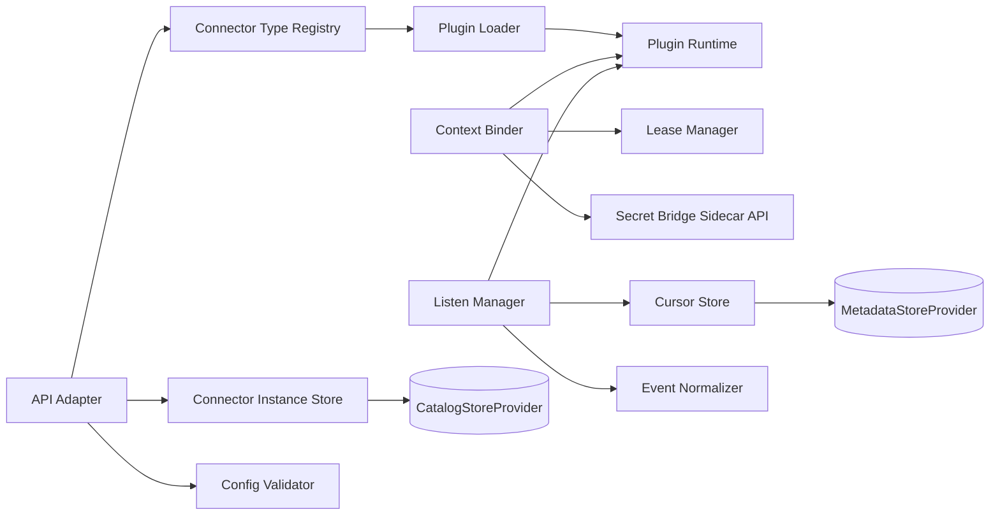
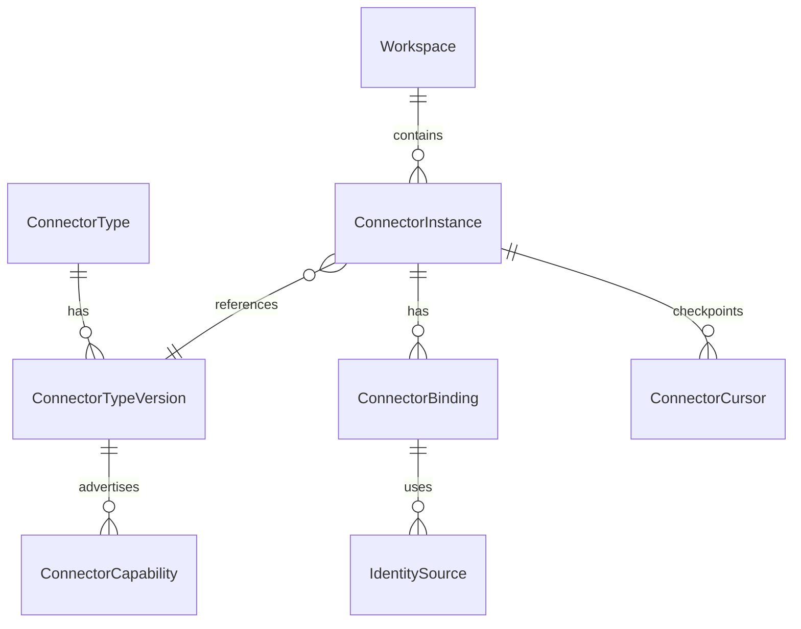
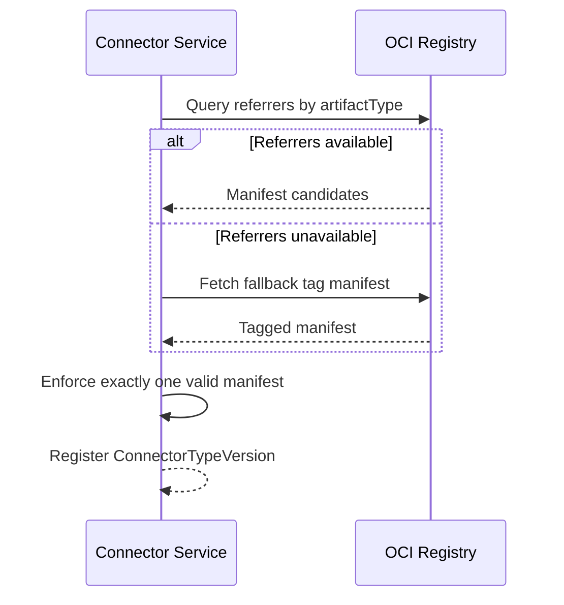
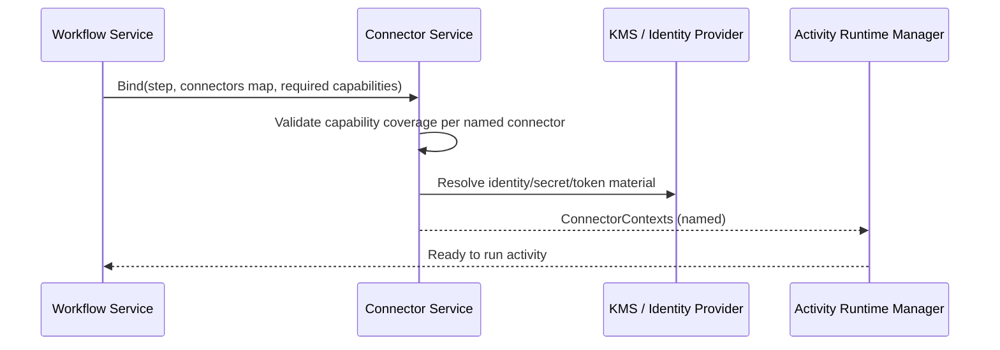

# Component Design: Connector Service

Slug: connector-service
Last Updated: 2026-05-17
Version: 7
Status: Draft

## Responsibility

The Connector Service is the access broker between workflows/activities and external systems.
It owns connector type metadata, connector instance lifecycle, capability matching, context issuance, and trigger event listen streams.

## Boundaries

- Owns:
  - Connector plugin contract and compatibility checks
  - Connector type registration (by version)
  - Connector instance configuration, validation, activation state, and health state
  - Connector context issuance for activity steps
  - Trigger listen streams (push and pull modes)
  - Identity-to-secret/token mediation for connector workloads
- Does NOT own:
  - Workflow orchestration state machine
  - Activity execution runtime internals
  - End-user authentication and RBAC policy engine

## Internal Structure



## Data Models



### Core entities

- ConnectorType: logical plugin family (for example `oci-registry`, `policy-engine`, `notification`).
- ConnectorTypeVersion: immutable plugin version descriptor.
- ConnectorInstance: workspace-scoped configured connection.
- ConnectorBinding: runtime binding between a step and one connector instance.
- ConnectorCursor: durable cursor/checkpoint for pull streams and reconnect.
- IdentitySource: one of KMS-backed secret, workload identity, federated identity.

## Plugin Packaging and Discovery

Connector plugins are OCI images. Connector metadata is not embedded in the image filesystem.

### Manifest artifact rules

- Preferred discovery mode: OCI Referrers API (Distribution Spec v1.1).
- Fallback discovery mode: digest-derived tag convention.
- Exactly one valid connector manifest must resolve.

Manifest selection algorithm:
1. Query referrers filtered by `artifactType = application/vnd.custos.connector.manifest.v1+json`.
2. If referrers are unsupported or unavailable, fetch fallback tag `<digest>.custos-connector-manifest-v1` where digest is normalized `sha256-<hex>`.
3. If both sources produce manifests, referrer result wins; fallback is ignored and audited.
4. Zero or multiple valid manifests is a hard validation failure.

## Plugin Manifest v1 (artifact payload)

```json
{
  "apiVersion": "custos.dev/connector-manifest/v1",
  "kind": "ConnectorManifest",
  "metadata": {
    "type": "oci-registry",
    "version": "2.3.1",
    "contractVersion": "1"
  },
  "spec": {
    "description": "OCI registry connector",
    "capabilities": [
      "oci.pull",
      "oci.push"
    ],
    "target": {
      "kind": "oci-registry",
      "endpoint": "https://ghcr.io",
      "verifyTls": true,
      "config": {
        "repositoryNamespace": "my-org"
      }
    },
    "credentials": {
      "authenticationType": "oidc",
      "authentication": {
        "provider": "oidc",
        "issuer": "https://token.actions.githubusercontent.com",
        "audience": "https://ghcr.io",
        "subjectTemplate": "repo:my-org/my-repo:ref:{ref}"
      }
    },
    "events": {
      "delivery": [
        "push",
        "pull"
      ],
      "produced": [
        "oci.image.pushed",
        "oci.tag.updated"
      ]
    }
  }
}
```

#### Sink connector example (no `events` block)

A connector whose only role is to receive data — for example, a Slack/Teams notifier or a write-only object-storage sink — omits the `events` block entirely. The Listen Manager skips trigger wiring for such connector type versions; the Binder still validates `capabilities` at step bind time.

```json
{
  "apiVersion": "custos.dev/connector-manifest/v1",
  "kind": "ConnectorManifest",
  "metadata": {
    "type": "slack-notifier",
    "version": "1.0.0",
    "contractVersion": "1"
  },
  "spec": {
    "description": "Slack notification sink",
    "capabilities": [
      "slack.post"
    ],
    "target": {
      "kind": "slack-webhook",
      "endpoint": "https://hooks.slack.com",
      "verifyTls": true,
      "config": {}
    },
    "credentials": {
      "authenticationType": "azure-key-vault",
      "authentication": {
        "vaultUri": "https://kv.example.com",
        "secretName": "slack-webhook-token"
      }
    }
  }
}
```

### Normative JSON Schema

The strict schema for this manifest is defined in `design/components/connector-service/schemas/connector-manifest.v1.schema.json`.
Concrete examples are maintained in `design/components/connector-service/examples/` and must be updated whenever the schema changes.

Validation requirements:
- Closed objects (`additionalProperties: false`) at all levels.
- Strict constants for `apiVersion`, `kind`, and `metadata.contractVersion`.
- SemVer validation for `metadata.version`.
- Inline `target` block defines the endpoint URI and resource type (`oci-registry`, `azure-blob-storage`, or `amazon-s3-bucket`).
- Common target fields (`kind`, `endpoint`, `verifyTls`) are kind-agnostic; type-specific fields live inside a generic `target.config` property bag interpreted by `target.kind`.
- Per-kind `target.config` schemas are enforced:
  - `oci-registry` requires `config.repositoryNamespace`.
  - `azure-blob-storage` requires `config.storageAccount` and `config.container`.
  - `amazon-s3-bucket` requires `config.bucket` and `config.region`.
- Inline `credentials` block defines auth mode via concrete `authenticationType` (`azure-key-vault`, `amazon-kms`, `azure-managed-identity`, `oidc`) and a generic `authentication` property bag.
- `credentials.authentication` is interpreted according to `credentials.authenticationType` and remains extensible for future auth types.
- Manifest payload is self-contained; target and credential requirements are defined inline.
- Identity category (KMS-backed, workload, federated) is derived from `credentials.authenticationType` by the Connector Service; manifests do not declare it. Vendor `x-*` auth types register their category at plugin-registration time, out of band.
- `capabilities` enumerates **data-plane verbs** the connector can perform (e.g. `oci.pull`, `s3.read`). `event.*` tokens MUST NOT appear in `capabilities` — event-stream concerns live entirely in `events`.
- The `events` block is **optional**. Sink/data-plane-only connectors (e.g. Slack, Teams, Email notification connectors, write-only blob targets) omit it entirely. The Listen Manager treats connector type versions with no `events` block as non-event-producing and skips trigger wiring for them.
- When the `events` block is present:
  - `events.delivery` enumerates the **delivery mechanisms** the Trigger Service must wire up: `push` (target delivers events to us) and/or `pull` (we poll the target). At least one entry is required.
  - `events.produced` enumerates the **catalog of normalized event types** the connector emits. Workflow trigger definitions reference these names. At least one entry is required.
- Capability and event tokens follow dot-delimited lowercase naming rules.

## Capabilities and Events

`capabilities` and `events` answer separate questions for different consumers and at different points in the system lifecycle.

### `capabilities` — data-plane verbs

A flat list of operations the connector type can perform against its target. Tokens are dot-delimited lowercase, e.g. `oci.pull`, `oci.push`, `oci.copy`, `s3.read`, `s3.write`, `blob.read`, `blob.write`.

Consumed by:

- **Activity authors** — activities declare their required capabilities per connector input.
- **Binder (Connector Service)** — at step bind time, validates that each named connector advertises all required capabilities. Missing capability ⇒ bind failure before the activity runs.
- **Catalog / UI** — surfaces filterable verb metadata when authoring workflows.

`capabilities` is purely about data-plane operations. Event-stream concerns are not expressed here.

### `events.delivery` — how events arrive

The `events` block as a whole is optional; connectors that do not produce events (sinks, notification targets, write-only data planes) omit it. When present, `events.delivery` is an array drawn from `["push", "pull"]` and declares the delivery mechanisms the connector supports:

- `push`: target pushes events to the platform (webhook, message bus, change-feed subscription).
- `pull`: the platform polls/lists the target on a cadence to detect new events.

Consumed by:

- **Listen Manager (Connector Service)** — selects the runtime wiring per delivery mode at trigger activation: spin up a webhook receiver, a polling loop, or a message-bus consumer.
- **Operator audit** — confirms which delivery surfaces are exposed by a given connector type version.

A single connector type may support both modes. The same `events.produced` catalog is available through any declared delivery mode; per-event delivery mapping is intentionally out of scope for v1.

### `events.produced` — event catalog

A flat list of normalized event types the connector emits, e.g. `oci.image.pushed`, `oci.tag.updated`, `s3.object.created`, `blob.object.deleted`.

Consumed by:

- **Workflow validator** — at workflow save time, confirms every trigger reference resolves to an event produced by some connector type in the workspace.
- **Trigger Service** — subscribes to these event types and matches them to workflow triggers at runtime.
- **Trigger UI / CLI** — autocomplete and discovery.
- **Audit / Catalog Service** — record of which event types are emitted by which connector type version.

### Why capabilities and events are kept separate

| Field | What it encodes | Primary consumer | When consumed |
|---|---|---|---|
| `capabilities` | Data-plane verbs (nouns: operations) | Binder | Step bind time |
| `events.delivery` | Event delivery mechanisms | Listen Manager | Trigger activation |
| `events.produced` | Event-type catalog (nouns: event names) | Workflow validator, Trigger Service | Workflow save + trigger runtime |

These are orthogonal axes. Knowing a connector can `oci.pull` images does not tell you whether it can deliver `oci.image.pushed` events, and vice versa. Conflating them into one list would force every consumer to filter by token prefix to recover the dimension it actually cares about.

## Connection to Workflows and Activities

A workflow step can bind one or many connectors.

Single connector example:

```yaml
- id: scan
  activity: vuln-scan@2
  connector: upstream-registry
```

Multi-connector example:

```yaml
- id: promote
  activity: image-promote@1
  connectors:
    source: upstream-registry
    destination: downstream-registry
```

Binding rules:
- `connector` and `connectors` are mutually exclusive on a step.
- Activities declare required capabilities per connector input.
- The binder validates each named connector against required capabilities before step execution.

## Identity and Credential Model

All three identity categories are supported from v1. The category for a given connector instance is **derived** by the Connector Service from `credentials.authenticationType`; it is not declared in the manifest.

| Identity category | Concrete `authenticationType` values |
|---|---|
| `kms` (KMS-backed credentials) | `azure-key-vault`, `amazon-kms` |
| `workload` (workload identity) | `azure-managed-identity` |
| `federated` (federated identity) | `oidc` |

Behavior per category:

1. KMS-backed credentials
   - Connector workload identity must be provisioned and authorized to read from KMS.
   - Examples: Azure Key Vault, AWS Secrets Manager, Vault.
2. Workload identity
   - Connector uses managed/workload identity directly to access upstream systems.
3. Federated identity
   - OIDC is first implementation.
   - Contract remains extensible to non-OIDC federation methods later.

Vendor extension auth types (`x-*` `authenticationType`) declare their identity category at plugin-registration time as out-of-band metadata; the manifest payload itself remains a single source of truth for the auth mechanism.

## Cursor Ownership

Pull-mode event streams require a durable cursor representing "the last position we have consumed against the upstream API". This cursor is owned by the **Connector Service**, keyed per `ConnectorInstance`, and persisted via `MetadataStoreProvider` (see `ConnectorCursor` in the Data Models section).

**Granularity is per-instance, not per-subscription.** A single `ConnectorInstance` may be referenced by multiple Trigger Service `Subscription`s (e.g. two workflows both listening for `oci.image.pushed` from the same registry connector). The Connector Service runs **one** pull loop per active `ConnectorInstance` against the upstream API, reads/advances the single cursor, and fans normalized events out to every subscribing receiver via the `listen(mode=pull)` channel. This avoids N×M upstream polling load when N subscriptions consume from M instances.

**The Trigger Service holds no cursor state.** Its Pull Receivers are stateless w.r.t. upstream position; they drive `listen(mode=pull)` ticks against the Connector Service and consume the events it yields. Per-subscription progress against *delivered* events is handled by Trigger Service's existing `DedupKey` store, not a cursor — cursor (upstream position) and dedup (per-subscription delivery exactness) are orthogonal concerns and remain split along the component boundary.

**Reset / replay semantics.** An operator who needs to reprocess events from an earlier position calls a Connector Service admin operation that rewinds the per-instance cursor; every subscription consuming that instance sees the replay. Per-subscription dedup keys are independently cleared by Trigger Service if a true replay (re-firing dispatches) is desired.

This division resolves INCON-011: there is exactly one cursor per stream, owned by the component that talks to the upstream API.

## Secret and Token Flow to Activities

The connector runtime authenticates to upstream systems and obtains short-lived token material as needed.
Activities do not receive raw static credentials directly.

Delivery model: sidecar approach.

- Activity receives `ConnectorContext` with opaque handles and metadata.
- Activity requests resolved secret/token material via local sidecar API.
- Sidecar enforces lease scope (workflow run id, step id, ttl) and audit logging.

This keeps secrets ephemeral, scoped, and auditable.

## Public Interface

### REST API (via API Gateway)

| Method | Path | Description |
|---|---|---|
| GET | /v1/workspaces/{ws}/connector-types | List connector types and versions |
| POST | /v1/workspaces/{ws}/connectors | Create connector instance |
| GET | /v1/workspaces/{ws}/connectors/{id} | Get connector instance |
| PATCH | /v1/workspaces/{ws}/connectors/{id} | Update connector config |
| POST | /v1/workspaces/{ws}/connectors/{id}:enable | Enable connector |
| POST | /v1/workspaces/{ws}/connectors/{id}:disable | Disable connector |
| GET | /v1/workspaces/{ws}/connectors/{id}/health | Probe health |

### Internal RPCs

| RPC | Caller | Purpose |
|---|---|---|
| BindForStep | Activity Runtime Manager | Get connector context for a step |
| ValidateConnector | Catalog/Workflow services | Preflight capability and config validation |
| SubscribeEvents | Trigger Service | Consume connector push/pull event stream |
| RefreshLease | Activity Runtime Manager | Extend lease for long-running step |

## Operational and Security Notes

- Plugin signature verification is out of scope for Custos runtime implementation.
- Signature/authenticity enforcement is delegated to platform controls such as Kyverno or OPA/Gatekeeper + Ratify.
- Connector Service must still emit audit events when manifests are resolved and plugins are loaded.

## Key Operations

### Operation: Resolve Connector Manifest



### Operation: Bind Multi-Connector Step



## Open Questions

- Capability namespace governance model (strict curated list vs extensible custom prefixes).
- Fallback tag naming finalization and normalization edge cases for non-sha256 digests.
- Sidecar API details (path, protocol, token refresh semantics, cache policy).

## Change History

| Date | Change | GitHub Issue |
|---|---|---|
| 2026-05-15 | Initial component design | — |
| 2026-05-16 | Refactor `target` to separate common fields from kind-specific `config` property bag | — |
| 2026-05-16 | Remove `identityModels` and `federatedProviders`; derive identity category from `credentials.authenticationType` | — |
| 2026-05-16 | Remove `supportedModes`; trigger delivery direction is already encoded by `event.push` / `event.pull` capabilities | — |
| 2026-05-16 | Move event delivery direction out of `capabilities` into `events.delivery`; document Capabilities and Events semantics | — |
| 2026-05-17 | INCON-012: `events` block is optional — sink/data-plane-only connectors omit it; when present, `events.delivery` and `events.produced` each require at least one entry. Added sink connector example | #37 |
| 2026-05-17 | INCON-011: Documented Cursor Ownership — Connector Service owns one `ConnectorCursor` per `ConnectorInstance`; Trigger Service holds no cursor state. One pull loop per instance fans events out to multiple subscriptions | #36 |
