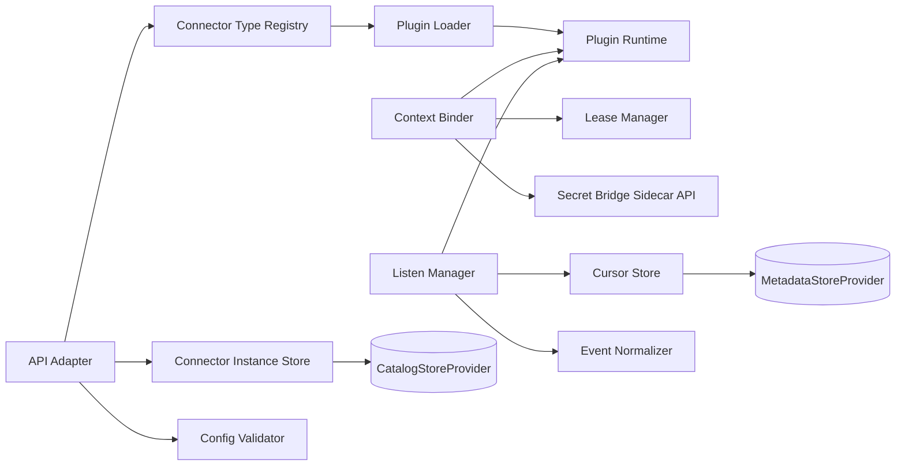
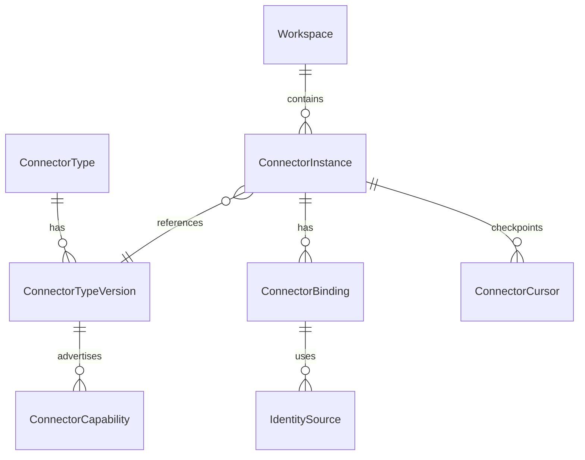
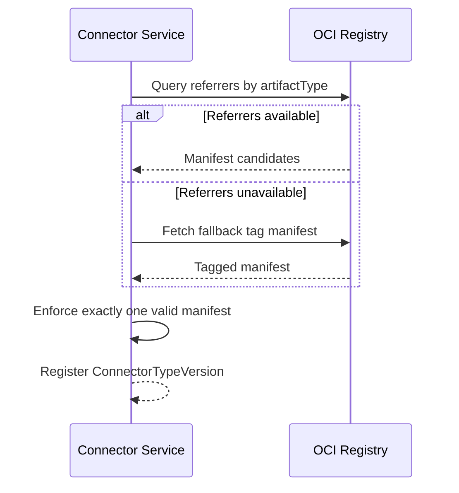
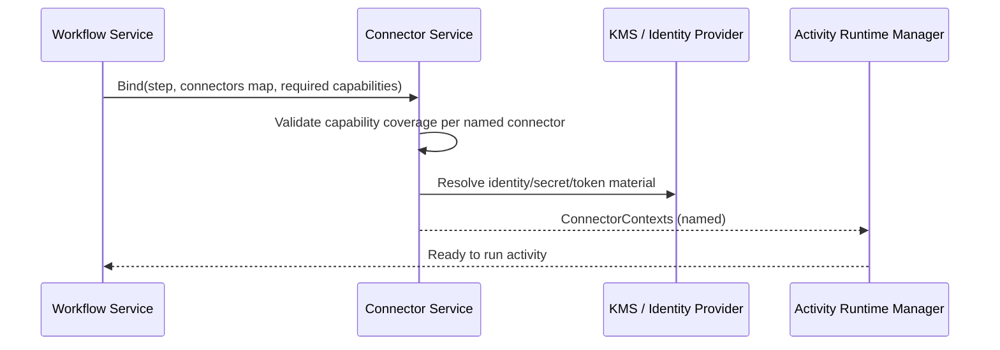

# Component Design: Connector Service

Slug: connector-service
Last Updated: 2026-05-15
Version: 1
Status: Draft

## Responsibility

The Connector Service is the access broker between workflows/activities and external systems.
It owns connector type metadata, connector instance lifecycle, capability matching, context issuance, and trigger event listen streams.

## Boundaries

- Owns:
  - Connector plugin contract and compatibility checks
  - Connector type registration (by version)
  - Connector instance configuration, validation, activation state, and health state
  - Connector context issuance for activity steps
  - Trigger listen streams (push and pull modes)
  - Identity-to-secret/token mediation for connector workloads
- Does NOT own:
  - Workflow orchestration state machine
  - Activity execution runtime internals
  - End-user authentication and RBAC policy engine

## Internal Structure



## Data Models



### Core entities

- ConnectorType: logical plugin family (for example `oci-registry`, `policy-engine`, `notification`).
- ConnectorTypeVersion: immutable plugin version descriptor.
- ConnectorInstance: workspace-scoped configured connection.
- ConnectorBinding: runtime binding between a step and one connector instance.
- ConnectorCursor: durable cursor/checkpoint for pull streams and reconnect.
- IdentitySource: one of KMS-backed secret, workload identity, federated identity.

## Plugin Packaging and Discovery

Connector plugins are OCI images. Connector metadata is not embedded in the image filesystem.

### Manifest artifact rules

- Preferred discovery mode: OCI Referrers API (Distribution Spec v1.1).
- Fallback discovery mode: digest-derived tag convention.
- Exactly one valid connector manifest must resolve.

Manifest selection algorithm:
1. Query referrers filtered by `artifactType = application/vnd.custos.connector.manifest.v1+json`.
2. If referrers are unsupported or unavailable, fetch fallback tag `<digest>.custos-connector-manifest-v1` where digest is normalized `sha256-<hex>`.
3. If both sources produce manifests, referrer result wins; fallback is ignored and audited.
4. Zero or multiple valid manifests is a hard validation failure.

## Plugin Manifest v1 (artifact payload)

```yaml
apiVersion: custos.dev/connector-manifest/v1
kind: ConnectorManifest
metadata:
  type: oci-registry
  version: 2.3.1
  contractVersion: "1"
spec:
  description: OCI registry connector
  capabilities:
    - oci.pull
    - oci.push
    - event.push
    - event.pull
  supportedModes:
    - push
    - pull
  target:
    kind: oci-registry
    endpoint: https://ghcr.io
    repositoryPrefix: my-org
    verifyTls: true
  credentials:
    sourceType: federated
    federated:
      provider: oidc
      issuer: https://token.actions.githubusercontent.com
      audience: https://ghcr.io
      subjectTemplate: repo:my-org/my-repo:ref:{ref}
  identityModels:
    - federated
  federatedProviders:
    - oidc
  events:
    produced:
      - oci.image.pushed
      - oci.tag.updated
```

### Normative JSON Schema

The strict schema for this manifest is defined in `design/components/connector-service/schemas/connector-manifest.v1.schema.json`.
Concrete examples are maintained in `design/components/connector-service/examples/` and must be updated whenever the schema changes.

Validation requirements:
- Closed objects (`additionalProperties: false`) at all levels.
- Strict constants for `apiVersion`, `kind`, and `metadata.contractVersion`.
- SemVer validation for `metadata.version`.
- Inline `target` block defines the endpoint and resource type (`oci-registry`, `azure-blob-storage`, or `amazon-s3-bucket`).
- Per-kind target requirements are enforced:
  - `oci-registry` requires `repositoryPrefix`.
  - `azure-blob-storage` requires `azureStorageAccount` and `azureContainer`.
  - `amazon-s3-bucket` requires `s3Bucket` and `s3Region`.
- Inline `credentials` block defines where auth material comes from (`kms`, `workload`, or `federated`).
- `credentials.sourceType` requires the matching credential details block and forbids sibling model blocks.
- Manifest payload is self-contained; target and credential requirements are defined inline.
- `federatedProviders` is required when `identityModels` contains `federated`.
- Capability/event tokens follow dot-delimited lowercase naming rules.

## Connection to Workflows and Activities

A workflow step can bind one or many connectors.

Single connector example:

```yaml
- id: scan
  activity: vuln-scan@2
  connector: upstream-registry
```

Multi-connector example:

```yaml
- id: promote
  activity: image-promote@1
  connectors:
    source: upstream-registry
    destination: downstream-registry
```

Binding rules:
- `connector` and `connectors` are mutually exclusive on a step.
- Activities declare required capabilities per connector input.
- The binder validates each named connector against required capabilities before step execution.

## Identity and Credential Model

All three models are supported from v1:

1. KMS-backed credentials (`kms`)
   - Connector workload identity must be provisioned and authorized to read from KMS.
   - Examples: Azure Key Vault, AWS Secrets Manager, Vault.
2. Workload identity (`workload`)
   - Connector uses managed/workload identity directly to access upstream systems.
3. Federated identity (`federated`)
   - OIDC is first implementation.
   - Contract remains extensible to non-OIDC federation methods later.

## Secret and Token Flow to Activities

The connector runtime authenticates to upstream systems and obtains short-lived token material as needed.
Activities do not receive raw static credentials directly.

Delivery model: sidecar approach.

- Activity receives `ConnectorContext` with opaque handles and metadata.
- Activity requests resolved secret/token material via local sidecar API.
- Sidecar enforces lease scope (workflow run id, step id, ttl) and audit logging.

This keeps secrets ephemeral, scoped, and auditable.

## Public Interface

### REST API (via API Gateway)

| Method | Path | Description |
|---|---|---|
| GET | /v1/workspaces/{ws}/connector-types | List connector types and versions |
| POST | /v1/workspaces/{ws}/connectors | Create connector instance |
| GET | /v1/workspaces/{ws}/connectors/{id} | Get connector instance |
| PATCH | /v1/workspaces/{ws}/connectors/{id} | Update connector config |
| POST | /v1/workspaces/{ws}/connectors/{id}:enable | Enable connector |
| POST | /v1/workspaces/{ws}/connectors/{id}:disable | Disable connector |
| GET | /v1/workspaces/{ws}/connectors/{id}/health | Probe health |

### Internal RPCs

| RPC | Caller | Purpose |
|---|---|---|
| BindForStep | Activity Runtime Manager | Get connector context for a step |
| ValidateConnector | Catalog/Workflow services | Preflight capability and config validation |
| SubscribeEvents | Trigger Service | Consume connector push/pull event stream |
| RefreshLease | Activity Runtime Manager | Extend lease for long-running step |

## Operational and Security Notes

- Plugin signature verification is out of scope for Custos runtime implementation.
- Signature/authenticity enforcement is delegated to platform controls such as Kyverno or OPA/Gatekeeper + Ratify.
- Connector Service must still emit audit events when manifests are resolved and plugins are loaded.

## Key Operations

### Operation: Resolve Connector Manifest



### Operation: Bind Multi-Connector Step



## Open Questions

- Capability namespace governance model (strict curated list vs extensible custom prefixes).
- Fallback tag naming finalization and normalization edge cases for non-sha256 digests.
- Sidecar API details (path, protocol, token refresh semantics, cache policy).
