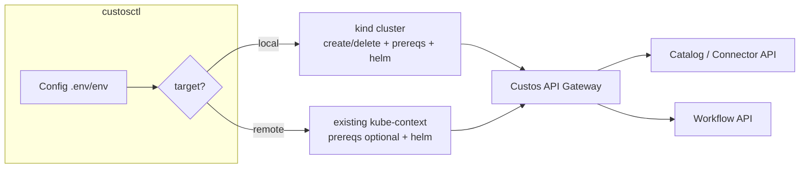
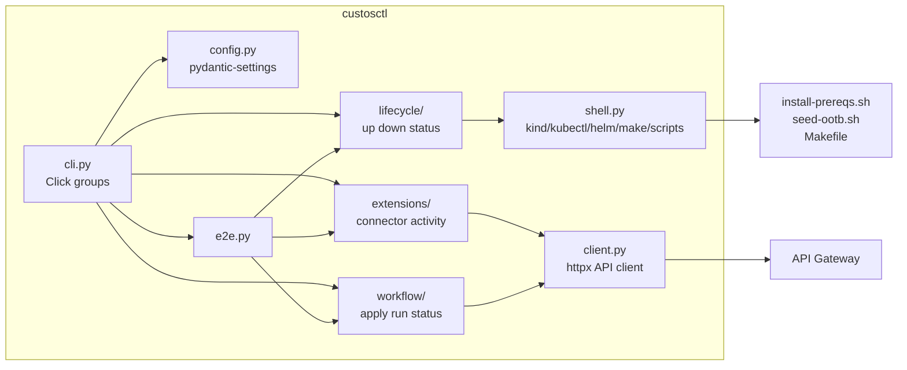
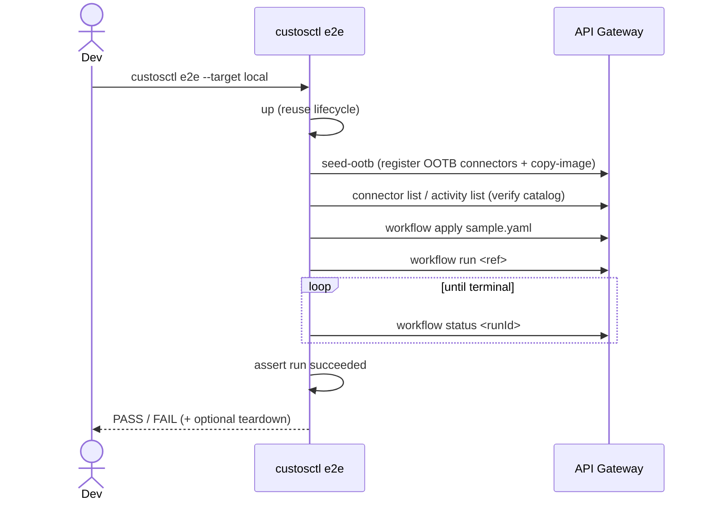

# Component Design: Local Dev & Test CLI (`custosctl`)

Slug: `custosctl`
Last Updated: 2026-06-30
Version: 1
Status: Draft
Milestone: 0.2

## Responsibility

`custosctl` is a developer-facing command-line tool that deploys the Custos
platform to a Kubernetes cluster — **local (`kind`)** or **remote (an existing
kube-context)** — and drives the extension lifecycle against the running
platform's public APIs: register connectors and activities into the catalog,
apply and run workflows that use them, and run a single end-to-end smoke test.
It is an **orchestration layer** over existing assets, not a reimplementation of
them.

## Boundaries

- **Owns**: the local/remote dev+test UX; a target abstraction (`local` vs
  `remote`); a thin typed API client for the Gateway/Catalog/Workflow surfaces;
  `.env`/environment configuration loading; a sample-workflow fixture used by
  `e2e`.
- **Does NOT own**: the platform runtime, the Helm umbrella chart, the
  connector/activity/workflow contracts, image publishing, or the OOTB onboarding
  logic. `custosctl` **wraps** `scripts/install-prereqs.sh`, `scripts/seed-ootb.sh`,
  the `make docker-build`/`deps` targets, `kind`/`kubectl`/`helm`, and the public
  REST APIs documented under `docs/developers/`.

## Scope for 0.2

- **Images**: **GHCR-only.** The platform and job images are deployed by the
  umbrella Helm chart, which composes them as
  `<global.imageRegistry>/<chart>:<global.imageTag>` — i.e. **tag-pinned** in
  0.2 (the chart has no digest support today; adding it is out of scope). OOTB
  **extension** registration is different: the catalog resolves and stores each
  extension image's **digest** at register time (as `scripts/seed-ootb.sh` does).
  No local registry and no local-build path in 0.2 — testing unpublished,
  locally built images is deferred to a later milestone.
- **Targets**: `local` (a `kind` cluster `custosctl` creates/deletes) and
  `remote` (an existing cluster selected by kube-context; `custosctl` never
  creates or deletes the cluster itself).
- **Out of scope for 0.2**: local-build/unpinned mode, multi-cluster fan-out,
  a TUI/web UI, secret management beyond reading a token from `.env`/env.

## Target Model



- **Lifecycle commands** (`up`/`down`/`status`) branch on target.
- **API-driven commands** (`connector`/`activity`/`workflow`/`seed-ootb`) are
  **target-agnostic** — they only need `GATEWAY` + `TOKEN`, so they behave
  identically against local and remote.
- **Remote guardrails**: `down` on a remote target only ever `helm uninstall`s
  the release; it never runs `kind delete` and never deletes the namespace or
  PVCs without an explicit `--force`. Destructive operations require `--yes`.

## Internal Structure



## Key Operations

### Operation: `up` (bring the platform online)

```mermaid
sequenceDiagram
    actor Dev
    participant CLI as custosctl up
    participant K as kind/kubectl/helm
    participant Cl as Cluster
    Dev->>CLI: custosctl up --target local
    CLI->>CLI: load config, doctor preflight
    alt target = local
        CLI->>K: kind create cluster (if absent)
    else target = remote
        CLI->>K: verify kube-context reachable
    end
    CLI->>K: install-prereqs.sh (idempotent; optional on remote)
    CLI->>K: helm dependency update + helm install --wait
    CLI->>Cl: poll gateway /healthz, /readyz
    Cl-->>CLI: ready
    CLI-->>Dev: platform up (gateway URL)
```

### Operation: `e2e` (test everything)



## Public Interface

`custosctl` exposes a CLI, not a network API. Command surface for 0.2:

| Command | Target-aware | Purpose |
|---|---|---|
| `custosctl doctor` | yes | Preflight: docker/kind/kubectl/helm versions (local); kube-context reachability (remote) |
| `custosctl up` | yes | Create/verify cluster, install prereqs, `helm install`, wait for health |
| `custosctl down` | yes | `helm uninstall`; local also `kind delete`; remote never deletes the cluster |
| `custosctl status` | yes | Pod readiness + gateway `/healthz` `/readyz` |
| `custosctl connector register <path-or-image>` | no | Register a connector-type via the API (extension folder or image ref) |
| `custosctl connector list` | no | Show registered connector-types (catalog view) |
| `custosctl activity register <path-or-image>` | no | Register an activity-type via the API (extension folder or image ref) |
| `custosctl activity list` | no | Show registered activity-types |
| `custosctl workflow apply <file>` | no | Create/update a workflow definition |
| `custosctl workflow run <ref>` | no | Start a run of a workflow |
| `custosctl workflow status <runId>` | no | Show run status/result |
| `custosctl seed-ootb` | no | Wrap `scripts/seed-ootb.sh` (OOTB onboarding) |
| `custosctl e2e` | yes | up -> seed -> apply -> run -> assert success |

Global flags: `--target {local,remote}`, `--config <path>`, `--yes`, `--verbose`.
CLI flags override `.env`/environment values.

## Configuration

Loaded via `pydantic-settings` from a `.env` file or the environment. CLI flags
take precedence. Prefix `CUSTOS_`.

| Variable | Required | Default | Description |
|---|---|---|---|
| `CUSTOS_TARGET` | No | `local` | `local` (kind) or `remote` (existing kube-context) |
| `CUSTOS_KUBE_CONTEXT` | No | `kind-<cluster>` (local) | kube-context to operate against |
| `CUSTOS_CLUSTER` | No | `custos-local` | kind cluster name (local only) |
| `CUSTOS_KIND_NODE_IMAGE` | No | `kindest/node:v1.31.2` | kind node image (local only) |
| `CUSTOS_NAMESPACE` | No | `custos-system` | Release namespace |
| `CUSTOS_RELEASE` | No | `custos` | Helm release name |
| `CUSTOS_PROFILE` | No | `connected-eval` | Umbrella-chart values profile |
| `CUSTOS_IMAGE_PREFIX` | No | `ghcr.io/toddysm/custos` | Maps to the chart's `global.imageRegistry`; service repos are derived as `<registry>/<chart>` |
| `CUSTOS_IMAGE_TAG` | No | `dev` (chart default) | Maps to the chart's `global.imageTag`; platform images are tag-pinned in 0.2 |
| `CUSTOS_GATEWAY` | Yes (API cmds) | — | API Gateway base URL |
| `CUSTOS_TOKEN` | Yes (API cmds) | — | Platform-admin service token (`cst_...`) |
| `CUSTOS_INSECURE` | No | `false` | Pass `-k`/verify=false for the eval self-signed cert |
| `CUSTOS_PREREQS` | No | `install` (local) / `skip` (remote) | Whether `up` runs `install-prereqs.sh` |

## Dependencies

| Dependency | Type | Purpose |
|---|---|---|
| `click` | Build/Runtime | CLI framework |
| `httpx` | Runtime | Gateway/Catalog/Workflow API client |
| `pydantic-settings` | Runtime | `.env`/env config model |
| `kind`, `kubectl`, `helm` | External CLI | Cluster lifecycle + install (invoked via subprocess) |
| `scripts/install-prereqs.sh` | Repo asset | Out-of-band operator install (wrapped) |
| `scripts/seed-ootb.sh` | Repo asset | OOTB onboarding (wrapped) |
| `Makefile` (`deps`) | Repo asset | Resolve chart subchart deps before install |
| API Gateway / Catalog / Workflow Service | Runtime (platform) | Registration + workflow execution targets |

## Relationship to Existing Assets

`custosctl` does not replace the Runme evaluation guides
([`docs/users/evaluation/local-cluster.md`](../../../docs/users/evaluation/local-cluster.md),
[`install-connected.md`](../../../docs/users/evaluation/install-connected.md)) — it
automates the same steps as a single tool. The guides remain the
copy-paste-able reference; `custosctl` is the scripted equivalent for repeatable
local/remote dev and test.

## Open TODOs

Tracked in [`todos.md`](todos.md) to avoid duplication (single source of truth).

## Change History

| Date | Change | GitHub Issue |
|---|---|---|
| 2026-06-30 | Initial design (0.2): target-aware local+remote CLI, GHCR-only | #951 |
