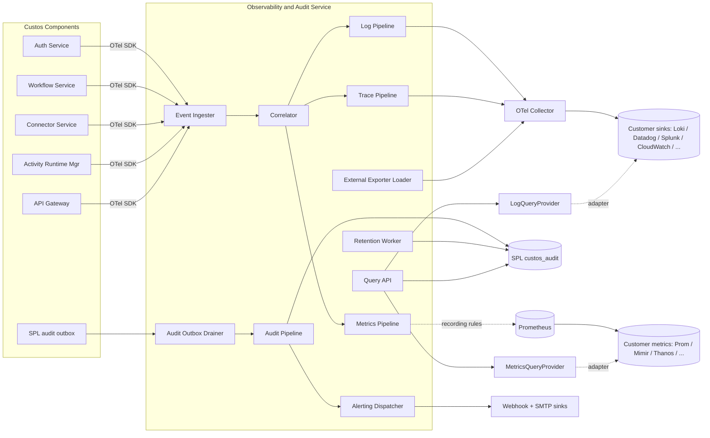
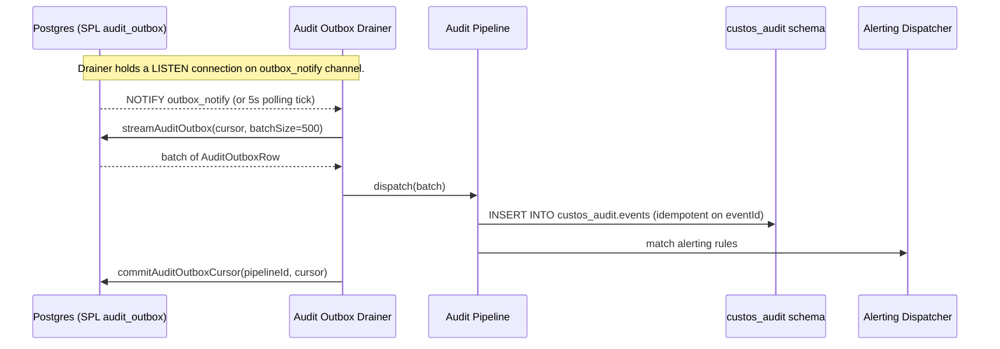
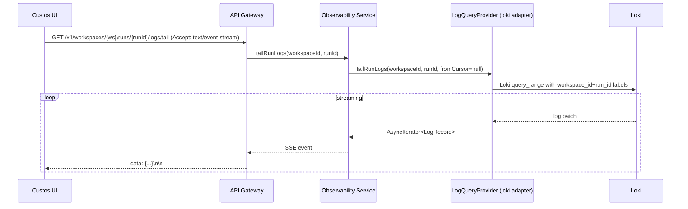
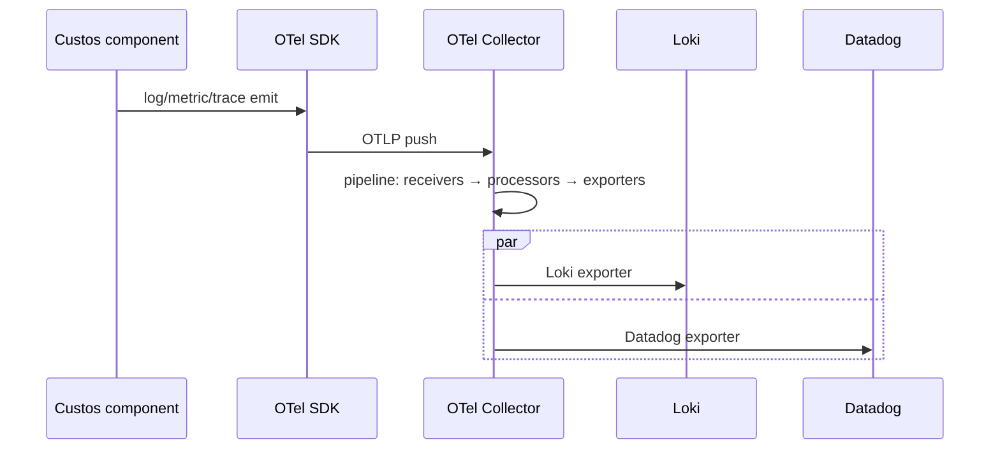
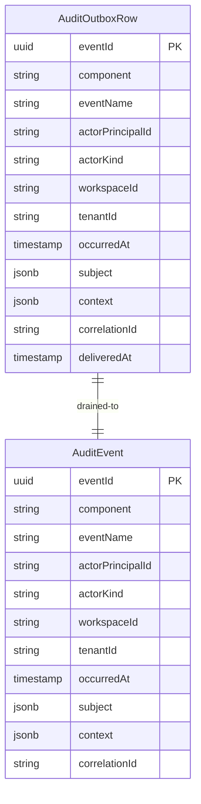

# Component Design: Observability and Audit Service

Slug: `observability-audit-service`
Last Updated: 2026-05-17
Version: 1
Status: Draft

## Responsibility

Operates the four telemetry pipelines — **Logs**, **Metrics**, **Traces**, **Audit** — that carry runtime signal off Custos components. Drains the SPL audit outbox into the durable audit store, enforces audit retention, manages the OTel Collector that fans telemetry out to customer-chosen backends, dispatches alerts, and serves the inbound read-back APIs (per-run log tail, audit query, run-scoped metrics) consumed by the Custos UI/CLI via the API Gateway.

The service is the platform's **single observer-side surface**. Components emit; this service correlates, ships, and serves.

## Boundaries

- **Owns**:
  - The four pipelines (ingestion, correlation, dispatch).
  - The audit outbox drainer and retention worker (90-day default, configurable upward per REQ-041 and ADR-010).
  - OTel Collector configuration bundle and the External Exporter Loader that templatizes customer-supplied exporter blocks.
  - The Alerting Dispatcher (webhook + SMTP in M1).
  - The read-back API surface: per-run log tail (SSE), audit query, run-scoped metrics.
- **Does NOT own**:
  - Audit row writes themselves — SPL `MetadataStoreProvider.appendAudit` owns the writer side via the outbox pattern.
  - Correlation-ID minting — API Gateway mints `x-correlation-id` per request and propagates it through Dapr metadata.
  - Audit event taxonomy — each component declares the event names it emits in code (Auth Service, Workflow Service, Connector Service, Activity Runtime Manager, SPL).
  - The destination systems for outbound telemetry (Loki, Datadog, Splunk, CloudWatch, etc.) — those are the customer's infrastructure; Custos only ships to them via OTel Collector exporters.
  - Metrics collection mechanics — Prometheus pulls `/metrics` from each component directly; this service does not proxy scrapes.

## Two Concerns, Cleanly Separated

The service handles two flows that look related but have different mechanisms and contracts:

### Concern A — Outbound Telemetry Streaming (export)

Logs, traces, metrics (and an optional copy of audit events) flow **out** of the platform to whatever backends the customer operates.

- Mechanism: **OTel Collector** with pipeline-config-driven exporters.
- Backends: anything OTel supports — Loki, Elasticsearch/OpenSearch, Datadog, Splunk, CloudWatch, Honeycomb, New Relic, S3, Kafka, etc.
- Custos artifact: a default Collector config + an Exporter Loader that templatizes customer-supplied exporter blocks into the Collector ConfigMap.
- Fan-out: a customer may export simultaneously to Loki (in-cluster) and Datadog (SaaS); that's a Collector pipeline detail, not a Custos one.

### Concern B — Inbound Query (read-back for Custos UI/API)

The Custos UI shows a per-run log tail, a per-run metrics panel, and an audit search. These need to **read from** some backend, so a query surface must exist.

- Mechanism: two new SPL provider interfaces — `LogQueryProvider` and `MetricsQueryProvider` — invoked by this service's Query API.
- Adapters (M1):
  - `LogQueryProvider`: `loki` (default), `opensearch`, `noop` (returns "view in external system at <configured-url>").
  - `MetricsQueryProvider`: `prometheus` (default, also covers Mimir/Thanos/Cortex/VictoriaMetrics/Grafana Cloud Prom-compat), `noop`.
- Customers on Splunk/Datadog typically use the vendor UI for deep log/metric search and run with `noop` here (the Custos UI shows a pointer link); the in-cluster Loki+Prometheus default works out of the box for evaluation deployments.
- The two providers are **query facades** — they hold no persistent state of their own and own no schema; they are pure read facades over the customer's chosen backend.

Audit query is **not** routed through these providers. Audit lives in the SPL `custos_audit` schema (always Postgres in v1) and is queried via `MetadataStoreProvider.queryAudit`.

## Internal Structure

Concern A is everything flowing **right** through the OTel Collector to `CustomerSinks` / `CustomerMetrics`. Concern B is everything flowing **into** `QueryAPI` from the same backends via `LogQueryProvider` and `MetricsQueryProvider`.

## Key Operations

### Operation: Audit Outbox Drain (Concern B, audit side)

- Redelivery is **at-least-once**; downstream dedup is enforced by `eventId` (UUIDv7) being the primary key on `custos_audit.events`.
- The cursor is per-pipeline (`audit-store`, `audit-alert`); each consumer commits independently so a slow alerter doesn't block the store writer.
- If the drainer crashes mid-batch, the cursor is unchanged and the batch is re-streamed on restart.

### Operation: Per-Run Log Tail (Concern B, log side)

- Transport is **SSE** (`text/event-stream`). One-way, proxy-friendly, FastAPI-native.
- The adapter is responsible for translating workspace+run identifiers into the backend's label selectors (Loki labels, OpenSearch query DSL, etc.).
- With `LogQueryProvider=noop`, the gateway returns `503 LogQueryUnavailable` with a Problem Details body pointing at `CUSTOS_LOGS_EXTERNAL_URL`.

### Operation: Outbound Telemetry Export (Concern A)

- The Collector ConfigMap is the **only** Custos artifact involved; pipelines are pure OTel configuration.
- The External Exporter Loader watches a Kubernetes ConfigMap (`custos-otel-exporters`) and merges customer exporter blocks into the Collector's running config (via a Collector reload signal).

## Data Models

### Audit pipeline (lives in SPL `custos_audit` schema, owned by SPL)

`AuditOutboxRow` rows are deleted by the drainer after a successful write to `AuditEvent` plus a retention margin (24h); `AuditEvent` rows are append-only and live for the configured retention (default 90 days).

The Observability Service owns no schema of its own — pipeline cursors live in SPL (see "Public Interface — SPL additions").

## Public Interface

### REST API (internal-only; exposed externally via API Gateway routes)

| Method | Path | Description |
|---|---|---|
| `GET` | `/v1/workspaces/{ws}/runs/{runId}/logs/tail` | SSE stream of run logs. Accept: `text/event-stream`. |
| `GET` | `/v1/workspaces/{ws}/runs/{runId}/logs` | Paged historical query. Query params: `stepId`, `from`, `to`, `severity`, `cursor`. |
| `GET` | `/v1/workspaces/{ws}/runs/{runId}/metrics` | Run-scoped metric series. Query params: `metric`, `range`. |
| `GET` | `/v1/workspaces/{ws}/audit` | Audit search. Query params: `actor`, `eventName`, `subjectId`, `from`, `to`, `cursor`. |
| `GET` | `/v1/workspaces/{ws}/audit/{eventId}` | Single audit event lookup. |

All five routes carry permissions declared in this component's `permissions.yaml`: `logs:read`, `metrics:read`, `audit:read`. The API Gateway enforces them; this service trusts the call-context JWT minted by the gateway.

### Alerting hook (internal)

| Mechanism | Description |
|---|---|
| Webhook | POST a Problem Details + event payload to a configured URL. Retry: exponential, 5 attempts, dead-letter after. |
| SMTP | Send email to a configured address. Uses configured SMTP relay. |

Alerting rules are declared in a Kubernetes ConfigMap (`custos-alert-rules`) parsed at startup. v1 supports a small DSL matching on `eventName`, `severity`, and `component`. M2+ will add the trace/metric-based rule types alluded to in REQ-044.

### SPL additions consumed by this service

| Interface | Methods added | Purpose |
|---|---|---|
| `MetadataStoreProvider` | `streamAuditOutbox(cursor, batchSize)`, `commitAuditOutboxCursor(pipelineId, cursor)` | Outbox drain protocol. Schema revision `MetadataStoreProvider:4`. |
| `LogQueryProvider` (new) | `queryRunLogs`, `tailRunLogs`, `queryStepLogs` | Concern B log read-back. Provider revision `LogQueryProvider:1`. Adapters: `loki`, `opensearch`, `noop`. |
| `MetricsQueryProvider` (new) | `queryRunMetrics`, `queryWorkspaceMetrics`, `queryInstantMetric` | Concern B metrics read-back. Provider revision `MetricsQueryProvider:1`. Adapters: `prometheus`, `noop`. |

Full method signatures live in the SPL design and its change record (`storage-provider-layer/changes/2026-05-17-003-add-observability-providers.md`).

## Configuration

| Variable | Required | Default | Description |
|---|---|---|---|
| `CUSTOS_LOG_QUERY_PROVIDER` | Yes | `loki` | Adapter identifier for `LogQueryProvider`. Set to `noop` when Custos UI should not attempt to query logs. |
| `CUSTOS_METRICS_QUERY_PROVIDER` | Yes | `prometheus` | Adapter identifier for `MetricsQueryProvider`. Set to `noop` to disable in-Custos metrics views. |
| `CUSTOS_LOKI_URL` | Conditional | — | Required when `LogQueryProvider=loki`. |
| `CUSTOS_OPENSEARCH_URL` | Conditional | — | Required when `LogQueryProvider=opensearch`. |
| `CUSTOS_PROMETHEUS_URL` | Conditional | — | Required when `MetricsQueryProvider=prometheus`. |
| `CUSTOS_LOGS_EXTERNAL_URL` | Conditional | — | Required when `LogQueryProvider=noop`. Surfaced to UI for "view in external system" pointer. |
| `CUSTOS_METRICS_EXTERNAL_URL` | Conditional | — | Required when `MetricsQueryProvider=noop`. |
| `CUSTOS_OTEL_COLLECTOR_CONFIGMAP` | No | `custos-otel-collector-config` | Kubernetes ConfigMap name holding the Collector's effective config. |
| `CUSTOS_OTEL_EXPORTERS_CONFIGMAP` | No | `custos-otel-exporters` | ConfigMap watched by the External Exporter Loader for customer exporter blocks. |
| `CUSTOS_AUDIT_RETENTION_DAYS` | No | `90` | Audit retention window. Configurable upward without bound (no downward path; would lose data). |
| `CUSTOS_AUDIT_OUTBOX_DRAIN_MODE` | No | `listen` | `listen` (LISTEN/NOTIFY) or `poll` (interval). Adapters without LISTEN support fall back to `poll` automatically. |
| `CUSTOS_AUDIT_OUTBOX_POLL_INTERVAL_S` | No | `5` | Polling interval when in `poll` mode. |
| `CUSTOS_ALERT_RULES_CONFIGMAP` | No | `custos-alert-rules` | ConfigMap holding the alert rule DSL. |
| `CUSTOS_ALERT_WEBHOOK_URLS` | No | `[]` | Default webhook destinations (overridable per-rule). |
| `CUSTOS_SMTP_*` | Conditional | — | Standard SMTP relay vars when SMTP sinks are configured in rules. |

## Dependencies

| Dependency | Type | Purpose |
|---|---|---|
| SPL (`MetadataStoreProvider`, `LogQueryProvider`, `MetricsQueryProvider`) | Runtime | Audit outbox drain, audit query, log/metric read-back. |
| OTel Collector | Runtime | Outbound telemetry pipelines (Concern A). |
| Prometheus (or any Prom-compatible backend) | Runtime | Metrics scrape targets — pulls component `/metrics` directly. |
| Loki (or any OTel-supported log backend) | Runtime, default | Default log sink. |
| API Gateway | Runtime | Routes external traffic to the Query API; mints the call-context JWT. |
| Dapr Pub/Sub (`custos.workflow.events`) | Runtime | Source of workflow lifecycle events for trace/metric correlation. |

## Failure Modes

| Failure | Surface | Caller expectation |
|---|---|---|
| `LogQueryUnavailable` (503) | `LogQueryProvider=noop` or backend unreachable. | UI shows the configured external-URL pointer. |
| `MetricsQueryUnavailable` (503) | `MetricsQueryProvider=noop` or backend unreachable. | Same pattern. |
| `AuditDrainLagging` | Drainer fell behind; outbox row count crosses a configurable threshold. | Emits an audit alert and a Prometheus metric. Does not block writes. |
| `AlertSinkUnavailable` | Webhook/SMTP target unreachable after retries. | Event lands in the dead-letter table; surfaces via audit alert. |
| `ExporterConfigInvalid` | Customer-supplied exporter block fails Collector validation. | External Exporter Loader rejects the merge, keeps last-good config, emits an audit alert. |

## Audit

This service consumes audit; it also emits a small set of operational audit events of its own:

- `obs.retention.applied` — retention worker ran; carries deleted-row count.
- `obs.outbox.lagging` — drainer lag crossed threshold.
- `obs.exporter.config.rejected` — customer-supplied exporter block invalid.
- `obs.exporter.config.applied` — exporter ConfigMap merged into Collector.
- `obs.alert.dispatched` / `obs.alert.failed` — per-alert dispatch outcome.

These events flow through the same outbox path as any other component's audit.

## Observability of the Observability Service

Self-instrumented via the OTel SDK like every other component. Health, drainer lag, retention-worker last-run timestamp, and exporter-config status are exposed on `/metrics`. The dogfooding is intentional: any Custos deployment can answer "is observability working?" by querying its own dashboards.

## Open TODOs

- [ ] TODO-001: Define the alert-rule DSL grammar (eventName/severity/component matchers, throttling, deduplication keys). (added 2026-05-17)
- [ ] TODO-002: Define the Collector ConfigMap merge algorithm for the External Exporter Loader, including validation and rollback on bad config. (added 2026-05-17)
- [ ] TODO-003: Define the dead-letter table schema for failed alert dispatches (lives in SPL or in-service?). (added 2026-05-17)
- [ ] TODO-004: Audit-event taxonomy registry — declare a canonical union of `eventName` values across components for documentation and the alert-rule editor. (added 2026-05-17)
- [ ] TODO-005: Conformance test suite for `LogQueryProvider` and `MetricsQueryProvider` adapters. (added 2026-05-17)
- [ ] TODO-006: Cryptographic hash chain over audit rows for tamper-evidence (deferred to M2+; v1 relies on append-only DDL and the `audit_retention` role). (added 2026-05-17)
- [ ] TODO-007: Define the SSE reconnection / resume-from-cursor semantics for the per-run log tail (last-event-id header, cursor encoding). (added 2026-05-17)

## Open Questions

_(none — all v1 design questions resolved this session.)_

## Change History

| Date | Change | GitHub Issue |
|---|---|---|
| 2026-05-17 | Initial component design: four pipelines (Logs/Metrics/Traces/Audit), audit outbox drainer with LISTEN/NOTIFY + polling fallback, retention worker (90-day default), Alerting Dispatcher (webhook + SMTP M1), External Exporter Loader over OTel Collector, Query API with SSE log tail, audit-event taxonomy locked to per-component declaration. Concern A (outbound telemetry export via OTel Collector) explicitly separated from Concern B (inbound query via new SPL `LogQueryProvider` and `MetricsQueryProvider`). Both query providers in M1 with `loki`/`opensearch`/`noop` and `prometheus`/`noop` adapters respectively. | #72 |
