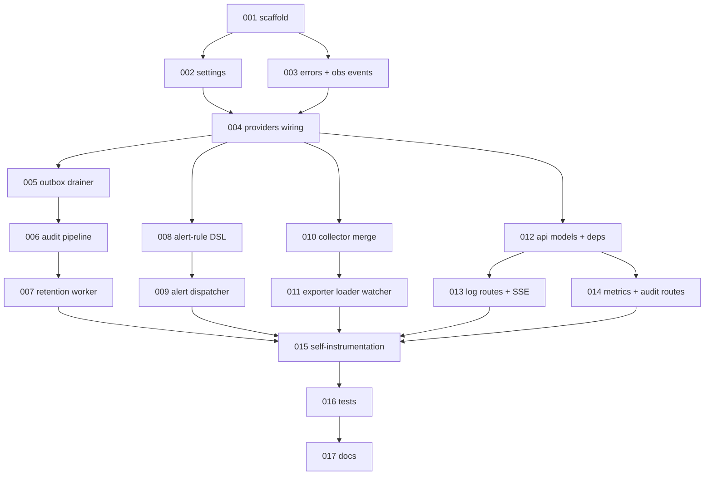

# `observability-audit-service` Implementation Plan

> Derived from `design/components/observability-audit-service/design.md` on 2026-06-05.
> Source of truth: the design doc and `design/architecture/`.
> This plan is owned by the `implement-component` skill; regenerate fresh whenever the design changes.

## Summary

The Observability and Audit Service (COMP-009) is the platform's single observer-side surface. It drains the SPL audit outbox into the durable `custos_audit` store, enforces audit retention, dispatches alerts (webhook + SMTP), manages the OTel Collector exporter bundle (External Exporter Loader, Concern A), and serves the inbound read-back API consumed by the Custos UI/CLI via the API Gateway (per-run log tail SSE, run-scoped metrics, audit search — Concern B). The SPL provider interfaces (`LogQueryProvider`, `MetricsQueryProvider`) and the audit-outbox drain methods (`stream_audit_outbox` / `commit_audit_outbox_cursor` / `listen_audit_outbox` / `append_audit` / `query_audit`) already exist in `custos-spl` + `custos-postgres`, and the `loki` / `prometheus` / `noop` adapters ship in `custos-loki` + `custos-prometheus`. This plan builds the **service host** (`custos_obs`) that orchestrates the four pipelines and the read-back API on top of that existing infrastructure.

The implementation is split so the audit path (Concern B core: drain → store → retention) lands first, then alerting, then the External Exporter Loader (Concern A), then the Query API read-back (Concern B), then cross-cutting self-instrumentation, tests, and docs.

## Conventions

- Task prefix: `OBS-IMPL-`.
- Numbering starts at `OBS-IMPL-001` (no prior `OBS-IMPL-*` issues exist; only the design issue #72 carries the `component:observability-audit-service` label).
- One task = one PR = one GitHub issue.
- Labels: tasks carry `component:observability-audit-service`, `phase:implementation`, `type:implementation`; the tracker carries `component:observability-audit-service`, `kind:tracking` (mirrors the Trigger Service / ARM convention — no per-phase labels in this repo).
- Phases run sequentially; tasks within a phase may run in parallel if dependencies allow.
- Quality gates run from `src/services/observability-audit-service`: `ruff format . && ruff check . && mypy src tests && pytest -q` at the ≥90 % coverage floor.

## Dependency graph

## Phase A — Scaffold & foundations

### `OBS-IMPL-001`: Scaffold the `custos-observability-audit-service` package + CI gate

- **Scope**:
  - `src/services/observability-audit-service/pyproject.toml` — `custos-observability-audit-service` distribution; runtime deps `custos-spl`, `custos-postgres`, `custos-loki`, `custos-prometheus`, `custos-callctx`, `fastapi`, `uvicorn`, `pydantic`, `pyyaml`, `httpx`, `opentelemetry-api`; dev extras (ruff / mypy strict / pytest-asyncio / pytest-cov); `--cov-fail-under=90` pytest default.
  - `src/.../custos_obs/__init__.py`, `__main__.py`, `app.py` — `create_app()` FastAPI factory + `python -m custos_obs` entry point.
  - `src/.../custos_obs/health.py` — `/healthz` + `/readyz` probes.
  - `.github/workflows/python-services.yml` — add the observability-audit-service install + lint/type/test job (mirroring the trigger-service entry).
  - `src/services/observability-audit-service/README.md` — status block + layout + design pointer.
- **Acceptance criteria**:
  - `python -m custos_obs` boots and serves `/healthz` + `/readyz`.
  - The package installs editable in CI install order after the SPL libs.
  - `ruff check`, `ruff format --check`, `mypy --strict`, and `pytest -q` pass on the skeleton.
- **Depends on**: _(none)_.
- **Complexity**: M.

### `OBS-IMPL-002`: `Settings` model + conditional-requirement validation

- **Scope**:
  - `src/.../custos_obs/settings.py` — typed settings for every `CUSTOS_*` env var in design § Configuration (`CUSTOS_LOG_QUERY_PROVIDER`, `CUSTOS_METRICS_QUERY_PROVIDER`, `CUSTOS_LOKI_URL`, `CUSTOS_OPENSEARCH_URL`, `CUSTOS_PROMETHEUS_URL`, `CUSTOS_LOGS_EXTERNAL_URL`, `CUSTOS_METRICS_EXTERNAL_URL`, `CUSTOS_OTEL_*_CONFIGMAP`, `CUSTOS_AUDIT_RETENTION_DAYS`, `CUSTOS_AUDIT_OUTBOX_DRAIN_MODE`, `CUSTOS_AUDIT_OUTBOX_POLL_INTERVAL_S`, `CUSTOS_AUDIT_OUTBOX_RETENTION_MARGIN`, `CUSTOS_ALERT_RULES_CONFIGMAP`, `CUSTOS_ALERT_WEBHOOK_URLS`, `CUSTOS_SMTP_*`).
  - Conditional validation: `CUSTOS_LOKI_URL` required iff `LogQueryProvider=loki`; `CUSTOS_OPENSEARCH_URL` iff `opensearch`; `CUSTOS_PROMETHEUS_URL` iff `prometheus`; external-URL required iff the matching provider is `noop`.
- **Acceptance criteria**:
  - Invalid combinations raise a clear startup error naming the offending var.
  - Defaults match the design table (`loki`, `prometheus`, `90`, `listen`, `5`).
  - Unit tests cover every conditional branch.
- **Depends on**: `OBS-IMPL-001`.
- **Complexity**: M.

### `OBS-IMPL-003`: Error taxonomy + RFC 7807 envelope + self-emitted `obs.*` audit events

- **Scope**:
  - `src/.../custos_obs/errors.py` — locked error taxonomy `LogQueryUnavailable`, `MetricsQueryUnavailable`, `AuditDrainLagging`, `AlertSinkUnavailable`, `ExporterConfigInvalid` with stable `kind` strings + RFC 7807 Problem Details `to_dict()`.
  - `src/.../custos_obs/events.py` — `AuditEvent`-shaped models for the service's own operational events: `obs.retention.applied`, `obs.outbox.lagging`, `obs.exporter.config.rejected`, `obs.exporter.config.applied`, `obs.alert.dispatched`, `obs.alert.failed`.
- **Acceptance criteria**:
  - Every documented failure mode + `obs.*` event name is represented and pinned by a closed-set test.
  - Problem Details bodies are `application/problem+json`-shaped.
- **Depends on**: `OBS-IMPL-001`.
- **Complexity**: S/M.

### `OBS-IMPL-004`: `providers.py` wiring — SPL providers from settings

- **Scope**:
  - `src/.../custos_obs/providers.py` — construct the `MetadataStoreProvider` (`custos_pg`), the `LogQueryProvider` (`custos_loki` `loki` / `noop`), and the `MetricsQueryProvider` (`custos_prometheus` `prometheus` / `noop`) from `Settings`; expose them through FastAPI lifespan-owned singletons.
  - Refuse startup if a declared provider has no matching adapter (mirrors the SPL "platform refuses to start without an active adapter" rule).
- **Acceptance criteria**:
  - Each provider identifier resolves to the correct adapter; unknown identifiers fail fast.
  - `noop` adapters wire without their backend URLs; backend adapters require their URL.
  - Lifespan opens and closes provider resources cleanly.
- **Depends on**: `OBS-IMPL-002`, `OBS-IMPL-003`.
- **Complexity**: M.

## Phase B — Audit pipeline

### `OBS-IMPL-005`: Audit Outbox Drainer — LISTEN/NOTIFY + polling fallback

- **Scope**:
  - `src/.../custos_obs/audit/drainer.py` — background task that consumes `listen_audit_outbox()` in `listen` mode and falls back to interval polling (`CUSTOS_AUDIT_OUTBOX_POLL_INTERVAL_S`) when the adapter raises `QueryUnsupported` or `CUSTOS_AUDIT_OUTBOX_DRAIN_MODE=poll`.
  - Batched `stream_audit_outbox(cursor, batch_size=500)` read loop in `id`-ascending order; crash-before-commit re-streams the batch.
- **Acceptance criteria**:
  - `listen` mode drains on NOTIFY; `poll` mode drains on the interval; unsupported-listen auto-falls-back to poll.
  - A crash mid-batch leaves the cursor unchanged and re-streams on restart (test with a fake adapter).
- **Depends on**: `OBS-IMPL-004`.
- **Complexity**: L.

### `OBS-IMPL-006`: Audit Pipeline — idempotent dispatch + per-pipeline cursors + lag signal

- **Scope**:
  - `src/.../custos_obs/audit/pipeline.py` — dispatch each drained batch to two independent consumers (`audit-store`, `audit-alert`), each committing its own high-water mark via `commit_audit_outbox_cursor(pipeline_id, cursor)` so a slow alerter cannot block the store writer.
  - Store writes are idempotent on `eventId` (UUIDv7 PK on `custos_audit.events`).
  - Emit `obs.outbox.lagging` when the outbox row count / cursor lag crosses a configurable threshold.
- **Acceptance criteria**:
  - At-least-once redelivery is de-duplicated by `eventId`.
  - The two pipeline cursors advance independently.
  - Lag crossing the threshold emits `obs.outbox.lagging` without blocking writes.
- **Depends on**: `OBS-IMPL-005`.
- **Complexity**: M/L.

### `OBS-IMPL-007`: Retention worker — audit retention + outbox GC

- **Scope**:
  - `src/.../custos_obs/audit/retention.py` — periodic worker that enforces `CUSTOS_AUDIT_RETENTION_DAYS` (default 90) on `custos_audit.events` and garbage-collects outbox rows once `id < min(cursor across all registered pipelines)` AND row age > `CUSTOS_AUDIT_OUTBOX_RETENTION_MARGIN` (default 24h).
  - Emit `obs.retention.applied` with the deleted-row count.
- **Acceptance criteria**:
  - Retention deletes only rows past the window; never deletes outbox rows still below `min(cursor)`.
  - A stuck pipeline (low cursor) preserves outbox rows indefinitely (test).
  - `obs.retention.applied` carries an accurate deleted-row count.
- **Depends on**: `OBS-IMPL-006`.
- **Complexity**: M.

## Phase C — Alerting

### `OBS-IMPL-008`: Alert-rule DSL loader + matcher

- **Scope**:
  - `src/.../custos_obs/alerting/rules.py` — load the `custos-alert-rules` ConfigMap (default `deploy/alert-rules/default.yaml` shape) at startup; match on `eventName`, `severity`, `component`, plus arbitrary `match:` field equality; support `throttle:` window + dedup keys (design TODO-001).
- **Acceptance criteria**:
  - Rules from the existing `deploy/alert-rules/default.yaml` parse and match correctly.
  - Throttle + dedup suppress repeat dispatches within the window.
  - Malformed rules fail loudly at startup.
- **Depends on**: `OBS-IMPL-004`.
- **Complexity**: M.

### `OBS-IMPL-009`: Alerting Dispatcher — webhook + SMTP sinks + dead-letter

- **Scope**:
  - `src/.../custos_obs/alerting/dispatcher.py` — webhook sink (POST Problem Details + event payload; exponential backoff, 5 attempts) and SMTP sink (configured relay via `CUSTOS_SMTP_*`).
  - Dead-letter table/record for dispatches exhausted after retries (design TODO-003); emit `obs.alert.dispatched` / `obs.alert.failed`.
- **Acceptance criteria**:
  - Webhook retries with backoff then dead-letters; SMTP sends via the configured relay.
  - `AlertSinkUnavailable` surfaces after exhaustion and the event lands in the dead-letter store.
  - Both sinks emit the correct `obs.alert.*` outcome event.
- **Depends on**: `OBS-IMPL-008`.
- **Complexity**: L.

## Phase D — External Exporter Loader (Concern A)

### `OBS-IMPL-010`: Collector-config merge + validation algorithm

- **Scope**:
  - `src/.../custos_obs/exporters/merge.py` — merge customer exporter blocks from the `custos-otel-exporters` ConfigMap into the base Collector config (`custos-otel-collector-config`), validate the merged config, and keep last-good on validation failure (design TODO-002).
- **Acceptance criteria**:
  - Valid exporter blocks merge into a well-formed Collector config.
  - Invalid blocks are rejected, last-good config is retained, and the rejection reason is captured.
  - Merge is deterministic and idempotent.
- **Depends on**: `OBS-IMPL-004`.
- **Complexity**: M/L.

### `OBS-IMPL-011`: Exporter ConfigMap watcher + Collector reload + rollback

- **Scope**:
  - `src/.../custos_obs/exporters/loader.py` — watch the `custos-otel-exporters` ConfigMap, run the merge, write the effective Collector ConfigMap, signal a Collector reload, and roll back on bad config.
  - Emit `obs.exporter.config.applied` / `obs.exporter.config.rejected`.
- **Acceptance criteria**:
  - A ConfigMap change triggers merge → write → reload-signal.
  - A bad change emits `obs.exporter.config.rejected` and leaves the running config untouched.
  - A good change emits `obs.exporter.config.applied`.
- **Depends on**: `OBS-IMPL-010`.
- **Complexity**: M.

## Phase E — Query API (Concern B read-back)

### `OBS-IMPL-012`: API wire models + dependency factories + call-context middleware + permissions

- **Scope**:
  - `src/.../custos_obs/api/models.py` — wire models for the five read-back routes.
  - `src/.../custos_obs/api/dependencies.py` — FastAPI dependency factories pulling the lifespan-owned providers.
  - `src/.../custos_obs/middleware/` — `custos-callctx` call-context middleware (trusts the gateway-minted JWT).
  - `src/services/observability-audit-service/permissions.yaml` — `logs:read`, `metrics:read`, `audit:read`.
- **Acceptance criteria**:
  - Middleware extracts the call context and rejects missing/invalid context.
  - `permissions.yaml` declares the three permissions the gateway enforces.
  - Dependency factories return the correct provider singletons.
- **Depends on**: `OBS-IMPL-004`.
- **Complexity**: M.

### `OBS-IMPL-013`: Log read-back routes — SSE tail + paged history

- **Scope**:
  - `src/.../custos_obs/api/routes/logs.py` — `GET /v1/workspaces/{ws}/runs/{runId}/logs/tail` (SSE, `text/event-stream`) over `LogQueryProvider.tail_run_logs`; `GET …/logs` paged history over `query_run_logs` / `query_step_logs` (params `stepId`, `from`, `to`, `severity`, `cursor`).
  - `noop` provider → `503 LogQueryUnavailable` Problem Details pointing at `CUSTOS_LOGS_EXTERNAL_URL`; SSE resume-from-cursor via `Last-Event-ID` (design TODO-007).
- **Acceptance criteria**:
  - The tail streams `data: {...}\n\n` SSE frames from the provider.
  - Paged query honors all filter params + cursor.
  - `noop`/unreachable backend returns the 503 pointer body.
- **Depends on**: `OBS-IMPL-012`.
- **Complexity**: M/L.

### `OBS-IMPL-014`: Metrics + audit read-back routes

- **Scope**:
  - `src/.../custos_obs/api/routes/metrics.py` — `GET /v1/workspaces/{ws}/runs/{runId}/metrics` over `MetricsQueryProvider.query_run_metrics` (params `metric`, `range`); `noop` → `503 MetricsQueryUnavailable` pointer.
  - `src/.../custos_obs/api/routes/audit.py` — `GET /v1/workspaces/{ws}/audit` search (params `actor`, `eventName`, `subjectId`, `from`, `to`, `cursor`) and `GET …/audit/{eventId}` over `MetadataStoreProvider.query_audit`.
- **Acceptance criteria**:
  - Run-metrics route returns provider series; `noop` returns the 503 pointer.
  - Audit search filters correctly and paginates by cursor; single-event lookup returns 404 when absent.
- **Depends on**: `OBS-IMPL-012`.
- **Complexity**: M.

## Phase F — Observability, verification, docs

### `OBS-IMPL-015`: OTel self-instrumentation (dogfooding)

- **Scope**:
  - `src/.../custos_obs/_telemetry.py` — single `custos_obs` tracer + meter; spans across drain / dispatch / merge / query; metrics for drainer lag, retention-worker last-run timestamp, exporter-config status, and alert-dispatch outcomes exposed on `/metrics`.
- **Acceptance criteria**:
  - Drainer lag, retention last-run, exporter status, and alert outcomes are queryable on `/metrics`.
  - Instrumentation is no-op when no OTel SDK is installed (only `opentelemetry-api` is a runtime dep).
- **Depends on**: `OBS-IMPL-007`, `OBS-IMPL-009`, `OBS-IMPL-011`, `OBS-IMPL-013`, `OBS-IMPL-014`.
- **Complexity**: M.

### `OBS-IMPL-016`: Unit + integration test suite (≥90 % coverage gate)

- **Scope**:
  - `src/services/observability-audit-service/tests/` — unit suite across settings / errors / drainer / pipeline / retention / alerting / exporter / API; Postgres-backed integration suite for the outbox-drain → store → retention path (testcontainers / `CUSTOS_PG_DSN`).
- **Acceptance criteria**:
  - Coverage ≥ 90 % (the package floor).
  - The integration suite drives the real `custos_pg` audit-outbox drain end-to-end.
  - Full `ruff` + `mypy --strict` + `pytest` green.
- **Depends on**: `OBS-IMPL-015`.
- **Complexity**: L.

### `OBS-IMPL-017`: Developer documentation — `docs/developers/observability-api.md`

- **Scope**:
  - `docs/developers/observability-api.md` — Concern A vs Concern B, the five read-back routes, SSE semantics, audit search, alert-rule DSL, exporter-loader behavior, the `obs.*` event + error taxonomy, configuration reference.
  - `tests/test_docs_examples.py` — pins every fenced example to the running code/models so the doc cannot drift.
- **Acceptance criteria**:
  - Every documented route + DSL + config var matches the implementation.
  - The doc-example test passes against the real models.
- **Depends on**: `OBS-IMPL-016`.
- **Complexity**: M.

## Out of scope (already built / deferred)

- **SPL providers & adapters** — the `LogQueryProvider` / `MetricsQueryProvider` interfaces, the `custos-loki` (`loki`/`noop`) and `custos-prometheus` (`prometheus`/`noop`) adapters, and the `stream_audit_outbox` / `commit_audit_outbox_cursor` / `listen_audit_outbox` / `append_audit` / `query_audit` methods on `custos_pg` already exist. This plan **consumes** them; the `opensearch` log adapter is not part of this milestone.
- **Helm subchart + `deploy/alert-rules/default.yaml`** already exist; tasks update values/templates rather than create the chart.
- **Deferred (M2+)**: audit cryptographic hash-chain tamper-evidence (TODO-006), trace/metric-based alert rule types (REQ-044), the cross-component audit-event taxonomy registry (TODO-004), and the standalone provider conformance suite (TODO-005, already covered by the SPL conformance harness).

## Open questions

- _(none — resolved at gate 1: keep the Exporter Loader in this milestone, ship webhook + SMTP together, accept the 6-phase grouping.)_
