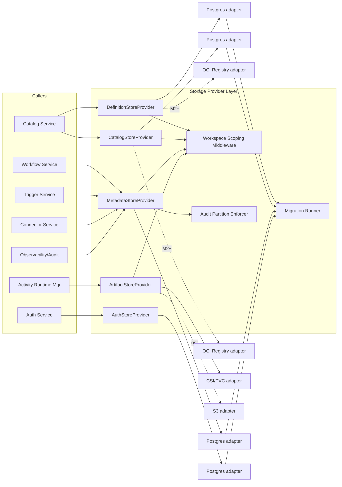
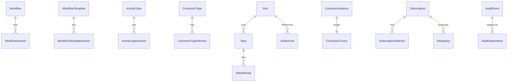

# Component Design: Storage Provider Layer

Slug: `storage-provider-layer`
Last Updated: 2026-05-17
Version: 1
Status: Draft

## Responsibility

The Storage Provider Layer (SPL) defines five small, stable interfaces — `DefinitionStoreProvider`, `CatalogStoreProvider`, `MetadataStoreProvider`, `ArtifactStoreProvider`, `AuthStoreProvider` — and routes all platform persistence through them. The rest of Custos has no compile-time or run-time dependency on Postgres, OCI registries, S3, or any other concrete backend. Adapters implement the interfaces; the platform is unaware of them.

SPL also owns the migration runner that gates platform startup against schema-revision compatibility.

## Boundaries

- Owns:
  - The five provider interface contracts (operation shapes, error taxonomy, immutability rules).
  - The workspace-scoping middleware that enforces multi-tenant boundaries on every call to the four workspace-scoped interfaces (`AuthStoreProvider` is exempt — it owns the workspace records themselves).
  - The audit partition enforcer that keeps audit physically separate from ops state.
  - The migration runner and the schema-revision negotiation that gates startup.
  - The audit outbox protocol (writer side) — readers belong to Observability Service.
  - The artifact backref table living inside `MetadataStoreProvider` (so backends stay dumb).
- Does NOT own:
  - Business-level validation of documents written through the interfaces (Catalog Service normalizes workflow/template documents; SPL stores them as opaque JSON).
  - Audit consumption / shipping / retention enforcement (Observability Service tails the outbox and applies retention).
  - Concurrency policy for runtime state (Workflow Service decides last-writer-wins on `Run.status`; SPL only provides the primitives).
  - Cursor model semantics (Connector Service owns `events.pull.cursorEncoding` and the migration flow); SPL only provides the row-level lease.

## Internal Structure



## Data Models

### Provider-owned entities



### Entity-to-interface map

| Interface | Entities |
|---|---|
| DefinitionStoreProvider | `Workflow`, `WorkflowVersion`, `WorkflowTemplate`, `WorkflowTemplateVersion` |
| CatalogStoreProvider | `ActivityType`, `ActivityTypeVersion`, `ConnectorType`, `ConnectorTypeVersion` |
| MetadataStoreProvider | `Run`, `Step`, `StepAttempt`, `ConnectorInstance`, `ConnectorCursor`, `Subscription`, `SubscriptionSelector`, `ResumeSubscription`, `DedupKey`, `Schedule`, `ArtifactUse` (backref), `IdempotencyRecord`, `DeviceCodeSession`, `AuditEvent`, `AuditOutboxRow` |
| ArtifactStoreProvider | `ArtifactBlob` (content-addressed; metadata lives in MetadataStore's `ArtifactUse` backref) |
| AuthStoreProvider | `Tenant`, `Workspace`, `Principal` (User / ServiceAccount discriminator), `OidcIdentity`, `ServiceToken`, `Role`, `Permission`, `RoleBinding` |

### Tenancy

Every row in the workspace-scoped interfaces (`DefinitionStoreProvider`, `CatalogStoreProvider`, `MetadataStoreProvider`, `ArtifactStoreProvider`) carries `workspaceId NOT NULL`. The `Workspace` and `Tenant` tables themselves are owned by `AuthStoreProvider` and are exempt from workspace-scoping middleware — they describe workspaces rather than living inside one. Cross-workspace reads on the four workspace-scoped interfaces are not expressible (see Workspace Scoping Middleware).

## Public Interface

All interfaces use absolute `workspaceId` as the first argument on every method. Methods omitted from a given interface are not callable (no "escape hatch" methods).

### DefinitionStoreProvider

| Method | Semantics |
|---|---|
| `putWorkflowVersion(workspaceId, workflowId, version, normalizedDoc, derivedFromTemplateVersionId?)` | Write-once. 409 if `(workflowId, version)` exists. |
| `getWorkflowVersion(workspaceId, workflowId, version)` | Returns the normalized document plus metadata. 404 if absent. |
| `listWorkflowVersions(workspaceId, workflowId, filter?)` | Paginated. Filter by `deprecated`, `publishedAt` range. |
| `getLatestWorkflowVersion(workspaceId, workflowId)` | Convenience for callers that don't care about specific versions. |
| `setWorkflowDeprecated(workspaceId, workflowId, bool)` | Mutates the parent `Workflow` row only — versions remain immutable. |
| `putWorkflowTemplateVersion(workspaceId, templateId, version, normalizedDoc, derivedFromWorkflowVersionId?)` | Write-once mirror of the workflow version semantics. |
| `getWorkflowTemplateVersion(...)`, `listWorkflowTemplateVersions(...)`, `setWorkflowTemplateDeprecated(...)` | Mirror of the workflow operations. |

**Immutability rule**: any call that mutates an existing version row returns `409 ImmutableViolation`. Even an idempotent re-put of identical content returns 409 — callers must check existence first if they want idempotence.

### CatalogStoreProvider

| Method | Semantics |
|---|---|
| `putActivityTypeVersion(namespace, type, version, digest, normalizedManifest)` | `(namespace, type, version)` is the primary key. **Digest mismatch on same key → 409 ConflictDigest**. Identical digest re-put → 200 (idempotent). |
| `putConnectorTypeVersion(type, version, digest, normalizedManifest)` | Same semantics with `(type, version)` as the key. |
| `resolve(namespace, type, semverRange)` | Returns the latest non-deprecated version matching the range. Returns `null` if none. |
| `getActivityTypeVersion(...)`, `getConnectorTypeVersion(...)` | Exact-version lookup. |
| `listActivityTypeVersions(...)`, `listConnectorTypeVersions(...)` | Paginated. |
| `setActivityTypeDeprecated(...)`, `setConnectorTypeDeprecated(...)` | Affects resolution but not historical lookups. |

Catalog Service performs capability-regression and digest-pinning checks before calling `put*`; SPL stores whatever it receives. The 409 conflict is the **only** integrity rule SPL enforces on this interface.

### MetadataStoreProvider

Grouped by entity family. All methods take `workspaceId` first (omitted from signatures here for brevity).

**Runtime execution state**

| Method | Notes |
|---|---|
| `putRun(run)` / `updateRunStatus(runId, status, reason?)` | Status updates are last-writer-wins; no optimistic lock. Audit captures every transition. |
| `getRun(runId)`, `listRuns(filter)` | |
| `appendStep(runId, step)` | One row per step instance. |
| `appendStepAttempt(runId, stepId, attempt)` | **Append-only**; updates return 409. Carries the `(runId, stepId, attempt)` idempotency triple. |
| `getStepAttempts(runId, stepId)` | Returns attempts in order. |

**Trigger Service state**

| Method | Notes |
|---|---|
| `putSubscription(subscription)`, `updateSubscriptionState(id, state)` | |
| `appendSubscriptionSelector(subscriptionId, selector)` | Append-only. |
| `putResumeSubscription(rs)`, `deleteResumeSubscription(id)` | TTL-driven sweep handled by Trigger Service. |
| `putDedupKey(key, ttl)` | Returns `Duplicate` if `(workspaceId, key)` exists within TTL. |
| `putSchedule(schedule)`, `updateScheduleNextFire(id, nextFireAt)` | |

**Connector pull cursors**

| Method | Notes |
|---|---|
| `acquireCursorLease(instanceId, holderId, ttlSeconds)` → `(cursor, leaseHandle)` \| `LeaseBusy` | Abstract primitive. Postgres adapter implements via `SELECT … FOR UPDATE`. Other adapters MAY use CAS as long as single-writer semantics are preserved. |
| `commitCursor(leaseHandle, newValue, newAdvancedAt)` | Fails with `LeaseExpired` if the lease TTL has passed or the holder mismatches. |
| `releaseCursorLease(leaseHandle)` | Explicit early release. Idempotent. |
| `readCursor(instanceId)` | Read-only; for operator UI. Does not acquire a lease. |
| `rewindCursor(instanceId, newValue, actor, reason)` | Operator-initiated. Records `cursor.rewound` audit event. Does not require an active lease (cursor must be locked-free or its lease expired). |

**Artifact backrefs**

| Method | Notes |
|---|---|
| `appendArtifactUse(runId, stepId, artifactRef)` | Append-only. Records that a run cited an artifact. |
| `listArtifactUses(artifactId)` | Used by the retention sweeper to refuse deletion of refs cited by live runs. |

**Gateway short-lived state**

| Method | Notes |
|---|---|
| `reserveIdempotencyRecord(key, requestHash, ttlSeconds)` → `Reserved \| ExistingCompleted(response) \| ExistingInFlight \| KeyReuse` | Atomic reserve-or-read. `key = (workspaceId, principalId, route, idempotencyKey)`. `ExistingCompleted` returns the stored `responseSnapshot` when `requestHash` matches; `KeyReuse` when the hash differs from the stored row; `ExistingInFlight` when status is still in-progress. |
| `completeIdempotencyRecord(key, responseSnapshot)` | Marks an in-progress reservation completed and stores the response. Fails with `NotReserved` if the row is not in-progress under this caller. |
| `deleteExpiredIdempotencyRecords(before)` | Sweeper-only. |
| `putDeviceCodeSession(deviceCode, userCode, issuerAlias, expiresAt)` | Creates a pending OIDC device-code session. `userCode` is unique within its TTL window. |
| `getDeviceCodeSessionByDeviceCode(deviceCode)` / `getDeviceCodeSessionByUserCode(userCode)` | Polling and landing-page lookups. |
| `completeDeviceCodeSession(deviceCode, tokenBundle)` | Called by the gateway after the user finishes the browser flow; subsequent polls return the bundle. |
| `deleteExpiredDeviceCodeSessions(before)` | Sweeper-only. |

**Audit (writer side)**

| Method | Notes |
|---|---|
| `appendAudit(event)` | **Writes to the audit outbox table in the same transaction as the state mutation** when the caller provides a transaction handle (see Transaction Model below); otherwise standalone. Returns void; no read handle. |
| `queryAudit(filter)` | Read-only. Used by Observability Service and the Connector Service lease-audit wrapper. |

### ArtifactStoreProvider

| Method | Semantics |
|---|---|
| `put(workspaceId, content, mediaType?)` | Computes `digest`, `size`. Returns `{id, digest, mediaType, size}`. Same digest → returns existing `id` (content-addressed; idempotent). |
| `get(workspaceId, id)` → stream | 404 if absent. Workspace mismatch returns 404 (never reveals cross-workspace existence). |
| `head(workspaceId, id)` → `{digest, mediaType, size}` | Lightweight existence + metadata check. |
| `delete(workspaceId, id)` | Reserved for the retention sweeper. Adapters MAY refuse if invoked from non-sweeper contexts; SPL exposes a single sweeper-only entry point. |

The artifact's user-facing metadata (`runId`, `stepId`, `name`) lives in `MetadataStoreProvider.appendArtifactUse`. The blob store itself only knows `{workspaceId, id, digest, mediaType, size, content}`.

### AuthStoreProvider

Persists the identity, tenancy, and RBAC entities owned by Auth Service (COMP-002). This interface does **not** take `workspaceId` as a leading argument — its entities either describe workspaces (`Tenant`, `Workspace`) or scope themselves via an explicit `scope` field on the row (`RoleBinding.scope ∈ {workspaceId, tenantId, "*"}`). The workspace-scoping middleware does not wrap this interface; Auth Service is the sole caller and enforces its own authorization rules before invoking it.

**Tenancy and workspace records**

| Method | Notes |
|---|---|
| `putTenant(tenant)` / `getTenant(id)` / `listTenants(filter)` | |
| `putWorkspace(workspace)` / `getWorkspace(id)` / `listWorkspaces(filter)` | `workspace.tenantId` is a required FK. |

**Principals (User + ServiceAccount discriminated union)**

| Method | Notes |
|---|---|
| `putPrincipal(principal)` / `getPrincipal(id)` / `listPrincipals(filter)` | `principal.kind ∈ {"user", "serviceAccount"}` discriminates the row variant. |
| `disablePrincipal(id, actor, reason)` | Soft-disable; preserves audit trail. |

**OIDC identity binding**

| Method | Notes |
|---|---|
| `putOidcIdentity(issuer, subject, userId)` | Write-once. 409 if `(issuer, subject)` already bound. |
| `getOidcIdentity(issuer, subject)` → `userId \| None` | Verifier path. |
| `listOidcIdentitiesForUser(userId)` | |

**Service tokens**

| Method | Notes |
|---|---|
| `putServiceToken(token)` | Stores `{tokenId, serviceAccountId, hash, issuedAt, expiresAt, revokedAt?}`. Plaintext is never persisted; Auth Service hashes before calling. |
| `getServiceTokenByHash(hash)` → `ServiceToken \| None` | Verifier path (hot path; adapter should index on `hash`). |
| `revokeServiceToken(tokenId, actor, reason)` | Sets `revokedAt`; never deletes. |
| `listServiceTokensForServiceAccount(serviceAccountId)` | |
| `deleteExpiredServiceTokens(before)` | Sweeper-only; physically removes rows past expiry + retention. |

**Permissions and roles**

| Method | Notes |
|---|---|
| `upsertPermission(permission)` | Called at platform startup for every declared permission. `(name)` is the primary key. |
| `listPermissions()` | |
| `putRole(role)` / `getRole(id)` / `listRoles()` | v1 roles are seeded at startup; mutation API reserved for M2+ custom roles. |

**Role bindings**

| Method | Notes |
|---|---|
| `putRoleBinding(binding)` | `binding.scope ∈ {workspaceId, tenantId, "*"}`. Adapter MUST index on `(principalId, scope)` for the authorization hot path. |
| `deleteRoleBinding(bindingId, actor, reason)` | |
| `listRoleBindingsForPrincipal(principalId, scopes)` | Returns all bindings for the principal at the supplied set of scopes (used by `authorize`). |
| `listRoleBindingsForScope(scope, filter)` | Admin views. |

**Immutability and audit**

`OidcIdentity` rows are write-once (rebinding requires explicit delete + re-put with audit trail). `ServiceToken.hash` is immutable. All mutating methods participate in the audit outbox via the same transaction handle contract as `MetadataStoreProvider` (`appendAudit` is reachable from any provider's transaction).

## Cross-cutting concerns

### Workspace Scoping Middleware

Every provider method on the four workspace-scoped interfaces (`DefinitionStoreProvider`, `CatalogStoreProvider`, `MetadataStoreProvider`, `ArtifactStoreProvider`) is wrapped in middleware that:

1. Requires `workspaceId` as the first argument (type system enforces).
2. Adapters MUST add `workspaceId = ?` to every `WHERE` clause; this is enforced by a static check on adapter code (SPL ships a lint rule that fails CI for any SQL query missing the workspace filter).
3. Cross-workspace operations are not expressible: there is no `*` workspace, no admin bypass, no cross-workspace join in the interface contract.

`AuthStoreProvider` is exempt because its entities define workspaces and span tenancy levels by design. Auth Service is the sole caller and is responsible for authorization on every method invocation before reaching the adapter.

### Audit Partition Enforcer

Audit data is **physically separate** from ops state:

- `AuditOutboxRow` and the materialized `AuditEvent` table live in their own Postgres schema (`custos_audit`), distinct from `custos_state`.
- The DDL marks the table append-only via:
  - No `UPDATE` or `DELETE` grants to the platform role.
  - A `BEFORE UPDATE` / `BEFORE DELETE` trigger that raises an exception.
- Retention enforcement is performed only by a dedicated `audit_retention` role used by Observability Service's retention worker (ADR-010).
- Audit retention is configured independently from ops-state retention (default 90 days per REQ-041; configurable upward without bound).

### Audit Write Path (Outbox Pattern)

The audit write path avoids dual-write inconsistency between state and audit:

```mermaid
sequenceDiagram
    participant Caller as Caller (e.g. Workflow Service)
    participant Meta as MetadataStoreProvider
    participant Pg as Postgres adapter
    participant Obs as Observability Service
    Caller->>Meta: withTransaction(tx => { appendStep(tx,...); appendAudit(tx, evt); })
    Meta->>Pg: BEGIN
    Meta->>Pg: INSERT step
    Meta->>Pg: INSERT audit_outbox
    Meta->>Pg: COMMIT
    Note over Obs: Tails audit_outbox (LISTEN/NOTIFY or polling)
    Obs->>Pg: SELECT * FROM audit_outbox WHERE delivered_at IS NULL
    Obs->>Pg: ship to audit pipeline, mark delivered
```

`appendAudit` accepts an optional transaction handle; when present, the outbox insert participates in the caller's transaction. Failure of the audit write rolls back the state mutation. Observability Service is the sole consumer of the outbox.

### Transaction Model

**No cross-interface transactions.** A caller can wrap multiple calls on a single provider in `withTransaction(provider, fn)` and they share atomicity. Calls across `MetadataStoreProvider` and `DefinitionStoreProvider` (for example) do not share atomicity, even when both happen to be backed by the same Postgres instance.

Rationale:
- The interfaces deliberately abstract storage; promising cross-interface atomicity would commit us to "all adapters share a backend".
- The audit outbox pattern means audit is intra-provider transactional (same as the state mutation), which is the only cross-concern atomicity callers have asked for.

Adapter shape:

```python
provider.withTransaction(lambda tx: (
    provider.appendStep(tx, workspaceId, runId, step),
    provider.appendStepAttempt(tx, workspaceId, runId, stepId, attempt),
    provider.appendAudit(tx, evt),
))
```

The transaction handle is opaque to callers; passing it to a different provider raises `InvalidTransactionHandle`.

### Lease Primitive Abstraction

`acquireCursorLease` / `commitCursor` are defined abstractly:

> A successful `acquireCursorLease` guarantees that no other call to `commitCursor` for the same `instanceId` will succeed until either the lease TTL elapses or the holder calls `releaseCursorLease`. If `commitCursor` is called after the TTL has elapsed, it MUST fail with `LeaseExpired`.

Adapter implementations:
- **Postgres adapter**: `BEGIN; SELECT * FROM connector_cursor WHERE instance_id = ? FOR UPDATE NOWAIT; …; UPDATE … WHERE instance_id = ? AND lease_holder = ? AND lease_expires_at > now(); COMMIT;`
- **Future backends**: any CAS-with-fencing-token mechanism satisfies the contract.

Connector Service code must not assume `FOR UPDATE` semantics; it interacts only with the abstract primitive.

### Migration Runner

Each interface has a monotonically increasing **schema revision number** owned by SPL. Examples:

| Interface | Revision | Description |
|---|---|---|
| MetadataStoreProvider | 1 | initial v1 schema |
| MetadataStoreProvider | 2 | adds `ConnectorCursor.encoding` |
| MetadataStoreProvider | 3 | adds `IdempotencyRecord` and `DeviceCodeSession` entities (API Gateway short-lived state) |
| DefinitionStoreProvider | 1 | initial v1 schema |
| AuthStoreProvider | 1 | initial v1 schema (tenants, workspaces, principals, OIDC identities, service tokens, roles, permissions, role bindings) |

Each adapter declares the set of revisions it implements at registration time:

```python
provider.declaredRevisions  # → {"MetadataStoreProvider": [1, 2], "DefinitionStoreProvider": [1]}
```

At platform startup:

1. SPL inspects the adapter's declared revisions for each interface it implements.
2. SPL compares against the platform's **required revision** for the running build.
3. **If any required revision is missing for any active interface, the platform refuses to start** and logs `MigrationRequired` listing the gap.
4. The migration runner is invoked explicitly via a platform admin command (`custos migrate up`); the platform never auto-migrates on startup.

This is the v1 policy. Read-only fallback mode is explicitly **not** supported in v1 (would be a footgun: callers can't tell that writes silently fail).

Migrations are forward-only in v1. Down-migrations require explicit operator backup-and-restore.

## Configuration

| Variable | Required | Default | Description |
|---|---|---|---|
| `CUSTOS_DEFINITION_STORE` | Yes | `postgres` | Adapter identifier for DefinitionStoreProvider. |
| `CUSTOS_CATALOG_STORE` | Yes | `postgres` | Adapter identifier for CatalogStoreProvider. |
| `CUSTOS_METADATA_STORE` | Yes | `postgres` | Adapter identifier for MetadataStoreProvider. |
| `CUSTOS_ARTIFACT_STORE` | Yes | `csi-pvc` | Adapter identifier for ArtifactStoreProvider. |
| `CUSTOS_AUTH_STORE` | Yes | `postgres` | Adapter identifier for AuthStoreProvider. |
| `CUSTOS_POSTGRES_DSN` | Conditional | — | Required when any Postgres adapter is active. |
| `CUSTOS_AUDIT_SCHEMA` | No | `custos_audit` | Postgres schema for the audit partition. |
| `CUSTOS_STATE_SCHEMA` | No | `custos_state` | Postgres schema for ops state. |
| `CUSTOS_ARTIFACT_PVC` | Conditional | — | Required when `csi-pvc` adapter is active. |
| `CUSTOS_S3_BUCKET` | Conditional | — | Required when `s3` adapter is active. |
| `CUSTOS_MIGRATION_POLICY` | No | `strict` | `strict` (refuse to start on missing revision). `permissive` is not implemented in v1. |

## Dependencies

| Dependency | Type | Purpose |
|---|---|---|
| Postgres 14+ | Runtime | v1 default backend for Definition/Catalog/Metadata stores. |
| CSI driver in cluster | Runtime | v1 default backend for ArtifactStore. |
| S3-compatible store (optional) | Runtime | Alternative ArtifactStore adapter. |
| `psycopg` / `asyncpg` | Build | Postgres driver. |

## Failure Modes

| Failure | Surface | Caller expectation |
|---|---|---|
| `ImmutableViolation` (409) | DefinitionStore, CatalogStore (digest mismatch), MetadataStore (StepAttempt re-write) | Caller may retry only after consulting the existing row. |
| `LeaseBusy` | MetadataStore cursor lease | Caller waits and retries on its own schedule. |
| `LeaseExpired` | `commitCursor` | Caller MUST discard the work it did under the lease and re-acquire. |
| `MigrationRequired` (startup) | Platform | Operator runs `custos migrate up` and restarts. |
| `InvalidTransactionHandle` | Cross-provider transaction misuse | Programming error; not retryable. |
| `WorkspaceMismatch` | Any | Returned as 404 (never disclose cross-workspace existence). |
| `BackendUnavailable` | Any | Transient; caller retries with backoff. Each adapter MUST classify its driver errors into either `BackendUnavailable` (transient) or a domain failure (terminal). |

## Open TODOs

- [ ] Define exact schema-revision policy for adapter upgrades that span multiple revisions in one platform release.
- [ ] Specify the audit outbox draining contract (LISTEN/NOTIFY vs polling cadence, batch size, redelivery guarantees) when Observability Service detailed design starts.
- [ ] Specify the static lint rule that enforces `workspaceId` on every adapter query (tooling task; M1 implementation track).
- [ ] Add a conformance test suite skeleton that any adapter must pass.

## Open Questions

_(none — all v1 design questions resolved this session.)_

## Change History

| Date | Change | GitHub Issue |
|---|---|---|
| 2026-05-17 | Initial component design: four provider interfaces (Definition/Catalog/Metadata/Artifact), workspace-scoping middleware, audit partition enforcer with outbox pattern, abstract lease primitive, migration runner with `strict` startup policy, M2+ deferral of OCI-registry adapter, MetadataStore-owned artifact backrefs | #64 |
| 2026-05-17 | Add `AuthStoreProvider` interface for Auth Service persistence (tenants, workspaces, principals, OIDC identities, service tokens, roles, permissions, role bindings). Exempt from workspace-scoping middleware. Adds `CUSTOS_AUTH_STORE` config and migration revision `AuthStoreProvider:1`. | #66 |
| 2026-05-17 | Add `IdempotencyRecord` and `DeviceCodeSession` entities to `MetadataStoreProvider` for API Gateway short-lived state. Adds atomic `reserveIdempotencyRecord`/`completeIdempotencyRecord` for write-endpoint dedup, and device-code-session CRUD for the OIDC device-code flow. Bumps `MetadataStoreProvider` revision to 3. | #70 |
