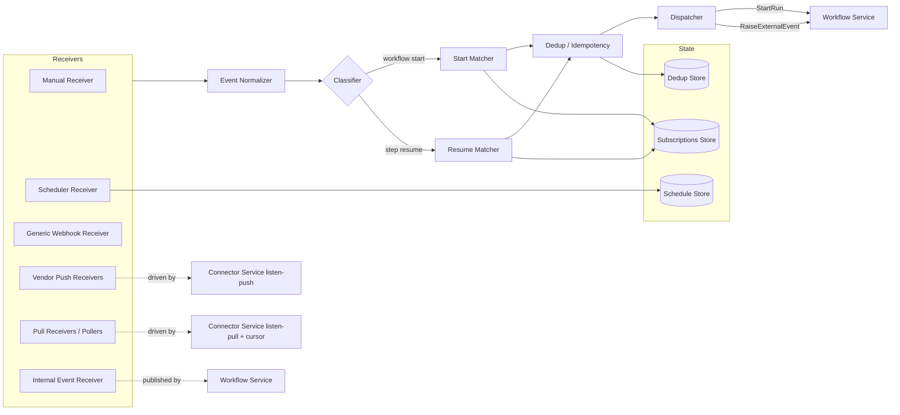
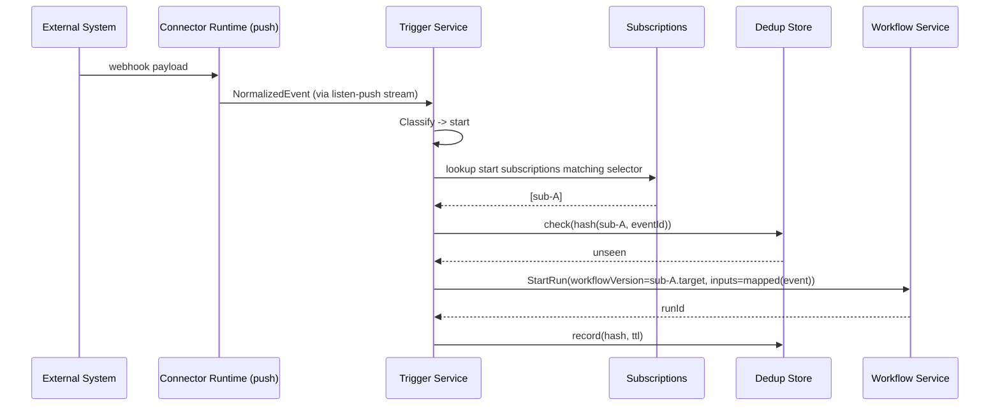
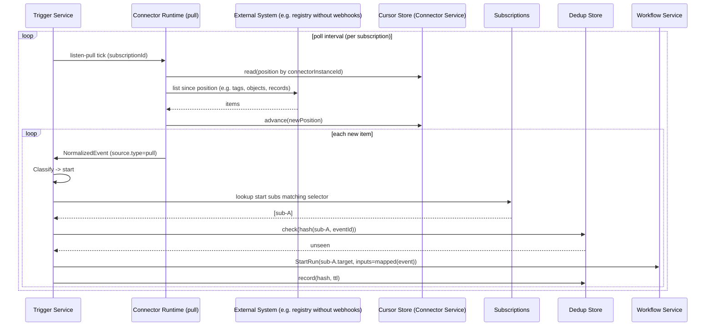
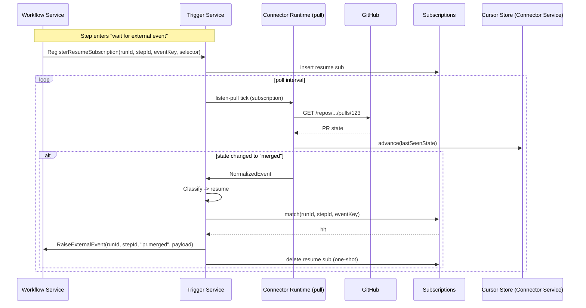
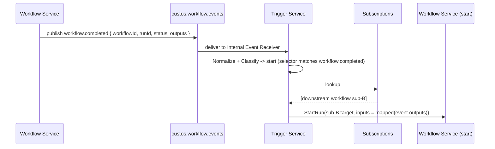
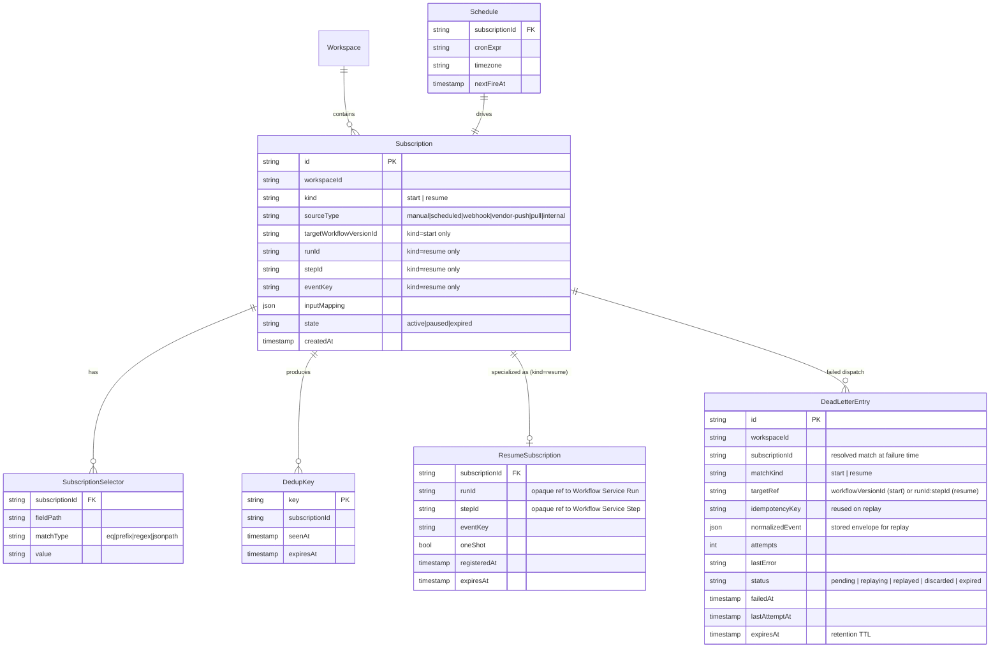

# Component Design: Trigger Service

Slug: `trigger-service`
Last Updated: 2026-06-04
Version: 7
Status: Draft

## Responsibility

The Trigger Service is the platform's **event ingestion and dispatch broker**. It receives signals from all sources that can cause work to happen — humans (manual), the clock (schedules), external systems (webhooks, pub/sub, polling), and other workflows (internal events) — normalizes them, deduplicates them, correlates them to either a workflow definition or an in-flight run+step, and dispatches them to the Workflow Service.

It owns ingestion. It does **not** own orchestration control flow.

> **M1 implementation note (added 2026-05-18):** this document defines the **v1 contract** for all six source categories (manual, scheduled, generic webhook, vendor push, pull/poll, internal). Implementation follows the requirements timeline: M1 ships the **manual API trigger** only (REQ-004); scheduled (REQ-005), registry webhook (REQ-006), generic webhook, vendor push, polling (REQ-074), and internal workflow-to-workflow (REQ-080) sources are contract-locked — their tables and dispatcher arms exist in the v1 schema — but their receivers are stubbed until M2. Dual-purpose start/resume routing (REQ-081) is contract-locked in M1 and goes live in M2.

## Boundaries

- **Owns**:
   - Trigger configuration (subscriptions tying sources to target workflows).
   - Resume subscriptions (in-flight `(runId, stepId)` waiting on an external signal).
   - Receiver runtime for manual, scheduled, generic webhook, vendor push, polling, and internal sources.
   - Event normalization, classification, matching, dedup, and dispatch.
   - Schedule state for cron-based triggers, persisted via `MetadataStoreProvider`.
   - Subscription, dedup, and resume-subscription state.

- **Does NOT own**:
   - Connector pull cursors. Pull cursors are owned by the Connector Service and keyed per `ConnectorInstance` (see Connector Service design § Cursor Ownership). Pull Receivers drive `listen(mode=pull)` against the Connector Service and consume the normalized events it emits; the Connector Service reads and advances the cursor against the upstream API on the platform's behalf.
   - Orchestration state machine, retries, fan-out, approval gates — those remain in Workflow Service (ADR-007).
   - Connector plugin loading, credential resolution, or context issuance — those belong to Connector Service. Vendor push receivers and pollers are *driven by* connector `listen()` (ADR-013) but the runtime host is Trigger Service.
   - Activity execution — Activity Runtime Manager.
   - Audit storage — events are emitted to Observability/Audit, not stored here.

## Internal Structure



Receivers are uniform in shape: each accepts source-specific input and emits a `NormalizedEvent` onto the internal Dapr Pub/Sub topic `custos.triggers.normalized`. From there a single linear pipeline (Classify → Match → Dedup → Dispatch) processes every event regardless of origin.

### Module responsibilities

| Module | Responsibility |
|---|---|
| Manual Receiver | Accepts `POST /v1/workspaces/{ws}/triggers/{id}:fire` from API Gateway; emits a normalized event with `source.type = manual`. |
| Scheduler Receiver | Owns cron evaluation per active schedule; fires normalized events at scheduled times. Uses `Schedule Store` for the durable schedule set. |
| Generic Webhook Receiver | Accepts inbound webhooks forwarded by the API Gateway pass-through (`POST /v1/webhooks/{connectorInstanceId}`); **delegates** HMAC/token verification to the Connector Service, which owns the per-instance signing material (see § Webhook Signature Verification), then **de-multiplexes** to all matching subscriptions on that connector instance (selector + payload match). Webhook URLs are connector-instance-scoped, not subscription-scoped — one URL is shared by all subscriptions attached to a given instance. Emits a normalized event per matched subscription with raw body + headers. |
| Vendor Push Receivers | Host process for connector `listen(mode=push)` streams. Receives push events from connector plugins via the Connector Service's listen channel. |
| Pull Receivers / Pollers | Host process for connector `listen(mode=pull)` streams. Drives interval polls per configured pull subscription; the Connector Service reads and advances its own per-instance cursor before returning normalized events to the receiver. |
| Internal Event Receiver | Subscribes to `custos.workflow.events` topic where Workflow Service publishes workflow lifecycle events (`workflow.completed`, `workflow.failed`, custom emit). Emits them as normalized events. |
| Event Normalizer | Converts source-specific payloads into the `NormalizedEvent` schema. |
| Classifier | Routes normalized events to Start Matcher and/or Resume Matcher. Both can match (e.g. a `workflow.completed` event starts a chained workflow *and* resumes a parent waiting on its child). |
| Start Matcher | Finds all `Subscription` rows of kind `start` whose selector matches the event. |
| Resume Matcher | Finds all `Subscription` rows of kind `resume` whose `(runId, stepId, eventKey)` matches the event. |
| Dedup / Idempotency | Computes dedup key = `hash(subscriptionId, source.eventId)`; rejects duplicates within retention window. |
| Dispatcher | For start matches: calls Workflow Service `StartRun(workflowVersionId, inputs)`. For resume matches: calls Workflow Service `RaiseExternalEvent(runId, stepId, eventName, payload)`. Retries on transient errors with exponential backoff; on retry exhaustion the event is written to the durable dead-letter store for operator replay (see § Dead-Letter Handling & Replay). |

## Key Operations

### Operation: Start workflow from external push event



### Operation: Start workflow from polled external system



This is the polling fallback for sources without reliable push (REQ-079). The cursor lives in the Connector Service (one per `ConnectorInstance`, not per subscription) and is advanced by the Connector Runtime against the upstream API before the events are handed off. The cursor advances *before* dispatch is confirmed, but the per-subscription dedup key (still owned by Trigger Service) prevents duplicate run starts on cursor replay after a crash.

### Operation: Resume in-flight activity from polled state change



### Operation: Internal workflow-to-workflow trigger



## Data Models



**Cross-service references are scalar IDs, not ER relationships.** `ResumeSubscription.runId` and `ResumeSubscription.stepId` are opaque identifiers that reference the Workflow Service-owned `Run` and `Step` entities (COMP-003). The Trigger Service holds no foreign key to those tables and never reads them — the only interaction is via the `RegisterResumeSubscription` / `CancelResumeSubscription` Internal RPCs and the dispatch back to `RaiseExternalEvent`. `Run` is intentionally not drawn as an entity in this diagram.

**Pull cursor state is intentionally not modeled here.** Pull cursors are owned by the Connector Service (`ConnectorCursor` keyed per `ConnectorInstance`) — one cursor per connector instance, shared across all subscriptions that pull from that instance. The Trigger Service has no cursor entity. See `design/components/connector-service/design.md` § Cursor Ownership for the authoritative model.

### NormalizedEvent schema (envelope)

```json
{
  "schemaVersion": "1",
  "eventId": "<source-provided or generated UUID>",
  "source": {
    "type": "vendor-push|pull|webhook|manual|scheduled|internal",
    "connectorInstanceId": "prod-registry",
    "subscriptionId": "sub-...",
    "vendor": "ghcr|github|cron|...",
    "occurredAt": "2026-05-16T12:00:00Z"
  },
  "kind": "registry.push|registry.tag|pr.merged|workflow.completed|cron.tick|manual.fire|...",
  "subject": "ghcr.io/acme/app@sha256:...",
  "data": { },
  "raw": { "headers": {}, "body": "..." }
}
```

`kind` is the platform-level event taxonomy used by selectors. `data` is the normalized, vendor-agnostic payload. `raw` is retained for audit and to let connector-aware activities re-parse if needed.

### Event Taxonomy (resolves TODO-001 / INCON-013)

`kind` strings are __dot-namespaced__ `<domain>.<event>` and validated against
`^[a-z][a-z0-9]*(\.[a-z][a-z0-9_]*)+$` — lowercase, at least one dot, the first
segment being the __domain__. Two tiers exist:

**Platform-owned domains** form a *closed* registry whose kind lists are
enumerated and validated exactly. This is the single source of truth for the
unified namespace (INCON-013); ARM (TODO-009) emits the `activity.*` strings
verbatim and Observability/Audit indexes events by the same `kind`.

| Domain | Canonical kinds | Emitter |
|---|---|---|
| `manual` | `manual.fire` | Manual Receiver (REQ-004) |
| `cron` | `cron.tick` | Scheduler Receiver (REQ-005, M2) |
| `webhook` | `webhook.received` | Generic Webhook Receiver (M2) |
| `workflow` | `workflow.started`, `workflow.completed`, `workflow.failed`, `workflow.cancelled` | Workflow Service (`custos.workflow.events`) |
| `run` | `run.started`, `run.completed`, `run.failed`, `run.cancelled` | Workflow Service run lifecycle |
| `step` | `step.started`, `step.succeeded`, `step.failed`, `step.retry_scheduled`, `step.waiting`, `step.resumed`, `step.timed_out` | Workflow Service step lifecycle |
| `activity` | `activity.scheduled`, `activity.started`, `activity.succeeded`, `activity.failed`, `activity.timed_out`, `activity.cancelled` | Activity Runtime Manager (ARM TODO-009) |
| `registry` | `registry.push`, `registry.tag`, `registry.delete` | Connector (OCI registry) |
| `pr` | `pr.opened`, `pr.merged`, `pr.closed`, `pr.review_requested`, `pr.synchronized` | Connector (SCM) |
| `scan` | `scan.started`, `scan.completed`, `scan.failed`, `scan.vulnerable` | Connector (security) |

**Connector-authored (vendor) domains** let plugin authors emit kinds under a
vendor-reserved domain declared in the connector manifest (e.g. `ghcr.*`,
`github.*`, `acr.*`). These are validated for **shape only**, not membership; a
vendor domain MUST NOT collide with a platform-owned domain.

The Internal Event Receiver maps the `custos.workflow.events` envelope `status`
field onto the `workflow.<status>` / `run.<status>` canonical kinds. The
registry is implemented as `custos_trigger/taxonomy.py` (`CANONICAL_EVENT_KINDS`,
`PLATFORM_DOMAINS`, `is_canonical_kind()`, `validate_kind()`) and may later be
promoted to a shared library so ARM/WF/Observability import rather than mirror
it (non-breaking, out of scope for M1). See change record
[`changes/2026-06-04-007-event-taxonomy.md`](changes/2026-06-04-007-event-taxonomy.md).

### Selector Language — CEL (resolves TODO-002)

A subscription **selector is a CEL boolean expression** evaluated by the shared
`custos-cel` sandboxed evaluator (ADR-011), giving full parity with the
`inputMapping` placeholders (`${{ … }}`) already used on triggers — one
expression language across the whole platform.

Selectors evaluate against a new `event` binding root that mirrors the
`NormalizedEvent` envelope: `event.kind`, `event.subject`,
`event.source.{type,connectorInstanceId,subscriptionId,vendor,occurredAt}`,
`event.data.*`, `event.raw.{headers,body}`. Enabling this requires an additive
extension to `custos-cel`: `event` joins `_ALLOWED_ROOTS` with a matching
`SchemaBindings.event` schema + `BindingScope.event` mapping. The same `event`
root powers trigger `inputMapping`.

Example:

```text
event.kind == "workflow.completed" && event.data.status == "succeeded"
```

Lifecycle:

1. **Authoring.** The YAML `selector:` block accepts either a CEL string or the
   legacy `field: matchType:value` sugar (`repository: prefix:ghcr.io/acme/`),
   which **desugars** to equivalent CEL
   (`event.data.repository.startsWith("ghcr.io/acme/")`). CEL is the canonical
   persisted form; `eq|prefix|regex|jsonpath` remain accepted at the API and
   lower to CEL before storage.
2. **Persistence.** Stored as a single `SubscriptionSelector` row with
   `matchType = "cel"`, `value = <cel expr>`, `fieldPath = ""` — the
   contract-locked SPL v1 schema is preserved; `cel` joins the existing
   match-type enum as the canonical value.
3. __Create / patch (fail-fast).__ `parse()` + `type_check()` against the
   `event` bindings; invalid CEL → `trigger.selector_invalid` (HTTP 422) before
   persistence. The typed AST is cached in-process by `(subscriptionId, exprHash)`.
4. __Match (hot path).__ `evaluate(typed_ast, BindingScope(event=…), clock)`
   under the per-evaluation timeout budget; a non-bool result →
   `trigger.selector_type_error` (no-match + audit); a timeout → no-match + audit.
5. **Resume selectors.** `RegisterResumeSubscription(selector=…)` is likewise a
   CEL expression (or `None` = match on event key alone); same
   compile-at-register, evaluate-at-match path.

See change record
[`changes/2026-06-04-006-selector-cel-parity.md`](changes/2026-06-04-006-selector-cel-parity.md).

## Public Interface

### REST API (mounted under API Gateway)

All paths are workspace-scoped and routed by the API Gateway under the `/v1/workspaces/{ws}/triggers/*` prefix. Webhook ingest is gateway-owned at `POST /v1/webhooks/{connectorInstanceId}` (connector-instance-scoped, not subscription-scoped) and is forwarded to this service after gateway-side pass-through processing (including TLS termination and other ingress handling defined by the API Gateway); the gateway does not add authn/call-context or perform signature verification for this route; signature verification is delegated to the Connector Service (the owner of the per-instance signing material — see § Webhook Signature Verification) and subscription demux happens here.

| Method | Path | Request | Response | Description |
|---|---|---|---|---|
| POST | `/v1/workspaces/{ws}/triggers` | `SubscriptionCreate` | `Subscription` | Create a start subscription (manual, scheduled, webhook, vendor-push, pull, internal). |
| GET | `/v1/workspaces/{ws}/triggers/{id}` | — | `Subscription` | Read one subscription. |
| PATCH | `/v1/workspaces/{ws}/triggers/{id}` | `SubscriptionPatch` | `Subscription` | Update state, selector, mapping, schedule. |
| DELETE | `/v1/workspaces/{ws}/triggers/{id}` | — | `204` | Remove subscription. |
| POST | `/v1/workspaces/{ws}/triggers/{id}:fire` | `{ inputs }` | `{ runId }` | Manual trigger; returns started run id. |
| GET | `/v1/workspaces/{ws}/triggers/deadletter` | — | `DeadLetterPage` | List dead-lettered dispatches (filters `subscriptionId`, `status`, `since`/`until`; paginated). Requires `trigger:admin`. |
| GET | `/v1/workspaces/{ws}/triggers/deadletter/{id}` | — | `DeadLetterEntry` | Inspect one entry (stored event + attempt/error history). Requires `trigger:admin`. |
| POST | `/v1/workspaces/{ws}/triggers/deadletter/{id}:replay` | — | `{ status }` | Re-dispatch the stored event via the Dispatcher; reuses the original `idempotencyKey`. Requires `trigger:admin`. |
| POST | `/v1/workspaces/{ws}/triggers/deadletter/{id}:discard` | `{ reason? }` | `204` | Mark the entry `discarded` (never replayed). Requires `trigger:admin`. |
| POST | `/v1/workspaces/{ws}/triggers/deadletter:replay` | `DeadLetterReplaySelector` | `{ accepted, rejected }` | Bulk replay by selector. Requires `trigger:admin`. |

Webhook ingest does not appear in this table because it is an unauthenticated gateway-owned route (`POST /v1/webhooks/{connectorInstanceId}`) that the gateway forwards to Trigger Service via Dapr invocation with no call-context. See the API Gateway design § Webhook Pass-through for the inbound contract; this service's § Generic Webhook Receiver delegates HMAC/token verification to the Connector Service (owner of the per-instance signing material) and owns subscription demux per connector instance.

### Internal RPC (Workflow Service ⇄ Trigger Service)

| Method | Direction | Purpose |
|---|---|---|
| `RegisterResumeSubscription(runId, stepId, eventKey, selector, ttl)` | WF → TS | Register a one-shot resume wait. Idempotent on `(runId, stepId, eventKey)` — re-registration returns the existing `subscriptionId` rather than creating a duplicate. On divergent `selector` between original and replay, original wins and TS emits a `resume.subscription.divergent` audit event. After `expiresAt` TS GCs the subscription; a re-registration after TTL expiry is treated as a fresh registration. See Workflow Service design § Resume Subscription Replay Protocol for the full WF-side protocol. |
| `CancelResumeSubscription(runId, stepId, eventKey)` | WF → TS | Cancel a wait (timeout, run cancelled). Idempotent — cancelling an unknown or already-expired key is a no-op. |
| `StartRun(workflowVersionId, inputs, idempotencyKey)` | TS → WF | Dispatch a workflow start. |
| `RaiseExternalEvent(runId, stepId, eventName, payload, idempotencyKey)` | TS → WF | Deliver a resume signal into Dapr Workflow. |

### Dapr Pub/Sub subscriptions

The Trigger Service's Internal Event Receiver consumes workflow lifecycle events via Dapr Pub/Sub. This is an **asynchronous, broker-mediated** interface — not a direct RPC. The Workflow Service publishes; Dapr buffers and retries delivery; the Trigger Service subscribes on its own schedule.

| Topic | Direction | Publisher | Subscriber | Purpose |
|---|---|---|---|---|
| `custos.workflow.events` | WF → Bus → TS | Workflow Service | Trigger Service Internal Event Receiver | Workflow lifecycle events (`workflow.completed`, `workflow.failed`, custom emitted events). Feeds the Internal Event Receiver for REQ-080 (internal workflow-to-workflow triggers) and REQ-081 (step-resume on workflow-lifecycle events). |

Message envelope (subset): `{ workflowVersionId, runId, status, outputs, occurredAt, … }`. Delivery semantics: **at-least-once** — Dapr retries on subscriber failure. The Trigger Service relies on its existing dedup store (`hash(subscriptionId, source.eventId)`) to absorb duplicates. Topic provisioning is a deployment-time Dapr component configuration; operators provisioning Dapr Pub/Sub for the platform must include `custos.workflow.events`.

### Declarative trigger syntax (in workflow YAML)

```yaml
spec:
  triggers:
    - type: manual

    - type: scheduled
      cron: "0 */6 * * *"
      timezone: UTC

    # Push mode: registry emits webhooks to us.
    # Selectors are CEL (§ Selector Language); the legacy `field: matchType:value`
    # sugar below desugars to `event.data.repository.startsWith("ghcr.io/acme/")`.
    - type: registry.push
      connector: ghcr-prod
      mode: push
      selector: event.data.repository.startsWith("ghcr.io/acme/")

    # Pull mode: registry has no reliable webhook; we poll it.
    # Same trigger type, same selector model — only `mode` and `pollInterval` differ.
    - type: registry.push
      connector: acr-prod
      mode: pull
      pollInterval: 5m
      selector: event.data.repository.startsWith("acme.azurecr.io/")

    # Pull mode against a non-registry source.
    - type: github.pr
      connector: github-acme
      mode: pull
      pollInterval: 1m
      selector: event.data.repo == "acme/app" && event.kind == "pr.merged"

    # Internal: another workflow's completion drives this one.
    - type: workflow.completed
      workflow: build-and-sign
      selector: event.kind == "workflow.completed" && event.data.status == "succeeded"
      inputMapping:
        image: ${{ event.data.outputs.image }}
```

`mode: pull` is available on **any** trigger type whose connector implements `listen(pull)`. The platform makes no distinction between "registry trigger" and "any other pollable source" at the pipeline level — that's a connector-author concern. `type: workflow.completed` is the first-class internal trigger surface for REQ-080.

## Scheduler Leader Election (REQ-005)

The Scheduler Receiver must fire each active schedule **exactly once** across all
Trigger Service replicas (REQ-005). Custos elects a single scheduler leader with a
**Postgres leader-lease row** held through `MetadataStoreProvider`, reinforced by a
per-fire idempotency key for defence in depth.

### Why Postgres, not a Kubernetes Lease or a Dapr lock

| Option | Verdict | Reason |
|---|---|---|
| **Postgres leader-lease row** | **Chosen** | Postgres is already a hard dependency (the Schedule Store lives in `MetadataStoreProvider`). No new infrastructure; an explicit, tunable TTL that matches the existing `TRIGGER_SCHEDULER_LEADER_LEASE_SECONDS`; connection-pooler-safe (PgBouncer); observable (`SELECT` the current holder); testable without a cluster; portable across the connected, eval, and air-gapped profiles. |
| Kubernetes `Lease` (`coordination.k8s.io`) | Rejected | Adds a hard Kubernetes-API dependency plus RBAC the service does not otherwise need, breaks local/non-cluster testing, and couples a storage concern to the control plane against the storage-provider abstraction. |
| Dapr distributed lock | Rejected | The Lock building block is alpha and needs a lock-store component (typically Redis). Redis is not a base-profile dependency — it is only an M2 option for the coordinated rate-limiter — so this would force new infra into the eval/air-gapped profiles. |

### Lease protocol

A single row in a `scheduler_leader` table (one logical scheduler group per
deployment) carries `holder_id`, `epoch`, and `expires_at`:

1. **Acquire / renew** — every replica runs a conditional update:
   `UPDATE scheduler_leader SET holder_id = :me, epoch = epoch + 1, expires_at = now() + :lease WHERE expires_at < now() OR holder_id = :me`.
   The replica whose statement affects the row (row count = 1) is the leader.
2. **Renew cadence** — the leader renews every `TRIGGER_SCHEDULER_LEADER_RENEW_SECONDS`
   (default `10`, ≈ lease ÷ 3) so a healthy leader never lapses; non-leaders retry
   acquisition on the same tick.
3. **Failover** — if the leader dies, its lease expires and the next replica
   acquires within `TRIGGER_SCHEDULER_LEADER_LEASE_SECONDS` (default `30`). `epoch`
   increments on every handover and acts as a **fencing token**.
4. **Only the leader evaluates cron** and enqueues normalized `cron.tick` events;
   non-leaders idle the scheduler loop but continue to serve all other receivers
   and API traffic.

### Exactly-once guarantee

Leader election bounds firing to one replica, but a paused-then-resumed old leader
could briefly overlap a new one during failover. To make double-firing impossible
even in that window, each fire is recorded under a deterministic idempotency key
`hash(scheduleId, plannedFireAt)` in the existing dedup store before dispatch; a
stale leader's duplicate collides on that key and is dropped (`trigger.deduped`).
Leader-lease (single firer) **plus** the `epoch` fence **plus** the per-fire dedup
key together deliver exactly-once without a distributed transaction.

## Webhook Signature Verification (REQ-006)

Inbound webhooks arrive on the gateway-owned, connector-instance-scoped route
`POST /v1/webhooks/{connectorInstanceId}` and are forwarded to this service's
Generic Webhook Receiver. Each request must be authenticated (HMAC signature or
bearer token) before any subscription is matched. This section fixes **who owns
the signing material** and **who verifies**.

### Decision

**Signing/verification material is owned by the Connector Service, per connector
instance — never by the Trigger Service per subscription.** The Generic Webhook
Receiver **delegates** verification to the Connector Service; raw signing secrets
never enter the Trigger Service.

| Question | Answer |
|---|---|
| Who owns the secret? | Connector Service, per `ConnectorInstance`, as part of the instance credential model (resolved via the Secret Bridge / an identity resolver such as `x-dapr-secret`). |
| Who verifies the request? | The Connector Service (the connector plugin's `push`-mode handler), because signature schemes are vendor-specific (e.g. GitHub `X-Hub-Signature-256`, Slack signing secret, generic HMAC). |
| What does the Trigger Service see? | Only the verified request outcome and the normalized event — never the secret. It owns subscription demux, dedup, and dispatch. |

### Why not per-subscription in the Trigger Service

1. **Instance-scoped URLs make per-subscription keys impossible.** One webhook URL is shared by every subscription on a `ConnectorInstance` (INCON-025), so the external system signs with a single instance secret; there is no per-subscription secret for it to use.
2. **The Connector Service already owns per-instance credentials** (Identity and Credential Model, Secret Bridge, `x-dapr-secret`) and the `listen(push)` webhook wiring via the Listen Manager. Duplicating a signing-secret store in the Trigger Service would fork secret management and contradict the platform rule that plaintext credentials never traverse service APIs — plugins receive opaque secret handles.
3. **Verification is vendor-specific**, so it belongs to the connector plugin (loaded by the Connector Service), not to the source-agnostic Trigger pipeline.

### Flow

1. The gateway forwards the raw body + headers to the Generic Webhook Receiver (no verification at the gateway).
2. The receiver calls the Connector Service verification seam for `connectorInstanceId` (raw body + headers); the Connector Service resolves the instance secret through the Secret Bridge and runs the plugin's verifier.
3. On **success** the receiver normalizes the event and de-multiplexes it to every matching subscription (selector + payload), then dedups and dispatches.
4. On **failure** the request is rejected with `401` and an audit event `trigger.webhook.rejected` (reason `signature_invalid` / `signature_missing`); no subscription is matched and no dispatch occurs.

### Rotation

Because the secret lives with the `ConnectorInstance`, rotation is a Connector-Service credential operation (update the referenced Kubernetes Secret / KMS entry) with no Trigger Service change and no per-subscription fan-out.

## Dead-Letter Handling & Replay

When the Dispatcher exhausts `TRIGGER_DISPATCH_MAX_RETRIES` against the Workflow
Service (or hits a non-retryable dispatch error), the event is **not dropped** —
it is written to a durable **dead-letter store** for operator inspection and
replay. This section fixes the destination, retention, and replay UX left open by
TS-TODO-005.

### Destination

Dead-lettered dispatches are persisted as `DeadLetterEntry` rows through the
`MetadataStoreProvider` (Postgres), workspace-scoped — the same durable store that
already holds `Subscription` / `Schedule` / `DedupKey` / `ResumeSubscription`. No
new infrastructure (no separate broker DLQ), and the rows are directly queryable,
which is exactly what the replay UX needs. Each entry stores the full
`NormalizedEvent` envelope, the resolved match (`subscriptionId`, `matchKind`
start/resume, target ref), the reused `idempotencyKey`, the attempt count, the
last error, and status.

### Lifecycle & status

`pending` → (`replaying`) → `replayed` | `discarded` | `expired`.

- **pending** — retries exhausted; awaiting operator action. Emits `trigger.deadletter.stored`.
- **replaying** — an operator replay is in flight (short-lived; guards concurrent replays of the same entry).
- **replayed** — a replay dispatch succeeded. Emits `trigger.deadletter.replayed`.
- **discarded** — operator chose not to replay, or replay attempts hit `TRIGGER_DEADLETTER_MAX_REPLAY_ATTEMPTS`. Emits `trigger.deadletter.discarded`.
- **expired** — retention TTL elapsed before resolution; the sweeper GCs it and emits `trigger.deadletter.expired`.

### Retention

A background sweeper deletes entries older than `TRIGGER_DEADLETTER_RETENTION_SECONDS`
(default 30 days) regardless of status, so the store cannot grow unbounded; terminal
(`replayed` / `discarded`) entries are kept until TTL for audit. Retention is
workspace-uniform in v1.

### Replay UX

Operators drive replay through workspace-scoped admin routes, all gated by a
`trigger:admin` permission via the gateway call-context:

- `GET …/triggers/deadletter` — list/filter (`subscriptionId`, `status`, `since`/`until`), paginated.
- `GET …/triggers/deadletter/{id}` — inspect the stored event + attempt/error history.
- `POST …/triggers/deadletter/{id}:replay` — re-inject the stored event into the Dispatcher.
- `POST …/triggers/deadletter/{id}:discard` — mark it `discarded`.
- `POST …/triggers/deadletter:replay` — bulk replay by selector.

### Replay semantics (exactly-once preserved)

Replay re-runs the normal Dispatcher path with the **original `idempotencyKey`**
(`StartRun` / `RaiseExternalEvent` are idempotent on it), so a replay can never
double-start a run even if a prior attempt partially reached the Workflow Service.
On dispatch **success** the entry moves to `replayed` and the dedup key is committed
(it was intentionally *not* committed at failure time — see § Failure Modes); on
**failure** the attempt count increments, a `trigger.deadletter.replay_failed` event
is emitted, and the entry stays `pending` until `TRIGGER_DEADLETTER_MAX_REPLAY_ATTEMPTS`
pins it to `discarded`. Because replay reuses the idempotency key, it is safe against
the dedup store: resume replays that target an already-completed step are absorbed by
the Workflow Service exactly as an ordinary duplicate would be.

## Configuration

| Variable | Required | Default | Description |
|---|---|---|---|
| `TRIGGER_WEBHOOK_BASE_URL` | Yes | — | External base URL for webhook receiver. |
| `TRIGGER_DEDUP_TTL_SECONDS` | No | `86400` | Dedup window. |
| `TRIGGER_POLLER_DEFAULT_INTERVAL_SECONDS` | No | `60` | Default pull interval when not specified per subscription. |
| `TRIGGER_RESUME_DEFAULT_TTL_SECONDS` | No | `604800` | Default expiry for resume subscriptions (7 days). |
| `TRIGGER_DISPATCH_MAX_RETRIES` | No | `5` | Max retries dispatching to Workflow Service. |
| `TRIGGER_FANOUT_MAX_DEPTH` | No | `16` | Max per-tenant fan-out depth before a dispatch is rejected as a loop (`trigger.loop.detected`). |
| `TRIGGER_SCHEDULER_LEADER_LEASE_SECONDS` | No | `30` | Scheduler leader-lease TTL (single-fire guarantee across replicas); failover bound. |
| `TRIGGER_SCHEDULER_LEADER_RENEW_SECONDS` | No | `10` | Scheduler leader-lease renew interval (≈ lease ÷ 3); the leader re-acquires on this cadence to avoid lapsing. |
| `TRIGGER_DEADLETTER_RETENTION_SECONDS` | No | `2592000` | Dead-letter entry retention before the sweeper GCs it (30 days). |
| `TRIGGER_DEADLETTER_MAX_REPLAY_ATTEMPTS` | No | `3` | Max operator-initiated replay attempts per entry before it is pinned to `discarded` (guards a poison event from looping). |

## Dependencies

| Dependency | Type | Purpose |
|---|---|---|
| Connector Service | Runtime | `listen(push)` / `listen(pull)` streams per connector instance (ADR-013); owns per-instance webhook signing material and verifies inbound webhook signatures on the Trigger Service's behalf (see § Webhook Signature Verification). |
| Workflow Service | Runtime | `StartRun`, `RaiseExternalEvent`, publisher of internal workflow events. |
| MetadataStoreProvider | Runtime | Persistence for Subscription, Schedule, DedupKey, ResumeSubscription, and DeadLetterEntry. (Pull cursors live with the Connector Service, not here.) |
| Dapr Pub/Sub | Runtime | Internal transport for `custos.triggers.normalized` and `custos.workflow.events`. |
| Observability/Audit | Runtime | Emit `trigger.matched`, `trigger.deduped`, `trigger.dispatched`, `resume.delivered`, and dead-letter (`trigger.deadletter.stored` / `.replayed` / `.replay_failed` / `.discarded` / `.expired`) audit events. |
| Auth Service | Runtime | Manual trigger RBAC. Webhook signing material is Connector-Service-owned (see § Webhook Signature Verification), not Auth-Service-issued. |

## Failure Modes

| Failure | Detection | Containment | Recovery |
|---|---|---|---|
| Workflow Service unreachable on dispatch | RPC timeout | Event remains in retry queue; dedup key not committed | Exponential backoff up to `TRIGGER_DISPATCH_MAX_RETRIES`, then the event is persisted to the durable dead-letter store (`trigger.dispatch.failed` + `trigger.deadletter.stored`) for operator inspection and replay (see § Dead-Letter Handling & Replay) |
| Duplicate inbound event | Dedup key hit | No dispatch | N/A |
| Poller falls behind | `nextFireAt < now - threshold` metric | Subscription marked `degraded`; alert | Operator increases interval or scales pod |
| Resume subscription expires before event arrives | TTL sweeper | Wait cancelled via `CancelResumeSubscription` callback | Workflow step takes its timeout branch (ADR-007) |
| Scheduler split-brain across replicas | Postgres leader-lease row (`epoch` fencing) | Only the lease holder fires schedules; non-leaders idle the scheduler loop | Lease auto-renews every `LEADER_RENEW_SECONDS`; on failover the next replica acquires within `LEADER_LEASE_SECONDS`; a stale leader's duplicate fire collides on the per-fire dedup key `hash(scheduleId, plannedFireAt)` |
| Internal event loop (workflow A starts B starts A) | Per-tenant fan-out depth counter | Reject dispatch when depth > `TRIGGER_FANOUT_MAX_DEPTH` | Audit `trigger.loop.detected`; operator inspects subscription graph |

## Open TODOs

- [ ] TODO-007: Selective `DedupKey` clear admin API (e.g. `POST /v1/workspaces/{ws}/triggers/dedup:clear` with selectors over `subscriptionId`, `connectorInstanceId`, `eventId`, time window) — needed so operators can re-fire downstream dispatches after a Connector Service cursor rewind without waiting for the dedup TTL window to expire. Deferred to M2+; v1 rewind procedure documents the workaround (wait for TTL, or rewind past the dedup window) (added 2026-05-18, #103).

## Closed TODOs

- [x] TODO-001: Define the platform event taxonomy. Resolved 2026-06-04 — § Event Taxonomy locks the closed platform-owned domain registry + the vendor-domain shape rule + the unified `kind` namespace (INCON-013). See [`changes/2026-06-04-007-event-taxonomy.md`](changes/2026-06-04-007-event-taxonomy.md), closes #18.
- [x] TODO-002: Decide selector language. Resolved 2026-06-04 — selectors are CEL boolean expressions over an `event` binding root (ADR-011 parity with `inputMapping`); legacy field/match-type tuples desugar to CEL. See [`changes/2026-06-04-006-selector-cel-parity.md`](changes/2026-06-04-006-selector-cel-parity.md), closes #19.
- [x] TODO-004: Specify resume-subscription registration as a Workflow Service responsibility in that component's design (cross-component) — REQ-081. Resolved 2026-05-17 by Workflow Service design (`design/components/workflow-service/design.md` § Step Resume on External Event and § Resume Subscription Replay Protocol). Idempotent re-registration semantics also documented on the TS Internal RPC table above.
- [x] TODO-003: Specify scheduler leader-election mechanism. Resolved 2026-08-28 — a **Postgres leader-lease row** held via `MetadataStoreProvider` (explicit TTL matching `TRIGGER_SCHEDULER_LEADER_LEASE_SECONDS`, `epoch` fencing token) elects a single scheduler; exactly-once is guaranteed by leader-lease + fencing + a per-fire dedup key `hash(scheduleId, plannedFireAt)`. Kubernetes `Lease` and Dapr locks rejected (new infra / control-plane coupling). See [`changes/2026-08-28-008-scheduler-leader-election.md`](changes/2026-08-28-008-scheduler-leader-election.md) — REQ-005, closes #20.
- [x] TODO-006: Owner of webhook signing keys. Resolved 2026-08-29 — signing/verification material is **owned by the Connector Service, per connector instance** (part of the instance credential model, resolved via the Secret Bridge / `x-dapr-secret`), not by the Trigger Service per subscription. The Generic Webhook Receiver **delegates** HMAC/token verification to the Connector Service so raw secrets never enter the Trigger Service, then demuxes verified events to subscriptions. Per-subscription keys are impossible anyway: webhook URLs are connector-instance-scoped (INCON-025). See [`changes/2026-08-29-009-webhook-signing-key-ownership.md`](changes/2026-08-29-009-webhook-signing-key-ownership.md) — REQ-006, closes #23.
- [x] TODO-005: Dead-letter handling and replay UX. Resolved 2026-08-29 — retry-exhausted dispatches are persisted as `DeadLetterEntry` rows via `MetadataStoreProvider` (Postgres), retained for `TRIGGER_DEADLETTER_RETENTION_SECONDS` (30 days), and driven through `trigger:admin` replay/discard/list routes under `/v1/workspaces/{ws}/triggers/deadletter`. Replay reuses the original `idempotencyKey` so exactly-once is preserved. See [`changes/2026-08-29-010-dead-letter-replay.md`](changes/2026-08-29-010-dead-letter-replay.md) — dispatch reliability, closes #22.

## Change History

| Date | Change | GitHub Issue |
|---|---|---|
| 2026-05-16 | Initial design covering ingestion broker model, workflow-start and step-resume paths, internal workflow-to-workflow triggers, polling for resume signals, schedule/cursor/dedup state, declarative YAML trigger types | #17 |
| 2026-05-17 | INCON-011: Pull cursors are owned by Connector Service per `ConnectorInstance`, not by Trigger Service per `Subscription`; removed `Cursor` entity from data model and state subgraph; updated sequence diagrams and dependencies | #36 |
| 2026-05-17 | INCON-014: `PublishWorkflowEvent` removed from Internal RPC table; replaced with explicit Dapr Pub/Sub Subscriptions section documenting `custos.workflow.events` topic, publisher (Workflow Service), subscriber (Internal Event Receiver), envelope, delivery semantics | #39 |
| 2026-05-17 | INCON-013: TODO-001 scope expanded — taxonomy work is unified with ARM TODO-009 and Observability/Audit; one dot-namespaced `kind` namespace covers connector events + activity/step lifecycle audit events | #38 |
| 2026-05-17 | Workflow Service design landed: idempotent re-registration semantics documented on `RegisterResumeSubscription` / `CancelResumeSubscription` Internal RPC rows; TS-TODO-004 closed (WF owns the registration lifecycle) | #40 |
| 2026-05-18 | INCON-024: ER diagram no longer draws `Run` as a participant in a Trigger-Service-owned relationship. `ResumeSubscription` now exposes `runId` / `stepId` as scalar opaque references to the Workflow Service-owned `Run` / `Step` entities, with a paragraph clarifying that cross-service references are by ID, not by FK | #86 |
| 2026-05-18 | INCON-025: Public REST routes rewritten to gateway-mounted workspace-scoped form (`/v1/workspaces/{ws}/triggers/*`); manual-fire renamed `POST /triggers/manual/{id}/fire` → `POST /v1/workspaces/{ws}/triggers/{id}:fire`; subscription-scoped webhook route `POST /triggers/webhook/{id}` removed in favor of the gateway-owned connector-instance-scoped `POST /v1/webhooks/{connectorInstanceId}` with downstream subscription demux owned by the Generic Webhook Receiver | #99 |
| 2026-05-18 | INCON-027: Added TODO-007 for a selective `DedupKey` clear admin API (deferred to M2+). Connector Service cursor rewind no longer documents a Trigger admin step that does not exist; until TODO-007 ships, re-firing after rewind is governed by Trigger's existing dedup TTL window | #103 |
| 2026-06-04 | TODO-002 resolved: selector language is CEL (ADR-011) over a new `event` binding root, with legacy field/match-type tuples desugaring to CEL; added § Selector Language — CEL | #19 |
| 2026-06-04 | TODO-001 / INCON-013 resolved: locked the platform event taxonomy — closed platform-owned domain registry (`manual`/`cron`/`webhook`/`workflow`/`run`/`step`/`activity`/`registry`/`pr`/`scan`) + vendor-domain shape rule; added § Event Taxonomy | #18 |
| 2026-08-28 | TODO-003 resolved: scheduler leader-election is a Postgres leader-lease row (`epoch` fencing) via `MetadataStoreProvider`, with a per-fire dedup key `hash(scheduleId, plannedFireAt)` for exactly-once; added § Scheduler Leader Election and `TRIGGER_SCHEDULER_LEADER_RENEW_SECONDS`; Kubernetes `Lease` and Dapr lock rejected | #20 |
| 2026-08-29 | TODO-006 resolved: webhook signing/verification material is Connector-Service-owned per connector instance (not Trigger-Service per subscription); the Generic Webhook Receiver delegates HMAC/token verification to the Connector Service so raw secrets never enter this service; added § Webhook Signature Verification; reconciled the Connector Service / Auth Service dependency rows | #23 |
| 2026-08-29 | TODO-005 resolved: retry-exhausted dispatches persist as `DeadLetterEntry` rows via `MetadataStoreProvider` with `TRIGGER_DEADLETTER_RETENTION_SECONDS` retention; added § Dead-Letter Handling & Replay, the `DeadLetterEntry` entity, `trigger:admin` deadletter replay/discard/list routes, and `trigger.deadletter.*` audit events; replay reuses the original `idempotencyKey` (exactly-once) | #22 |
