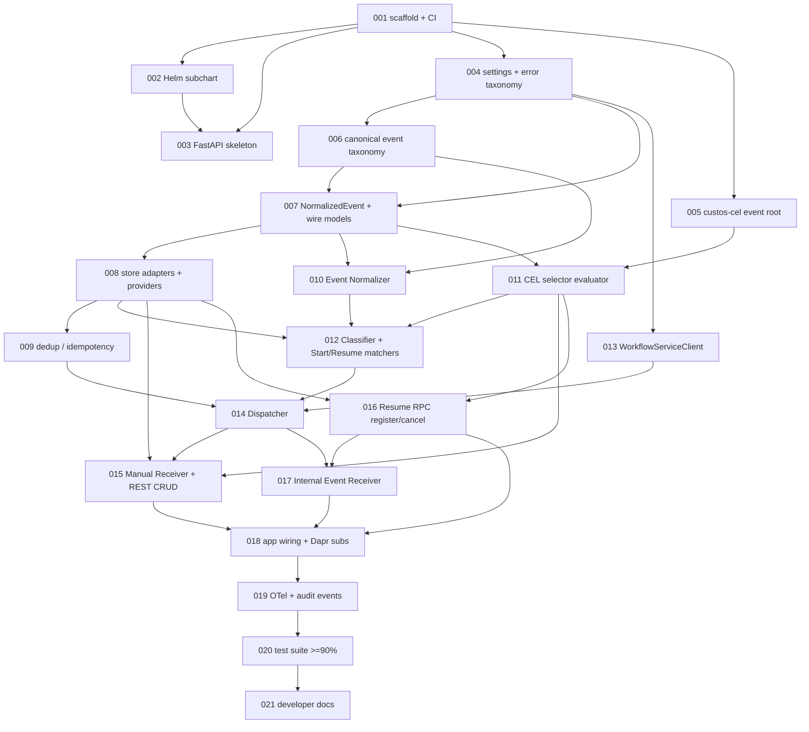

# `trigger-service` Implementation Plan

> Derived from `design/components/trigger-service/design.md` v7 (2026-06-04).
> Source of truth: the design doc and `design/architecture/`.
> Owned by the `implement-component` skill; regenerate fresh whenever the design changes.

## Summary

The Trigger Service (COMP-004) is the platform's event ingestion and dispatch
broker: it receives signals (manual, scheduled, webhook, vendor-push, pull,
internal), normalizes them, classifies them as workflow-start or step-resume,
matches them to `Subscription` rows via CEL selectors, deduplicates them, and
dispatches to the Workflow Service (`StartRun` / `RaiseExternalEvent`). This
milestone ships an **MVP vertical slice** that turns on the paths that unblock
the Workflow Service end-to-end: REQ-004 (manual trigger + REST CRUD), REQ-081
(resume RPCs + `RaiseExternalEvent` — flips the WF `waitFor:` fake to a live
server), and REQ-080 (internal workflow-to-workflow triggers via
`custos.workflow.events`), plus the full Normalize → Classify → Match(CEL) →
Dedup → Dispatch pipeline, the canonical event taxonomy (design TODO-001), and
CEL selectors (design TODO-002). The Scheduler, Generic Webhook, Vendor Push,
and Pull/Poller receivers are contract-locked in the SPL v1 schema but deferred
to M2.

## Conventions

- Task prefix: `TS-IMPL-`.
- Numbering starts at `TS-IMPL-001` (no prior `TS-IMPL` issues).
- One task = one PR = one GitHub issue.
- Phases run sequentially; tasks within a phase may run in parallel if dependencies allow.
- Quality gate from `src/services/trigger-service`: `ruff format . && ruff check . && mypy src tests && pytest -q` at `--cov-fail-under=90`.

## Dependency graph

## Phase A — Scaffold & foundations

### `TS-IMPL-001`: Scaffold `custos-trigger-service` + CI gate

- **Scope**:
  - `src/services/trigger-service/pyproject.toml` — hatchling build; deps `custos-spl`, `custos-postgres`, `custos-cel`, `fastapi`, `uvicorn`, `pydantic`, `pyyaml`, `opentelemetry-api`; dev extras mirroring catalog-service.
  - `src/custos_trigger/{__init__,__main__,py.typed}` — package skeleton + entry point.
  - ruff / mypy(strict) / pytest config with `--cov-fail-under=90`.
  - `.github/workflows/python-services.yml` — add the trigger-service job + install order.
- **Acceptance criteria**:
  - `pip install -e src/services/trigger-service[dev]` succeeds.
  - `ruff check`, `ruff format --check`, `mypy src tests`, `pytest -q` green on an empty suite.
  - CI job runs the gate.
- **Depends on**: _(none)_.
- **Complexity**: M.

### `TS-IMPL-002`: Wire trigger-service Helm subchart

- **Scope**:
  - `deploy/helm/charts/trigger-service/` — Deployment/Service/ConfigMap/ExternalSecret.
  - All `TRIGGER_*` env knobs from § Configuration; Dapr app-id annotations + `custos.triggers.normalized` / `custos.workflow.events` Pub/Sub component refs.
  - Register in the `custos` umbrella chart; render fixtures under `tests/helm/`.
- **Acceptance criteria**:
  - `helm template` renders for all four value profiles.
  - chart-lint + a `test_trigger_service_render.py` conftest assertion pass.
- **Depends on**: `TS-IMPL-001`.
- **Complexity**: M.

### `TS-IMPL-003`: FastAPI skeleton + `/healthz` `/readyz` + call-context shim

- **Scope**:
  - `custos_trigger/app.py` (`create_app()` factory), `custos_trigger/health.py`.
  - `custos_trigger/middleware/` call-context shim mirroring catalog-service.
  - `python -m custos_trigger` entry point.
- **Acceptance criteria**:
  - App boots sidecar-free; probes return 200.
  - Middleware attaches call-context; ASGI smoke test passes.
- **Depends on**: `TS-IMPL-001`, `TS-IMPL-002`.
- **Complexity**: S.

### `TS-IMPL-004`: Settings + locked `trigger.*` error taxonomy

- **Scope**:
  - `custos_trigger/settings.py` — typed env loader for every § Configuration knob with defaults.
  - `custos_trigger/errors.py` — `TriggerError` base + locked `kind` strings (`trigger.subscription_not_found`, `trigger.selector_invalid`, `trigger.selector_type_error`, `trigger.dispatch_failed`, `trigger.resume_divergent`, `trigger.dedup_duplicate`, `trigger.loop_detected`) with JSON-safe `to_dict()`.
- **Acceptance criteria**:
  - Each knob has a typed default + override test.
  - Each `kind` pinned on `LOCKED_TRIGGER_KINDS`, guarded by an enum-grid test.
  - 100% coverage on `errors.py`.
- **Depends on**: `TS-IMPL-001`.
- **Complexity**: S.

### `TS-IMPL-005`: `custos-cel` `event` binding root (ADR-011 extension)

- **Scope**:
  - `src/libs/custos-cel/` — add `event` to `custos_cel.scope._ALLOWED_ROOTS`.
  - `SchemaBindings.event` JSON-Schema entry + `BindingScope.event` mapping resolving `event.kind/subject/source.*/data.*/raw.*`.
  - Library version bump.
- **Acceptance criteria**:
  - `parse` + `type_check` + `evaluate` of `event.*` expressions pass.
  - Sandbox / determinism tests extended to cover `event`; the existing custos-cel suite stays green.
  - Additive only — no behavior change to existing roots.
- **Depends on**: `TS-IMPL-001`.
- **Complexity**: M.

### `TS-IMPL-006`: Canonical event taxonomy registry (resolves design TODO-001)

- **Scope**:
  - `custos_trigger/taxonomy.py` — `CANONICAL_EVENT_KINDS` frozenset, `PLATFORM_DOMAINS`, `is_canonical_kind()`, `validate_kind()` (regex shape + vendor-domain rule + platform-collision guard).
- **Acceptance criteria**:
  - Every platform domain/kind from § Event Taxonomy enumerated + enum-grid guarded.
  - Vendor-domain shape accepted; platform-domain collision rejected.
  - 100% coverage on `taxonomy.py`.
- **Depends on**: `TS-IMPL-004`.
- **Complexity**: M.

## Phase B — Domain models & persistence

### `TS-IMPL-007`: `NormalizedEvent` envelope + API wire + domain models

- **Scope**:
  - `custos_trigger/events.py` — `NormalizedEvent` per § NormalizedEvent schema.
  - `custos_trigger/models.py` — `SubscriptionCreate` / `SubscriptionPatch` / `Subscription` + `SubscriptionKind` / `SourceType` enums; selector field carries a CEL string (or legacy sugar).
  - Mapping helpers onto the existing SPL `Subscription` / `SubscriptionSelector` / `ResumeSubscription` / `DedupKey` / `Schedule` dataclasses.
- **Acceptance criteria**:
  - Round-trip JSON (de)serialization tests for every model.
  - `kind` validated via `taxonomy.validate_kind`; invalid source/kind rejected.
- **Depends on**: `TS-IMPL-004`, `TS-IMPL-006`.
- **Complexity**: M.

### `TS-IMPL-008`: Store adapters over `MetadataStoreProvider` + `providers.py`

- **Scope**:
  - `custos_trigger/stores/` — `SubscriptionStore`, `ResumeSubscriptionStore`, `ScheduleStore` thin adapters over the SPL `put_subscription` / `append_subscription_selector` / `update_subscription_state` / `put_resume_subscription` / `delete_resume_subscription` / `put_schedule` methods.
  - `custos_trigger/providers.py` — lifespan wiring; in-memory default + `TRIGGER_METADATA_STORE`-gated `custos_pg` provider.
- **Acceptance criteria**:
  - CRUD round-trips against the in-memory `MetadataStoreProvider`.
  - Provider selection honors the env knob; no new schema invented.
- **Depends on**: `TS-IMPL-007`.
- **Complexity**: M.

### `TS-IMPL-009`: Dedup / idempotency

- **Scope**:
  - `custos_trigger/dedup.py` — `dedup_key = hash(subscriptionId, source.eventId)`, reserve-before-dispatch via SPL `put_dedup_key` + `DedupReserved` / `DedupDuplicate`, TTL `TRIGGER_DEDUP_TTL_SECONDS`.
- **Acceptance criteria**:
  - First event reserves + returns `unseen`.
  - Replay within window returns `duplicate` and suppresses dispatch.
  - Key not committed when dispatch fails (matches § Failure Modes row 1).
- **Depends on**: `TS-IMPL-008`.
- **Complexity**: M.

## Phase C — Pipeline core

### `TS-IMPL-010`: Event Normalizer

- **Scope**:
  - `custos_trigger/normalize.py` — convert manual-fire body + internal `custos.workflow.events` envelope into `NormalizedEvent`; map envelope `status` onto `workflow.<status>` / `run.<status>` canonical kinds; generate `eventId` when the source omits one.
- **Acceptance criteria**:
  - Manual + internal payloads normalize to the locked envelope with canonical kinds.
  - Deterministic `eventId` generation; unknown source raises a taxonomy error.
- **Depends on**: `TS-IMPL-007`, `TS-IMPL-006`.
- **Complexity**: M.

### `TS-IMPL-011`: CEL selector evaluator (resolves design TODO-002)

- **Scope**:
  - `custos_trigger/selector.py` — compile-at-create (`parse` + `type_check` against the `event` `SchemaBindings`; invalid → `trigger.selector_invalid`), in-process typed-AST cache keyed by `(subscriptionId, exprHash)`, evaluate-at-match (`BindingScope(event=…)` → bool), legacy `field: matchType:value` → CEL desugar for `eq|prefix|regex|jsonpath`.
- **Acceptance criteria**:
  - Valid CEL compiles + matches; invalid CEL rejected at create (422).
  - Non-bool result → `trigger.selector_type_error`; each legacy match-type desugars to the documented CEL and matches identically; timeout → no-match.
- **Depends on**: `TS-IMPL-005`, `TS-IMPL-007`.
- **Complexity**: L.

### `TS-IMPL-012`: Classifier + Start Matcher + Resume Matcher

- **Scope**:
  - `custos_trigger/pipeline/classify.py` — route to start and/or resume (both may match).
  - `match_start.py` — selector eval over active `kind=start` subs via the CEL evaluator.
  - `match_resume.py` — `(runId, stepId, eventKey)` lookup over `kind=resume` subs + optional CEL selector.
- **Acceptance criteria**:
  - An event can match both arms; resume match is exact on the triple.
  - Start matches gated by the CEL selector.
- **Depends on**: `TS-IMPL-010`, `TS-IMPL-011`, `TS-IMPL-008`.
- **Complexity**: L.

### `TS-IMPL-013`: `WorkflowServiceClient` — Dapr Service-Invocation adapter

- **Scope**:
  - `custos_trigger/clients/workflow.py` — `start_run(...)` → `POST /internal/runs:start`, `raise_external_event(...)` → `POST /internal/runs/{runId}/steps/{stepId}:raiseEvent` via the local Dapr sidecar (raw `httpx`, mirroring the WF `_dapr_invoke` precedent); `idempotencyKey` propagation; `Noop` + `Fake` doubles.
- **Acceptance criteria**:
  - Request bodies match the WF `InternalStartRunRequest` / `RaiseExternalEventRequest` schemas.
  - Transient 5xx surface a retryable error; `Fake` records calls; 100% coverage on the adapter.
- **Depends on**: `TS-IMPL-004`.
- **Complexity**: M.

### `TS-IMPL-014`: Dispatcher

- **Scope**:
  - `custos_trigger/pipeline/dispatch.py` — start match → `StartRun(targetWorkflowVersionId, mapped inputs)`, resume match → `RaiseExternalEvent(runId, stepId, eventName, payload)`; exponential backoff up to `TRIGGER_DISPATCH_MAX_RETRIES`, dead-letter with `trigger.dispatch.failed`; per-tenant fan-out depth guard (`trigger.loop.detected`).
- **Acceptance criteria**:
  - Both dispatch arms covered; retry then dead-letter on persistent failure.
  - Dedup key committed only after a confirmed dispatch; loop-depth limit rejects + audits.
- **Depends on**: `TS-IMPL-009`, `TS-IMPL-012`, `TS-IMPL-013`.
- **Complexity**: L.

## Phase D — Receivers & RPC surface (WF-unblockers)

### `TS-IMPL-015`: Manual Receiver + REST CRUD (REQ-004)

- **Scope**:
  - `custos_trigger/api/routes/subscriptions.py` — `POST/GET/PATCH/DELETE /v1/workspaces/{ws}/triggers[/{id}]` + `POST …/{id}:fire` → normalize(manual) → pipeline → `{ runId }`; selector validated through the CEL evaluator on create/patch; RFC 7807 problem envelope.
- **Acceptance criteria**:
  - Full CRUD lifecycle test; `:fire` returns the started `runId`.
  - Invalid selector → 422; RBAC delegation via call-context; 404 on unknown subscription.
- **Depends on**: `TS-IMPL-008`, `TS-IMPL-014`, `TS-IMPL-011`.
- **Complexity**: M.

### `TS-IMPL-016`: Resume RPCs `RegisterResumeSubscription` / `CancelResumeSubscription` (REQ-081)

- **Scope**:
  - `custos_trigger/api/routes/rpc.py` — Dapr-method routes matching the WF `TriggerServiceClient` contract; register idempotent on `(runId, stepId, eventKey)` (returns existing `subscriptionId`), original-wins on divergent selector + `resume.subscription.divergent` audit; cancel idempotent no-op (404/409) on unknown/expired keys; TTL `TRIGGER_RESUME_DEFAULT_TTL_SECONDS`; CEL selector compiled at register.
- **Acceptance criteria**:
  - Re-registration returns the same id; divergent selector keeps the original + audits; cancel of unknown key is a clean no-op.
  - Verified against the exact request/response shapes the WF `DaprTriggerServiceClient` sends.
- **Depends on**: `TS-IMPL-008`, `TS-IMPL-011`.
- **Complexity**: M.

### `TS-IMPL-017`: Internal Event Receiver (REQ-080 + REQ-081 delivery)

- **Scope**:
  - `custos_trigger/receivers/internal.py` — Dapr Pub/Sub subscription on `custos.workflow.events`, normalize(internal) → pipeline; at-least-once handled by the dedup store; fan-out depth honored.
- **Acceptance criteria**:
  - A `workflow.completed` event can both start a chained workflow and resume a parent waiting on the child (dual-match); duplicate delivery absorbed by dedup.
  - Subscription registered via the Dapr `/dapr/subscribe` programmatic route.
- **Depends on**: `TS-IMPL-014`, `TS-IMPL-016`.
- **Complexity**: M.

### `TS-IMPL-018`: App wiring — mount routers + Dapr subscription + lifespan

- **Scope**:
  - `custos_trigger/app.py` — mount subscription/rpc routers + the internal-event handler, register the Dapr subscription, `trigger.*` exception handlers, lifespan-owned store/client construction via `providers.py`.
- **Acceptance criteria**:
  - `create_app()` boots the full surface sidecar-free; `/dapr/subscribe` lists `custos.workflow.events`.
  - An end-to-end ASGI test fires a manual trigger and registers a resume subscription.
- **Depends on**: `TS-IMPL-015`, `TS-IMPL-016`, `TS-IMPL-017`.
- **Complexity**: M.

## Phase E — Observability, verification, docs

### `TS-IMPL-019`: OTel observability + audit events

- **Scope**:
  - `custos_trigger/_telemetry.py` — tracer + meter, pipeline-stage spans, counters; emit `trigger.matched` / `trigger.deduped` / `trigger.dispatched` / `resume.delivered` / `trigger.dispatch.failed` audit events through the SPL audit sink.
- **Acceptance criteria**:
  - Each pipeline outcome records its counter + audit event; no-op when no OTel SDK installed.
  - In-memory exporter test asserts every (stage, outcome) pair.
- **Depends on**: `TS-IMPL-018`.
- **Complexity**: M.

### `TS-IMPL-020`: Unit + integration test suite (≥90% coverage gate)

- **Scope**:
  - `tests/` — full unit matrix incl. taxonomy enum-grid + CEL selector cases; two integration flows: manual-fire → `StartRun`, and resume-register → internal event → `RaiseExternalEvent`; testcontainers Postgres path behind a marker.
- **Acceptance criteria**:
  - Coverage ≥ 90% (target ≈ 99% like sibling services).
  - Both end-to-end flows green against the WF `Fake` / real-route contract.
- **Depends on**: `TS-IMPL-019`.
- **Complexity**: L.

### `TS-IMPL-021`: Developer documentation — `docs/developers/trigger-api.md`

- **Scope**:
  - REST surface, the declarative trigger YAML syntax, Internal RPC contract, `NormalizedEvent` envelope, event taxonomy reference table, CEL selector guide (incl. legacy desugar), dispatch/dedup/resume semantics, deferred-M2 note; link from `docs/developers/README.md`; doc-example test pinning the YAML/CEL blocks to the real models + taxonomy.
- **Acceptance criteria**:
  - Every fenced example parses/validates against the real models via a `test_docs_examples.py`.
  - Doc cannot drift from the code.
- **Depends on**: `TS-IMPL-020`.
- **Complexity**: S.

## Out of scope (deferred to M2)

- Scheduler Receiver (REQ-005) + leader election (design TODO-003).
- Generic Webhook Receiver + HMAC/token verification (design TODO-006).
- Vendor Push Receivers.
- Pull Receivers / Pollers (REQ-074).
- Selective dedup-clear admin API (design TODO-007).

Their tables and dispatcher arms are already contract-locked in the SPL v1 schema; only their receiver runtimes are deferred.

## Open questions

- Taxonomy home: M1 implements the canonical registry in `custos_trigger/taxonomy.py` (documented as authoritative). Promotion to a shared `custos-common` library so ARM/WF/Observability import it is a non-breaking, post-M1 move.
