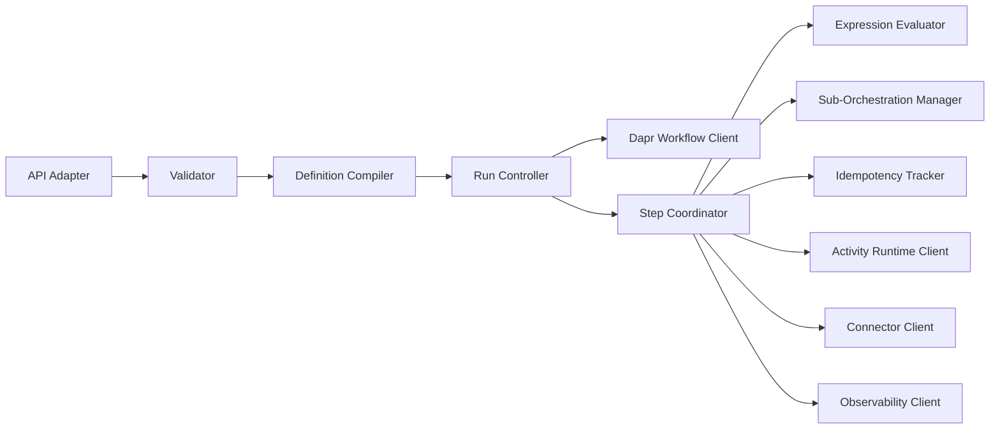
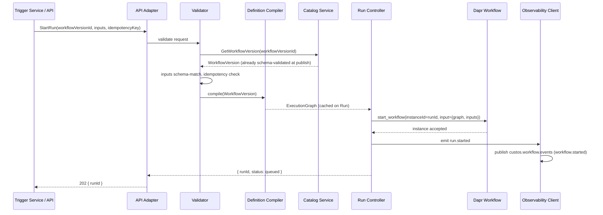
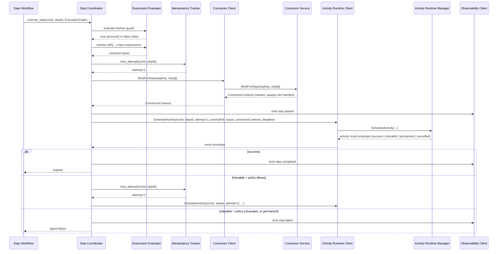
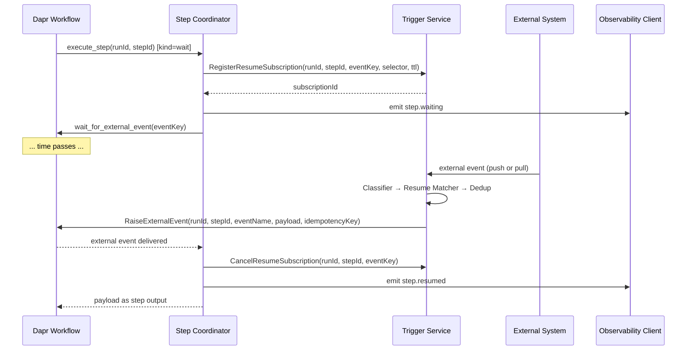
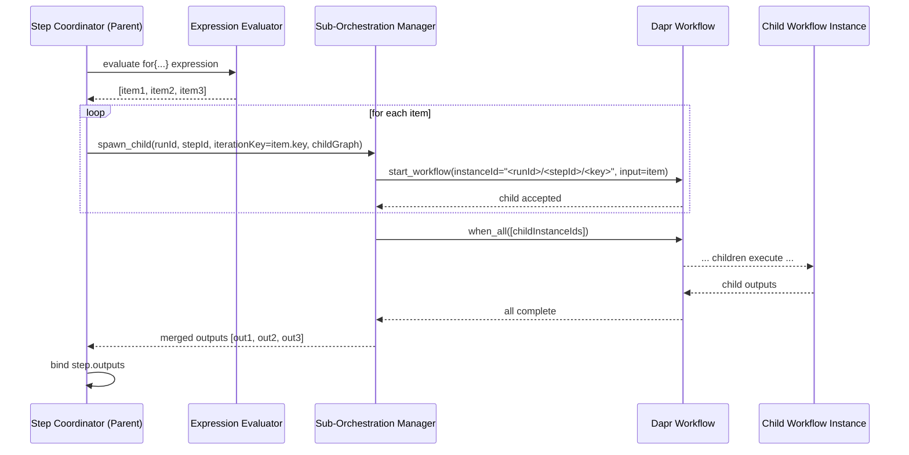
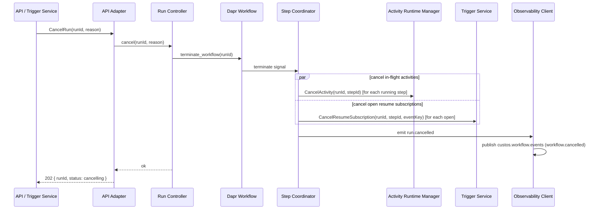
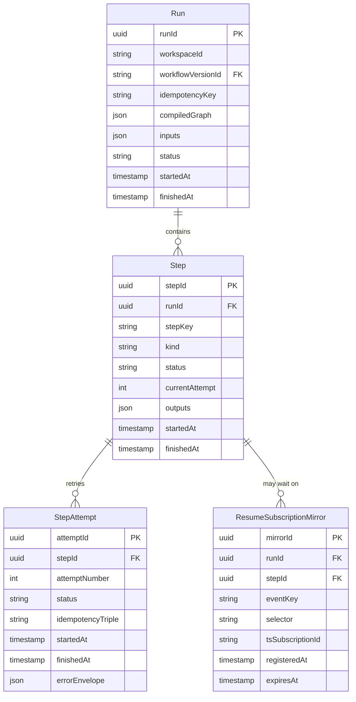
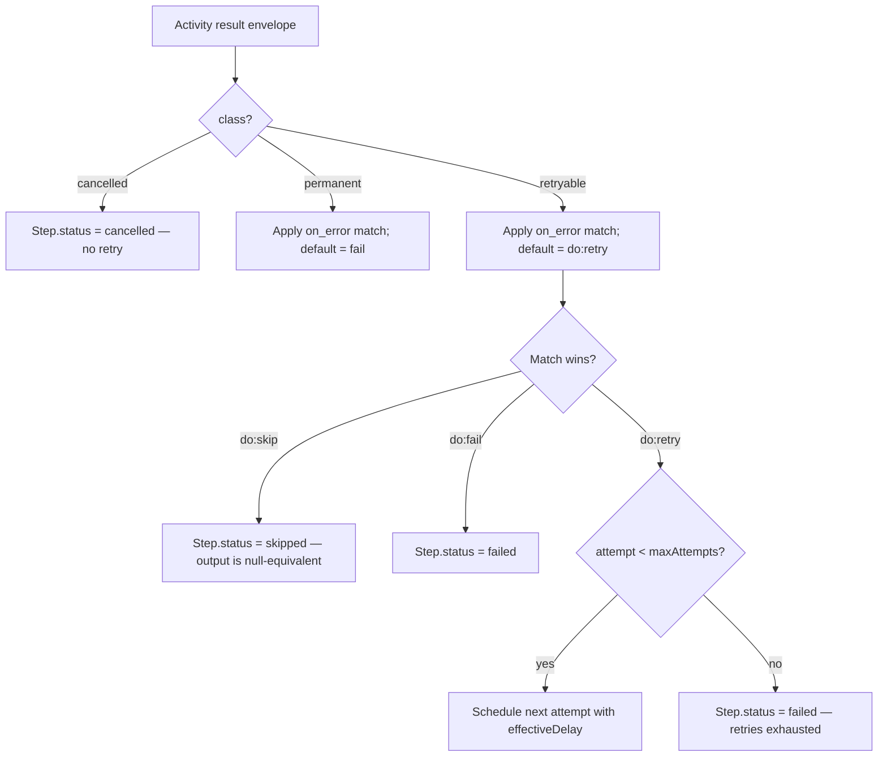

# Component Design: Workflow Service

Slug: `workflow-service`
Component ID: COMP-003
Last Updated: 2026-05-21
Version: 4
Status: Draft

## Responsibility

The Workflow Service owns the **orchestration state machine**. It compiles workflow definitions into an internal execution graph, drives one Dapr Workflow instance per Custos `Run`, coordinates step execution against the Activity Runtime Manager and the Connector Service, evaluates expressions deterministically under a sandboxed CEL-like evaluator (ADR-011), manages sub-orchestrations for dynamic loops and approval gates (ADR-007), registers and cancels resume subscriptions with the Trigger Service across each step's lifecycle (REQ-081), and publishes workflow lifecycle events to the `custos.workflow.events` Dapr Pub/Sub topic (REQ-080).

## Boundaries

- **Owns**:
  - `Run`, `Step`, and `StepAttempt` lifecycle and durable state.
  - Mapping of Custos primitives to Dapr Workflow primitives (Run ↔ workflow instance, Step ↔ activity task, dynamic loop ↔ sub-orchestration, approval gate ↔ sub-orchestration + external event, wait ↔ durable timer).
  - Compilation of `WorkflowVersion` definitions into an internal `ExecutionGraph`.
  - Idempotency key derivation: `(runId, stepId, attempt)`.
  - CEL expression evaluation sandbox (ADR-011) — pure, deterministic, replay-safe.
  - Sub-orchestration lifecycle: spawn, await, merge results (ADR-007).
  - Resume subscription lifecycle: WF is the source of truth for which `(runId, stepId, eventKey)` registrations exist; idempotently re-registers with the Trigger Service on Dapr Workflow replay.
  - Publication of workflow lifecycle events to `custos.workflow.events`.
  - Workflow-level retry policy decisions and per-step attempt counters.
  - `let` expression-only steps — evaluated inline, never dispatched to ARM.

- **Does NOT own**:
  - Trigger ingestion, normalization, matching, or dedup — Trigger Service (COMP-004).
  - Activity execution inside the sandbox, runtime drivers, or activity input/output schema validation at execution time — Activity Runtime Manager (COMP-006).
  - Connector instance binding, `ConnectorContext` construction, or credential delivery — Connector Service (COMP-005).
  - Workflow definition schema validation at publish time, template materialization, or definition storage — Catalog Service (COMP-007). WF reads compiled `WorkflowVersion` records; it does not validate them.
  - Audit-event retention, log shipping, or trace export — Observability/Audit Service (COMP-009). WF emits structured events; Observability owns their fate.

## Internal Structure



Sub-module responsibilities (matches `design/architecture/components.md` § COMP-003):

| Sub-module | Owns |
|---|---|
| API Adapter | Inbound REST and Internal RPC surface; maps wire requests to internal calls; enforces auth/authz delegation to AuthN/AuthZ Service. |
| Validator | Pre-execution checks of a `StartRun` request: workflow version exists, inputs schema-match, workspace authorized, idempotency key not previously fired with different inputs. Does not re-validate the workflow definition itself — Catalog already did that at publish time. |
| Definition Compiler | Reads a `WorkflowVersion` from Catalog, turns it into an `ExecutionGraph` (nodes = steps, edges = dependencies, annotated with `if`/`when`/`for`/`with` expressions, retry policy, primitive kind). The compiled graph is cached on the `Run` so a Catalog outage cannot pause in-flight runs. |
| Run Controller | Owns the Dapr Workflow instance for the run: `start`, `pause`, `resume`, `cancel`, `terminate`. Reconciles WF service state with Dapr Workflow durable state on replay. |
| Step Coordinator | Drives execution of one step at a time within a Run: evaluates guards via Expression Evaluator, derives idempotency key via Idempotency Tracker, dispatches to Activity Runtime Client / Connector Client / Sub-Orchestration Manager according to step kind, registers resume subscriptions when the step is a wait-style primitive, applies workflow-level retry policy on retryable failures. |
| Expression Evaluator | Sandboxed CEL-like evaluator. Pure, deterministic, replay-safe. Used for `if`, `when`, `unless`, `with`, loop `for`, `let` expressions, and template-placeholder resolution at run start. |
| Sub-Orchestration Manager | Spawns child Dapr Workflow instances for dynamic loops and approval gates (ADR-007). Parent awaits via `when_all` (loop) or `when_any` (approval with timeout). Merges child outputs back into parent state. |
| Idempotency Tracker | Issues `(runId, stepId, attempt)` triples, deterministic under Dapr replay. The triple is the Dapr activity task id, the ARM scheduling key, and the audit correlation key. |
| Activity Runtime Client | Outbound RPC client for ARM: `ScheduleActivity`, `CancelActivity`. Activity completion arrives via the native Dapr activity-task return path, not via a topic. |
| Connector Client | Outbound RPC client for Connector Service: `BindForStep(stepKey, slots[])` for pre-flight credential leases, capability checks, and returning the connector contexts needed by the step. |
| Observability Client | Emits structured execution events (`run.*`, `step.*`, `workflow.*`) into Observability/Audit. Also publishes workflow lifecycle events to the `custos.workflow.events` Dapr Pub/Sub topic for REQ-080 internal triggering and REQ-081 dual-purpose resume delivery. |

## Key Operations

### Operation: Start Run



`idempotencyKey` is a caller-supplied opaque string. The Validator dedups against `(workspaceId, idempotencyKey)` for a configurable window (default 24h) — a second `StartRun` with the same key returns the original `runId` rather than starting a new instance. `runId` itself is deterministic from `(workspaceId, idempotencyKey)` when supplied, otherwise a fresh UUID; the deterministic form makes Dapr's `instanceId = runId` mapping idempotent end-to-end.

### Operation: Step Execution (Activity Step)



Activity completion arrives via the **native Dapr activity-task return path** (ARM is invoked through Dapr Workflow's activity-task primitive; its return value is the result envelope). No `custos.activity.events` topic is used in v1. This is sufficient because the Workflow Service is the only consumer of activity completion. If a second consumer is ever required (e.g. an analytics pipeline reacting to activity completions), the design adds a parallel topic-based fan-out at that point; until then, the native return path is the source of truth.

ARM does **not** retry on retryable failures — the ARM design § Retry Policy is authoritative on the ARM side. Workflow-level retry policy lives here: the full schema, precedence rules, and interaction with `on_error:` are specified in § Retry Policy below. Each retry attempt gets a fresh `(runId, stepId, attempt)` triple from the Idempotency Tracker; ARM uses this triple to deduplicate scheduling under Dapr replay.

### Operation: Step Resume on External Event (REQ-081)



**WF is the source of truth for resume subscriptions.** On Dapr Workflow replay (pod restart, crash recovery), Step Coordinator re-derives the open subscription set from its `ResumeSubscriptionMirror` persisted in `MetadataStoreProvider` and **idempotently re-registers** with the Trigger Service.

### Resume Subscription Replay Protocol

The protocol between WF and TS for replay-safe registration:

1. **Idempotency key**: `(runId, stepId, eventKey)`. TS treats `RegisterResumeSubscription` as idempotent on this tuple — a re-registration with the same key returns the existing `subscriptionId` rather than creating a duplicate.
2. **Divergence policy**: if `selector` differs between the original registration and the replay, the **original wins**. Dapr Workflow replay must be deterministic, so a divergent selector indicates a bug in the workflow definition or evaluator. TS keeps the original registration and emits a `resume.subscription.divergent` audit event so the divergence is observable.
3. **TTL expiry**: TS garbage-collects subscriptions on `expiresAt` independently of WF mirror state. A re-registration arriving after TTL expiry is treated as a fresh registration (new `subscriptionId`, fresh TTL).
4. **Mirror sequencing**: WF persists `ResumeSubscriptionMirror` **before** calling TS (so a crash between mirror-write and TS-call leaves WF aware that registration is pending). On replay, WF re-registers every open mirror; if TS returns a different `subscriptionId` than the one in the mirror (e.g. after TTL expiry), WF updates the mirror to point at the new ID.
5. **Cancellation**: on step or run terminal transition, WF calls `CancelResumeSubscription(runId, stepId, eventKey)` for each open mirror, then deletes the mirror rows. TS treats `CancelResumeSubscription` as idempotent — cancelling an unknown or already-expired key is a no-op.

If `TS` is unreachable on initial `RegisterResumeSubscription`, Step Coordinator retries with exponential backoff (capped at `WF_REGISTER_SUB_MAX_RETRIES`, default 5). If retries are exhausted, the wait step fails with `class: retryable` so the workflow-level retry policy can decide whether to give up — this prevents a wait step from silently never resuming when the resume registration itself never landed.

### Operation: Sub-Orchestration (Dynamic Loop)



Child instance IDs are deterministic: `<parentRunId>/<stepId>/<iterationKey>`. This guarantees Dapr replay produces the same child instance set and makes child outputs addressable from `steps.<stepId>.outputs` in the parent's expression scope.

Approval gates follow the same pattern but with `when_any([childInstance, durableTimer])` for timeout semantics. The approval signal is delivered via `RaiseExternalEvent` (same path as Step Resume), not via a back-channel API.

### Operation: Cancel Run



The run reaches terminal `cancelled` once Dapr Workflow confirms the instance has terminated; until then `status: cancelling`.

### Operation: Pod Restart / Dapr Replay

When a Workflow Service pod restarts, Dapr Workflow replays each in-flight instance from durable state. All side effects emitted by the Step Coordinator must be guarded by the Idempotency Tracker so replay does not double-fire:

- `ScheduleActivity` calls — ARM dedups on `(runId, stepId, attempt)`.
- `RegisterResumeSubscription` calls — TS dedups on `(runId, stepId, eventKey)`.
- `BindForStep(stepKey, slots[])` — Connector Service issues a fresh credential lease per replay; the previous lease is allowed to expire on its own TTL.
- `custos.workflow.events` publications — guarded by producer-side dedup on `(runId, eventKind, occurredAt)`.

The compiled `ExecutionGraph` is persisted on the `Run` row, so replay does not re-call the Catalog Service. This isolates in-flight runs from Catalog Service outages.

## Data Models



All four entities are persisted via the `MetadataStoreProvider` (REQ-048). Dapr Workflow's internal state store (Redis, REQ-049) is separate; the two correlate by `runId == dapr.instanceId`. The `compiledGraph` blob on `Run` is the authoritative execution plan for the lifetime of the run — once compiled, it never re-reads the source `WorkflowVersion`.

`ResumeSubscriptionMirror` is what makes WF the source of truth for resume subscriptions: on replay, Step Coordinator queries this table for the current run+step and re-registers anything still open. TTL-expired mirrors are garbage-collected on a periodic sweep.

## Workflow Schema: Step Kinds Handled

The Workflow Service Step Coordinator recognizes the following step kinds. The workflow YAML schema is already locked in `design/architecture/overview.md` § Workflow and Template Schema; this table maps each kind to its handler within the Step Coordinator.

| Step kind | Trigger keyword | Handler | Dapr primitive |
|---|---|---|---|
| Activity | `activity:` | Activity Runtime Client | Activity task |
| Conditional | `if:` / `when:` / `unless:` | Expression Evaluator (skips step if false) | (none — guard) |
| Parallel block (static) | `parallel:` | Step Coordinator emits `when_all` over child steps | `when_all` |
| Loop (dynamic fan-out) | `for:` | Sub-Orchestration Manager | Sub-orchestration + `when_all` |
| Approval gate | `approval:` | Sub-Orchestration Manager + Resume Subscription | Sub-orchestration + `wait_for_external_event` + durable timer |
| Wait / sleep | `wait: PT5M` | Run Controller | Durable timer |
| External wait | `waitFor:` | Resume Subscription Manager logic in Step Coordinator | `wait_for_external_event` |
| Expression-only | `let:` | Expression Evaluator inline | (none — no Dapr call) |
| Sub-workflow invocation | `workflow:` | Sub-Orchestration Manager (sub-workflow path) | Sub-orchestration |

### `let` Primitive (M2 implementation, contract locked in v1)

`let` steps are inline expression evaluations. They produce a typed output bound to `steps.<id>.outputs.<name>` like any other step, are durable like any other step output (recorded on `Step.outputs` and replayed), but do **not** invoke ARM and do **not** invoke any connector. They run entirely inside the Expression Evaluator.

The contract is locked in v1 because the boundary matters: a `let` step must never have side effects, must never require a `ConnectorContext`, and must never trigger a `(runId, stepId, attempt)` ARM scheduling key. Implementation is flagged for M2 per the requirements timeline.

**Compilation strategy**: CEL **syntactic** validation is the Catalog Service's responsibility at workflow **publish time** — Catalog parses every CEL expression (`if`, `when`, `with`, `for`, `let`) and rejects the publish with parse error and position before a `WorkflowVersion` is created. The Workflow Service therefore never observes a syntactically invalid `WorkflowVersion`. `WorkflowVersion.document` stores the normalized definition with the original CEL **source strings**, not a pre-built AST.

The Definition Compiler runs at `StartRun` time: it re-parses each CEL source string from `WorkflowVersion.document`, **type-checks** the AST against the bound input/output schemas and the step graph, and caches the resulting typed AST on `ExecutionGraph` alongside the wired step topology. Type errors fail the workflow at `StartRun` (Validator rejects the request before a `runId` is issued). Defensive re-parse failures at this stage are a contract violation (Catalog gate bypassed or document tampered) and surface as a permanent compile error on the request, not as a parse error to the user. Evaluation errors fail the specific step at run time with status `permanent` — the AST is well-formed but a binding produced an incompatible value.

This matches the compilation model for all expressions (`if`, `when`, `with`, loop `for`, `let`): syntax gated once at publish (Catalog), type-checked and parsed-into-AST once per run at StartRun (WF Definition Compiler), evaluated many times at step boundaries. There is no first-execution / lazy compilation path.

Example:

```yaml
- id: summarize
  let:
    totalCritical: ${{ steps.scan.outputs.critical + steps.scan-alt.outputs.critical }}
    label: ${{ totalCritical > 0 ? "block" : "allow" }}
```

## Expression Evaluator (ADR-011)

The Expression Evaluator is a pure CEL subset, evaluated under a sandboxed interpreter. It is the only mechanism for computing values at orchestration time; arbitrary Python `eval` is never used.

**Bindings exposed in expressions**:

| Binding | Source | Mutability |
|---|---|---|
| `inputs.*` | Run inputs at start | Immutable |
| `steps.<id>.outputs.*` | Completed step outputs | Immutable once set |
| `run.id` | Current runId | Immutable |
| `run.workspace` | Workspace ID | Immutable |
| `workflow.name`, `workflow.version` | From `WorkflowVersion` metadata | Immutable |
| `now()` | Dapr Workflow `current_utc_datetime` (replay-deterministic) | Time-bound, but replay-safe |
| `let.<name>` | Inline `let` bindings within the same step | Immutable |

**Explicitly not exposed**: secrets, connector contexts, environment variables, file system, network, `eval`/`exec`, system clock other than `now()`.

**Determinism guarantees**: every binding is replay-deterministic. `now()` returns the same value across replays of the same Dapr Workflow instance. No expression can introduce non-determinism into the orchestration; non-determinism lives only inside activities (where Dapr Workflow doesn't replay it).

**Failure modes**:
- Expression timeout (default 100ms per evaluation, configurable) → step fails permanent.
- Type error or unbound name → step fails permanent (caught at compile time where possible, runtime otherwise).
- Divergence between replay and original execution → Dapr Workflow signals a non-determinism error; WF logs `expression.divergence` and fails the run.

## Sub-Orchestration Manager (ADR-007)

Used for three purposes:

1. **Dynamic loops** (`for:` step kind). One child workflow instance per iteration. Parent waits on `when_all`. Iteration keys are taken from the iterable's stable identity (e.g. list index or item key field) so child instanceIds are deterministic across replay.

2. **Approval gates** (`approval:` step kind). One child workflow instance per gate. The child workflow internally calls `wait_for_external_event` for the approval signal, with a durable timer for timeout. Parent waits on `when_any([childInstance, parentTimeoutTimer])` so an external cancel can preempt the gate. The approval signal flows through the Trigger Service via `RaiseExternalEvent`, not via a back-channel API — this keeps approval signals subject to the same dedup, audit, and idempotency machinery as every other external event.

3. **Sub-workflow invocation** (`workflow:` step kind). One child workflow instance per call. Reference must be a fully-qualified `workflowVersionId` (REQ-025 immutability — no name-only references). Inputs supplied via the step's `with:` block; child outputs bind to `steps.<id>.outputs.*` in the parent's expression scope. Parent waits on the single child instance; failure of the child propagates to the parent step as a typed failure.

Child instance ID format:

| Step kind | Child instance ID |
|---|---|
| Loop (`for:`) | `<parentRunId>/<stepId>/<iterationKey>` |
| Approval gate (`approval:`) | `<parentRunId>/<stepId>/approval` |
| Sub-workflow (`workflow:`) | `<parentRunId>/<stepId>/workflow` |

### Approval-gate timeout

The `approval:` block carries a `timeout` field (ISO-8601 duration). Default is `PT24H` if omitted. The timeout fires a durable timer inside the child sub-orchestration; `when_any([approvalEvent, timer])` resolves the gate.

On timeout, the gate step terminates with status `timed_out` — distinct from both `cancelled` (user-initiated) and `failed` (transient or permanent error). Workflow-level retry policy does **not** apply to approval-gate timeouts: a timed-out approval is a business decision, not a transient failure, so re-running the gate without operator intent is wrong. To re-open a timed-out gate, the user must explicitly restart the run (or re-run with modified inputs per REQ-028).

Timeouts are per-gate, not per-workflow. A workflow with multiple approval gates can configure each independently.

## Idempotency Model

Two layers:

1. **`StartRun` idempotency** (caller-supplied `idempotencyKey`):
   - Validator dedups against `(workspaceId, idempotencyKey)` for a configurable window.
   - Second `StartRun` with the same key returns the original `runId`.
   - `runId` is deterministic from `(workspaceId, idempotencyKey)` when supplied.

2. **Step-attempt idempotency** (engine-derived `(runId, stepId, attempt)` triple):
   - Issued by Idempotency Tracker on each retry.
   - Used as the Dapr activity task id, the ARM scheduling key, the Connector Service lease key, the audit-event correlation key, and the resume subscription dedup key.
   - Deterministic under Dapr replay: same `(runId, stepId, attempt)` re-derives on replay so all downstream services dedup correctly.

## Retry Policy

Workflow-level retry policy is owned by the Workflow Service Step Coordinator and is the **only** retry mechanism on Custos. ARM never retries internally (ARM design § Retry Policy). The schema below is the on-the-wire YAML contract; workflow authors write it, Catalog Service validates it at publish time, and the Step Coordinator applies it at runtime.

### Two-layer model

Retry policy splits into two orthogonal layers:

| Layer | YAML surface | Responsibility |
|---|---|---|
| **Routing** | `on_error:` | Match the ARM error envelope (by `code` / `codePrefix` / `class`) and pick an action (`skip` / `retry` / `fail`). |
| **Mechanics** | `retry:` | When the chosen action is `retry`, define **how**: total attempts, backoff curve, jitter, and `retryAfter` handling. |

`on_error:` selects *which* errors retry. `retry:` defines *how* retries happen. A `do: retry` arm consumes the prevailing `retry:` policy.

### Schema

```yaml
- id: scan
  activity: custos.builtin/vuln-scan@2
  connector: prod-registry
  with: { image: ${{ item }} }

  # Step-level retry policy. Applies to any do:retry that does not carry its own override.
  retry:
    maxAttempts: 5                 # total attempts including the first; integer >= 1
    backoff:
      strategy: exponential        # constant | linear | exponential
      initialDelay: PT1S           # ISO-8601 duration; > 0
      maxDelay: PT5M               # ISO-8601 duration; >= initialDelay
      multiplier: 2.0              # exponential only; default 2.0; >= 1.0
    jitter: full                   # none | full | equal | decorrelated; default full
    respectRetryAfter: true        # honor envelope.retryAfter as a lower bound; default true

  on_error:
    - match: { codePrefix: "registry.rate_limited" }
      do: retry
      retry:                       # per-match override; only supplied fields are overridden
        maxAttempts: 10
        backoff: { strategy: exponential, initialDelay: PT5S, maxDelay: PT10M }
    - match: { codePrefix: "registry." }
      do: skip
    - match: { class: "retryable" }
      do: retry                    # uses the step-level retry policy unchanged
      maxAttempts: 3               # shorthand: equivalent to `retry: { maxAttempts: 3 }`
```

Workflow-level defaults live under `spec.defaults.retry:` and apply to every activity step that does not declare its own:

```yaml
spec:
  defaults:
    retry:
      maxAttempts: 4
      backoff: { strategy: exponential, initialDelay: PT2S, maxDelay: PT2M }
      jitter: equal
  steps:
    - id: scan
      activity: custos.builtin/vuln-scan@2
      # No step-level retry: defaults above apply when on_error selects do:retry.
```

### Precedence

For any `do: retry` decision, the effective `retry:` policy is computed by overlaying (most-specific wins, field-by-field — partial overrides are supported):

1. `on_error[i].retry` (per-match override) — wins on any field it specifies.
2. `step.retry` — fills in fields not specified by (1).
3. `spec.defaults.retry` — fills in fields not specified by (1) or (2).
4. **Platform defaults** — fill in remaining fields:
   - `maxAttempts: 3`
   - `backoff: { strategy: exponential, initialDelay: PT1S, maxDelay: PT5M, multiplier: 2.0 }`
   - `jitter: full`
   - `respectRetryAfter: true`

The inline `maxAttempts: N` shorthand on an `on_error[]` arm is treated as `retry: { maxAttempts: N }` at layer (1). If both are present on the same arm, `retry:` wins and the shorthand is reported as a redundant-field warning at publish time.

### Implicit `on_error` policy

When a step has **no** `on_error:` block, the Step Coordinator applies this implicit handler:

- `class: retryable` → `do: retry` using the prevailing `retry:` policy.
- `class: permanent` → `do: fail`.
- `class: cancelled` → `do: fail` (never retried; cancellation is terminal by design).

When a step **does** have an `on_error:` block, matches are evaluated in declaration order and the first match wins. A `class: cancelled` envelope is **never** matched by a `do: retry` arm even if the match clause would otherwise accept it — `cancelled` short-circuits to `fail` regardless. This rule prevents a misconfigured workflow from converting an operator-initiated cancellation into a retry loop.

If no arm matches, the implicit policy above is the fallback.

### Backoff formulas

Let `n` = 1-indexed attempt number that just failed (so the delay precedes attempt `n + 1`). `D₀` = `initialDelay`. `Dmax` = `maxDelay`. `m` = `multiplier`. All values are in seconds before clamping.

| `strategy` | Formula (pre-jitter, pre-clamp) |
|---|---|
| `constant` | `D = D₀` |
| `linear` | `D = D₀ × n` |
| `exponential` | `D = D₀ × m^(n − 1)` |

Then clamp: `D = min(D, Dmax)`.

### Jitter strategies

Standard AWS Architecture Blog naming. `random(a, b)` is uniform on the half-open interval `[a, b)`.

| `jitter` | Effective delay before next attempt |
|---|---|
| `none` | `D` |
| `full` | `random(0, D)` |
| `equal` | `D/2 + random(0, D/2)` |
| `decorrelated` | `min(Dmax, random(D₀, prevDelay × 3))` where `prevDelay` is the previous attempt's effective delay (or `D₀` for the first retry) |

### `retryAfter` interaction

When the ARM error envelope carries a `retryAfter` field (ISO-8601 duration) and the prevailing `retry.respectRetryAfter` is `true` (default), the effective delay is:

```
effectiveDelay = max(jitteredBackoff, retryAfter)
```

Setting `respectRetryAfter: false` causes `retryAfter` to be logged but otherwise ignored. The envelope hint is **never** honored when `class: cancelled` or `class: permanent` (those classes don't retry).

### Where `retry:` may appear

| Location | Allowed | Notes |
|---|---|---|
| `activity:` step (top-level `retry:`) | ✅ | Default for any `do: retry` on this step. |
| `on_error[].retry:` arm | ✅ | Per-match override. |
| `spec.defaults.retry:` (workflow root) | ✅ | Workflow-wide default. |
| `let:` step | ❌ | No I/O, never fails retryably. Catalog rejects with parse position. |
| `if:`-only / guard step | ❌ | No execution to retry. Catalog rejects. |
| `forEach:` step container | ❌ | The `retry:` belongs on the inner activity step; each iteration is its own attempt sequence. |
| `wait:` / `waitFor:` / `approval:` | ❌ | Wait kinds have their own deadlines and timeout semantics (see § Approval-gate timeout); they do not participate in retry policy. |
| `workflow:` (sub-workflow invocation) | ❌ | Retry the sub-workflow at the call site via the parent's `on_error:`, not via an inner `retry:` block — sub-workflows already own their own internal retry policies. |

### Publish-time validation (enforced by Catalog Service)

Catalog must reject the publish if any of the following hold; the error surfaces at workflow publish, never at `StartRun`:

- `maxAttempts < 1` or non-integer.
- `backoff.initialDelay <= 0` or not a valid ISO-8601 duration.
- `backoff.maxDelay < backoff.initialDelay`.
- `backoff.multiplier < 1.0` (when `strategy: exponential`).
- `backoff.strategy` not in `{constant, linear, exponential}`.
- `jitter` not in `{none, full, equal, decorrelated}`.
- `retry:` on a disallowed step kind (table above).
- `do: retry` on a `match: { class: "permanent" }` or `match: { class: "cancelled" }` arm.
- An `on_error[]` arm carries both an inline `maxAttempts:` and an inner `retry: { maxAttempts: ... }` with conflicting values (the redundant-field warning above; conflict promotes to error).
- An `on_error[]` arm with `do: skip` or `do: fail` carries a `retry:` block (mechanics without retry action is incoherent).

### Runtime behavior

The Step Coordinator's retry decision tree on receiving an ARM result envelope:



On every retry decision the Step Coordinator emits a `step.retry_scheduled` event into `custos.workflow.events` carrying `runId`, `stepId`, the previous attempt's envelope `code`/`class`, the chosen `do:` action, the effective delay, and the next attempt number. This makes retry behavior observable end-to-end without scraping logs.

### Relationship to ARM (cross-component contract)

- ARM **only** classifies the envelope (`class`) and surfaces `retryAfter` as a hint.
- The Workflow Service **decides** whether to retry, when, and how many times.
- The `(runId, stepId, attempt)` triple from the Idempotency Tracker is the shared scheduling key. ARM dedups on it; the Workflow Service increments `attempt` on every retry decision.
- A `retryAfter` hint older than the prevailing maxDelay is clamped to `maxDelay` (the hint is a lower bound on the delay, not on the upper bound).

## Public Interface

### REST API (via API Gateway, COMP-001)

| Method | Path | Request | Response | Description |
|---|---|---|---|---|
| POST | `/v1/workspaces/{ws}/runs` | `StartRunRequest` | `RunRef` (202) | Start a new run; honors `Idempotency-Key` header per RFC. |
| GET | `/v1/workspaces/{ws}/runs/{runId}` | — | `Run` (with timeline) | Fetch run state, step timeline, and outputs. |
| POST | `/v1/workspaces/{ws}/runs/{runId}:cancel` | `{ reason }` | 202 | Initiate cancellation. |
| GET | `/v1/workspaces/{ws}/runs/{runId}/steps/{stepId}` | — | `Step` | Fetch a specific step's state and outputs. |
| GET | `/v1/workspaces/{ws}/runs/{runId}/steps/{stepId}/logs` | (streaming) | log lines | Stream step logs; delegates to Observability Service. |
| GET | `/v1/workspaces/{ws}/runs` | `RunListQuery` (filters + opaque `cursor` + `limit ≤ 200`) | `RunListResponse` (`{items: RunRef[], nextCursor?}`) | List runs in workspace; cursor-paginated. The Run Controller already returns `Page[RunRef]` so the public surface mirrors that envelope. |

`StartRunRequest`:

```json
{
  "workflowVersionId": "string",
  "inputs": { "...": "..." },
  "idempotencyKey": "optional, falls back to header"
}
```

### Internal RPC (inbound — WF as callee)

| RPC | Caller | Purpose |
|---|---|---|
| `StartRun(workflowVersionId, inputs, idempotencyKey)` | Trigger Service, API Adapter | Dispatch a workflow start. Idempotent on `(workspaceId, idempotencyKey)`. |
| `RaiseExternalEvent(runId, stepId, eventName, payload, idempotencyKey)` | Trigger Service | Deliver a resume signal into Dapr Workflow's `raise_event` primitive. Idempotent on `(runId, stepId, eventName, idempotencyKey)`. |
| `CancelRun(runId, reason)` | API Adapter, Trigger Service | Initiate run cancellation. |

### Internal RPC (outbound — WF as caller)

| RPC | Callee | Purpose |
|---|---|---|
| `BindForStep(stepKey, slots[])` | Connector Service | Acquire named `ConnectorContexts` (opaque slot handles) covering every connector slot a step references. Called by the Step Coordinator before `ScheduleActivity` for both single- and multi-connector steps. |
| `ScheduleActivity(runId, stepId, attempt, activityRef, inputs, connectorContexts, deadline)` | Activity Runtime Manager | Schedule an activity step. Idempotent on `(runId, stepId, attempt)`. ARM consumes the pre-resolved contexts; it does not re-bind. ARM mints the sidecar bootstrap token at sidecar start per the locked sidecar contract. |
| `CancelActivity(runId, stepId)` | Activity Runtime Manager | Cancel an in-flight activity step (used by cancel-run path). |
| `RegisterResumeSubscription(runId, stepId, eventKey, selector, ttl)` | Trigger Service | Register a one-shot resume wait. Idempotent on `(runId, stepId, eventKey)`. |
| `CancelResumeSubscription(runId, stepId, eventKey)` | Trigger Service | Cancel a resume registration on step or run terminal. |

### Dapr Pub/Sub Publications

| Topic | Direction | Producer | Consumer | Purpose |
|---|---|---|---|---|
| `custos.workflow.events` | WF → Bus → TS | Workflow Service (Observability Client sub-module) | Trigger Service Internal Event Receiver | Workflow lifecycle events (`workflow.started`, `workflow.completed`, `workflow.failed`, `workflow.cancelled`, and user-emitted `workflow.*`). Feeds REQ-080 internal triggering and REQ-081 dual-purpose resume delivery. |

Envelope (subset, full schema joint with TS-TODO-001 / ARM TODO-009 unified taxonomy):

```json
{
  "kind": "workflow.completed",
  "workflowVersionId": "...",
  "runId": "...",
  "workspace": "...",
  "status": "succeeded | failed | cancelled",
  "outputs": { "...": "..." },
  "occurredAt": "RFC3339"
}
```

Delivery semantics: **at-least-once**. Producer-side dedup on `(runId, eventKind, occurredAt)` so Dapr replay does not cause duplicate publications. Subscribers (currently only the Trigger Service Internal Event Receiver) rely on their own dedup machinery to absorb any duplicates that slip through.

## Configuration

| Variable | Required | Default | Description |
|---|---|---|---|
| `WF_DAPR_WORKFLOW_COMPONENT` | Yes | — | Name of the Dapr Workflow component to bind. |
| `WF_PUBLISH_TOPIC` | No | `custos.workflow.events` | Dapr Pub/Sub topic for lifecycle event publication. |
| `WF_ARM_ENDPOINT` | Yes | — | Activity Runtime Manager service endpoint. |
| `WF_TS_ENDPOINT` | Yes | — | Trigger Service service endpoint. |
| `WF_CONNECTOR_ENDPOINT` | Yes | — | Connector Service endpoint. |
| `WF_CATALOG_ENDPOINT` | Yes | — | Catalog Service endpoint (read-only access to `WorkflowVersion`). |
| `WF_METADATA_STORE` | No | — | libpq DSN for the durable `MetadataStoreProvider` (`custos_pg`) backing `Run` / idempotency persistence. When unset the in-memory provider is used (dev/test); required when `ENVIRONMENT=production`. The pool is opened eagerly at startup, so a bad DSN or unreachable database keeps `/readyz` at 503. |
| `WF_RUN_HISTORY_RETENTION` | No | `90d` | How long to keep terminal-run metadata before archival. |
| `WF_RESUME_SUB_DEFAULT_TTL` | No | `PT24H` | Default TTL for `RegisterResumeSubscription` when caller does not specify. |
| `WF_REGISTER_SUB_MAX_RETRIES` | No | `5` | Max retries when registering a resume subscription with TS before failing the wait step. |
| `WF_EXPR_TIMEOUT_MS` | No | `100` | Per-expression evaluation timeout. |
| `WF_IDEMPOTENCY_KEY_TTL` | No | `PT24H` | Window for `(workspaceId, StartRun idempotencyKey)` dedup. |
| `WF_MAX_FANOUT_WIDTH` | No | `1000` | Maximum number of children a single `forEach` loop may spawn; an over-cap loop fails with `step.sub_orchestration_spawn_error` before any child is spawned. |
| `WF_APPROVAL_DEFAULT_TIMEOUT` | No | `PT24H` | Default `approval:` gate timeout applied when a document leaves `approval.timeout` at the model default; an explicit per-document timeout always wins. |

## Dependencies

| Dependency | Type | Purpose |
|---|---|---|
| Dapr Workflow | Runtime | Durable orchestration substrate. One workflow instance per Run; child instances per sub-orchestration. |
| Dapr Pub/Sub | Runtime | Publication of `custos.workflow.events`. |
| Activity Runtime Manager (COMP-006) | Runtime | `ScheduleActivity`, `CancelActivity`. |
| Trigger Service (COMP-004) | Runtime | `RegisterResumeSubscription`, `CancelResumeSubscription`. Consumer of `custos.workflow.events`. |
| Connector Service (COMP-005) | Runtime | `BindForStep(stepKey, slots[])` for credential leases and named `ConnectorContext` issuance. |
| Catalog Service (COMP-007) | Runtime (read-only) | Source of `WorkflowVersion` records at run start. Compiled graph is cached on the Run, so Catalog outages do not pause in-flight runs. |
| MetadataStoreProvider (COMP-008) | Runtime | Persistence of `Run`, `Step`, `StepAttempt`, `ResumeSubscriptionMirror`. |
| Observability/Audit Service (COMP-009) | Runtime | Execution event sink, audit emission. |
| AuthN/AuthZ Service (COMP-002) | Runtime | Inbound REST and RPC authorization delegation. |

## Failure Modes

| Failure | Detection | Containment | Recovery |
|---|---|---|---|
| Workflow Service pod restart | Dapr Workflow durable state | Run resumes from last step boundary; resume subscriptions re-registered idempotently | Automatic |
| ARM unreachable on `ScheduleActivity` | RPC timeout | Step Coordinator applies workflow-level retry policy | Exponential backoff; permanent fail after policy exhaustion |
| ARM returns retryable failure | Result envelope `class: retryable` | Step Coordinator applies workflow-level retry policy | Workflow-level retry; ARM never retries internally |
| TS unreachable on `RegisterResumeSubscription` | RPC timeout | Wait step held in retry loop, bounded by `WF_REGISTER_SUB_MAX_RETRIES` | After exhaustion, step fails `class: retryable` so workflow-level policy decides |
| Connector Service unreachable on `BindForStep` | RPC timeout | Step Coordinator retries with backoff; bounded by workflow-level retry policy | Step fails if exhausted |
| Catalog Service unavailable mid-run | (does not happen — compiled graph cached) | In-flight runs unaffected; new `StartRun` requests fail | Restore Catalog; new runs resume |
| Expression timeout | Evaluator | Step fails permanent | Operator fixes expression; user re-runs |
| Expression replay divergence | Dapr non-determinism error | Run fails with `expression.divergence` audit event | Investigate; operator decides re-run or abandon |
| `custos.workflow.events` publish failure | Dapr publish error | Producer-side retry; at-least-once delivery | Subscribers absorb duplicates via dedup |
| MetadataStoreProvider unavailable | Provider health check | API returns 503; in-flight runs pause at next step boundary | Restore store; runs resume |
| Dapr Workflow component unavailable | Dapr error | API returns 503 on new starts; in-flight runs pause | Restore Dapr; runs resume |
| Cancel-run race with step completion | Step terminal write conflicts with cancel | Last-writer-wins on `Run.status`; cancel acknowledged when Dapr terminate completes | Audit captures both transitions |

## Open TODOs

- [ ] TODO-001: Finalize canonical workflow event taxonomy (`workflow.*`, `run.*`, `step.*`) jointly with Trigger Service TS-TODO-001 (#18) and ARM TODO-009 (INCON-013 cross-link). Tracked under those existing issues; no separate WF issue. (added 2026-05-17)
- [x] TODO-002: Closed 2026-05-21 — `retry:` block schema specified in § Retry Policy below, with two-layer model (`on_error:` routes, `retry:` provides mechanics). Closes #52.
- [x] TODO-003: Closed 2026-05-17 by Catalog Service design — `workflow:` accepts only fully-qualified `WorkflowVersion` references; template-with-inline-values is a two-step authoring flow (materialize → reference). Closes #53.

## Change History

| Date | Change | GitHub Issue |
|---|---|---|
| 2026-05-17 | Initial component design covering sub-modules, key operations (start/step/resume/sub-orchestration/cancel/replay), Dapr Workflow binding, expression evaluator scope, idempotency model, public interface (REST + internal RPC + Pub/Sub publications), data model, failure modes; resolves INCON-015 | #40 |
| 2026-05-18 | INCON-018 + INCON-021: Step Coordinator is now the only caller of Connector Service `BindForStep(stepKey, slots[])`; renamed outbound RPC `Resolve` → `BindForStep`; `ScheduleActivity` signature changed from `connectorRefs` to pre-resolved named `connectorContexts` (the sidecar bootstrap token continues to be minted by ARM per the locked sidecar contract); clarified that activity completion uses the native Dapr activity-task return path (no `custos.activity.events` topic in v1) | #98, #101 |
| 2026-05-18 | INCON-022: Clarified the CEL parse-error surface and AST storage location — Catalog is the sole syntactic gate at publish time; `WorkflowVersion.document` stores normalized CEL source strings (not a pre-built AST); WF's Definition Compiler at StartRun re-parses, type-checks, and caches the typed AST on `ExecutionGraph`; type errors fail StartRun, parse errors at this stage are a contract violation surfaced as compile errors | #100 |
| 2026-05-21 | TODO-002 / REQ-010: Locked the retry-policy YAML schema — two-layer model where `on_error:` is the routing layer and `retry:` is the mechanics layer; defined per-step and per-match `retry:` blocks, workflow-level `spec.defaults.retry:`, platform defaults, precedence rules, backoff/jitter formulas, `retryAfter` interaction, and publish-time validation rules. Inline `maxAttempts: N` shorthand on `on_error[].do=retry` arms retained for ergonomics. Closes #52 | #52 |
