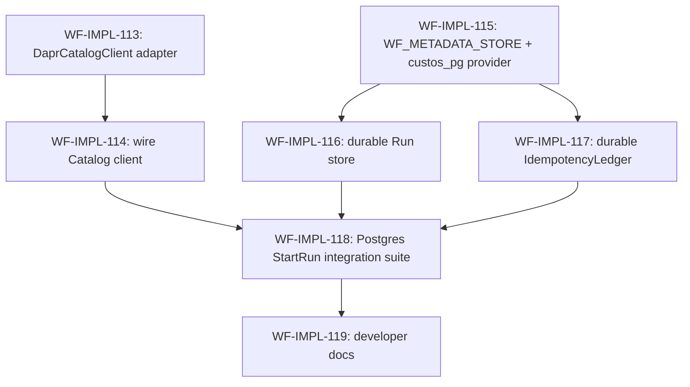

# workflow-service — Durable Wiring Implementation Plan

> Derived from [`design.md`](design.md) on 2026-06-04.
> Source of truth: the design doc and `design/architecture/`.
> This plan is owned by the `implement-component` skill; regenerate fresh whenever the design changes.

## Summary

The seven workflow-service sub-modules (Definition Compiler, Run Controller, Step
Coordinator, API Adapter + Validator, ARM/Connector adapters, Sub-Orchestration
Manager, Resume Subscription Manager) are all implemented, but the deployed build
still runs on stubs in
[`providers.py`](../../../src/services/workflow-service/src/custos_workflow/providers.py):
the Catalog client (`_NotConfiguredCatalogClient`) **raises** on the first uncached
`StartRun`, and the Run store / idempotency ledger default to **in-memory**
adapters (state lost on restart, no HA). This plan replaces those stubs with
production adapters so the service can run end-to-end in a deployed cluster.

The durable backend already exists: `custos_pg` implements the full
`MetadataStoreProvider` (`custos_state.run`, `step_attempt`, `idempotency_record`)
with migrations, and the Catalog Service already exposes `GetWorkflowVersion` over
Internal RPC. This is therefore **wiring**, following the established
`DaprTriggerServiceClient` / `_dapr_invoke` and `CAT_*_STORE` precedents — not new
persistence logic.

## Conventions

- Task prefix: `WF-IMPL-`. Numbering starts at `WF-IMPL-113` (next free id after a
  `gh issue list --search "WF-IMPL in:title"` scan; highest existing = 112).
- One task = one PR = one GitHub issue.
- Phases run sequentially; tasks within a phase may run in parallel if dependencies allow.
- Quality gates from `src/services/workflow-service`
  (`ruff format . && ruff check . && mypy src tests && pytest -q`, `--cov-fail-under=90`).

## Dependency graph

## Phase A — Catalog client (the #1 MVP blocker)

### `WF-IMPL-113`: `DaprCatalogClient` — `GetWorkflowVersion` over Dapr Service Invocation

- **Scope**:
  - New `custos_workflow/clients/catalog.py` — `DaprCatalogClient` implementing the
    existing `CatalogClient` Protocol
    ([`runs/controller.py`](../../../src/services/workflow-service/src/custos_workflow/runs/controller.py)),
    built on `_dapr_invoke` (`DaprInvokeEndpoint`, `build_invoke_url`), mirroring
    `DaprTriggerServiceClient`.
  - Map the Catalog `GetWorkflowVersion` Internal RPC response → `WorkflowVersion`
    (incl. `document` → `WorkflowDocument`); map 404 / access-denied / transport
    errors to clear exceptions.
  - `NoopCatalogClient` + `FakeCatalogClient` test doubles.
- **Acceptance criteria**:
  - `DaprCatalogClient` is `runtime_checkable`-conformant to `CatalogClient`.
  - The invoke URL matches the canonical Dapr Service-Invocation shape verbatim.
  - A 404 from Catalog maps to a distinct not-found error; transport errors map to a
    retryable error.
  - The response JSON round-trips into a `WorkflowVersion` with a parsed
    `WorkflowDocument`.
  - ~100 % unit-test coverage on the new module.
- **Depends on**: _(none)_.
- **Complexity**: M.

### `WF-IMPL-114`: Wire `DaprCatalogClient` into `providers.py`

- **Scope**:
  - Replace the `_NotConfiguredCatalogClient` default with `DaprCatalogClient` built
    from `WF_CATALOG_ENDPOINT` (already a documented, required env var).
  - Refuse to start when the endpoint is unset and `ENVIRONMENT=production`; keep a
    clear not-configured fallback otherwise (dev/test inject fakes).
  - Thread the one shared client into both `RunController` and `StartRunValidator`
    (no second connection).
- **Acceptance criteria**:
  - A `StartRun` against a real Catalog endpoint fetches + compiles a
    `WorkflowVersion`.
  - Existing in-memory tests still inject fakes and pass unchanged.
  - `ruff` / `mypy` / `pytest` green at the coverage floor.
- **Depends on**: `WF-IMPL-113`.
- **Complexity**: S.

## Phase B — Durable metadata provider foundation

### `WF-IMPL-115`: `WF_METADATA_STORE` config + lifespan-owned `custos_pg` provider

- **Scope**:
  - Add a `WF_METADATA_STORE` DSN config knob (following the `CAT_DEFINITION_STORE` /
    `CAT_CATALOG_STORE` precedent) and build a lifespan-owned `custos_pg`
    `MetadataStoreProvider` (pool) in the FastAPI lifespan; `aclose()` on shutdown;
    include it in `/readyz`.
  - Add the `WF_METADATA_STORE` row to [`design.md`](design.md) § Configuration.
  - Default to the existing in-memory provider when the DSN is unset (dev/test);
    refuse to start with in-memory when `ENVIRONMENT=production`.
- **Acceptance criteria**:
  - The provider is constructed once and shared across collaborators.
  - `/readyz` fails when the DSN is set but the pool cannot connect.
  - The in-memory default is preserved for tests.
  - The design Configuration table includes `WF_METADATA_STORE`.
- **Depends on**: _(none)_.
- **Complexity**: M.

## Phase C — Durable Run store

### `WF-IMPL-116`: Back the Run store with the `custos_pg` provider

- **Scope**:
  - Wire the Phase-B `MetadataStoreProvider` behind the `InProcessRunStore` seam
    ([`runs/store.py`](../../../src/services/workflow-service/src/custos_workflow/runs/store.py))
    so `put_run` / `update_run_status` / `get_run` / `list_runs` persist to
    `custos_state.run`; replace the `_InProcessMetadataStoreProvider` default in
    production wiring.
  - Verify (do not duplicate) the migrate job creates the `custos_state.run` table.
- **Acceptance criteria**:
  - A run survives a simulated process restart (a new store instance over the same
    DSN sees the persisted run + status).
  - `list_runs` cursor pagination matches the in-memory contract.
  - The in-memory path is retained for unit tests.
- **Depends on**: `WF-IMPL-115`.
- **Complexity**: M.

## Phase D — Durable idempotency ledger

### `WF-IMPL-117`: `MetadataStoreProvider`-backed `IdempotencyLedger` adapter

- **Scope**:
  - New durable adapter implementing the `IdempotencyLedger` Protocol
    ([`validator/idempotency_ledger.py`](../../../src/services/workflow-service/src/custos_workflow/validator/idempotency_ledger.py))
    over `reserve_idempotency_record` / `complete_idempotency_record` /
    `delete_expired_idempotency_records`, mapping the WF `(workspaceId, idempotencyKey)`
    + inputs fingerprint onto the SPL
    `(workspace_id, principal_id, route="StartRun", idempotency_key, request_hash)`
    shape.
  - Replace the `InMemoryIdempotencyLedger` default in `providers.py`; align the
    periodic expiry sweep with `WF_IDEMPOTENCY_KEY_TTL`.
- **Acceptance criteria**:
  - Re-submitting the same `(workspace, idempotencyKey)` after a simulated restart is
    deduped against Postgres.
  - A key reused with different inputs surfaces the conflict.
  - TTL expiry reaps rows.
  - The in-memory ledger is retained for tests.
- **Depends on**: `WF-IMPL-115`.
- **Complexity**: M.

## Phase E — Verification & documentation

### `WF-IMPL-118`: Postgres-backed `StartRun` integration suite

- **Scope**:
  - macOS-friendly Postgres fixture (skips cleanly when unavailable, mirroring
    existing integration-test conventions); end-to-end `StartRun` → compile → persist
    Run; restart/replay durability (run + idempotency survive a new store instance);
    dedup across restart.
- **Acceptance criteria**:
  - The suite is green locally and in CI.
  - Coverage stays ≥ 90 %.
  - Durability + dedup assertions pass against real Postgres.
- **Depends on**: `WF-IMPL-114`, `WF-IMPL-116`, `WF-IMPL-117`.
- **Complexity**: L.

### `WF-IMPL-119`: Developer documentation — durable wiring + Catalog config

- **Scope**:
  - New `docs/developers/workflow-durable-wiring.md` documenting `WF_CATALOG_ENDPOINT`
    + `WF_METADATA_STORE` wiring, the durable vs. in-memory adapter switch, and the
    production-refusal behavior; pin config/examples with a test where feasible.
- **Acceptance criteria**:
  - The doc is added and linked from the service README / docs index.
  - Any embedded config/example is validated by a test or render check.
- **Depends on**: `WF-IMPL-118`.
- **Complexity**: S.

## Out of scope (deferred)

- **Durable `ResumeSubscriptionMirror`** — the SPL `ResumeSubscription` model lacks
  `eventKey` / `selector` / `tsSubscriptionId` and there is no
  `list_resume_subscription` query, which the replay reconciler and TTL sweeper
  require. A durable mirror needs a COMP-008 (`MetadataStoreProvider`) interface
  extension. Since `waitFor:` already ships behind a fake Trigger client (COMP-004
  unimplemented), this is lower priority and deferred.
- **Full Observability Client integration** (audit sink + `GET …/steps/{id}/logs`
  delegation) — separate deferred item in [`todos.md`](todos.md).
- **Step / StepAttempt durable persistence** beyond what the Run Controller already
  writes — not on the MVP `StartRun` critical path.

## Open questions

- _(resolved)_ `WF_METADATA_STORE` will be added to the design Configuration table as
  part of `WF-IMPL-115`.
- _(resolved)_ Durable `ResumeSubscriptionMirror` stays deferred (above).
- _(resolved)_ Docs land in a new `docs/developers/workflow-durable-wiring.md`.
