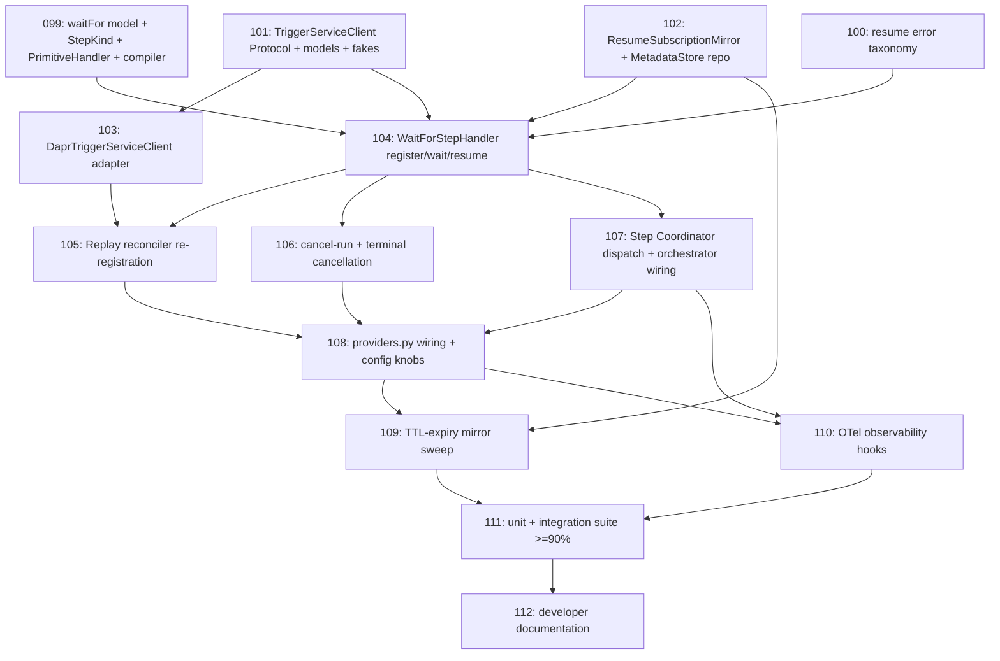

# Workflow Service — Resume Subscription Manager Implementation Plan

> Derived from `design/components/workflow-service/design.md` on 2026-06-01.
> Source of truth: the design doc (§ Step Resume on External Event, § Resume
> Subscription Replay Protocol, § Internal RPC outbound, § Data Models,
> § Configuration) and `design/architecture/`.
> This plan is owned by the `implement-component` skill; regenerate fresh
> whenever the design changes.

## Summary

Eighth workflow-service sub-module. Implements the **`waitFor:` step kind**
(REQ-081): a step that suspends the Dapr Workflow on
`wait_for_external_event(eventKey)` after registering a one-shot resume
subscription with the Trigger Service. WF is the **source of truth** — it
persists a `ResumeSubscriptionMirror` (via `MetadataStoreProvider`) **before**
calling TS, idempotently re-registers every open mirror on Dapr replay through
the existing `ReplayReconciler` hook (`runs/replay.py`), and cancels + deletes
mirrors on step/run terminal. Replaces the `step.kind_not_implemented` stub the
Step Coordinator returns for `waitFor:`. The Trigger Service (COMP-004) has no
implementation yet, so the production adapter ships behind a
`TriggerServiceClient` Protocol with a fake test client (same precedent as the
ARM/Connector clients, tracker #495).

## Conventions

- Task prefix: `WF-IMPL-`.
- Numbering: `099`–`112` (next free id after a
  `gh issue list --label component:workflow-service` scan; highest used was
  `WF-IMPL-098`).
- One task = one PR = one GitHub issue.
- Phases run sequentially; tasks within a phase may run in parallel if
  dependencies allow.
- New package: `custos_workflow.steps.resume` + `TriggerServiceClient` in
  `custos_workflow.clients.trigger`.

## Dependency graph

## Phase A — Foundations (model, errors, client contract)

### `WF-IMPL-099`: `waitFor:` document model + `StepKind.WAIT_FOR` + `PrimitiveHandler.RESUME_SUBSCRIPTION` + compiler tagging

- **Scope**:
  - `document/models.py` — add `WaitForStep` (`waitFor:` keyword; fields
    `eventKey`, `selector`, optional `ttl` ISO-8601 duration).
  - `graph/model.py` — add `StepKind.WAIT_FOR` + `PrimitiveHandler.RESUME_SUBSCRIPTION`.
  - `compiler.py` — map `WaitForStep -> (WAIT_FOR, RESUME_SUBSCRIPTION)`;
    collect `eventKey`/`selector` CEL call sites.
  - `steps/coordinator.py` — extend `_EXPECTED_PRIMITIVE_HANDLERS` invariant.
- **Acceptance criteria**:
  - A `waitFor:` document compiles to a node tagged `RESUME_SUBSCRIPTION`.
  - Kind-grid test enumerates the new enum members.
  - `eventKey`/`selector` CEL call sites collected with source positions.
- **Depends on**: _(none)_.
- **Complexity**: M.

### `WF-IMPL-100`: Resume subscription error taxonomy additions

- **Scope**:
  - `steps/errors.py` — locked `kind` strings:
    `step.resume_registration_failed` (retryable, TS unreachable after
    `WF_REGISTER_SUB_MAX_RETRIES`), `step.resume_subscription_divergent`
    (replay selector mismatch), `step.resume_mirror_persist_error`.
- **Acceptance criteria**:
  - Each subclass pins a stable `kind` with JSON-safe `to_dict()`.
  - Taxonomy test covers every new `kind`.
- **Depends on**: _(none)_.
- **Complexity**: S.

### `WF-IMPL-101`: `TriggerServiceClient` Protocol + request/response models + test doubles

- **Scope**:
  - new `clients/trigger.py` — `runtime_checkable` `TriggerServiceClient`
    Protocol with `register_resume_subscription(...)` /
    `cancel_resume_subscription(...)`; frozen request/response dataclasses
    (`RegisterResumeSubscriptionRequest/Response` carrying `tsSubscriptionId`,
    `CancelResumeSubscriptionRequest`); `FakeTriggerServiceClient` +
    `NoopTriggerServiceClient`; pinned Dapr method-name constants.
- **Acceptance criteria**:
  - 100% coverage on contract + doubles.
  - Idempotent fake returns same `tsSubscriptionId` for repeated
    `(runId, stepId, eventKey)`.
- **Depends on**: _(none)_.
- **Complexity**: S.

## Phase B — Persistence + client adapter

### `WF-IMPL-102`: `ResumeSubscriptionMirror` model + `MetadataStoreProvider`-backed repository

- **Scope**:
  - new `steps/resume/mirror.py` — `ResumeSubscriptionMirror` dataclass
    (`mirrorId`, `runId`, `stepId`, `eventKey`, `selector`, `tsSubscriptionId`,
    `registeredAt`, `expiresAt`); repository with `put`, `list_open(runId)`,
    `list_open_for_step`, `delete`, `list_expired(before)`; in-memory adapter
    for tests.
- **Acceptance criteria**:
  - Byte-stable serialization round-trip.
  - Mirror written before any TS call is observable via `list_open`.
  - Expired-mirror query honors `expiresAt`.
- **Depends on**: _(none)_.
- **Complexity**: M.

### `WF-IMPL-103`: `DaprTriggerServiceClient` — Dapr Service-Invocation adapter

- **Scope**:
  - extend `clients/trigger.py` — production adapter over
    `clients/_dapr_invoke.py` (`build_invoke_url`, raw `httpx`), mapping
    HTTP/Dapr errors to the `OutboundRpcError` family; `RegisterResumeSubscription`
    / `CancelResumeSubscription` methods.
- **Acceptance criteria**:
  - Register returns parsed `tsSubscriptionId`.
  - Cancel of unknown key is a no-op (idempotent).
  - 499/5xx mapped to the right outbound-RPC error classes.
- **Depends on**: `WF-IMPL-101`.
- **Complexity**: M.

## Phase C — WaitFor step handler + replay + cancellation

### `WF-IMPL-104`: `WaitForStepHandler` — register / wait / resume lifecycle

- **Scope**:
  - new `steps/resume/handler.py` — resolve `eventKey`/`selector` via
    `WithInputResolver`/CEL, default TTL from `WF_RESUME_SUB_DEFAULT_TTL`;
    **persist mirror before** TS `register` (mirror-sequencing rule 4); retry
    register with exponential backoff capped at `WF_REGISTER_SUB_MAX_RETRIES` ->
    on exhaustion fail `step.resume_registration_failed` (`class: retryable`);
    emit `step.waiting`; `yield ctx.wait_for_external_event(eventKey)`; on
    delivery cancel subscription + delete mirror; emit `step.resumed`; bind
    payload as step output.
- **Acceptance criteria**:
  - Happy path registers -> waits -> resumes -> cancels -> deletes mirror.
  - TS-unreachable exhausts retries then retryable failure.
  - Replay-safe (no double register within one logical attempt).
- **Depends on**: `WF-IMPL-099`, `WF-IMPL-100`, `WF-IMPL-101`, `WF-IMPL-102`.
- **Complexity**: L.

### `WF-IMPL-105`: Replay reconciler — idempotent re-registration of open mirrors

- **Scope**:
  - new production `ReplayReconciler` impl bound to the orchestrator
    `ReplayHook` (`runs/replay.py`, `runs/orchestrator.py`) — on replay,
    `list_open(runId)`, re-register each via TS (idempotent on
    `(runId, stepId, eventKey)`); apply divergence policy (original wins ->
    `step.resume_subscription_divergent` audit event); on TTL-expiry-induced new
    `tsSubscriptionId`, update mirror; swallow + log reconcile errors.
- **Acceptance criteria**:
  - Re-register of identical key returns existing id (no duplicate).
  - Divergent selector keeps original + emits audit event.
  - New id after expiry updates the mirror row.
- **Depends on**: `WF-IMPL-102`, `WF-IMPL-103`, `WF-IMPL-104`.
- **Complexity**: L.

### `WF-IMPL-106`: Cancel-run + terminal cancellation of open subscriptions

- **Scope**:
  - `steps/resume/` + cancel path — on step/run terminal transition (incl.
    CancelRun, § Operation: Cancel Run), `CancelResumeSubscription` for each open
    mirror then delete mirror rows; integrate with the existing terminal/cancel
    hooks.
- **Acceptance criteria**:
  - Cancelling a run with N open waits issues N idempotent cancels and removes
    all mirror rows.
  - Cancelling an unknown/expired key is a no-op.
- **Depends on**: `WF-IMPL-104`.
- **Complexity**: M.

## Phase D — Dispatch integration & wiring

### `WF-IMPL-107`: Step Coordinator dispatch of `RESUME_SUBSCRIPTION` + orchestrator wiring

- **Scope**:
  - `steps/coordinator.py` — route `PrimitiveHandler.RESUME_SUBSCRIPTION` to
    `WaitForStepHandler` (replaces the `step.kind_not_implemented` stub); thread
    the handler through the orchestrator's `waitFor:` path returning
    `StepWaiting`.
- **Acceptance criteria**:
  - A `waitFor:` node no longer returns `kind_not_implemented`.
  - Dispatcher invariant holds for the full `PrimitiveHandler` set.
- **Depends on**: `WF-IMPL-104`.
- **Complexity**: M.

### `WF-IMPL-108`: `providers.py` wiring + Configuration knobs + registration

- **Scope**:
  - `providers.py` + app wiring — build `TriggerServiceClient` from
    `WF_TS_ENDPOINT`; wire mirror repository on `MetadataStoreProvider`; register
    the production `ReplayReconciler`; add config: `WF_TS_ENDPOINT`,
    `WF_RESUME_SUB_DEFAULT_TTL` (`PT24H`), `WF_REGISTER_SUB_MAX_RETRIES` (`5`).
- **Acceptance criteria**:
  - App boots with the resume path live.
  - Missing required `WF_TS_ENDPOINT` fails fast.
  - Defaults match design § Configuration.
- **Depends on**: `WF-IMPL-105`, `WF-IMPL-106`, `WF-IMPL-107`.
- **Complexity**: M.

### `WF-IMPL-109`: TTL-expiry periodic mirror sweep

- **Scope**:
  - background sweep (FastAPI lifespan task) calling `repository.list_expired(now)`
    and deleting GC-eligible mirrors; interval config knob.
- **Acceptance criteria**:
  - Expired mirrors are removed on the sweep; non-expired untouched.
  - Sweep is restart-safe and idempotent.
- **Depends on**: `WF-IMPL-102`, `WF-IMPL-108`.
- **Complexity**: S.

## Phase E — Observability, verification, docs

### `WF-IMPL-110`: OTel observability hooks

- **Scope**:
  - `_telemetry.py` — spans for register/cancel/replay; counters
    `resume_subscriptions_registered_total`, `resume_subscriptions_cancelled_total`,
    `resumes_total`, `resume_subscription_divergent_total`; no-op without OTel SDK.
- **Acceptance criteria**:
  - In-memory exporter test asserts span names + counter increments.
  - `step.waiting`/`step.resumed` lifecycle events emitted.
- **Depends on**: `WF-IMPL-107`, `WF-IMPL-108`.
- **Complexity**: M.

### `WF-IMPL-111`: Unit + integration test suite (>=90% coverage gate)

- **Scope**:
  - full suite — register/wait/resume, retry exhaustion, mirror sequencing,
    replay re-registration + divergence, cancel-run cleanup, TTL sweep; honor the
    `--cov-fail-under=90` floor.
- **Acceptance criteria**:
  - Suite green; coverage >=90% (target ~99% per prior sub-modules).
- **Depends on**: `WF-IMPL-110`.
- **Complexity**: L.

### `WF-IMPL-112`: Developer documentation

- **Scope**:
  - `docs/developers/workflow-resume-subscriptions.md` — `waitFor:` schema,
    register/replay/cancel sequence (Mermaid), `ResumeSubscriptionMirror`,
    replay-protocol table, error taxonomy, config knobs; doc-example test pinning
    fenced YAML to `compile()`; update component `README.md` + `todos.md`.
- **Acceptance criteria**:
  - Doc-example test passes.
  - README status block + todos updated.
- **Depends on**: `WF-IMPL-111`.
- **Complexity**: M.

## Out of scope (deferred)

- Trigger Service side (`RegisterResumeSubscription` endpoint, Resume Matcher) —
  COMP-004, not yet implemented. WF ships behind the Protocol + fake.
- True cross-service E2E resume — blocked until Trigger Service exists.
- Durable `IdempotencyLedger` and Full Observability Client — separate deferred
  sub-modules.

## Open questions

1. `waitFor:` wire schema is not yet locked in `design/architecture/overview.md`.
   Plan proceeds with the design.md field set (`eventKey`, `selector`, `ttl`).
2. New `PrimitiveHandler.RESUME_SUBSCRIPTION` member added (vs reusing an
   existing tag).
3. `step.resume_subscription_divergent` emitted via the existing
   `LifecycleEventPublisher` while the Observability Client sink remains deferred.
