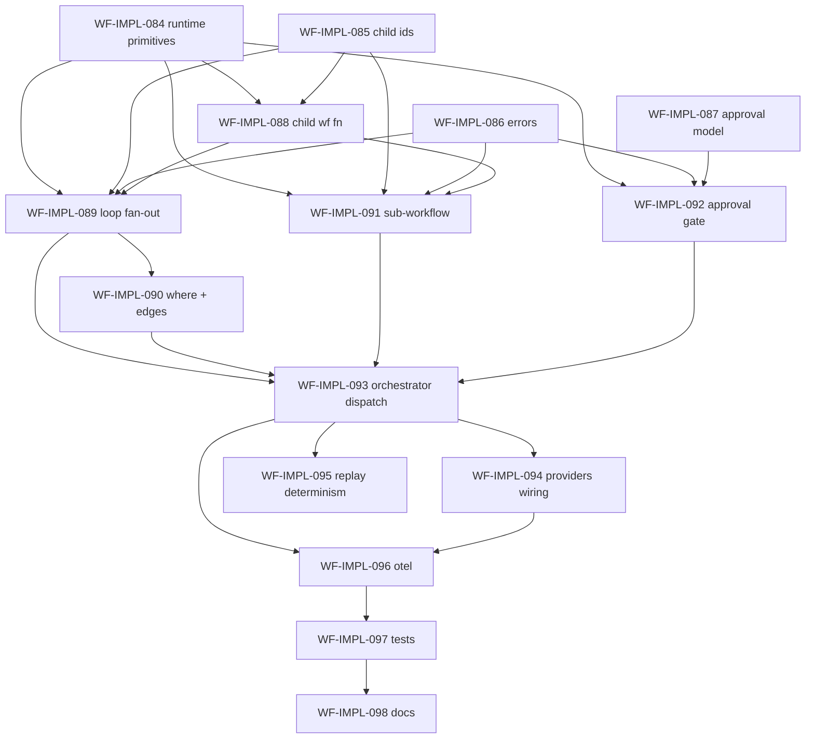

# `sub-orchestration-manager` Implementation Plan

> Derived from `design/components/workflow-service/design.md` on 2026-06-01.
> Source of truth: the design doc, `design/architecture/overview.md` (ADR-007), and `design/architecture/components.md`.
> This plan is owned by the `implement-component` skill; regenerate fresh whenever the design changes.

## Summary

The Sub-Orchestration Manager is the sixth-and-final core sub-module of the workflow-service (COMP-003). It unblocks the three step kinds that spawn **child Dapr Workflow instances**: dynamic loops (`forEach:`), sub-workflow invocation (`workflow:`), and approval gates (`approval:`). Children get deterministic instance ids `<parentRunId>/<stepId>/<iterationKey>` so Dapr replay reproduces the exact child set and outputs are addressable from `steps.<stepId>.outputs` in the parent's expression scope. Loops await via `when_all`; approval gates via `when_any([signal, durableTimer])`. It plugs into the orchestrator's inline-dispatch surface (the same path `wait:` uses), replacing the current `step.kind_not_implemented` stub the Step Coordinator returns for `PrimitiveHandler.SUB_ORCHESTRATION`.

## Conventions

- Task prefix: `WF-IMPL-`; numbering starts at `WF-IMPL-084` (next free id after a `component:workflow-service` scan; highest used is `WF-IMPL-083`).
- One task = one PR = one GitHub issue.
- Phases run sequentially; tasks within a phase may run in parallel if dependencies allow.
- `for:` in design.md and the wire-schema `forEach:` modifier are the same dynamic-loop primitive (the code models it as `for_each`).
- Labels follow the established repo convention: task issues use `type:implementation`, `phase:implementation`, `component:workflow-service`; the tracker uses `component:workflow-service`, `kind:tracking`.

## Dependency graph

## Phase A — Foundations (runtime primitives, ids, errors, models)

### `WF-IMPL-084`: Child-workflow + `when_all`/`when_any` runtime primitives

- **Scope**:
  - `src/custos_workflow/runtime/dapr.py` — add `call_child_workflow(name, *, instance_id, input)`, `when_all(tasks)`, `when_any(tasks)` passthroughs on the `WorkflowContext` protocol + `DaprWorkflowContext` adapter.
  - `src/custos_workflow/runtime/fake.py` — deterministic in-memory `FakeWorkflowContext` implementations: record spawned child ids/inputs, drive child generators, resolve `when_all`/`when_any` deterministically.
- **Acceptance criteria**:
  - Real adapter forwards to the Dapr SDK with zero behavior change to existing `call_activity`.
  - Fake resolves `when_all` in spawn order and `when_any` to the first-listed ready task.
  - Child generators run under the fake without Dapr.
- **Depends on**: _(none)_.
- **Complexity**: L.

### `WF-IMPL-085`: Deterministic child-instance-id + iteration-key derivation

- **Scope**:
  - New `custos_workflow.steps.sub_orchestration` package with `child_instance_id(parent_run_id, step_id, iteration_key)` → `"<parentRunId>/<stepId>/<iterationKey>"`.
  - `iteration_key(item, index)` rule (stable key from list item, index fallback).
- **Acceptance criteria**:
  - Ids are byte-stable and replay-identical.
  - Reserved separators in step/iteration components are rejected or escaped.
  - Documented collision rule for duplicate item keys.
- **Depends on**: _(none)_.
- **Complexity**: S.

### `WF-IMPL-086`: Sub-orchestration error taxonomy additions

- **Scope**:
  - `src/custos_workflow/steps/errors.py` — extend the `StepCoordinatorError` hierarchy + `LOCKED_STEP_KINDS` with locked kinds: `step.loop_expansion_error`, `step.sub_orchestration_spawn_error`, `step.sub_workflow_failed`, `step.approval_timeout`.
- **Acceptance criteria**:
  - Each new class pins a stable `step.*` `kind`, JSON-safe `to_dict()`, added to `LOCKED_STEP_KINDS`.
  - One test per kind.
  - The WF-IMPL-058 OTel counter label set stays exhaustive.
- **Depends on**: _(none)_.
- **Complexity**: S.

### `WF-IMPL-087`: `approval:` step kind + model + compiler primitive tagging

- **Scope**:
  - `src/custos_workflow/graph/model.py` — add `StepKind.APPROVAL` mapped to `PrimitiveHandler.SUB_ORCHESTRATION`.
  - `src/custos_workflow/document/models.py` — `ApprovalStep` document model (`approval:` block: approvers/selector + `timeout:` ISO-8601).
  - Compiler tags `approval:`, `workflow:`, and `forEach`-bearing steps with `SUB_ORCHESTRATION`.
- **Acceptance criteria**:
  - `approval:` round-trips through the loader.
  - Compiler emits `SUB_ORCHESTRATION` for all three primitives.
  - Kind-grid test (`test_kind_grid.py`) stays exhaustive (`set(observed) == set(StepKind)`).
- **Depends on**: _(none)_.
- **Complexity**: M.

## Phase B — Child workflow + dynamic loop

### `WF-IMPL-088`: Child sub-workflow orchestrator function

- **Scope**:
  - A registered child workflow function that runs a single inner-step body against an item-scoped `BindingScope` and returns its `StepSucceeded.outputs`; reuses the existing `StepHandler` for the inner activity/let step.
- **Acceptance criteria**:
  - Child function is deterministic and replay-safe.
  - Failure surfaces a structured envelope to the parent.
  - Runnable under `FakeWorkflowRuntime`.
- **Depends on**: `WF-IMPL-084`, `WF-IMPL-085`.
- **Complexity**: L.

### `WF-IMPL-089`: Loop fan-out — `forEach` spawn + `when_all` + merge

- **Scope**:
  - `SubOrchestrationManager.run_loop` — evaluate the `forEach` CEL list, spawn one child per item with a deterministic id, `when_all`, merge ordered child outputs into `steps.<stepId>.outputs` (list).
- **Acceptance criteria**:
  - Output order matches input list order.
  - A single child failure short-circuits with `step.sub_workflow_failed`.
  - Expansion errors raise `step.loop_expansion_error`.
  - Replay reproduces the identical child set.
- **Depends on**: `WF-IMPL-084`, `WF-IMPL-085`, `WF-IMPL-086`, `WF-IMPL-088`.
- **Complexity**: L.

### `WF-IMPL-090`: `where:` pre-filter + edge cases

- **Scope**:
  - Apply the `where:` CEL pre-filter to the `forEach` list; handle empty list (zero children → empty output list, step succeeds), single item, and duplicate iteration-key collision detection.
- **Acceptance criteria**:
  - Filtered-out items spawn no child.
  - Empty result is a success, not a failure.
  - Colliding iteration keys raise `step.loop_expansion_error`.
- **Depends on**: `WF-IMPL-089`.
- **Complexity**: M.

## Phase C — Sub-workflow invocation + approval gate

### `WF-IMPL-091`: `workflow:` sub-workflow invocation path

- **Scope**:
  - Spawn one child workflow from a compiled sub-workflow `ExecutionGraph` (resolved at compile time per REQ-025 fully-qualified ref), pass `with:` inputs, await, merge the child run output into `steps.<stepId>.outputs`.
- **Acceptance criteria**:
  - Child run uses deterministic id `<parentRunId>/<stepId>/_`.
  - Child failure → `step.sub_workflow_failed`.
  - Inputs flow through the child's `inputs.*` scope.
- **Depends on**: `WF-IMPL-084`, `WF-IMPL-085`, `WF-IMPL-086`, `WF-IMPL-088`.
- **Complexity**: L.

### `WF-IMPL-092`: `approval:` gate — `when_any([event, timer])` + timeout

- **Scope**:
  - Open a durable timer for the approval `timeout:` and `wait_for_external_event` for the approval signal (delivered via the existing `RaiseExternalEvent` bridge, WF-IMPL-068); `when_any` resolves on whichever fires first; timeout → `step.approval_timeout`; approve/reject payload binds to step outputs.
- **Acceptance criteria**:
  - Signal-before-timeout yields the approval decision.
  - Timeout-before-signal fails with `step.approval_timeout`.
  - Deterministic under replay.
  - **Out of scope**: Trigger Service resume-subscription registration / `ResumeSubscriptionMirror` (owned by the deferred Resume Subscription Manager).
- **Depends on**: `WF-IMPL-084`, `WF-IMPL-086`, `WF-IMPL-087`.
- **Complexity**: L.

## Phase D — Dispatch integration & wiring

### `WF-IMPL-093`: Orchestrator inline dispatch of `SUB_ORCHESTRATION`

- **Scope**:
  - Route `PrimitiveHandler.SUB_ORCHESTRATION` nodes through the manager inline in `src/custos_workflow/runs/orchestrator.py` (mirroring the `WaitStepHandler` inline path).
  - Remove the `StepKindNotImplementedError` arm in `src/custos_workflow/steps/coordinator.py`.
- **Acceptance criteria**:
  - `forEach`/`workflow:`/`approval:` execute end-to-end under `FakeWorkflowRuntime`.
  - The coordinator no longer returns `step.kind_not_implemented` for `SUB_ORCHESTRATION`.
- **Depends on**: `WF-IMPL-089`, `WF-IMPL-090`, `WF-IMPL-091`, `WF-IMPL-092`.
- **Complexity**: M.

### `WF-IMPL-094`: `providers.py` wiring + Configuration knobs + child registration

- **Scope**:
  - Wire the manager in `src/custos_workflow/providers.py`; register the child workflow function on the runtime; Configuration knobs (`WF_APPROVAL_DEFAULT_TIMEOUT`, `WF_MAX_FANOUT_WIDTH`).
- **Acceptance criteria**:
  - App boots with the child workflow registered.
  - Knobs are read from env with documented defaults.
  - Fan-out width cap enforced with a structured error.
- **Depends on**: `WF-IMPL-093`.
- **Complexity**: M.

### `WF-IMPL-095`: Replay determinism — idempotent re-spawn + reconciliation

- **Scope**:
  - Ensure deterministic child-id re-derivation and idempotent re-spawn on Dapr replay; reconcile already-completed children from durable state instead of re-running side effects.
- **Acceptance criteria**:
  - Replay produces no duplicate child instances.
  - A property/determinism test asserts byte-equal child id sets across repeated orchestrator entries.
- **Depends on**: `WF-IMPL-093`.
- **Complexity**: M.

## Phase E — Observability, verification, docs

### `WF-IMPL-096`: OTel observability hooks

- **Scope**:
  - Extend `custos_workflow._telemetry` with spans (`custos_workflow.sub_orchestration.{loop,sub_workflow,approval}`) and counters (children spawned, approvals timed-out) labelled by outcome.
- **Acceptance criteria**:
  - No-op when no OTel SDK installed.
  - In-memory exporter test asserts one span + one sample per primitive per outcome.
- **Depends on**: `WF-IMPL-093`, `WF-IMPL-094`.
- **Complexity**: M.

### `WF-IMPL-097`: Unit + integration test suite (≥90% coverage gate)

- **Scope**:
  - `FakeWorkflowRuntime`-driven tests for loop (N items, empty, where-filtered, child failure), sub-workflow (success/failure), approval (approve/timeout); determinism property test; honor the package's `--cov-fail-under=90` floor.
- **Acceptance criteria**:
  - Every new `step.*` kind exercised.
  - Replay determinism asserted.
  - Gate green (`ruff format/check`, `mypy`, `pytest`).
- **Depends on**: `WF-IMPL-096`.
- **Complexity**: L.

### `WF-IMPL-098`: Developer documentation

- **Scope**:
  - New `docs/developers/workflow-sub-orchestration.md` — ADR-007 mapping, child-id scheme, loop/`where`/sub-workflow/approval semantics, error taxonomy table, worked YAML examples; link from `docs/developers/README.md`. Pinned by a `test_docs_examples_*` guard.
- **Acceptance criteria**:
  - Every fenced YAML example compiles + runs through the manager in a doc test.
  - All new `step.*` kinds documented.
- **Depends on**: `WF-IMPL-097`.
- **Complexity**: M.

## Out of scope (deferred)

- **Resume Subscription Manager** — Trigger Service `RegisterResumeSubscription` and `ResumeSubscriptionMirror` persistence for `approval:` signals (its own deferred sub-module). This plan consumes only the in-place `RaiseExternalEvent` bridge.
- **Static `parallel:` blocks** — the design lists `parallel:` as a `when_all` over child *steps* (not sub-orchestration); not part of this sub-module.

## Open questions

1. **Approval signal source** — `approval:` relies solely on `RaiseExternalEvent` until the Resume Subscription Manager lands (assumed).
2. **`forEach` inner kinds** — dynamic fan-out supports `activity:` and `let:` inner bodies for the MVP.
3. **Nested sub-orchestration depth** — optional configurable max depth added in `WF-IMPL-094`.
