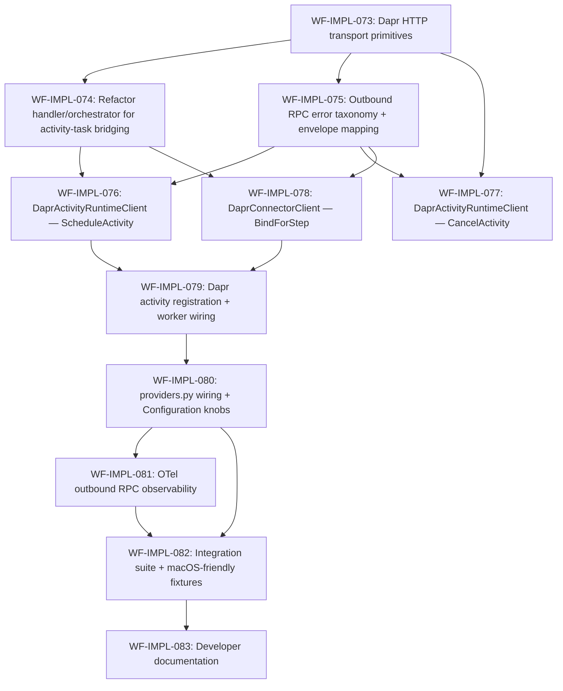

# `workflow-service` — Real ARM Client + Connector Client adapters Implementation Plan

> Derived from [`design/components/workflow-service/design.md`](design.md) on 2026-05-31.
> Source of truth: that design doc (§ Components → Activity Runtime Client / Connector Client, § Internal RPC (outbound — WF as caller), § Operation: Execute Step, § Failure Modes, § Configuration), the binding lock-in change record [`changes/2026-05-18-002-bundle-g-binding-completion.md`](changes/2026-05-18-002-bundle-g-binding-completion.md), the locked Protocols in [`src/services/workflow-service/src/custos_workflow/clients/activity_runtime.py`](../../../src/services/workflow-service/src/custos_workflow/clients/activity_runtime.py) (WF-IMPL-049) and [`src/services/workflow-service/src/custos_workflow/clients/connector.py`](../../../src/services/workflow-service/src/custos_workflow/clients/connector.py) (WF-IMPL-050), and the raw-`httpx`-against-the-Dapr-sidecar precedent established by [`DaprPubSubLifecyclePublisher`](../../../src/services/workflow-service/src/custos_workflow/runs/events.py).
> This plan is owned by the `implement-component` skill; regenerate fresh whenever the design changes.

## Summary

The workflow-service today ships **Protocol-typed stubs** (`NoopActivityRuntimeClient`, `NoopConnectorClient`) and **in-process fakes** (`FakeActivityRuntimeClient`, `FakeConnectorClient`) for the two outbound RPC clients the `ActivityStepHandler` (WF-IMPL-054) drives — `ActivityRuntimeClient.schedule_activity` / `cancel_activity` and `ConnectorClient.bind_for_step`. The locked Protocols + envelopes (WF-IMPL-049 / WF-IMPL-050) and the binding lock-in change record pin the call shape; the sidecar bootstrap token and `ConnectorContext` slot-handle model are out of scope here.

This sub-module ships the **production HTTP transports** behind those Protocols: a real `DaprActivityRuntimeClient` that calls the Activity Runtime Manager (COMP-006) and a real `DaprConnectorClient` that calls Connector Service (COMP-005), both via the **local Dapr sidecar's Service Invocation HTTP API** (`http://<DAPR_HOST>:<DAPR_HTTP_PORT>/v1.0/invoke/<app-id>/method/<method>`). The transports follow the same raw-`httpx`-against-the-sidecar precedent already in place for the Dapr Pub/Sub lifecycle publisher, including `httpx.MockTransport`-based unit tests, an opt-in flip in [`providers.py::load_run_components`](../../../src/services/workflow-service/src/custos_workflow/providers.py), an OTel span + counters surface for outbound RPC, an `ActivityResultEnvelope` mapping from upstream HTTP / transport errors to the locked `success | retryable | permanent | cancelled` classes, and a `ConnectorBindError` taxonomy gated against the WF-IMPL-048 `StepCoordinatorError` family.

WF-IMPL-074 is intentionally L-complexity because the current `ActivityStepHandler.execute` is a plain synchronous method that calls `bind_for_step` and `schedule_activity` inline — a Dapr Workflow orchestrator function must not perform arbitrary I/O inline, so both calls must travel through registered Dapr activity-task primitives. That refactor is part of this sub-module because the production transports cannot be wired without it.

## Conventions

- Task prefix: `WF-IMPL-`.
- Numbering starts at `WF-IMPL-073` (next free id after WF-IMPL-072 / issue [#458](https://github.com/toddysm/custos/issues/458); verified via `gh issue list --label component:workflow-service --search "WF-IMPL- in:title"`).
- One task = one PR = one GitHub issue.
- Labels per existing repo convention: `component:workflow-service`, `phase:implementation`, `type:implementation`. (No `phase:A`/`phase:B` labels in this repo — the phase grouping is reflected in this plan only.)
- Phases run sequentially; tasks within a phase may run in parallel if dependencies allow.
- Quality gate: `ruff format . && ruff check . && mypy src tests && pytest -q` from `src/services/workflow-service/`, honoring the existing `--cov-fail-under=90` floor.
- New code lives under `src/custos_workflow/clients/` (extending the existing `_dapr_invoke.py` / `_errors.py` siblings) plus `src/custos_workflow/runtime/dapr_activities.py` (the orchestrator-side yield-protocol dispatcher + Dapr activity-worker registration).

## Dependency graph

## Phase A — Foundations (transport + handler refactor + error taxonomy)

### `WF-IMPL-073`: Dapr Service-Invocation HTTP transport primitives

- **Scope**:
  - New `src/custos_workflow/clients/_dapr_invoke.py` housing `DaprInvokeEndpoint`, `build_invoke_url`, `read_dapr_env`, and the `DEFAULT_DAPR_HOST` / `DEFAULT_DAPR_HTTP_PORT` / `DEFAULT_OUTBOUND_RPC_TIMEOUT_SECONDS` constants plus the `DAPR_HTTP_HOST` / `DAPR_HTTP_PORT` env-var names.
  - No `httpx.AsyncClient` constructed here — adapters receive an already-built client by injection (lifespan-owned, per the existing `RunComponents.dapr_http_client` pattern).
- **Acceptance criteria**:
  - `build_invoke_url` produces the canonical Dapr Service-Invocation HTTP shape verbatim.
  - `DaprInvokeEndpoint` is frozen, hashable, and rejects empty `app_id` / `host` at construction.
  - `read_dapr_env` raises `RuntimeError` whose message names the missing var.
  - 100 % unit-test coverage on the new module.
- **Depends on**: _(none)_.
- **Complexity**: S.

### `WF-IMPL-074`: Refactor `ActivityStepHandler` + orchestrator to bridge ARM/Connector calls through Dapr activity tasks

- **Scope**: Refactor `ActivityStepHandler.execute` into a generator that yields `_BindCall` / `_ActivityCall` value objects; introduce `src/custos_workflow/runtime/dapr_activities.py` with the orchestrator-side dispatcher + in-process `FakeDaprActivityDispatcher` for the fake path; update `runs/orchestrator.py` to `yield from handler.execute(...)` for `StepKind.ACTIVITY`.
- **Acceptance criteria**: existing `tests/steps/test_activity_step.py` + `tests/runs/test_orchestrator*.py` continue to pass; orchestrator no longer calls `bind_for_step` / `schedule_activity` inline; new unit tests pin the yield protocol shape; coverage ≥ 90 %.
- **Depends on**: `WF-IMPL-073`.
- **Complexity**: L.

### `WF-IMPL-075`: Outbound RPC error taxonomy + `ActivityResultEnvelope` mapping

- **Scope**: New `src/custos_workflow/clients/_errors.py` with `OutboundRpcError` + four subclasses + `LOCKED_OUTBOUND_RPC_KINDS` frozenset + `LOCKED_OUTBOUND_RPC_KIND_TO_STATUS` companion dict. New `map_to_activity_envelope(exc, *, attempt) -> ActivityResultEnvelope` classifying transport / 408 / 429 / 5xx → `retryable`, 4xx → `permanent`, sidecar cancel → `cancelled`. New `ConnectorBindError(OutboundRpcError)` extending `custos_workflow.clients.connector`.
- **Acceptance criteria**: kind frozenset exhaustively pinned; envelope mapping exhaustively unit-tested across all status classes; returned envelopes always satisfy `ActivityResultEnvelope.__post_init__`; 100 % coverage.
- **Depends on**: `WF-IMPL-073`.
- **Complexity**: M.

## Phase B — Adapter implementations

### `WF-IMPL-076`: `DaprActivityRuntimeClient.schedule_activity`

- **Scope**: `DaprActivityRuntimeClient` class added to `clients/activity_runtime.py`; constructor `(http_client, endpoint, timeout)`; `schedule_activity(request)` marshals to canonical camelCase JSON, POSTs to `…/method/ScheduleActivity` with `Idempotency-Key: {run_id}|{step_id}|{attempt}`, parses response into `ActivityResultEnvelope`, maps `httpx` / HTTP errors through `map_to_activity_envelope`.
- **Acceptance criteria**: `httpx.MockTransport` tests cover 200 success / 200 permanent / 4xx / 5xx / 408 / 429 / transport timeout / 499 / decode failure; Idempotency-Key asserted on every request; 100 % coverage.
- **Depends on**: `WF-IMPL-074`, `WF-IMPL-075`.
- **Complexity**: M.

### `WF-IMPL-077`: `DaprActivityRuntimeClient.cancel_activity`

- **Scope**: `cancel_activity(run_id, step_id)` POSTs to `…/method/CancelActivity`; 200 / 204 / 404 / 409 are idempotent no-ops; 4xx (other than 404 / 409) → `OutboundRpcStatusError`; 5xx → `OutboundRpcStatusError`; transport → `OutboundRpcTransportError`.
- **Acceptance criteria**: `httpx.MockTransport` tests cover all paths; caplog asserts INFO on 404 / 409; 100 % coverage.
- **Depends on**: `WF-IMPL-073`, `WF-IMPL-075`.
- **Complexity**: S.

### `WF-IMPL-078`: `DaprConnectorClient.bind_for_step`

- **Scope**: `DaprConnectorClient` class in `clients/connector.py`; `bind_for_step(request)` marshals `step_key` + `slots` to canonical JSON, POSTs to `…/method/BindForStep`, parses response into `BindForStepResponse` with tz-aware `expiresAt`; transport / HTTP errors → `ConnectorBindError` with retryable/permanent flag.
- **Acceptance criteria**: `httpx.MockTransport` tests cover happy paths (one + many slots, capability order preserved), slot-name mismatch → `OutboundRpcDecodeError`, naive `expiresAt` → `OutboundRpcDecodeError`, 4xx / 5xx / 408 / 429 / transport mapped to `ConnectorBindError` per taxonomy; response `contexts` is always `MappingProxyType`; 100 % coverage.
- **Depends on**: `WF-IMPL-074`, `WF-IMPL-075`.
- **Complexity**: M.

## Phase C — Integration & wiring

### `WF-IMPL-079`: Dapr activity registration + worker wiring

- **Scope**: Extend `runtime/dapr_activities.py` (from WF-IMPL-074) with `arm_schedule_activity` + `connector_bind_for_step` Dapr activity functions; register both in `runtime/dapr.py::WorkflowRuntime.start()`; mirror registration in `FakeWorkflowRuntime` so in-process tests still pass; activity-side `OutboundRpcError` instances round-trip through Dapr with class + code + detail + cause preserved.
- **Acceptance criteria**: introspection surface lists both activities; round-trip test pins the error preservation; coverage on new module ≥ 95 %; service-wide ≥ 90 %.
- **Depends on**: `WF-IMPL-076`, `WF-IMPL-078`.
- **Complexity**: M.

### `WF-IMPL-080`: `providers.py` wiring + Configuration knobs

- **Scope**: `_build_activity_client(env)` + `_build_connector_client(env)` factories mirroring `_build_lifecycle_publisher`; activate `Dapr*Client` when `WF_ARM_ENDPOINT` / `WF_CONNECTOR_ENDPOINT` set; share the single lifespan-owned `httpx.AsyncClient` already lifespan-owned via `RunComponents.dapr_http_client`; read `WF_OUTBOUND_RPC_TIMEOUT_MS` (default 10000); update Configuration table in `docs/developers/workflow-api.md`.
- **Acceptance criteria**: four-branch coverage in `tests/test_providers.py`; assertion that shared `http_client` is the same object passed to both adapters; pin tests for the new Configuration rows; service-wide coverage ≥ 90 %.
- **Depends on**: `WF-IMPL-079`.
- **Complexity**: M.

### `WF-IMPL-081`: OTel outbound RPC observability

- **Scope**: Extend `_telemetry.py` with `custos_workflow_outbound_rpc_duration_ms` histogram, `custos_workflow_outbound_rpc_total` counter (outcome label), `custos_workflow_outbound_rpc_errors_total` counter (error.kind label); `@observe_outbound_rpc(client, method)` decorator emits `custos_workflow.outbound_rpc.call` span; applied to all three adapter methods.
- **Acceptance criteria**: outcome + error.kind label values pinned to `LOCKED_OUTBOUND_RPC_OUTCOMES` / `LOCKED_OUTBOUND_RPC_KINDS`; span attribute set pinned; per-outcome counter increments asserted; coverage on new code ≥ 95 %.
- **Depends on**: `WF-IMPL-080`.
- **Complexity**: M.

## Phase D — Verification & documentation

### `WF-IMPL-082`: End-to-end integration suite + macOS-friendly fixtures

- **Scope**: New `tests/integration/test_real_clients_end_to_end.py` driving `create_app()` → `FakeWorkflowRuntime` configured to dispatch the new Dapr activities to the real adapters → `httpx.MockTransport` mounted on the shared client; three scenarios — happy path, retryable scheduling failure with attempt retry, connector bind permanent failure; canonical Dapr URL shape asserted per call; runs on Linux CI + macOS local without Docker/Dapr.
- **Acceptance criteria**: three scenarios green on Linux CI + macOS local; ≥ 5 percentage points coverage delta on the two adapters + registration module; service-wide ≥ 90 %; URL path assertion on every outbound call; Idempotency-Key assertion on `ScheduleActivity`.
- **Depends on**: `WF-IMPL-080`, `WF-IMPL-081`.
- **Complexity**: M.

### `WF-IMPL-083`: Developer documentation — `docs/developers/workflow-outbound-rpc.md`

- **Scope**: New `docs/developers/workflow-outbound-rpc.md` (overview + Mermaid sequence diagram + RPC envelope tables + error taxonomy table + envelope mapping table + Configuration + OTel surface); new `tests/test_docs_examples_outbound_rpc.py` pinning every documented JSON example + error-kind set + canonical endpoint paths; row added to `docs/developers/README.md`; status block + tracker pointer updated in `src/services/workflow-service/README.md`; tick matching bullet in `design/components/workflow-service/todos.md`.
- **Acceptance criteria**: pin tests green; doc renders cleanly; service-wide coverage ≥ 90 %.
- **Depends on**: `WF-IMPL-082`.
- **Complexity**: M.

## Out of scope (deferred)

- **`RefreshLease`** for long-running steps. ARM owns the lease-refresh loop per [ARM § ScheduleActivity](../activity-runtime-manager/design.md); workflow-service only does the initial `BindForStep`.
- **Sidecar bootstrap token minting.** Pinned by [Bundle G change record](changes/2026-05-18-002-bundle-g-binding-completion.md): ARM mints and writes `/custos/in/sidecar-token` at sidecar start; it never travels through `ScheduleActivity`.
- **Durable `IdempotencyLedger`** (still tracked separately under the deferred-sub-modules section of [`todos.md`](todos.md)).
- **gRPC transport** for either adapter. v1 ships HTTP-only per the precedent set by the Pub/Sub publisher.

## Open questions

1. **`ActivityStepHandler` refactor scope** — `WF-IMPL-074` is intentionally L-complexity because converting `execute` from a sync method to a generator that yields Dapr activity-task tokens touches the StepResult dispatch path. We carry it inside this sub-module rather than splitting it out — confirmed in gate-1 review.
2. **Shared `httpx.AsyncClient`** — reuse `RunComponents.dapr_http_client` (already lifespan-owned for Pub/Sub) for outbound RPC. Confirmed in gate-1 review.
3. **Idempotency key shape on the wire** — `Idempotency-Key: {run_id}|{step_id}|{attempt}` using the existing `IdempotencyTriple` canonical encoding. Needs ARM-side confirmation that the wire encoding matches; if ARM expects a different shape, WF-IMPL-076 will adjust before merge.
4. **`WF_ARM_ENDPOINT` / `WF_CONNECTOR_ENDPOINT` semantics** — treated as Dapr **app-ids** (not URLs). Confirmed in gate-1 review.
5. **OTel span naming** — `custos_workflow.outbound_rpc.call` chosen; aligned with the existing `custos_workflow.*` namespace used in `_telemetry.py`.
