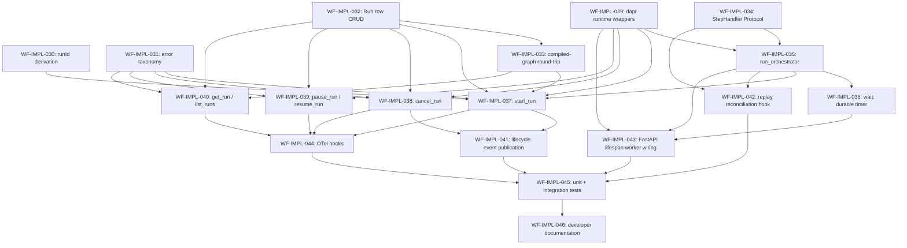

# `workflow-service` — Run Controller Implementation Plan

> Derived from [`design/components/workflow-service/design.md`](design.md) on 2026-05-28.
> Source of truth: that design doc plus [`design/architecture/overview.md`](../../architecture/overview.md) § Execution Model and [`design/architecture/components.md`](../../architecture/components.md) § COMP-003.
> This plan is owned by the `implement-component` skill; regenerate fresh whenever the design changes.

## Summary

The **Run Controller** is the third sub-module to be built inside the workflow-service host (after the Expression Evaluator at `src/libs/custos-cel/` and the Definition Compiler at `src/services/workflow-service/src/custos_workflow/compiler.py`). Per design.md § Internal Structure, it owns the **Dapr Workflow instance lifecycle** for every Custos `Run`: `start`, `pause`, `resume`, `cancel`, `terminate`; reconciles in-process state with Dapr Workflow durable state on pod restart / replay; and is the direct handler for the single step kind that maps to a durable timer — `wait:` / sleep. Step-body execution itself is the next sub-module (Step Coordinator) and is reached through a `StepHandler` Protocol that Run Controller publishes here.

Run Controller wires the first Custos→Dapr Workflow bridge in the codebase. It also wires the first runtime use of `MetadataStoreProvider` from the workflow-service host (`Run` / `Step` / `StepAttempt` row persistence), the first use of `custos.workflow.events` Pub/Sub publication (REQ-080), and the deterministic `runId` derivation that backs `(workspaceId, idempotencyKey)`-keyed idempotency on `StartRun`.

## Conventions

- Task prefix: `WF-IMPL-`.
- Numbering starts at `WF-IMPL-029` (next free id after the WF-IMPL-001..028 range used by `custos-cel` and the Definition Compiler; verified via `gh issue list --label component:workflow-service`).
- One task = one PR = one GitHub issue.
- Labels per existing repo convention: `component:workflow-service`, `phase:implementation`, `type:implementation`. (No `phase:A`/`phase:B` labels are used in this repo — the phase grouping is reflected in the implementation-plan only.)
- Phases run sequentially; tasks within a phase may run in parallel if dependencies allow.
- Quality gate: `ruff format . && ruff check . && mypy src tests && pytest -q` from `src/services/workflow-service/`, honoring the existing `--cov-fail-under=90` floor.
- `dapr-ext-workflow>=1.17,<2` is the canonical Dapr Workflow Python SDK. All Dapr imports live behind a thin `WorkflowRuntime` / `WorkflowClient` adapter so tests can swap a `FakeWorkflowRuntime`.

## Boundary with the Step Coordinator (next sub-module)

To keep this plan focused on Run-Controller responsibilities, the following are explicitly **out of scope** here and reached via the `StepHandler` Protocol introduced in WF-IMPL-034:

- Per-step retry policy decisions (delegates back to WF-IMPL-022 / -023 outputs already on the compiled graph).
- `BindForStep` calls to the Connector Service.
- `ScheduleActivity` calls to the Activity Runtime Manager.
- `RegisterResumeSubscription` lifecycle against the Trigger Service.
- Sub-orchestration spawn / await for `for:` / `approval:` / `workflow:` step kinds.
- `let:` inline-expression step execution (uses `custos-cel` directly).
- `step.*` event publication.

The Run Controller owns:

- The Dapr Workflow function registered for every Custos Run (graph walker + dispatcher loop).
- The `wait:` / sleep step kind — implemented as a Dapr durable timer because no external system is consulted.
- The `Run` row lifecycle (`queued` → `running` → `pausing`/`paused` → `cancelling`/`cancelled` / `succeeded` / `failed`).
- The `workflow.*` lifecycle events.
- Idempotent `runId` derivation.
- The `on_replay` hook that lets Step Coordinator re-register resume subscriptions.

## Dependency graph



## Phase A — Foundations (Dapr runtime, IDs, errors)

### `WF-IMPL-029`: Add Dapr Workflow runtime + client wrappers

- **Scope**:
  - `pyproject.toml` — add `dapr-ext-workflow>=1.17,<2` to runtime dependencies.
  - `src/custos_workflow/runtime/__init__.py` — public re-exports.
  - `src/custos_workflow/runtime/dapr.py` — `WorkflowRuntime` (registers workflow + activity functions, starts/stops the gRPC worker) and `WorkflowClient` (thin async adapter over `DaprWorkflowClient`: `schedule_new_workflow`, `get_workflow_state`, `terminate_workflow`, `pause_workflow`, `resume_workflow`, `raise_workflow_event`). Each method is a `@dataclass(frozen=True)` request + `await asyncio.to_thread(...)` to the sync SDK call so the host event loop never blocks.
  - `src/custos_workflow/runtime/fake.py` — `FakeWorkflowRuntime` + `FakeWorkflowClient` for tests; deterministic in-memory instance state with manual `step()`/`raise_event()`/`terminate()` controls.
  - `tests/runtime/test_fake.py` + `tests/runtime/test_dapr_adapter_shape.py` (latter only checks signatures/imports — no live Dapr sidecar).
- **Acceptance criteria**:
  - `WorkflowClient` / `WorkflowRuntime` are import-safe — no module-level Dapr connection attempts.
  - `FakeWorkflowRuntime` round-trips a 3-step orchestrator function and exposes `instance.status` / `instance.output` / `instance.history` for assertions.
  - `mypy src tests` clean; ruff clean; coverage on the two `runtime/` modules ≥ 95 %.
- **Depends on**: _(none)_.
- **Complexity**: M.

### `WF-IMPL-030`: Deterministic `runId` derivation

- **Scope**:
  - `src/custos_workflow/runs/ids.py` — `derive_run_id(workspace_id: str, idempotency_key: str | None) -> RunId`. With a key: UUIDv5 in a fixed namespace UUID (`RUN_ID_NAMESPACE = UUID("d8e6c1a4-0f3a-4f8a-9f1d-1c9b6e6a9c2d")`, locked in this task) over `f"{workspace_id}|{idempotency_key}"`. Without a key: `uuid4()`.
  - `RunId` is a `str` `NewType` for typing-only — instance-id in Dapr is a string.
  - `tests/runs/test_ids.py` — determinism property (same inputs → same id, 1000 Hypothesis examples); collision-resistance smoke; key-absent path returns distinct ids; workspace separation (same key, different workspace → different id).
- **Acceptance criteria**:
  - Deterministic-path output is byte-equal across 1000 calls with the same inputs.
  - Same idempotency key under two different workspaces yields two different ids.
  - Empty-string idempotency key is treated as "no key supplied" (matches WF-IMPL-008 input-validation idioms).
  - Coverage on the module = 100 %.
- **Depends on**: _(none)_.
- **Complexity**: S.

### `WF-IMPL-031`: Public Run Controller error taxonomy

- **Scope**:
  - `src/custos_workflow/runs/errors.py` — `RunControllerError` base + four locked subclasses:
    | Class | `kind` | Underlying builtin | Trigger |
    |---|---|---|---|
    | `RunNotFoundError` | `run.not_found` | `LookupError` | `get_run` / `cancel_run` against an unknown `runId`. |
    | `RunStateConflictError` | `run.state_conflict` | `RuntimeError` | Status transition disallowed by the state machine (e.g. `cancel` after `succeeded`). |
    | `RunStateCorruptError` | `run.state_corrupt` | `RuntimeError` | `Run.compiled_graph` JSON fails the WF-IMPL-018 `from_json` deserialization. |
    | `WorkflowRuntimeUnavailableError` | `run.runtime_unavailable` | `ConnectionError` | `WorkflowClient` call fails because the Dapr sidecar is unreachable. |
  - Every error: `to_dict()` JSON-safe with stable key ordering; structured `__repr__`; hashable; carries `run_id` when available.
  - `tests/runs/test_errors.py` — every class + every `kind` round-trips through `to_dict()`; subclass relationships hold.
- **Acceptance criteria**:
  - Locked `kind` strings appear in `custos_workflow.runs.errors.LOCKED_RUN_KINDS` as a `frozenset` so the WF-IMPL-027 OTel error counter can assert the closed set in WF-IMPL-044.
  - 100 % coverage on `runs/errors.py`.
- **Depends on**: _(none)_.
- **Complexity**: S.

## Phase B — Run row persistence

### `WF-IMPL-032`: `Run` row CRUD against `MetadataStoreProvider`

- **Scope**:
  - `src/custos_workflow/runs/store.py` — `RunStore` Protocol with `put_run`, `update_run_status`, `get_run`, `list_runs`; the in-process adapter delegates to `custos_spl.interfaces.metadata_store.MetadataStoreProvider`.
  - `src/custos_workflow/runs/model.py` — `RunRecord` (workflow-service-internal projection over the SPL `Run` dataclass) with `compiled_graph: ExecutionGraph | None` plus the explicit status enum: `queued | running | pausing | paused | cancelling | cancelled | succeeded | failed`.
  - `RunStore.update_run_status` enforces the transition table (every illegal transition raises `RunStateConflictError`).
  - `tests/runs/test_store.py` — uses an in-memory fake `MetadataStoreProvider` (already conventionally used by sibling services); exhaustive status-transition matrix.
- **Acceptance criteria**:
  - Status enum + transition table are pinned in the test as a single source of truth; adding a status without updating the transition table fails the build.
  - `put_run` is idempotent on `(workspace_id, run_id)` — a duplicate insert with byte-equal payload is a no-op; a divergent payload raises `RunStateConflictError`.
  - `list_runs` supports the SPL `Cursor`-based pagination.
  - Coverage on `runs/store.py` + `runs/model.py` ≥ 95 %.
- **Depends on**: WF-IMPL-031.
- **Complexity**: M.

### `WF-IMPL-033`: Compiled-`ExecutionGraph` JSON round-trip on `Run`

- **Scope**:
  - `RunRecord.compiled_graph` is serialized via the WF-IMPL-018 `to_json()` and re-hydrated via `from_json()` on read. Corruption raises `RunStateCorruptError` (WF-IMPL-031).
  - `tests/runs/test_compiled_graph_roundtrip.py` — byte-equal round-trip across 200 Hypothesis-generated `ExecutionGraph`s; corruption fixtures (truncated JSON, schema-version mismatch, garbage payload) raise `RunStateCorruptError` with the right `run_id` attached.
- **Acceptance criteria**:
  - `Run.compiled_graph` is the only path the orchestrator function uses at run time — the test asserts `Catalog` is never re-consulted post-start (mocked Catalog client raises if called).
  - Coverage delta: the round-trip module hits 100 %.
- **Depends on**: WF-IMPL-032.
- **Complexity**: S.

## Phase C — Workflow function + step-dispatch boundary

### `WF-IMPL-034`: `StepHandler` Protocol — the Step Coordinator boundary

- **Scope**:
  - `src/custos_workflow/runs/step_handler.py` — `StepHandler` `Protocol` with one method: `execute(self, ctx: StepExecutionContext, graph: ExecutionGraph, step_id: StepId) -> StepResult`. `StepExecutionContext` carries `run_id`, `workspace_id`, the Dapr workflow context (typed via the runtime wrapper, not the raw Dapr type), the per-run output bag, and the `Clock` (`custos_cel.DaprWorkflowClock`).
  - `StepResult` is a frozen union: `StepSucceeded(outputs)` / `StepFailed(envelope)` / `StepSkipped(reason)` / `StepWaiting(reason)` — the four shapes the orchestrator must dispatch on.
  - `NoopStepHandler` — explicit test default that raises `NotImplementedError("StepHandler.execute") unless the step kind is `let:`; lets us land the orchestrator in this plan without dragging Step Coordinator scope in.
  - `tests/runs/test_step_handler.py` — Protocol conformance (runtime_checkable), `StepResult` immutability, `NoopStepHandler` behaviour.
- **Acceptance criteria**:
  - Protocol is `runtime_checkable`; `NoopStepHandler` instance passes `isinstance(h, StepHandler)`.
  - `StepResult` variants are exhaustively enumerated in a `_STEP_RESULT_VARIANTS` tuple so future variants must also extend the orchestrator's match arms (build-time check).
  - Coverage on the module = 100 %.
- **Depends on**: _(none)_.
- **Complexity**: S.

### `WF-IMPL-035`: `run_orchestrator` workflow function

- **Scope**:
  - `src/custos_workflow/runs/orchestrator.py` — the Python function registered with `WorkflowRuntime` as `"custos.workflow.run"`. Inputs: `RunInput { workspace_id, workflow_version_id, compiled_graph_json, inputs, idempotency_key }`. Body:
    1. `from_json` the compiled graph (WF-IMPL-018).
    2. Walk topologically-sorted nodes (WF-IMPL-019).
    3. For each node, evaluate `if:` / `when:` / `unless:` guards through `custos_cel.evaluate` against a `BindingScope` derived from the per-run output bag + the workflow context's `current_utc_datetime` clock (Dapr-replay-safe per WF-IMPL-006).
    4. Dispatch surviving nodes through `StepHandler.execute(...)`; collect outputs into the bag.
    5. On the first `StepFailed`, short-circuit and return `RunOutput(status="failed", outputs=..., failed_step=...)`. On a `StepSkipped`, mark the node skipped and continue. On a `StepWaiting`, suspend the workflow (Step Coordinator owns the resume path).
    6. On full completion, return `RunOutput(status="succeeded", outputs=...)`.
  - Emits an `on_replay` callback exactly once per orchestrator entry (Phase E hooks into this).
  - `tests/runs/test_orchestrator.py` — drives the orchestrator under `FakeWorkflowRuntime` with a stubbed `StepHandler` that records dispatch order; covers (a) linear graph, (b) fan-out with stable ordering, (c) failed step short-circuits, (d) skipped step continues, (e) replay produces byte-equal dispatch sequence.
- **Acceptance criteria**:
  - Same compiled graph + same inputs + same `StepHandler` → identical dispatch sequence across 100 replays (asserted by `FakeWorkflowRuntime.history`).
  - Orchestrator never references `Catalog` (mocked Catalog raises if touched).
  - Coverage on `orchestrator.py` ≥ 95 %.
- **Depends on**: WF-IMPL-029, WF-IMPL-034.
- **Complexity**: L.

### `WF-IMPL-036`: `wait:` step handler — Dapr durable timer

- **Scope**:
  - `src/custos_workflow/runs/wait.py` — `WaitStepHandler` (a partial `StepHandler` for one kind) that calls `ctx.create_timer(duration)` on the Dapr workflow context and returns `StepSucceeded(outputs={})` when the timer fires. Duration parsed from `step.wait` (ISO-8601 duration string) at the time the step is reached.
  - The orchestrator (WF-IMPL-035) routes `kind=wait` directly to `WaitStepHandler` without consulting the generic `StepHandler` — `wait:` is the one kind Run Controller owns per design.md § Workflow Schema.
  - `tests/runs/test_wait.py` — short-duration timer fires; replay re-issues the same timer instance-id; invalid duration raises a `CompileError` at orchestrator entry (not a runtime error — the graph compiler should have caught it, but defensive guard exists).
- **Acceptance criteria**:
  - Fake runtime advances simulated time and asserts the timer completes deterministically.
  - Coverage on `wait.py` = 100 %.
- **Depends on**: WF-IMPL-035.
- **Complexity**: S.

## Phase D — Public lifecycle API

### `WF-IMPL-037`: `RunController.start_run`

- **Scope**:
  - `src/custos_workflow/runs/controller.py` — `RunController` class with dependencies (`WorkflowClient`, `RunStore`, `LifecycleEventPublisher`, `Compiler`, `Clock`) injected by `app.py`.
  - `start_run(workspace_id, workflow_version_id, inputs, idempotency_key) -> RunRef`:
    1. Derive `run_id` via WF-IMPL-030.
    2. Look up `(workspace_id, idempotency_key)` against the existing run window (WF-IMPL-032) — if a prior `RunRecord` exists with byte-equal `(workflow_version_id, inputs)`, return the existing `RunRef` (RFC-style idempotency).
    3. Otherwise: fetch the `WorkflowVersion` from the Catalog client (mocked at this stage — Catalog client wiring is a one-line FastAPI dependency injected by `app.py` in WF-IMPL-043), call WF-IMPL-021 `compile()`, persist `RunRecord(status="queued", compiled_graph=…)`.
    4. Call `WorkflowClient.schedule_new_workflow(workflow_name="custos.workflow.run", instance_id=run_id, input=RunInput(…))`.
    5. Transition `RunRecord` to `running`.
    6. Emit `workflow.started` (WF-IMPL-041).
  - `tests/runs/test_start_run.py` — happy path; idempotent replay; divergent inputs surface `RunStateConflictError`; runtime-unavailable bubbles `WorkflowRuntimeUnavailableError`.
- **Acceptance criteria**:
  - Idempotent path skips both Catalog and Dapr (asserted with mocks).
  - All status transitions appear in the audit fixture in the expected order.
  - Coverage on the `start_run` slice ≥ 95 %.
- **Depends on**: WF-IMPL-029, WF-IMPL-030, WF-IMPL-031, WF-IMPL-032, WF-IMPL-033, WF-IMPL-035.
- **Complexity**: L.

### `WF-IMPL-038`: `RunController.cancel_run`

- **Scope**:
  - `cancel_run(workspace_id, run_id, reason) -> RunRef`:
    1. Load `RunRecord` (raise `RunNotFoundError`).
    2. Status transition: `running → cancelling` (or `pausing` / `paused → cancelling`).
    3. `WorkflowClient.terminate_workflow(instance_id=run_id, reason=reason)`.
    4. Once Dapr returns confirmation (poll `get_workflow_state` until `TERMINATED` with bounded backoff), transition to `cancelled` and emit `workflow.cancelled`.
  - `tests/runs/test_cancel_run.py` — happy path; idempotent re-cancel on `cancelled`; rejected-transition on `succeeded` raises `RunStateConflictError`; runtime-unavailable surfaces `WorkflowRuntimeUnavailableError`.
- **Acceptance criteria**:
  - The poll-loop has a deterministic per-poll budget for testability.
  - Coverage on the `cancel_run` slice ≥ 95 %.
- **Depends on**: WF-IMPL-029, WF-IMPL-031, WF-IMPL-032, WF-IMPL-037.
- **Complexity**: M.

### `WF-IMPL-039`: `RunController.pause_run` / `resume_run`

- **Scope**:
  - `pause_run(workspace_id, run_id) -> RunRef` — `running → pausing` → `pause_workflow` → `paused`.
  - `resume_run(workspace_id, run_id) -> RunRef` — `paused → running` → `resume_workflow`.
  - `tests/runs/test_pause_resume.py` — full transition matrix.
- **Acceptance criteria**:
  - Illegal transitions raise `RunStateConflictError`.
  - Coverage ≥ 95 %.
- **Depends on**: WF-IMPL-029, WF-IMPL-031, WF-IMPL-032.
- **Complexity**: S.

### `WF-IMPL-040`: `RunController.get_run` / `RunController.list_runs`

- **Scope**:
  - `get_run(workspace_id, run_id) -> RunRecord` — hydrates from `RunStore` + (when status is non-terminal) overlays `WorkflowClient.get_workflow_state` for the most recent Dapr-side status snapshot.
  - `list_runs(workspace_id, filter, cursor, limit) -> Page[RunRef]` — delegates to `RunStore.list_runs`.
  - `tests/runs/test_get_list_runs.py` — covers terminal-status pure-store path, in-flight-status overlay path, unknown id raises `RunNotFoundError`.
- **Acceptance criteria**:
  - In-flight overlay never mutates the persisted `RunRecord` row (read-through projection only).
  - Coverage ≥ 95 %.
- **Depends on**: WF-IMPL-031, WF-IMPL-032, WF-IMPL-033.
- **Complexity**: S.

## Phase E — Events, replay, service wiring

### `WF-IMPL-041`: Workflow lifecycle event publication

- **Scope**:
  - `src/custos_workflow/runs/events.py` — `LifecycleEventPublisher` Protocol; `InMemoryLifecyclePublisher` (test default); `DaprPubSubLifecyclePublisher` (production — wraps `DaprClient.publish_event` against the configured `WF_PUBLISH_TOPIC`, default `custos.workflow.events`).
  - Producer-side dedup keyed on `(run_id, event_kind, occurred_at)` so Dapr replay does not double-publish.
  - Event kinds: `workflow.started`, `workflow.completed`, `workflow.failed`, `workflow.cancelled`. Envelope per design.md § Dapr Pub/Sub Publications.
  - `tests/runs/test_events.py` — every kind round-trips through the in-memory publisher; dedup absorbs replays; envelope schema matches the design.md subset.
- **Acceptance criteria**:
  - Dedup behaviour asserted under 100 simulated replays.
  - `DaprPubSubLifecyclePublisher` only depends on Dapr SDK symbols imported lazily so unit tests can run without an SDK install.
  - Coverage on `events.py` ≥ 95 %.
- **Depends on**: WF-IMPL-037, WF-IMPL-038.
- **Complexity**: M.

### `WF-IMPL-042`: Replay reconciliation hook

- **Scope**:
  - `src/custos_workflow/runs/replay.py` — `ReplayReconciler` Protocol with `on_replay(ctx: StepExecutionContext, graph: ExecutionGraph) -> None`. `run_orchestrator` (WF-IMPL-035) calls `reconciler.on_replay(...)` exactly once per orchestrator entry, *before* the first dispatch, so Step Coordinator can re-register resume subscriptions per design.md § Resume Subscription Replay Protocol.
  - `NoopReplayReconciler` test default.
  - `RunController` accepts an optional `replay_reconciler` dependency (default `NoopReplayReconciler`).
  - `tests/runs/test_replay.py` — reconciler is invoked exactly once per Dapr orchestrator entry, including across 50 simulated replays; missing reconciler defaults to noop without error.
- **Acceptance criteria**:
  - The orchestrator fires `on_replay` exactly once even when there are zero steps to dispatch (so the hook can sweep stale state).
  - Coverage on `replay.py` = 100 %.
- **Depends on**: WF-IMPL-034, WF-IMPL-035.
- **Complexity**: S.

### `WF-IMPL-043`: FastAPI lifespan worker wiring

- **Scope**:
  - `src/custos_workflow/app.py` — extend the existing lifespan: at startup, build a `WorkflowRuntime` (env var `WF_DAPR_WORKFLOW_COMPONENT` required — fail-fast `RuntimeError` with the variable name if unset), register `run_orchestrator` and `WaitStepHandler`, start the worker; gate `/readyz` on `workflow_runtime.is_ready()`; at shutdown, stop the worker with a 10 s grace period.
  - Inject `RunController`, `RunStore` (backed by an in-process `MetadataStoreProvider` adapter — wiring intentionally minimal here; the Postgres-backed wiring lands in a later infrastructure task), and `LifecycleEventPublisher` (`InMemoryLifecyclePublisher` by default, `DaprPubSubLifecyclePublisher` when `WF_PUBLISH_TOPIC` is set and the Dapr sidecar is reachable).
  - Tests use a `FakeWorkflowRuntime` provided via a `RunController` fixture so the existing app-shape tests stay sidecar-free.
  - `tests/test_app.py` — extend with `/readyz` 503-while-worker-starting case; worker-shutdown error never crashes lifespan.
- **Acceptance criteria**:
  - Existing Phase-A lifespan tests still pass (no regression).
  - With `WF_REQUIRE_CALL_CONTEXT=1` + `WF_DAPR_WORKFLOW_COMPONENT` set, importing `create_app` is still side-effect-free; the worker only starts inside the lifespan.
  - Coverage on the changed `app.py` slice ≥ 95 %.
- **Depends on**: WF-IMPL-029, WF-IMPL-035, WF-IMPL-036.
- **Complexity**: M.

## Phase F — Observability, verification, docs

### `WF-IMPL-044`: OTel observability hooks

- **Scope**:
  - Extend `src/custos_workflow/_telemetry.py` (the WF-IMPL-027 module) with:
    - Spans: `custos_workflow.run.{start,cancel,pause,resume,get,replay}`.
    - Histogram: `custos_workflow_run_lifecycle_call_duration_ms` (labels: `operation` ∈ {`start`,`cancel`,`pause`,`resume`,`get`,`list`}; `outcome` ∈ {`ok`,`conflict`,`runtime_unavailable`,`not_found`,`state_corrupt`}).
    - Counter: `custos_workflow_run_status_transitions_total` (labels: `from`, `to`).
    - Counter: `custos_workflow_workflow_events_emitted_total` (labels: `kind` ∈ the four `workflow.*` kinds).
  - `tests/test_observability.py` — extend with in-memory exporter assertions per operation × outcome matrix.
- **Acceptance criteria**:
  - Importing `custos_workflow` without an OTel SDK still no-ops (existing invariant preserved).
  - WF-IMPL-031 `LOCKED_RUN_KINDS` matches the `outcome` label set (build-time check).
  - Coverage on `_telemetry.py` stays at 100 %.
- **Depends on**: WF-IMPL-037, WF-IMPL-038, WF-IMPL-039, WF-IMPL-040.
- **Complexity**: M.

### `WF-IMPL-045`: Unit + integration test suite

- **Scope**:
  - Cross-cutting test layer that exercises the full lifecycle end-to-end:
    - `tests/integration/test_run_lifecycle.py` — `start_run → step dispatch (Noop) → succeeded`, `start_run → cancel_run → cancelled`, `start_run → pause → resume → succeeded`, `start_run → orchestrator failure → failed`, `start_run → wait step (5s simulated) → succeeded`.
    - `tests/integration/test_replay_safety.py` — drive `FakeWorkflowRuntime` through 100 replays of the same `RunInput`; assert byte-equal dispatch history and byte-equal lifecycle event sequence.
    - `tests/integration/test_kind_grid.py` — extend the WF-IMPL-025 grid with the new `Run.status` enum + `LOCKED_RUN_KINDS` so adding a member without a grid row fails the build.
  - Verify the global `--cov-fail-under=90` floor stays green.
- **Acceptance criteria**:
  - Project coverage ≥ 95 % (current ≈ 99 % — must not regress more than 4 pp).
  - Replay sequence equality is byte-equal under `json.dumps(history, sort_keys=True)`.
  - All quality gates clean from `src/services/workflow-service/`.
- **Depends on**: WF-IMPL-041, WF-IMPL-042, WF-IMPL-043, WF-IMPL-044.
- **Complexity**: L.

### `WF-IMPL-046`: Developer documentation

- **Scope**:
  - New file `docs/developers/workflow-run-controller.md`:
    - Lifecycle state machine (Mermaid).
    - Public API table — every `RunController` method, request/response shape.
    - `StepHandler` Protocol shape (so Step Coordinator authors know what to implement).
    - Dapr Workflow primitive mapping (Custos Run ↔ Dapr workflow instance, Custos `wait:` ↔ Dapr durable timer).
    - Replay determinism contract (what is guaranteed, what surfaces as `expression.divergence`).
    - Error taxonomy table (every `run.*` kind, trigger, recovery action).
    - Three worked examples (start → succeed, start → cancel, start → wait → succeed).
  - Link the new doc from `docs/developers/README.md`.
  - `tests/test_docs_examples.py` (new file) — parse each ```yaml``` block in the doc, push it through `compile()` + the `RunController` integration harness, and assert the documented terminal status.
  - Update [`src/services/workflow-service/README.md`](../../../src/services/workflow-service/README.md) status block: add the new sub-module milestone.
- **Acceptance criteria**:
  - Every documented public method has a matching signature in `RunController` (asserted by test reflection).
  - Every documented `run.*` kind appears in `LOCKED_RUN_KINDS`.
  - Quality gates clean; doc-examples test passes.
- **Depends on**: WF-IMPL-045.
- **Complexity**: M.

## Out of scope (deferred to Step Coordinator and beyond)

- `BindForStep` calls to Connector Service.
- `ScheduleActivity` calls to Activity Runtime Manager.
- `RegisterResumeSubscription` / `CancelResumeSubscription` against Trigger Service (the `on_replay` hook is in scope; the actual TS calls are not).
- Sub-orchestration spawn / await for `for:` / `approval:` / `workflow:`.
- `let:` inline-expression step execution.
- `step.*` event publication.
- API Adapter REST surface (`POST /v1/workspaces/{ws}/runs` etc.) — `RunController` is the in-process callee; the inbound HTTP surface is a separate sub-module (API Adapter).
- Validator sub-module (input schema-match, idempotency-key dedup as a first-class check) — `start_run` does the minimum dedup in-line but the broader Validator is its own sub-module.
- Postgres-backed `MetadataStoreProvider` wiring (WF-IMPL-032 uses the SPL Protocol; a follow-up infra task picks the concrete adapter).

## Open questions

- Does `RunController.pause_run` belong in this sub-module or in the API Adapter alongside `cancel`? Currently scoped here because Dapr Workflow's pause primitive is per-instance and aligns with the rest of the lifecycle API.
- Should `LifecycleEventPublisher` (WF-IMPL-041) live under `runs/` or be hoisted into a shared `events/` package that the future Observability Client (the dedicated sub-module) shares? Current plan keeps it under `runs/` and lets the Observability Client wrap it later.
- Confirm the `RUN_ID_NAMESPACE` UUID value before WF-IMPL-030 lands — once published it is part of the wire contract for `runId` determinism.
