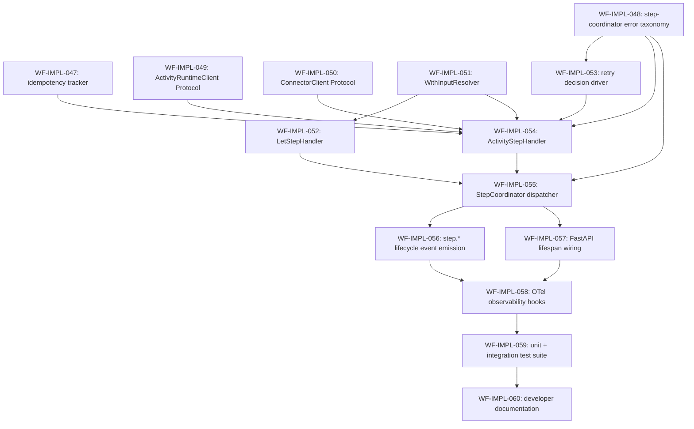

# `workflow-service` — Step Coordinator Implementation Plan

> Derived from [`design/components/workflow-service/design.md`](design.md) on 2026-05-29.
> Source of truth: that design doc plus [`design/architecture/components.md`](../../architecture/components.md) § COMP-003 and [`design/architecture/overview.md`](../../architecture/overview.md) § Execution Model.
> This plan is owned by the `implement-component` skill; regenerate fresh whenever the design changes.

## Summary

The **Step Coordinator** is the fourth sub-module to land inside the workflow-service host (`src/services/workflow-service/`, Python package `custos_workflow`), after the Expression Evaluator (`src/libs/custos-cel/`), the Definition Compiler (`custos_workflow.compiler` + `custos_workflow.graph` + `custos_workflow.retry` + `custos_workflow.on_error`, tracker [#363](https://github.com/toddysm/custos/issues/363)), and the Run Controller (`custos_workflow.runs`, tracker [#399](https://github.com/toddysm/custos/issues/399)). Per design.md § Internal Structure it *drives execution of one step at a time within a Run*: evaluates `with:` input expressions through `custos_cel`, derives the per-attempt `(runId, stepId, attempt)` idempotency triple, dispatches to the Activity Runtime Manager via a typed client boundary, applies the workflow-level retry policy on retryable failures (consuming the WF-IMPL-022/023 compiler outputs already materialised on every `ExecutionNode`), and emits the canonical `step.*` lifecycle events through the existing `LifecycleEventPublisher` (WF-IMPL-041).

Landing this sub-module is the unblock for end-to-end activity step execution: the Run Controller orchestrator (WF-IMPL-035) already routes every non-`wait:` node through the `StepHandler` Protocol (WF-IMPL-034); today's `NoopStepHandler` raises `NotImplementedError` for every kind except `let:`. After this sub-module merges, the orchestrator dispatches `activity:` + `let:` steps through real handlers and four step kinds (`waitFor:` / `for:` / `approval:` / `workflow:`) raise a typed `StepKindNotImplementedError` envelope until their owning sub-modules ship.

## Boundary with the deferred sub-modules

| Deferred sub-module | What it owns | Why it's out of scope here |
|---|---|---|
| **Resume Subscription Manager** | `waitFor:` step kind, `TriggerServiceClient` Protocol, `RegisterResumeSubscription` / `CancelResumeSubscription` RPC, `ResumeSubscriptionMirror` persistence (`MetadataStoreProvider`), replay re-registration through the WF-IMPL-042 reconciler hook. | Needs a new document-model step kind + a new outbound client + new persistence rows + replay plumbing — large enough to merit its own plan. The `step.waiting` lifecycle event slot already lands here (WF-IMPL-056) so the eventual sub-module just emits into it. |
| **Sub-Orchestration Manager** | `for:` (dynamic loop), `approval:` (gate + timeout), `workflow:` (sub-workflow call). Spawns child Dapr Workflow instances with deterministic `<parentRunId>/<stepId>/<iterationKey>` ids; awaits via `when_all` / `when_any`; merges outputs. | Each is a new document-model step kind, a new Dapr primitive, and a new lifecycle table. Step Coordinator dispatcher (WF-IMPL-055) returns `StepFailed(step.kind_not_implemented)` for all three until this sub-module ships. |
| **API Adapter + Validator** | Public REST surface (`POST /v1/workspaces/{ws}/runs`, `GET …/{runId}`, `POST …/{runId}:cancel`, …), inbound RPC for Trigger Service / API Gateway, `(workspaceId, idempotencyKey)` dedup window per design.md § Idempotency Model, inputs JSON-Schema match. | The Run Controller's internal `RunController.start_run` (WF-IMPL-037) is already the in-process entry point; the public-facing surface is a separate sub-module. |
| **Real ARM Client + Connector Client adapters** | Production `ActivityRuntimeClient` / `ConnectorClient` implementations that bridge Dapr Service Invocation to ARM (COMP-006) and Connector Service (COMP-005). | Protocols + test fakes ship here so Step Coordinator code is testable in isolation; the Dapr-backed adapters slot in behind the same Protocols without changing handler code. |
| **Full Observability Client integration** | Canonical workflow event taxonomy unification with TS-TODO-001 / ARM TODO-009 (INCON-013), Audit-event sink wiring, log-stream delegation for `GET …/steps/{stepId}/logs`. | `step.*` event publication lands here via the existing `LifecycleEventPublisher` shape (WF-IMPL-056). Cross-component taxonomy lock is tracked separately under TODO-001. |

## Conventions

- Task prefix: `WF-IMPL-`.
- Numbering starts at `WF-IMPL-047` (next free id after the WF-IMPL-001..046 range used by `custos-cel`, the Definition Compiler, and the Run Controller; verified via `gh issue list --label component:workflow-service`).
- One task = one PR = one GitHub issue.
- Labels per existing repo convention: `component:workflow-service`, `phase:implementation`, `type:implementation`. (No `phase:A`/`phase:B` labels in this repo — the phase grouping is reflected in this plan only.)
- Phases run sequentially; tasks within a phase may run in parallel if dependencies allow.
- Quality gate: `ruff format . && ruff check . && mypy src tests && pytest -q` from `src/services/workflow-service/`, honoring the existing `--cov-fail-under=90` floor.
- New code lives under `src/services/workflow-service/src/custos_workflow/steps/` (new package) plus `src/custos_workflow/clients/` (new package for outbound RPC client Protocols + test doubles). The existing `runs/` package keeps the Run-Controller-owned modules.

## Dependency graph

## Phase A — Foundations (IDs, errors)

### `WF-IMPL-047`: Idempotency Tracker — deterministic `(runId, stepId, attempt)` triples

- **Scope**:
  - New package `src/custos_workflow/steps/__init__.py`.
  - `src/custos_workflow/steps/idempotency.py` — `IdempotencyTriple` frozen dataclass (`run_id`, `step_id`, `attempt`); `derive_triple(run_id, step_id, attempt) -> IdempotencyTriple`; canonical wire form via `to_str()` = `f"{run_id}|{step_id}|{attempt}"` and `from_str()` round-trip; `IdempotencyTripleError` on parse failures.
  - `tests/steps/test_idempotency.py` — determinism (same inputs → byte-equal triple, 500 Hypothesis examples); `attempt >= 1` validation; round-trip `to_str() → from_str()`; rejection of `|` in `step_id`.
- **Acceptance criteria**:
  - Same `(run_id, step_id, attempt)` produces byte-equal `to_str()` across 500 calls.
  - `attempt < 1` raises `ValueError`.
  - Round-trip `from_str(triple.to_str()) == triple` holds for 200 Hypothesis examples.
  - Coverage on `steps/idempotency.py` = 100 %.
- **Depends on**: _(none)_.
- **Complexity**: S.

### `WF-IMPL-048`: Public Step Coordinator error taxonomy

- **Scope**:
  - `src/custos_workflow/steps/errors.py` — `StepCoordinatorError` base + five locked subclasses:
    | Class | `kind` | Underlying builtin | Trigger |
    |---|---|---|---|
    | `StepKindNotImplementedError` | `step.kind_not_implemented` | `NotImplementedError` | Dispatcher sees a step kind owned by a deferred sub-module (`waitFor`/`for`/`approval`/`workflow`). |
    | `WithInputResolutionError` | `step.with_input_resolution_error` | `ValueError` | A `with:` CEL expression fails type-check or evaluation. Wraps the underlying `custos_cel.CelError`. |
    | `ConnectorBindError` | `step.connector_bind_error` | `RuntimeError` | `ConnectorClient.bind_for_step` fails (RPC error, slot resolution failure). |
    | `ActivityScheduleError` | `step.activity_schedule_error` | `RuntimeError` | `ActivityRuntimeClient.schedule_activity` raises before returning an envelope. |
    | `RetryBudgetExhaustedError` | `step.retry_budget_exhausted` | `RuntimeError` | Retry driver detects `attempt >= maxAttempts` after a `do:retry` decision. Carries the last failure envelope. |
  - Every error: `to_dict()` JSON-safe with stable key ordering; structured `__repr__`; hashable; carries `run_id` / `step_id` when available.
  - `tests/steps/test_errors.py` — every class + every `kind` round-trips through `to_dict()`; subclass relationships hold; `LOCKED_STEP_KINDS` frozenset matches the table.
- **Acceptance criteria**:
  - `custos_workflow.steps.errors.LOCKED_STEP_KINDS` is a `frozenset` of exactly the five locked strings.
  - 100 % coverage on `steps/errors.py`.
- **Depends on**: _(none)_.
- **Complexity**: S.

## Phase B — Outbound client boundaries

### `WF-IMPL-049`: `ActivityRuntimeClient` Protocol + result envelope

- **Scope**:
  - New package `src/custos_workflow/clients/__init__.py`.
  - `src/custos_workflow/clients/activity_runtime.py`:
    - `ActivityRuntimeClient` runtime-checkable Protocol: `schedule_activity(request: ScheduleActivityRequest) -> ActivityResultEnvelope` (sync — matches the `StepHandler.execute` sync contract; the production adapter yields through `ctx.call_activity`).
    - `ScheduleActivityRequest` frozen dataclass: `run_id`, `step_id`, `attempt`, `activity_ref`, `inputs` (mapping), `connector_contexts` (mapping `slot_name → ConnectorContext`), `deadline` (datetime).
    - `ActivityResultEnvelope` frozen dataclass: `class_` (`Literal["success", "retryable", "permanent", "cancelled"]`), `outputs` (mapping or `None`), `error` (mapping or `None` — `{kind, message, code, codePrefix, retryAfter?}`), `attempt`.
    - `cancel_activity(run_id, step_id) -> None`.
    - `NoopActivityRuntimeClient` test default that raises `NotImplementedError`; tests wire a `FakeActivityRuntimeClient` that returns canned envelopes.
  - `tests/clients/test_activity_runtime.py` — Protocol runtime check; envelope immutability; round-trip a representative envelope through dataclass `replace`.
- **Acceptance criteria**:
  - Protocol is `runtime_checkable`.
  - `ActivityResultEnvelope.class_` is constrained to the four design.md values (Literal type asserted by mypy in tests).
  - Coverage on `clients/activity_runtime.py` = 100 %.
- **Depends on**: _(none)_.
- **Complexity**: M.

### `WF-IMPL-050`: `ConnectorClient` Protocol + `ConnectorContext`

- **Scope**:
  - `src/custos_workflow/clients/connector.py`:
    - `ConnectorClient` runtime-checkable Protocol: `bind_for_step(request: BindForStepRequest) -> BindForStepResponse`.
    - `BindForStepRequest`: `step_key` (string), `slots` (tuple of `SlotSpec(name, connector_ref, capabilities)`).
    - `BindForStepResponse`: `contexts` (mapping `slot_name → ConnectorContext`).
    - `ConnectorContext` frozen dataclass: `slot_name`, `handle` (opaque string the sidecar dereferences), `expires_at` (datetime), `connector_kind` (string).
    - `NoopConnectorClient` raising `NotImplementedError`; `FakeConnectorClient` returning canned contexts.
  - `tests/clients/test_connector.py` — Protocol runtime check; immutability; `ConnectorContext` is hashable.
- **Acceptance criteria**:
  - Protocol is `runtime_checkable`.
  - `BindForStepResponse.contexts` is a `MappingProxyType` snapshot (caller can't mutate).
  - Coverage on `clients/connector.py` = 100 %.
- **Depends on**: _(none)_.
- **Complexity**: S.

## Phase C — Step Coordinator core

### `WF-IMPL-051`: `WithInputResolver` — evaluate `with:` CEL expressions

- **Scope**:
  - `src/custos_workflow/steps/with_inputs.py`:
    - `WithInputResolver` class; `resolve(node: ExecutionNode, scope: BindingScope, clock: Clock) -> Mapping[str, Any]`.
    - Walks the node's `CallSiteKind.WITH` typed call-sites (already attached by the compiler in WF-IMPL-020), evaluates each via `custos_cel.evaluate`, and assembles the resolved input mapping for `ScheduleActivityRequest.inputs`.
    - Any underlying `custos_cel.CelError` is wrapped in `WithInputResolutionError` carrying `step_id` + source position + the original `kind` on `.cause_kind`.
  - `tests/steps/test_with_inputs.py` — empty `with:` block; nested `${{ }}` placeholder; type error path; evaluation error path; binding scope sees prior step outputs.
- **Acceptance criteria**:
  - All five locked CEL `kind`s round-trip into `WithInputResolutionError` with the underlying `kind` preserved on `.cause_kind`.
  - Resolver is pure (no I/O); receives the immutable per-run output bag via scope.
  - Coverage on the module = 100 %.
- **Depends on**: _(none)_.
- **Complexity**: M.

### `WF-IMPL-052`: `LetStepHandler` — inline expression evaluation

- **Scope**:
  - `src/custos_workflow/steps/let_step.py`:
    - `LetStepHandler.execute(ctx, graph, step_id) -> StepResult` matching the existing `StepHandler` Protocol.
    - Walks the `LetStep.let` mapping, evaluates each `name: expr` pair via `custos_cel.evaluate` against a `BindingScope` derived from `ctx.outputs` + the per-`let` overlay (later expressions in the same block see earlier `let.<name>` bindings, per design.md § `let` Primitive).
    - Returns `StepSucceeded(outputs={...})`; never schedules an activity, never binds a connector.
    - Wraps CEL errors as `StepFailed(envelope={kind: "step.with_input_resolution_error", …})` — `let:` errors map to the same taxonomy because they're semantically identical (CEL evaluation failure inside a step body).
  - Today the `NoopStepHandler` in `runs/step_handler.py` already handles `let:` inline — this task **moves** that logic into the dedicated handler and updates the `NoopStepHandler` to delegate to it.
  - `tests/steps/test_let_step.py` — single-binding; multi-binding with `let.<name>` cross-reference; type error; replay-determinism (two evaluations under same `FixedClock` produce byte-equal outputs).
- **Acceptance criteria**:
  - `let.a + let.b` reads `a` then `b` from the same-step overlay, not from `steps.*.outputs`.
  - Two `execute()` calls under the same `FixedClock` produce byte-equal `StepSucceeded.outputs`.
  - Coverage on `steps/let_step.py` = 100 %.
- **Depends on**: WF-IMPL-051.
- **Complexity**: S.

### `WF-IMPL-053`: Retry decision driver — `on_error` route walk + effective delay

- **Scope**:
  - `src/custos_workflow/steps/retry_driver.py`:
    - `RetryDecision` frozen union: `RetryNow(delay_seconds, next_attempt)` / `Skip(reason)` / `FailNow(envelope)`.
    - `decide(node, envelope, attempt, prev_delay_seconds, rng) -> RetryDecision`:
      1. Walk `node.on_error_routes` (already compiled — see [`src/services/workflow-service/src/custos_workflow/on_error/compile.py`](../../../src/services/workflow-service/src/custos_workflow/on_error/compile.py)) in declaration order; first match wins.
      2. On a `do:retry` arm: if `attempt + 1 > policy.max_attempts` → `FailNow` with a `step.retry_budget_exhausted` envelope; else compute `effectiveDelay`.
      3. Effective delay: `jitteredBackoff` per `policy.backoff.strategy` × `policy.jitter`, then `max(jitteredBackoff, retryAfter)` when `policy.respect_retry_after` is true AND envelope carries a `retryAfter` AND `class != cancelled/permanent`. Mirror the design.md § Backoff formulas + § Jitter strategies tables byte-for-byte.
    - `emit_retry_scheduled(node, decision, publisher)` — emits the `step.retry_scheduled` lifecycle event per design.md § Runtime behavior.
  - `tests/steps/test_retry_driver.py`:
    - All four `class` values routed correctly under the implicit-policy default and under explicit `on_error:` blocks.
    - All three `backoff.strategy` × all four `jitter` strategies produce delays within their documented intervals (50 Hypothesis examples per combination, `rng=Random(0)` for determinism).
    - `retryAfter` clamp: `effectiveDelay >= retryAfter` whenever `respectRetryAfter=true` and the class allows it.
    - `cancelled` short-circuits to `FailNow` even when `on_error:` declares a `do:retry` arm for it.
- **Acceptance criteria**:
  - Delay-bound assertions from design.md pinned as a single table-driven test.
  - `RetryBudgetExhaustedError` envelope carries the last underlying `code` / `codePrefix` / `class`.
  - Coverage on `steps/retry_driver.py` ≥ 98 %.
- **Depends on**: WF-IMPL-048.
- **Complexity**: M.

### `WF-IMPL-054`: `ActivityStepHandler` — full activity step lifecycle

- **Scope**:
  - `src/custos_workflow/steps/activity_step.py`:
    - `ActivityStepHandler(activity_client, connector_client, idempotency_tracker, retry_driver, publisher, clock)` — concrete `StepHandler.execute` for `StepKind.ACTIVITY`.
    - Body (matches design.md § Operation: Step Execution sequence diagram):
      1. Resolve `with:` inputs via `WithInputResolver`.
      2. Start `attempt = 1`. Loop:
         - `triple = idempotency_tracker.derive(run_id, step_id, attempt)`.
         - `contexts = connector_client.bind_for_step(...)` (fresh lease per attempt).
         - `publisher.emit_step_started(run_id, step_id, attempt)`.
         - `envelope = activity_client.schedule_activity(ScheduleActivityRequest(...))`.
         - Map envelope `class`:
           - `success` → `publisher.emit_step_completed(...)` → return `StepSucceeded(envelope.outputs)`.
           - `retryable` / `permanent` / `cancelled` → `retry_driver.decide(...)`:
             - `RetryNow(delay)` → `ctx.create_timer(delay)`; `attempt += 1`; loop.
             - `Skip(reason)` → `publisher.emit_step_skipped(...)` → return `StepSkipped(reason)`.
             - `FailNow(envelope)` → `publisher.emit_step_failed(...)` → return `StepFailed(envelope)`.
  - `tests/steps/test_activity_step.py` — success on first attempt; retryable → retry → success on second; retryable → policy exhausted → `StepFailed`; permanent → no retry; cancelled → immediate fail; `with:` resolution failure; `bind_for_step` failure; replay determinism (byte-equal results under same fakes + `FixedClock`).
- **Acceptance criteria**:
  - Every code-path in design.md § Operation: Step Execution sequence diagram has at least one test.
  - Coverage on `steps/activity_step.py` ≥ 95 %.
- **Depends on**: WF-IMPL-047, WF-IMPL-049, WF-IMPL-050, WF-IMPL-051, WF-IMPL-053.
- **Complexity**: L.

## Phase D — Coordinator integration

### `WF-IMPL-055`: `StepCoordinator` — concrete `StepHandler` dispatcher

- **Scope**:
  - `src/custos_workflow/steps/coordinator.py`:
    - `StepCoordinator(activity_handler, let_handler)` implements `StepHandler.execute(ctx, graph, step_id)`.
    - Dispatch table keyed by the node's `PrimitiveHandler` tag (see [`src/services/workflow-service/src/custos_workflow/graph/model.py`](../../../src/services/workflow-service/src/custos_workflow/graph/model.py)):
      | `PrimitiveHandler` | Routed to |
      |---|---|
      | `EXPRESSION_INLINE` (`let:`) | `LetStepHandler` |
      | `ACTIVITY_RUNTIME` (`activity:`) | `ActivityStepHandler` |
      | `RUN_CONTROLLER_TIMER` (`wait:`) | Defensive raise — this kind belongs to the Run Controller, not the dispatcher. |
      | `SUB_ORCHESTRATION` (`for:` / `approval:` / `workflow:`) | `StepFailed(envelope={kind: "step.kind_not_implemented", …})`. |
    - Build-time exhaustiveness: a one-line `assert` over `PrimitiveHandler` mirrors WF-IMPL-035's `_STEP_RESULT_VARIANTS` guard so a new handler tag must extend the dispatch table.
  - `tests/steps/test_coordinator.py` — every dispatch arm; `wait:` raises; `SUB_ORCHESTRATION` returns `StepFailed` with the deferred-kind envelope.
- **Acceptance criteria**:
  - Coordinator passes `isinstance(coord, StepHandler)`.
  - Adding a hypothetical `PrimitiveHandler.FOO` member without extending the table fails a unit test.
  - Coverage on `steps/coordinator.py` = 100 %.
- **Depends on**: WF-IMPL-048, WF-IMPL-052, WF-IMPL-054.
- **Complexity**: S.

### `WF-IMPL-056`: `step.*` lifecycle event emission

- **Scope**:
  - `src/custos_workflow/steps/events.py`:
    - `StepLifecyclePublisher` Protocol: `emit_step_started`, `emit_step_completed`, `emit_step_failed`, `emit_step_skipped`, `emit_step_waiting`, `emit_step_retry_scheduled`.
    - `LifecycleEventPublisherAdapter` — adapts the existing `runs.controller.LifecycleEventPublisher` (the `workflow.*` publisher) so we get one HTTP path. Adapter constructs the per-event envelope (`kind`, `runId`, `stepId`, `attempt`, `occurredAt`, optional `outputs` / `error` / `retry` block) per design.md § Dapr Pub/Sub Publications, dedup keyed on `(run_id, step_id, attempt, kind)`.
  - `tests/steps/test_events.py` — every emit method round-trips through `InMemoryLifecycleEventPublisher`; dedup absorbs replays; envelope schema asserted byte-for-byte against a fixture.
- **Acceptance criteria**:
  - Locked `step.*` event kinds (`step.started`, `step.completed`, `step.failed`, `step.skipped`, `step.waiting`, `step.retry_scheduled`) exported as a `frozenset`.
  - Envelope JSON ordering is stable (lexical key order).
  - Coverage on `steps/events.py` ≥ 95 %.
- **Depends on**: WF-IMPL-055.
- **Complexity**: M.

### `WF-IMPL-057`: FastAPI lifespan worker wiring

- **Scope**:
  - `src/custos_workflow/app.py` — extend the existing FastAPI lifespan (set up by WF-IMPL-043) so the `WorkflowRuntime` registers `make_run_orchestrator(step_handler=StepCoordinator(...))` instead of today's `NoopStepHandler`. Wire the production `ActivityRuntimeClient` / `ConnectorClient` **stubs** (the test doubles from WF-IMPL-049/050 — real Dapr-backed adapters land in the deferred sub-modules) so production startup doesn't crash before those land. Document the stub-only status in the README.
  - `tests/test_app_lifespan.py` — additional assertion that the orchestrator's `step_handler` is a `StepCoordinator` instance, not the `Noop` default.
- **Acceptance criteria**:
  - `pytest` exercises both the existing lifespan path and the new step-handler wiring.
  - README "Status" block updated to mention the Step Coordinator landing + stub clients.
- **Depends on**: WF-IMPL-055.
- **Complexity**: S.

## Phase E — Observability, verification, docs

### `WF-IMPL-058`: OTel observability hooks for the Step Coordinator

- **Scope**:
  - Extend `src/custos_workflow/_telemetry.py` with:
    - Spans: `custos_workflow.step.execute`, `custos_workflow.step.bind_connectors`, `custos_workflow.step.schedule_activity`, `custos_workflow.step.retry_decision`.
    - Histograms: `custos_workflow_step_execute_duration_ms` (labelled `step_kind`, `outcome`), `custos_workflow_activity_schedule_duration_ms` (labelled `step_kind`, `class`), `custos_workflow_step_attempts_total` (counter, labelled `step_kind`, `final_class`).
    - Counter: `custos_workflow_step_errors_total` (labelled `kind` — closed set = `LOCKED_STEP_KINDS` from WF-IMPL-048).
  - All metrics follow the existing `instrument(...)` helper pattern (no-op when SDK absent).
  - `tests/test_observability_steps.py` — in-memory exporter; every (handler, outcome) combination produces the expected metric sample + span status.
- **Acceptance criteria**:
  - Error counter only emits `kind` values present in `LOCKED_STEP_KINDS`.
  - Span attribute schema matches the documented set (one assertion per attribute).
  - Coverage delta on `_telemetry.py` does not regress the existing floor.
- **Depends on**: WF-IMPL-056, WF-IMPL-057.
- **Complexity**: M.

### `WF-IMPL-059`: Unit + integration test suite (≥ 90 % coverage gate)

- **Scope**:
  - `tests/integration/test_step_coordinator_end_to_end.py` — drive the full orchestrator using `FakeWorkflowRuntime` + `FakeActivityRuntimeClient` + `FakeConnectorClient` + a real `RunStore` + a real `LifecycleEventPublisher` (in-memory) + the real `StepCoordinator`. Scenarios:
    1. Single activity step success → `RunRecord.status == "succeeded"` + ordered `workflow.started`, `step.started`, `step.completed`, `workflow.completed` events.
    2. Multi-step graph (`let → activity → let`) with cross-step `${{ steps.X.outputs.* }}` references.
    3. Activity retry loop (envelope = retryable for attempts 1–2, success on 3) → `step.retry_scheduled` fired twice; final `step.completed`.
    4. Retry budget exhaustion → `RunRecord.status == "failed"` + `step.failed` with `step.retry_budget_exhausted` envelope.
    5. Cancelled mid-flight → `cancel_run` during `wait:` between retries → orchestrator returns `RunOutput(status="cancelled", …)`.
    6. Replay determinism — drive the orchestrator twice with the same `FakeWorkflowRuntime` history snapshot and assert byte-equal event stream + byte-equal final `RunRecord`.
  - `pyproject.toml` — ensure the `--cov-fail-under=90` gate applies to the new `steps/` + `clients/` packages (≥ 90 % each).
- **Acceptance criteria**:
  - All six integration scenarios pass.
  - Coverage report: `steps/` ≥ 90 %, `clients/` ≥ 90 %, package total ≥ 90 % (existing floor preserved).
- **Depends on**: WF-IMPL-058.
- **Complexity**: L.

### `WF-IMPL-060`: Developer documentation — `docs/developers/workflow-step-coordinator.md`

- **Scope**:
  - New `docs/developers/workflow-step-coordinator.md` modelled on the existing [`docs/developers/workflow-run-controller.md`](../../../docs/developers/workflow-run-controller.md). Sections:
    1. Sub-module overview + boundary with Run Controller and the deferred sub-modules.
    2. Dispatch table (`PrimitiveHandler` → handler).
    3. Activity step lifecycle (sequence diagram lifted from design.md).
    4. Retry policy application (precedence overlay + backoff/jitter + `retryAfter` interaction, with worked examples for each backoff/jitter combination).
    5. Idempotency triple — derivation, wire form, downstream usage (ARM / Connector lease / audit correlation).
    6. `step.*` event taxonomy — every kind + envelope schema + producer-side dedup rule.
    7. Locked error taxonomy table (one row per `LOCKED_STEP_KINDS` entry).
    8. Configuration knobs.
    9. Extension points — how the deferred sub-modules slot in on top of the existing Protocols.
  - Update [`docs/developers/README.md`](../../../docs/developers/README.md) index.
  - `tests/test_docs_step_coordinator_examples.py` — every CEL source string in the doc is parsed, type-checked, and evaluated against representative bindings (same pattern as `test_docs_examples.py`).
- **Acceptance criteria**:
  - Doc cross-references `design.md` § Internal Structure / § Operation: Step Execution / § Retry Policy.
  - All worked examples are exercised by the doc-examples test.
  - Coverage on any new docstrings ≥ 90 %.
- **Depends on**: WF-IMPL-059.
- **Complexity**: M.

## Out of scope (deferred sub-modules)

The following sub-modules are tracked in [`todos.md`](todos.md) § Deferred sub-modules and will each get their own implementation plan when prioritised:

- **Resume Subscription Manager** (`waitFor:` step kind + Trigger Service client + `ResumeSubscriptionMirror` persistence + replay re-registration).
- **Sub-Orchestration Manager** (`for:` / `approval:` / `workflow:` step kinds).
- **API Adapter + Validator** (public REST + inbound RPC + idempotency dedup window + inputs schema match).
- **Real ARM Client + Connector Client adapters** (Dapr Service Invocation bridges behind the Protocols this plan ships).
- **Full Observability Client integration** (cross-component event taxonomy lock per TODO-001).

## Open questions

1. Should `LetStepHandler` failures map to a *separate* `step.let_evaluation_error` kind, or share `step.with_input_resolution_error` as proposed? The plan currently reuses the latter to keep the taxonomy tight; flip if distinct kinds are preferred.
2. Should the `StepCoordinator` dispatcher return `StepFailed(step.kind_not_implemented)` for the four deferred kinds (current proposal) or raise an exception that the orchestrator converts to a run-level failure? Both are workable; the `StepFailed` route keeps the run alive long enough to capture the `step.failed` event in audit.
3. Coverage floor for `steps/activity_step.py` — proposed at 95 % because retry-loop branches are easy to under-cover; lower to 90 % to match the package floor exactly if preferred.
