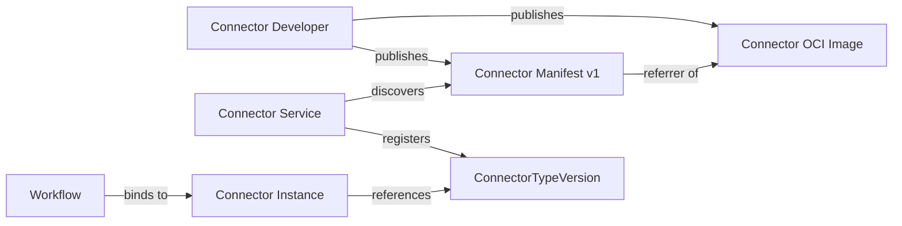

# Connections API Reference: Custos

Last Updated: 2026-05-16

This document describes the **Connector Manifest v1** contract. A connector manifest declares everything Custos needs to know about a connector type: what it targets, how it authenticates, what data-plane operations it supports, and what events it produces.

The normative schema lives at:

```
design/components/connector-service/schemas/connector-manifest.v1.schema.json
```

This document is the human-readable companion to that schema and should be read together with the [example manifests](examples/).

---

## Overview

A connector type is the integration logic that lets workflows reach an external system — an OCI registry, a cloud storage bucket, a KMS, an identity provider, etc. Each connector type is published as an OCI image; a separate OCI artifact carries the **connector manifest**, which is the document defined here.



The manifest is **self-contained**: target details and credential requirements are defined inline so the Connector Service can validate, register, and bind connector instances from the manifest alone.

---

## Discovery

The Connector Service discovers the manifest using one of two methods, in priority order:

1. **OCI Referrers API** (Distribution Spec v1.1) — query referrers of the connector image filtered by `artifactType = application/vnd.custos.connector.manifest.v1+json`. **Preferred.**
2. **Fallback tag convention** — fetch the manifest from the tag `<digest>.custos-connector-manifest-v1`, where `<digest>` is the normalized `sha256-<hex>` of the connector image.

Exactly one valid manifest must resolve per image. Zero or multiple valid manifests is a hard validation failure.

---

## Top-Level Structure

```json
{
  "apiVersion": "custos.dev/connector-manifest/v1",
  "kind": "ConnectorManifest",
  "metadata": { "...": "..." },
  "spec": {
    "description": "...",
    "capabilities": ["..."],
    "target": { "...": "..." },
    "credentials": { "...": "..." },
    "events": { "...": "..." }
  }
}
```

| Field | Type | Required | Description |
|---|---|---|---|
| `apiVersion` | const string | Yes | Must be `custos.dev/connector-manifest/v1`. |
| `kind` | const string | Yes | Must be `ConnectorManifest`. |
| `metadata` | object | Yes | Identity of the connector type version. |
| `spec` | object | Yes | Behavior, target binding, credentials, and events. |

All objects in the schema use `additionalProperties: false`. Unknown fields cause validation to fail.

---

## `metadata`

```json
"metadata": {
  "type": "oci-registry",
  "version": "2.3.1",
  "contractVersion": "1"
}
```

| Field | Type | Required | Description |
|---|---|---|---|
| `type` | string | Yes | Connector type slug. Lowercase alphanumeric with optional dashes, e.g. `oci-registry`, `azure-blob-storage`. Pattern: `^[a-z0-9](?:[a-z0-9-]{1,62})$`. |
| `version` | string | Yes | SemVer string for this type's version descriptor, e.g. `2.3.1` or `2.3.1-akv.1`. Pre-release and build metadata follow SemVer 2.0.0. |
| `contractVersion` | const string | Yes | Must be `"1"`. Identifies the connector contract version this manifest targets. |

**Usage notes:**

- `type` identifies the connector type *family*. All versions of the same family share the same `type` slug.
- `version` is immutable per published manifest; bumping a connector image must bump the version.
- Pre-release qualifiers (e.g. `-akv.1`, `-oidc.1`) are commonly used to distinguish builds that differ only in their authentication configuration.

---

## `spec.description`

A free-form human-readable description (1 to 4000 characters). Surfaced in the workflow authoring UI and connector catalog.

---

## `spec.capabilities`

A list of **data-plane verbs** the connector type can perform against its target.

```json
"capabilities": [
  "oci.pull",
  "oci.push",
  "oci.tag"
]
```

- Type: array of strings.
- Each string follows the pattern `^[a-z][a-z0-9-]*(?:\.[a-z0-9][a-z0-9-]*)+$` — dot-delimited lowercase tokens with at least one dot.
- `minItems: 1`, `uniqueItems: true`.

**Common verbs by target:**

| Target | Example verbs |
|---|---|
| `oci-registry` | `oci.pull`, `oci.push`, `oci.tag`, `oci.copy`, `oci.referrers` |
| `azure-blob-storage` | `blob.read`, `blob.write`, `blob.delete` |
| `amazon-s3-bucket` | `s3.read`, `s3.write`, `s3.delete` |

**Consumed by:**

- **Activity authors** declare required capabilities per connector input.
- **The Binder** (Connector Service) validates capability coverage at step bind time. Missing capability ⇒ bind failure before the activity runs.
- **The Catalog / UI** surfaces verbs for filtering and discovery during workflow authoring.

`capabilities` is purely about data-plane operations. **Event-stream concerns do not belong here** — they live in `events`. Do not put tokens like `event.push` or `oci.image.pushed` into `capabilities`.

---

## `spec.target`

Describes the external system this connector binds to. Common fields are kind-agnostic; type-specific configuration goes into `config`.

```json
"target": {
  "kind": "oci-registry",
  "endpoint": "https://myorg.azurecr.io",
  "verifyTls": true,
  "config": {
    "repositoryNamespace": "team-a"
  }
}
```

| Field | Type | Required | Description |
|---|---|---|---|
| `kind` | enum | Yes | One of `oci-registry`, `azure-blob-storage`, `amazon-s3-bucket`. |
| `endpoint` | string | Yes | HTTPS base endpoint URI of the target. Must start with `https://`. |
| `verifyTls` | boolean | No | Whether the connector must verify the server TLS certificate. Defaults to `true`. Set to `false` only for development against self-signed targets. |
| `config` | object | Yes | Type-specific configuration interpreted based on `kind`. See per-kind schemas below. |

### Per-kind `target.config` schemas

The shape of `target.config` is validated against a different sub-schema depending on `target.kind`. Each is a closed object (`additionalProperties: false`).

#### `kind: oci-registry`

```json
"config": {
  "repositoryNamespace": "team-a"
}
```

| Field | Type | Required | Description |
|---|---|---|---|
| `repositoryNamespace` | string | Yes | Repository namespace under the registry the connector is scoped to (1–512 chars), e.g. `team-a`, `platform/services`. |

#### `kind: azure-blob-storage`

```json
"config": {
  "storageAccount": "custosstorage",
  "container": "supply-chain-artifacts"
}
```

| Field | Type | Required | Description |
|---|---|---|---|
| `storageAccount` | string | Yes | Azure storage account name. Pattern: `^[a-z0-9]{3,24}$`. |
| `container` | string | Yes | Container name within the storage account. Pattern: `^[a-z0-9](?:[a-z0-9-]{1,61})[a-z0-9]$`. |

#### `kind: amazon-s3-bucket`

```json
"config": {
  "bucket": "custos-artifacts-prod",
  "region": "us-east-1"
}
```

| Field | Type | Required | Description |
|---|---|---|---|
| `bucket` | string | Yes | S3 bucket name. Pattern: `^[a-z0-9][a-z0-9.-]{1,61}[a-z0-9]$`. |
| `region` | string | Yes | AWS region code, e.g. `us-east-1`. Pattern: `^[a-z]{2}-[a-z]+-[0-9]$`. |

---

## `spec.credentials`

Describes the authentication mechanism the connector uses to reach its target.

```json
"credentials": {
  "authenticationType": "azure-key-vault",
  "authentication": {
    "secretRef": "https://custos-akv.vault.azure.net/secrets/registry-token",
    "connectorIdentity": "azure://managed-identity/custos-connector-mi"
  }
}
```

| Field | Type | Required | Description |
|---|---|---|---|
| `authenticationType` | enum or `x-*` string | Yes | Concrete authentication mechanism. See accepted values below. |
| `authentication` | object | Yes | Property bag interpreted according to `authenticationType`. `additionalProperties: true` to remain extensible. |

### Accepted `authenticationType` values

| Value | Mechanism |
|---|---|
| `azure-key-vault` | KMS-backed: secret material stored in Azure Key Vault. |
| `amazon-kms` | KMS-backed: secret material stored in AWS Secrets Manager and protected by KMS. |
| `azure-managed-identity` | Workload identity: connector uses an Azure managed identity directly. |
| `oidc` | Federated identity: connector exchanges an OIDC token for a target-system credential. |
| `x-<vendor>` | Vendor extension. Must match `^x-[a-z0-9][a-z0-9.-]{1,63}$`. Vendor types register their identity category and required `authentication` fields at plugin-registration time, out of band. |

### Identity categories (derived, not declared)

The Connector Service **derives** an internal identity category from `authenticationType`. Manifests do not declare it.

| Identity category | Concrete `authenticationType` values |
|---|---|
| `kms` (KMS-backed credentials) | `azure-key-vault`, `amazon-kms` |
| `workload` (workload identity) | `azure-managed-identity` |
| `federated` (federated identity) | `oidc` |

### Typical `authentication` field shapes

These are conventional shapes used by the canonical authentication types. The schema accepts additional fields to keep the contract extensible; future or vendor types may use different keys.

| `authenticationType` | Typical fields |
|---|---|
| `azure-key-vault` | `secretRef` (Key Vault secret URI), `connectorIdentity` (managed identity URI used to read from Key Vault) |
| `amazon-kms` | `secretRef` (Secrets Manager or KMS ARN), `connectorIdentity` (IAM role ARN used to read the secret) |
| `azure-managed-identity` | `identityRef` (managed identity URI), `audience` (target audience the token is acquired for) |
| `oidc` | `issuer` (OIDC issuer URL), `audience` (audience the IdP must mint), `subjectTemplate` (template for the federated subject claim) |

The connector manifest does not embed actual secret material. `secretRef`-style fields point to external secret stores; the runtime resolves them through the Connector Service's secret bridge.

---

## `spec.events`

Declares how the connector emits events and what events it produces. The Trigger Service uses this to wire up event listeners and to validate workflow trigger references.

`spec.events` is **optional** — sink/data-plane-only connectors that never deliver events may omit the block entirely (see change record `2026-05-17-005-incon-012-events-block-optional.md`). When present, the rules below apply.

```json
"events": {
  "delivery": [
    "push",
    "pull"
  ],
  "produced": [
    "oci.image.pushed",
    "oci.tag.updated"
  ],
  "pull": {
    "cursorEncoding": "oci-list-tags-v1",
    "initialCursorBehavior": "now"
  }
}
```

| Field | Type | Required | Description |
|---|---|---|---|
| `delivery` | array | Yes (when `events` is present) | Delivery mechanisms the connector supports. At least one. Each item is one of `push` or `pull`. `uniqueItems: true`. |
| `produced` | array | Yes (when `events` is present) | Catalog of normalized event types the connector emits. At least one. Tokens follow the dot-delimited lowercase pattern. `uniqueItems: true`. |
| `pull` | object | Yes whenever `delivery` contains `"pull"` | Pull-mode cursor contract. See `events.pull` below. |

### `events.delivery`

- `push` — the target system pushes events to the platform (webhook, message bus, change-feed subscription).
- `pull` — the platform polls or lists the target on a cadence to detect new events.

A connector may support both. The Listen Manager selects runtime wiring per mode at trigger activation: spinning up a webhook receiver, a polling loop, or a message-bus consumer.

The same `events.produced` catalog is available through any declared delivery mode. Per-event delivery mapping is intentionally out of scope for v1.

### `events.produced`

A flat list of normalized event type names. Each follows the dot-delimited lowercase token pattern, e.g. `oci.image.pushed`, `oci.tag.updated`, `s3.object.created`, `blob.object.deleted`.

**Consumed by:**

- **Workflow validator** — at workflow save time, confirms every trigger reference resolves to an event produced by some connector type in the workspace.
- **Trigger Service** — subscribes to these event types and matches them to workflow triggers at runtime.
- **Trigger UI / CLI** — autocomplete and discovery.
- **Audit / Catalog Service** — record of which event types are emitted by which connector type version.

### `events.pull`

Required whenever `events.delivery` contains `"pull"`. Locks the cursor contract the Connector Service uses to drive pull-mode polling.

```json
"pull": {
  "cursorEncoding": "oci-list-tags-v1",
  "initialCursorBehavior": "now"
}
```

| Field | Type | Required | Description |
|---|---|---|---|
| `cursorEncoding` | string | Yes | Connector-type-declared identifier for the cursor envelope shape. Pattern: `^[a-z][a-z0-9-]*(?:\.[a-z0-9][a-z0-9-]*)*$`. The Connector Service treats this value as opaque; only the connector type author understands its layout. Bumping the value triggers the Connector Service encoding-migration flow for all instances of this connector type, so it functions as the cursor schema version. |
| `initialCursorBehavior` | string | Yes | First-tick position when no operator-supplied cursor exists. One of `now` (skip everything before activation), `beginning` (replay from the earliest available event), or `custom` (the connector type declares its own start position; the operator must supply a cursor at instance creation time). |

**Migration semantics.** When a connector type publishes a new manifest version with a changed `cursorEncoding`, existing instances do not automatically re-anchor and the connector plugin must not accept the previous encoding as a one-time handoff. Instead, the Connector Service returns `CursorEncodingMismatch`, marks the instance `cursorMigrationRequired`, halts further ticks for that instance, and requires an operator-admin rewind before polling can resume under the new encoding.

See change record `2026-05-17-008-pull-cursor-model.md` for the full cursor lifecycle.

---

## Why `capabilities` and `events` are separate

These are orthogonal axes:

| Field | What it encodes | Primary consumer | When consumed |
|---|---|---|---|
| `capabilities` | Data-plane verbs (operations the connector can perform) | Binder | Step bind time |
| `events.delivery` | Event delivery mechanisms (`push` / `pull`) | Listen Manager | Trigger activation |
| `events.produced` | Event-type catalog (named events the connector emits) | Workflow validator, Trigger Service | Workflow save + trigger runtime |

Knowing a connector can `oci.pull` images does not tell you whether it can deliver `oci.image.pushed` events, and vice versa. Keep verbs in `capabilities` and event-stream concerns in `events`.

---

## Validation Checklist

Before publishing, verify your manifest meets all of the following:

- [ ] Validates against the JSON Schema with no errors.
- [ ] `apiVersion` is exactly `custos.dev/connector-manifest/v1`.
- [ ] `kind` is exactly `ConnectorManifest`.
- [ ] `metadata.contractVersion` is exactly `"1"`.
- [ ] `metadata.type` and `metadata.version` follow their patterns.
- [ ] `spec.target.kind` matches the shape of `spec.target.config`.
- [ ] `spec.target.endpoint` uses `https://`.
- [ ] `spec.credentials.authenticationType` is recognized (or is a registered `x-*` vendor type).
- [ ] `spec.credentials.authentication` carries the fields expected for the chosen `authenticationType`.
- [ ] `spec.capabilities` contains only data-plane verbs — no `event.*` tokens.
- [ ] If `spec.events` is present: `spec.events.delivery` has at least one of `push` or `pull`.
- [ ] If `spec.events` is present: `spec.events.produced` lists at least one normalized event type and matches the dot-delimited pattern.
- [ ] If `spec.events.delivery` contains `"pull"`: `spec.events.pull.cursorEncoding` and `spec.events.pull.initialCursorBehavior` are both set.
- [ ] No unknown top-level or nested fields (`additionalProperties: false` is enforced).

---

## Examples

Concrete manifests covering the supported target × authentication combinations live under [examples/](examples/):

- [`oci-registry-azure-key-vault.json`](examples/oci-registry-azure-key-vault.json) — OCI registry, KMS-backed credentials via Azure Key Vault.
- [`oci-registry-azure-managed-identity.json`](examples/oci-registry-azure-managed-identity.json) — OCI registry, Azure workload identity.
- [`oci-registry-oidc-federated.json`](examples/oci-registry-oidc-federated.json) — OCI registry, federated OIDC identity.
- [`amazon-s3-bucket-amazon-kms.json`](examples/amazon-s3-bucket-amazon-kms.json) — Amazon S3 bucket, AWS KMS-backed credentials.
- [`azure-blob-storage-azure-key-vault.json`](examples/azure-blob-storage-azure-key-vault.json) — Azure Blob Storage, KMS-backed credentials via Azure Key Vault.

---

## Change History

| Date | Change |
|---|---|
| 2026-05-16 | Initial connector manifest v1 reference for connection developers. |
