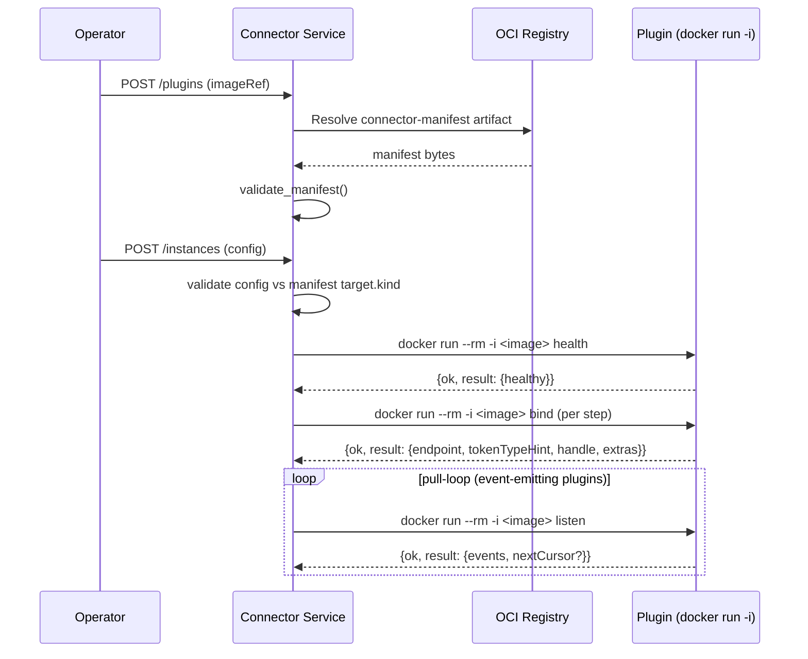

# Connector Plugin Author Guide

Last Updated: 2026-05-28

> This guide is for engineers writing **connector plugins** — the
> small executables the Connector Service invokes to bind workflows
> to external systems, listen for events, and report health. Pair
> this guide with the [Connections API reference](connections-api.md)
> (which covers the manifest schema in full) and the two reference
> plugins shipped in the repository:
>
> * [`src/libs/connector-plugins/oci-registry`](../../src/libs/connector-plugins/oci-registry/) — bidirectional registry connector
> * [`src/libs/connector-plugins/slack-notifier`](../../src/libs/connector-plugins/slack-notifier/) — sink connector (Slack incoming-webhook)

## Audience and scope

You are writing a plugin if you need Custos workflows to talk to a
system that the platform does not natively support. The Connector
Service treats every plugin as an opaque executable invoked over a
JSON-on-stdio contract: you can implement a plugin in any language
that can read stdin, parse JSON, and write JSON to stdout. The two
reference plugins are Python, but nothing in the wire contract is
Python-specific.

This guide covers:

1. [What a plugin actually is](#1-what-a-plugin-is)
2. [The connector manifest](#2-the-connector-manifest)
3. [Capability tokens](#3-capability-tokens)
4. [The hook wire contract](#4-the-hook-wire-contract)
5. [Error taxonomy](#5-error-taxonomy)
6. [Packaging and OCI publication](#6-packaging-and-oci-publication)
7. [Testing locally](#7-testing-locally)

For the API the activity sees once a connection is bound (the
"sidecar API"), see the [Connections API reference](connections-api.md).

---

## 1. What a plugin is

A connector plugin is a container image that ships:

* A **connector manifest** — a single JSON document describing the
  connector's type, capabilities, target shape, credential model, and
  events it produces or accepts. The manifest is the source of truth
  the Connector Service uses to gate registration, validate instance
  config, and discover compatible activities.
* An **entrypoint** — a process that reads a JSON request envelope on
  stdin, performs the requested hook (`bind`, `listen`, or `health`),
  and writes a JSON response envelope on stdout. The Connector
  Service runs the plugin with `docker run --rm -i <image> <hook>`
  and times each invocation out independently.

The connector manifest is published as an OCI artifact alongside the
image; the Connector Service resolves it via the OCI Referrers API
(or a deterministic fallback tag) when an operator registers the
plugin. See [§ 6 — Packaging and OCI publication](#6-packaging-and-oci-publication).

### Connector-Service ↔ Plugin call graph



---

## 2. The connector manifest

A v1 connector manifest is the JSON document validated by the schema
[`design/components/connector-service/schemas/connector-manifest.v1.schema.json`](../../design/components/connector-service/schemas/connector-manifest.v1.schema.json). The packaged copy that ships inside the Connector Service is byte-identical (enforced by a drift test).

```jsonc
{
  "apiVersion": "custos.dev/connector-manifest/v1",
  "kind": "ConnectorManifest",
  "metadata": {
    "type": "custos-<your-connector>",     // unique, kebab-case
    "version": "1.0.0",                    // SemVer
    "contractVersion": "1"                 // pinned for v1
  },
  "spec": {
    "description": "What this connector does.",
    "capabilities": ["<token>", "..."],
    "target": {
      "kind": "<oci-registry|azure-blob-storage|amazon-s3-bucket|slack-webhook>",
      "endpoint": "https://...",
      "verifyTls": true,
      "config": { ... }                    // shape depends on `kind`
    },
    "credentials": { ... },                // see Connections API § credentials
    "events": { ... }                      // optional; omit for sinks
  }
}
```

The two reference manifests show the two ends of the spectrum:

* The [`oci-registry`](../../src/libs/connector-plugins/oci-registry/connector-manifest.json) sample uses every capability token in the Tier‑1 `oci.*` group and ships a full `events` block (pull-mode with `oci-list-tags-v1` cursor encoding plus a push-mode receiver).
* The [`slack-notifier`](../../src/libs/connector-plugins/slack-notifier/connector-manifest.json) sample is intentionally minimal — a single capability, no `events` block, no `listen` implementation.

See the [Connections API reference](connections-api.md) for the
per-field reference, including the per-`target.kind` config schemas.

---

## 3. Capability tokens

Capabilities are the contract between a connector and the activities
that compose with it. An activity declares the capabilities it needs;
the Connector Service binds it only to connector instances whose
manifest advertises a superset.

The curated Tier‑1 registry lives in
[`design/architecture/capabilities.md`](../../design/architecture/capabilities.md).
The Connector Service rejects any manifest that uses a token in a
Tier‑1 prefix (`oci.*`, `blob.*`, `s3.*`, `kms.*`, `http.*`, `sql.*`,
`notification.*`) but is not in the curated list — see error code
`unknown-core-capability`.

For Tier‑2 or vendor-shaped capabilities use a vendor-prefixed name
under `x-<vendor>.*` (e.g. `x-acme.scan`). The Connector Service
records them, but cross-activity composition policies live with the
publisher.

When you advertise a capability the runtime exercises it: the `bind`
hook is called with the `(slot, capability)` tuple the workflow step
requested, and the plugin is expected to reject combinations it
doesn't actually support with a typed `invalid-response` error. See
the slack-notifier `_bind` implementation for the strict-validation
pattern.

---

## 4. The hook wire contract

### Invocation

```
docker run --rm -i <image_ref> <hook>
```

`<hook>` is one of:

| Hook | Direction | Purpose | Called when |
|---|---|---|---|
| `bind` | platform → plugin | Materialize a per-step credential / endpoint pair | Every workflow step that uses the connection |
| `listen` | platform → plugin | Pull mode: drain new events. Push mode: surface a receiver endpoint | Pull-loop tick, or activity attach time |
| `health` | platform → plugin | Self-check the upstream is reachable | Operator-triggered or background sweep |

The platform writes a single JSON request envelope to stdin and
reads a single JSON response envelope from stdout. No streaming, no
keep-alive, no out-of-band stderr semantics — stderr is captured
for human debugging but never parsed.

### Request envelope

```jsonc
{
  "apiVersion": 1,
  "hook": "bind" | "listen" | "health",
  "connector": {
    "type": "custos-...",          // from manifest.metadata.type
    "version": "1.0.0",
    "imageRef": "ghcr.io/.../image:1.0.0",
    "digest": "sha256:...",
    "manifest": { ... }            // the validated manifest, verbatim
  },
  "instance": {
    "workspaceId": "ws-...",
    "instanceId": "inst-...",
    "type": "custos-...",
    "version": "1.0.0",
    "name": "prod-registry",
    "enabled": true,
    "status": "active",
    "healthStatus": "healthy" | "degraded" | "unknown",
    "leaseTtlSeconds": 600,
    "targetConfig": { ... },       // operator-supplied `spec.target.config`
    "credentialsAuthentication": { ... },
    "usedCapabilities": ["..."]
  },
  "input": { ... }                 // hook-specific
}
```

The plugin SHOULD reject `apiVersion != 1` with
`invalid-response`. It MAY ignore fields it doesn't recognise — the
envelope is forward-compatible.

### `bind` hook

**Input:**
```jsonc
{ "slot": "source" | "sink" | "...", "capability": "oci.pull" }
```

**Response — success:**
```jsonc
{
  "ok": true,
  "result": {
    "endpoint": "https://registry.example.com/v2/team-a",
    "tokenTypeHint": "bearer" | "basic" | "none" | "...",
    "handle": { "any": "JSON-serialisable" },
    "extras": { "any": "JSON-serialisable" }
  }
}
```

The `endpoint` is the URL the activity calls. `tokenTypeHint` lets
the activity pick the right Authorization header shape. `handle`
opaquely carries plugin-private state the activity will pass back on
subsequent invocations. `extras` is a free-form bag for non-secret
hints (e.g. `verifyTls`, `connectorKind`).

### `listen` hook

**Input — pull mode:**
```jsonc
{ "mode": "pull", "cursor": { "encoding": "oci-list-tags-v1", "value": {...} } }
```

**Response — pull mode:**
```jsonc
{
  "ok": true,
  "result": {
    "events": [ { ... } ],
    "nextCursor": { "encoding": "oci-list-tags-v1", "value": {...} }
  }
}
```

If the persisted cursor encoding doesn't match what the plugin
expects, the plugin MUST raise `cursor-encoding-mismatch` with the
mismatched encodings in `error.data` — see the `oci-registry`
sample's `_listen` for the canonical pattern. The Connector Service
uses this signal to gate cursor reset workflows.

**Input — push mode:** `{"mode": "push"}`. The plugin returns a
receiver endpoint the upstream can POST events to.

Sink connectors (no `events` block) MUST return
`invalid-response` from `listen` — the slack-notifier sample
does this unconditionally.

### `health` hook

**Input:** `{}`.

**Response:**
```jsonc
{
  "ok": true,
  "result": {
    "healthy": true,
    "detail": "registry reachable",
    "checkedAt": "2026-05-28T03:15:00Z",
    "extras": { "instanceId": "inst-...", ... }
  }
}
```

A `healthy: false` response is still a *success* envelope — the
plugin reached the upstream and observed a degraded state. Only
truly unrecoverable failures (no network, library bug) should produce
an error envelope.

---

## 5. Error taxonomy

A plugin failure is always a JSON envelope on stdout, never a
non-zero exit code or stderr message. The runtime never interprets
stderr.

**Error envelope:**
```jsonc
{
  "ok": false,
  "error": {
    "code": "...",
    "detail": "human-readable, single line",
    "data": { ... }            // optional, machine-readable context
  }
}
```

The runtime treats unknown codes as `unknown-plugin-error`.

| Code | Meaning | Who raises it |
|---|---|---|
| `cursor-expired` | The persisted cursor refers to a window the upstream no longer retains | `listen` pull mode |
| `cursor-encoding-mismatch` | Persisted cursor encoding != plugin encoding | `listen` |
| `upstream-unauthorized` | Credentials present but rejected by upstream | any hook |
| `upstream-unreachable` | Network / DNS / TLS failure reaching upstream | any hook |
| `hook-timeout` | The plugin's internal timer fired before the upstream responded | any hook |
| `invocation-failed` | The hook was invoked with arguments the plugin can't fulfil (e.g. unknown slot) | `bind`, `listen` |
| `invalid-response` | Malformed request envelope OR plugin produced a structurally invalid response | both sides |
| `unknown-plugin-error` | Catch-all for unexpected exceptions; the runtime synthesises this if the plugin crashes | runtime |

The reference plugins' `__main__.py` shows the canonical "catch
`PluginError` → envelope, catch bare `Exception` → unknown-plugin-error
envelope, always exit 0" pattern.

---

## 6. Packaging and OCI publication

A connector plugin ships as **one OCI image** plus **one connector
manifest artifact** in the same repository:

* **Image:** any base; both reference plugins use `python:3.12-slim`
  with a non-root user. The `ENTRYPOINT` is the console script that
  reads stdin and writes stdout. Keep the image small: the Connector
  Service may pull it on every `bind` if image-caching is disabled.
* **Connector manifest artifact:** a tiny OCI artifact whose layer
  body is the JSON manifest, with
  `artifactType = application/vnd.custos.connector.manifest.v1+json`.

The Connector Service discovers the manifest in one of two ways:

1. **OCI Referrers API** — preferred when the registry supports it
   (Zot, Harbor, ACR, Artifact Registry). The manifest carries a
   `subject` reference pointing at the image manifest's descriptor.
2. **Deterministic fallback tag** — for registries that don't
   implement Referrers (notably the unconfigured CNCF
   `distribution/distribution` reference). The publisher tags the
   connector manifest with `custos-connector-manifest-v1_<digest>`
   where `<digest>` is `sha256-<hex>` derived from the image
   manifest's digest. Both reference samples are exercised against
   this path in CI.

The integration test
[`tests/integration/test_sample_plugins.py`](../../src/services/connector-service/tests/integration/test_sample_plugins.py)
publishes both reference plugins against live registry containers
(Zot for Referrers, `registry:2.8.3` for fallback-tag) on every run.

### Suggested publisher commands

ORAS-CLI is the simplest tool:

```sh
oras push \
  registry.example.com/custos-plugins/oci-registry:1.0.0 \
  --artifact-type application/vnd.custos.connector.manifest.v1+json \
  --subject registry.example.com/custos-plugins/oci-registry:1.0.0-image \
  connector-manifest.json:application/vnd.custos.connector.manifest.v1+json
```

For registries without Referrers support, ALSO tag the artifact with
the fallback tag derived from the image digest — see
`fallback_tag_for_digest` in
[`src/services/connector-service/src/custos_connector/manifest/discovery.py`](../../src/services/connector-service/src/custos_connector/manifest/discovery.py) for the deterministic transformation.

---

## 7. Testing locally

Both reference plugins ship a self-contained test layout you can copy:

```
<plugin>/
├── connector-manifest.json
├── Dockerfile
├── pyproject.toml          # hatchling, console script
├── README.md
├── src/<package>/
│   ├── __init__.py
│   ├── __main__.py         # stdin/stdout edge
│   └── plugin.py           # pure functions; unit-testable
└── tests/
    ├── __init__.py
    ├── test_plugin.py      # exercises handle() directly
    └── test_main_entry.py  # exercises sys.stdin → sys.stdout via capsys
```

A few patterns to copy:

* **Keep `__main__.py` thin.** All policy lives in `plugin.py`. The
  entry-point's only jobs are: parse stdin, dispatch to `handle()`,
  catch `PluginError` / bare `Exception`, and write the envelope.
* **Use `capsys` for entry-point tests.** Monkey-patching
  `sys.stdout` to a `StringIO` collides with pytest's default
  capture: the JSON ends up in pytest's capture buffer instead of the
  StringIO. Capture the bytes via `capsys.readouterr().out` instead.
* **Test the manifest with `validate_manifest`.** The Connector
  Service exposes `custos_connector.manifest.validator.validate_manifest`;
  call it from a unit test so a manifest typo fails CI before the
  Dockerfile is built.

To smoke-test the wire contract against a built image:

```sh
docker run --rm -i ghcr.io/example/custos-oci-registry:1.0.0 health \
  <<< '{"apiVersion":1,"hook":"health","connector":{...},"instance":{...},"input":{}}'
```

A well-formed plugin always returns exit code `0` and a single JSON
object on stdout.

---

## Related references

* [Connections API](connections-api.md) — full manifest schema reference
* [Capabilities](../../design/architecture/capabilities.md) — Tier‑1 token registry
* [Connector Service component design](../../design/components/connector-service/) — runtime, sidecar API, OCI discovery
* [Sample plugins index](../../src/libs/connector-plugins/README.md)
* [`examples/`](examples/) — minimal manifest stubs by `target.kind`
