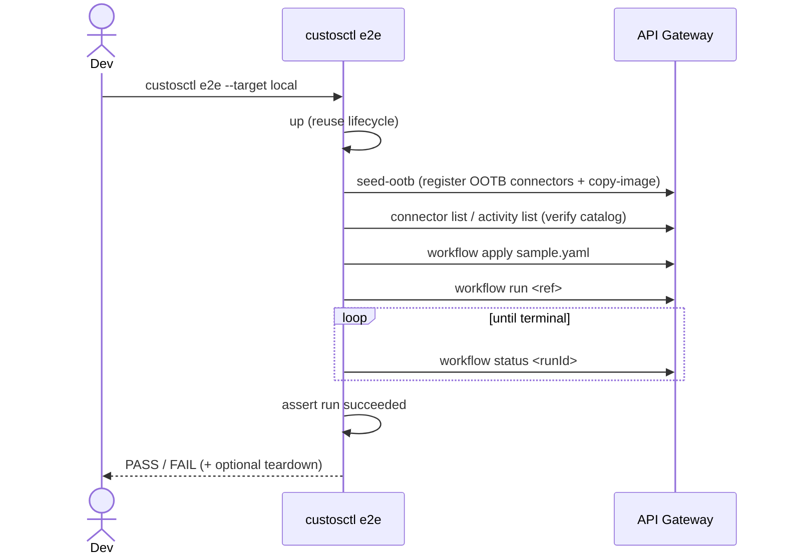

# `custosctl` — Local & Remote Dev/Test CLI

Last Updated: 2026-07-01

`custosctl` is the developer command-line tool for **standing up Custos and
driving the extension lifecycle end to end** — on a local
[`kind`](https://kind.sigs.k8s.io/) cluster or against an existing remote
kube-context. It is the scripted, single-binary equivalent of the notebook-style
[local-cluster quickstart](../users/evaluation/local-cluster.md): the same
`helm install`, prereqs, connector/activity onboarding, and workflow run, but as
idempotent subcommands you can chain in CI or a `Makefile`.

- Source & install notes: [`tools/custosctl/`](../../tools/custosctl/README.md)
- Design: [`design/components/custosctl/design.md`](../../design/components/custosctl/design.md)
- Component: COMP-011 · Milestone: 0.2

> **Scope (0.2).** `custosctl` targets the M1 evaluation build: single-cluster,
> pre-provisioned tokens, digest-pinned OOTB images. It talks to the platform
> through the **public API Gateway** for all catalog/workflow operations and
> shells out to the checkout's chart/scripts/`Makefile` only for the cluster
> lifecycle. It is a dev/test aid — not a production deployment tool.

## Install

```sh
pip install -e 'tools/custosctl[dev]'   # from a Custos checkout (editable)
custosctl --help
```

Requires Python 3.11+. The console entry point is `custosctl`
(`custosctl = "custosctl.cli:main"`).

## Targets

Every lifecycle command is **target-aware** via the global `--target` flag (or
`CUSTOS_TARGET`):

| Target | Cluster | `up` creates it? | `down` deletes it? | Prereqs default |
|---|---|---|---|---|
| `local` (default) | a `kind` cluster (`CUSTOS_CLUSTER`) | yes | yes (`kind delete`) | `install` |
| `remote` | a kube-context (`CUSTOS_KUBE_CONTEXT`, or the current one) | no | no (release only; `--force` also drops the namespace) | `skip` |

`local` is the laptop flow: create the cluster, install prereqs, and run
`helm install` (you build/load the images yourself — `up` does not). `remote`
operates against a cluster you already have (`CUSTOS_KUBE_CONTEXT`, defaulting
to kubectl's current context); it never creates or deletes the cluster itself,
only the Custos release (and, with `down --force`, the namespace and its PVCs).

## Command reference

`custosctl` exposes a CLI (not a network API). Global flags:
`--target {local,remote}`, `--yes`, `--verbose`. CLI flags override
`.env`/environment values.

### Lifecycle

| Command | Target-aware | Purpose |
|---|---|---|
| `custosctl doctor` | yes | Preflight: docker/kind/kubectl/helm versions (local); kube-context reachability (remote) |
| `custosctl up` | yes | Create/verify the cluster, install prereqs, `helm install`, wait for health |
| `custosctl status` | yes | Cluster/release/pod summary (+ gateway `/healthz`,`/readyz` when `CUSTOS_GATEWAY` is set) |
| `custosctl down [--yes] [--force]` | yes | `helm uninstall`; `local` also `kind delete`; `remote --force` also deletes the namespace (destructive) |

```sh
custosctl doctor                 # preflight the local (kind) toolchain
custosctl up                     # create kind cluster, prereqs, helm install --wait
custosctl status                 # cluster / release / pod summary
custosctl down --yes             # uninstall the release and delete the kind cluster

# Remote: operate against an existing kube-context (never creates/deletes the cluster)
export CUSTOS_TARGET=remote CUSTOS_KUBE_CONTEXT=my-cluster
custosctl up
custosctl down --yes --force     # ...also delete the namespace and its PVCs
```

### Catalog — connectors & activities

Needs `CUSTOS_GATEWAY` + `CUSTOS_TOKEN`. `register` always takes a local
extension folder (or a manifest file) as its `PATH`: the CLI reads the manifest
from there and derives a digest-pinned image reference from `CUSTOS_IMAGE_PREFIX`.
Pass `--image-ref <ref>@sha256:...` to override that derived image reference
(the manifest still comes from `PATH`).

| Command | Purpose |
|---|---|
| `custosctl connector register <path>` | Register a connector-type from an extension folder/manifest; `--image-ref` overrides the derived image |
| `custosctl connector list <type>` | List registered versions of a connector-type |
| `custosctl activity register <path>` | Register an activity-type from an extension folder/manifest; `--image-ref` overrides the derived image |
| `custosctl activity list <namespace> <name>` | List registered versions of an activity-type |

```sh
custosctl connector register extensions/connectors/dockerhub
custosctl connector register extensions/connectors/ghcr \
  --image-ref ghcr.io/acme/custos/ghcr:v0.1.0@sha256:...
custosctl connector list dockerhub
custosctl activity register extensions/activities/copy-image
custosctl activity list custos.builtin copy-image
```

### Workflows

Needs `CUSTOS_WORKSPACE` (or `--workspace`).

| Command | Purpose |
|---|---|
| `custosctl workflow apply <file>` | Create/update a workflow definition |
| `custosctl workflow run <ref> [--input k=v ...]` | Start a run |
| `custosctl workflow status <runId> [--watch]` | Show run status; `--watch` polls to a terminal state (exit 1 unless `succeeded`) |

```sh
custosctl workflow apply my-workflow.yaml
custosctl workflow run wfv-... --input image=ghcr.io/x:1
custosctl workflow status run-... --watch
```

### Onboarding & smoke test

| Command | Target-aware | Purpose |
|---|---|---|
| `custosctl seed-ootb [--allow-existing]` | no | Wrap [`scripts/seed-ootb.sh`](../../scripts/seed-ootb.sh) to onboard the OOTB catalog |
| `custosctl e2e [--teardown] [--skip-up] [--workflow <file>]` | yes | One-shot: `up` → seed → verify → apply → run → assert success |

`e2e` is the fastest full-platform check. It reuses the lifecycle, seeds the
OOTB catalog, applies a bundled `copy-image` sample workflow, runs it, and exits
non-zero on any failure:



```sh
custosctl e2e --teardown                       # local kind, torn down after
custosctl --target remote e2e --skip-up --workflow my-wf.yaml  # existing platform
```

## Configuration

Loaded via `pydantic-settings` from the environment or an optional `.env` file
using the `CUSTOS_` prefix; CLI flags take precedence.

| Variable | Required | Default | Description |
|---|---|---|---|
| `CUSTOS_TARGET` | No | `local` | `local` (kind) or `remote` (existing kube-context) |
| `CUSTOS_KUBE_CONTEXT` | No | `kind-<cluster>` (local) / current context (remote) | kube-context to operate against |
| `CUSTOS_CLUSTER` | No | `custos-local` | kind cluster name (local only) |
| `CUSTOS_KIND_NODE_IMAGE` | No | `kindest/node:v1.31.2` | kind node image (local only) |
| `CUSTOS_NAMESPACE` | No | `custos-system` | Release namespace |
| `CUSTOS_RELEASE` | No | `custos` | Helm release name |
| `CUSTOS_PROFILE` | No | `connected-eval` | Umbrella-chart values profile |
| `CUSTOS_IMAGE_PREFIX` | No | `ghcr.io/toddysm/custos` | Maps to `global.imageRegistry` |
| `CUSTOS_IMAGE_TAG` | No | `dev` (chart default) | Maps to `global.imageTag` |
| `CUSTOS_GATEWAY` | Yes (API cmds) | — | API Gateway base URL |
| `CUSTOS_TOKEN` | Yes (API cmds) | — | Platform-admin service token (`cst_...`) |
| `CUSTOS_WORKSPACE` | Yes (workflow cmds) | — | Default workspace for `workflow` commands |
| `CUSTOS_INSECURE` | No | `false` | Skip TLS verify for the eval self-signed cert |
| `CUSTOS_PREREQS` | No | `install` (local) / `skip` (remote) | Whether `up` runs `install-prereqs.sh` |
| `CUSTOS_REPO_ROOT` | No | autodetected | Custos checkout the lifecycle commands shell out to |
| `CUSTOS_HELM_TIMEOUT` | No | `15m` | `helm install --wait` timeout |

## Relationship to the evaluation quickstart

The [local-cluster quickstart](../users/evaluation/local-cluster.md) walks the
same steps as runnable notebook cells so you can read the *why* of each command.
`custosctl` collapses that flow into idempotent subcommands for repeatable and
CI use — `custosctl up` ≈ steps 2–6 (create cluster → prereqs → `helm install`),
`custosctl seed-ootb` ≈ the [copy-image walkthrough](../users/evaluation/copy-image-walkthrough.md)
onboarding, and `custosctl e2e` runs the whole thing plus a workflow assertion.
Use the quickstart to learn the platform; use `custosctl` to script it.

## Errors & exit codes

API commands surface the gateway's RFC 7807 (`application/problem+json`) error
`title`/`detail` and exit non-zero. `workflow status --watch` and `e2e` exit `1`
when the run does not reach `succeeded`. Lifecycle failures (a failed
`helm install`, an unreachable kube-context) propagate the underlying command's
message; re-run with `--verbose` for the full argv and output.

## Related documentation

| Document | Description |
|---|---|
| [`tools/custosctl/README.md`](../../tools/custosctl/README.md) | Install, usage cheatsheet, and developer/test workflow |
| [Local-cluster quickstart](../users/evaluation/local-cluster.md) | The notebook flow `custosctl` scripts |
| [Copy-image walkthrough](../users/evaluation/copy-image-walkthrough.md) | Manual OOTB onboarding + first workflow run |
| [OOTB Catalog Index](../../extensions/README.md) | The connectors/activities `seed-ootb` onboards |
| [Catalog API](catalog-api.md) / [Workflow Service API](workflow-api.md) | The REST surfaces the API commands call |
