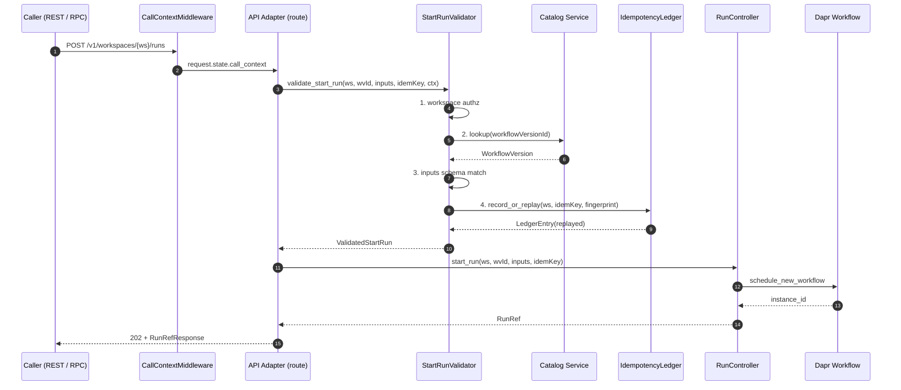

# Workflow Service Public API

Last Updated: 2026-06-04

## Audience

API consumers who drive Custos workflows from outside the cluster
through the public REST surface (operator tooling, the Custos UI,
end-user SDKs) and in-cluster siblings that drive workflows
through the Internal RPC surface (today the Trigger Service;
tomorrow any sibling that needs to issue `StartRun` /
`CancelRun` / `RaiseExternalEvent` without minting a public
HTTP request). Workflow-service contributors maintaining the API
Adapter + Validator sub-module should also start here — the
locked error taxonomy and idempotency contract documented below
are the source of truth the wire models and exception handlers
ship against. Workflow *authors* should start with the
[CEL Expressions](cel-expressions.md) and
[Workflow Compilation](workflow-compilation.md) docs — the
public API is concerned with *executing* workflows, not
*writing* them.

## Cross-references

- Design:
  [`design/components/workflow-service/design.md` § Public
  Interface](../../design/components/workflow-service/design.md#public-interface),
  [§ Idempotency Model](../../design/components/workflow-service/design.md#idempotency-model),
  [§ Operation: Start Run](../../design/components/workflow-service/design.md#operation-start-run),
  [§ Failure Modes](../../design/components/workflow-service/design.md#failure-modes),
  and [§ Configuration](../../design/components/workflow-service/design.md#configuration)
  — the canonical, locked contract for the API Adapter + Validator
  sub-module.
- Implementation plan:
  [`design/components/workflow-service/implementation-plan.md`](../../design/components/workflow-service/implementation-plan.md)
  — the WF-IMPL-061..072 task ledger that shipped this sub-module.
- Companion docs:
  [Workflow Run Controller](workflow-run-controller.md) — the
  in-process lifecycle owner the API Adapter dispatches into;
  [Workflow Step Coordinator](workflow-step-coordinator.md) —
  the per-step execution engine sitting under the Run Controller;
  [Auth API](auth-api.md) — call-context headers + workspace
  authorization model the API Adapter delegates to.
- Public Python surface:
  [`custos_workflow.api`](../../src/services/workflow-service/src/custos_workflow/api/__init__.py)
  (wire models, problem envelope, dependency factories, routers)
  and [`custos_workflow.validator`](../../src/services/workflow-service/src/custos_workflow/validator/__init__.py)
  (`StartRunValidator`, `IdempotencyLedger`).

## Overview

The API Adapter + Validator is the **fifth sub-module** in the
workflow service host. Its job is one sentence: *be the only way
into the Workflow Service from outside the process boundary*.
That covers the public REST surface (mounted under
`/v1/workspaces/{ws}/...`), the Internal RPC surface (mounted
under `/internal/...` for in-cluster siblings), pre-execution
validation (workspace authorization, workflow-version lookup,
inputs schema match, `(workspaceId, idempotencyKey)` dedup), and
the RFC 7807 `application/problem+json` envelope every error
travels in.

The Validator is the gatekeeper. Every `StartRun` walks four
gates before the Run Controller mints a run id:

1. **Workspace authorization** — the call-context workspace (set
   by `CallContextMiddleware` from the `X-Custos-Workspace` header)
   must match the path / body workspace; mismatch → 403
   `workflow.validator.workspace_unauthorized`.
2. **Catalog lookup** — the `workflowVersionId` must resolve via
   the bound `CatalogClient`; absent → 404
   `workflow.validator.workflow_version_not_found`.
3. **Inputs schema match** — the caller's `inputs` payload must
   validate against the workflow's published JSON Schema (derived
   from `spec.inputs`); violation → 422
   `workflow.validator.inputs_schema_error` with a structured
   `validation` extension carrying every rejected field.
4. **Idempotency ledger** — when the caller supplied a
   non-empty `idempotencyKey`, the
   `(workspaceId, idempotencyKey)` pair must either be absent
   from the ledger (a fresh request) or carry the *same*
   request fingerprint (a replay); a divergent fingerprint → 409
   `workflow.validator.idempotency_conflict`.

Only after all four gates pass does the validator return a
`ValidatedStartRun` to the route, which then forwards into
`RunController.start_run`. The controller's own dedup gate is the
second line of defence — every public REST `StartRun` walks both
ledgers.

The boundary with the Run Controller is sharp: the API Adapter
**never** touches Dapr Workflow, the persistent run store, the
metadata-store provider, or the step / activity wiring. It owns
the wire surface and the pre-execution gates; the Run Controller
owns everything below the FastAPI handler.



## REST API

All public routes live under `/v1/workspaces/{ws}/...`. The `{ws}`
path segment must match the canonical DNS-1123-like workspace
grammar (`^[a-z][a-z0-9-]{0,62}$`); a violation surfaces as a 400
`workflow.api.bad_request` envelope before any handler runs.

| Method | Path | Body | Success | Description |
|---|---|---|---|---|
| `POST` | `/v1/workspaces/{ws}/runs` | `StartRunRequest` | 202 `RunRefResponse` | Start a workflow run. Honors `Idempotency-Key` header per RFC; body field `idempotencyKey` wins when both are present. |
| `GET` | `/v1/workspaces/{ws}/runs` | — | 200 `RunListResponse` | List runs in workspace; supports `status`, `workflowVersionId`, `cursor`, `limit ≤ 200` query parameters. |
| `GET` | `/v1/workspaces/{ws}/runs/{run_id}` | — | 200 `RunResponse` | Fetch a single run plus its step timeline. |
| `POST` | `/v1/workspaces/{ws}/runs/{run_id}:cancel` | `CancelRunRequest` | 202 `RunRefResponse` | Request cancellation; idempotent against terminal-cancel states. |
| `GET` | `/v1/workspaces/{ws}/runs/{run_id}/steps/{step_id}` | — | 200 `StepResponse` | Fetch a single step's compiled-graph projection. |
| `GET` | `/v1/workspaces/{ws}/runs/{run_id}/steps/{step_id}/logs` | — | 501 `application/problem+json` | Documented stub — delegates to Observability Service (COMP-009) when the *Full Observability Client integration* sub-module lands. |

### Request envelope: `StartRunRequest`

`POST /v1/workspaces/{ws}/runs` and `POST /internal/runs:start`
share the same field set. The internal variant additionally
requires a top-level `workspaceId` body field because the
`/internal/` URL surface carries no `{ws}` path segment.

```json
{
  "workflowVersionId": "wfv-2026-05-31-abc",
  "inputs": {
    "image": "registry.example/app:1.2.3"
  },
  "idempotencyKey": "client-supplied-opaque-string"
}
```

- `workflowVersionId` — required; the Catalog `WorkflowVersion.id`
  the run instantiates.
- `inputs` — optional; defaults to `{}`. Validated at the
  Validator gate against the workflow's published JSON Schema.
- `idempotencyKey` — optional; falls back to the
  `Idempotency-Key` HTTP header. An empty string in either field
  is normalised to "no key supplied".

### Response envelope: `RunRefResponse`

The lightweight handle returned by `StartRun` (and reused as the
per-item shape inside `RunListResponse`).

```json
{
  "runId": "run-2026-05-31-xyz",
  "status": "running",
  "workspaceId": "ws-prod",
  "workflowVersionId": "wfv-2026-05-31-abc",
  "startedAt": "2026-05-31T12:34:56Z"
}
```

`status` is one of the locked `RunStatus` lifecycle values:
`queued`, `running`, `cancelling`, `cancelled`, `succeeded`,
`failed`. `startedAt` is `null` for adapters that return a
freshly-queued row before the runtime stamps a start time.

### Response envelope: `RunResponse`

`GET /v1/workspaces/{ws}/runs/{run_id}` returns the full run
record plus the step timeline so a single read serves the typical
UI / SDK workflow-detail screen without an N+1 follow-up.

```json
{
  "runId": "run-2026-05-31-xyz",
  "status": "succeeded",
  "workspaceId": "ws-prod",
  "workflowVersionId": "wfv-2026-05-31-abc",
  "reason": null,
  "startedAt": "2026-05-31T12:34:56Z",
  "updatedAt": "2026-05-31T12:35:42Z",
  "inputs": {},
  "outputs": null,
  "steps": []
}
```

Per-step lifecycle state + per-attempt history (`steps[]`,
`inputs`, `outputs`) ride on follow-on tasks; the wire shape is
contract-stable today so SDK clients can branch on field presence
without a future-breaking change.

### Cancel envelope: `CancelRunRequest`

```json
{
  "reason": "operator initiated; safety review escalation"
}
```

The `reason` field is optional and capped at 1024 characters; it
surfaces on every subsequent read of the run via
`RunResponse.reason`. Cancelling an already-cancelled or already-
cancelling run is an idempotent no-op that returns 202 with the
current `RunRef`. Cancelling a run that is already in a terminal
non-cancel state (`succeeded` / `failed`) surfaces the 409
`workflow.run_state_conflict` envelope.

### List envelope: `RunListResponse`

`GET /v1/workspaces/{ws}/runs` returns a paginated slice; the
opaque `nextCursor` is forwarded unchanged on the next request.

```json
{
  "items": [
    {
      "runId": "run-1",
      "status": "succeeded",
      "workspaceId": "ws-prod",
      "workflowVersionId": "wfv-2026-05-31-abc",
      "startedAt": "2026-05-31T12:34:56Z"
    }
  ],
  "nextCursor": "opaque-page-token"
}
```

An empty `items` list with a non-`null` `nextCursor` is a legal
"keep paging, nothing in this window" response. `nextCursor` is
`null` on the final page.

### Step envelope: `StepResponse`

`GET /v1/workspaces/{ws}/runs/{run_id}/steps/{step_id}` projects
the persisted run's compiled `ExecutionGraph` into a per-step
wire shape.

```json
{
  "stepId": "scan",
  "kind": "activity",
  "status": "pending",
  "attempts": [],
  "startedAt": null,
  "finishedAt": null,
  "outputs": null
}
```

`kind` is a free-form string (`activity`, `let`, `waitFor`,
`for`, `approval`, `workflow`) rather than an enum so additions
to the step-kind taxonomy do not force a breaking change to
this wire model. Per-step state plumbing lands with a follow-on
task; the fields are present today with stable defaults so SDK
clients can branch on field presence without a breaking change.

When the persisted run has no compiled graph yet, OR the
requested `stepId` is not a node in the compiled graph, the
route returns the 404 `workflow.step_not_found` envelope (the
two cases are intentionally collapsed so SDK branch logic stays
uniform).

### Step log stream stub

`GET /v1/workspaces/{ws}/runs/{run_id}/steps/{step_id}/logs` ships
as a documented 501 stub until the *Full Observability Client
integration* sub-module lands the real handler. The envelope is
locked so SDK clients can branch deterministically on `code`:

```json
{
  "type": "https://errors.custos.dev/workflow/api/not_implemented",
  "title": "Not implemented",
  "status": 501,
  "detail": "Step log streaming is delegated to the Observability Service (COMP-009); deferred until the Full Observability Client integration sub-module lands.",
  "instance": "/v1/workspaces/ws-prod/runs/run-1/steps/scan/logs",
  "code": "workflow.api.not_implemented",
  "workspaceId": "ws-prod",
  "runId": "run-1",
  "stepId": "scan"
}
```

## Internal RPC API

In-cluster siblings reach the workflow service through a flat
`/internal/...` prefix rather than the public
`/v1/workspaces/{ws}/...` shape. The prefix is the seam the Helm
chart / mesh uses to pin mTLS-only access. Because the workspace
is no longer carried in the URL, every Internal RPC body promotes
`workspaceId` to a top-level field.

| Method | Path | Body | Success | Description |
|---|---|---|---|---|
| `POST` | `/internal/runs:start` | `InternalStartRunRequest` | 202 `RunRefResponse` | Internal RPC: start a workflow run. Same idempotency contract as the public REST surface. |
| `POST` | `/internal/runs/{run_id}:cancel` | `InternalCancelRunRequest` | 202 `RunRefResponse` | Internal RPC: request cancellation. |
| `POST` | `/internal/runs/{run_id}/steps/{step_id}:raiseEvent` | `RaiseExternalEventRequest` | 202 (empty body) | Internal RPC: deliver an external event into a running workflow's `wait_for_external_event` step. |

### `InternalStartRunRequest`

```json
{
  "workspaceId": "ws-prod",
  "workflowVersionId": "wfv-2026-05-31-abc",
  "inputs": {
    "image": "registry.example/app:1.2.3"
  },
  "idempotencyKey": "trigger-service-issued-key"
}
```

### `InternalCancelRunRequest`

```json
{
  "workspaceId": "ws-prod",
  "reason": "trigger condition retracted"
}
```

### `RaiseExternalEventRequest`

```json
{
  "workspaceId": "ws-prod",
  "eventName": "approval.granted",
  "payload": {
    "approver": "user-123",
    "decision": "approve"
  },
  "idempotencyKey": "ts-event-0001"
}
```

Idempotency on this surface is keyed by
`(workspaceId, runId, stepId, eventName, idempotencyKey)` inside
the controller's in-process event-dispatch ledger. A duplicate
body within the `WF_IDEMPOTENCY_KEY_TTL` window is a no-op (still
returns 202) — no second event lands on the workflow. Omitting
`idempotencyKey` opts out of dedup entirely; every such call
dispatches.

## Locked error taxonomy

Every error a Run Controller method or a Validator method may
raise is translated into a single
`application/problem+json` envelope by the
[`register_exception_handlers`](../../src/services/workflow-service/src/custos_workflow/api/errors.py)
chain. The `code` extension field is the canonical
machine-readable selector for client branch logic; the `type`
URI MAY change in future without bumping the `code`.

| `code` | HTTP | Python class | Trigger |
|---|---|---|---|
| `workflow.run_not_found` | 404 | `RunNotFoundError` | `GetRun` / `CancelRun` / `RaiseExternalEvent` against an unknown run id. |
| `workflow.run_state_conflict` | 409 | `RunStateConflictError` | `CancelRun` against a run in terminal non-cancel state, OR `RaiseExternalEvent` against a run in any terminal state. |
| `workflow.workflow_runtime_unavailable` | 503 | `WorkflowRuntimeUnavailableError` | Dapr Workflow component is unreachable; new starts fail, in-flight runs pause at the next step boundary. |
| `workflow.validator.workflow_version_not_found` | 404 | `WorkflowVersionNotFoundError` | The `workflowVersionId` does not resolve in Catalog. |
| `workflow.validator.inputs_schema_error` | 422 | `InputsSchemaError` | Caller `inputs` failed the workflow's published JSON-Schema; carries a structured `validation` extension. |
| `workflow.validator.idempotency_conflict` | 409 | `IdempotencyConflictError` | `(workspaceId, idempotencyKey)` already maps to a *different* request fingerprint within the TTL window. |
| `workflow.validator.workspace_unauthorized` | 403 | `WorkspaceUnauthorizedError` | The call-context workspace disagrees with the path / body workspace. |
| `workflow.step_not_found` | 404 | — (route-local) | The persisted run carries no compiled step with the requested id (or the run has not yet been compiled). |
| `workflow.api.not_implemented` | 501 | — (route-local) | Documented stub route — today: step log streaming. |
| `workflow.api.bad_request` | 400 | — (catch-all) | Request body / query / path validation rejected by FastAPI / Pydantic. |

### Envelope shape (RFC 7807 + extensions)

```json
{
  "type": "https://errors.custos.dev/workflow/validator/inputs_schema_error",
  "title": "Inputs failed schema validation",
  "status": 422,
  "detail": "Caller-supplied inputs failed the workflow's published JSON-Schema.",
  "instance": "/v1/workspaces/ws-prod/runs",
  "code": "workflow.validator.inputs_schema_error",
  "workspaceId": "ws-prod",
  "validation": [
    {
      "loc": "/image",
      "code": "type_error.string",
      "message": "value is not a valid string"
    }
  ]
}
```

The base RFC 7807 fields (`type`, `title`, `status`, `detail`,
`instance`) are always present. The `code` field is always
present and is the canonical selector. Per-kind extension fields
(`runId`, `workflowId`, `workflowVersion`, `workspaceId`,
`idempotencyKey`, `validation`, `principal`,
`currentStatus`, `attemptedStatus`) appear only when known —
`null`-valued extras are stripped from the wire envelope.

The `validation[].loc` field is a JSON-pointer string per
[RFC 6901](https://www.rfc-editor.org/rfc/rfc6901) (`/image`,
not `["image"]`) so SDK clients can directly resolve the
offending field against the original request body without
re-parsing.

## Idempotency Model

Two layers operate end to end:

1. **`StartRun` idempotency** — caller-supplied `idempotencyKey`,
   dedup'd against `(workspaceId, idempotencyKey)` for a
   configurable TTL window (default `PT24H`, set via
   `WF_IDEMPOTENCY_KEY_TTL` per design.md § Configuration).
2. **Step-attempt idempotency** — engine-derived
   `(runId, stepId, attempt)` triple. Owned by the Step
   Coordinator and out of scope for this doc; see the
   [Step Coordinator developer doc](workflow-step-coordinator.md)
   for the full surface.

### Precedence: header vs body

The wire surface accepts the idempotency key in two places:

- The `Idempotency-Key` HTTP header (RFC draft "The
  Idempotency-Key HTTP Header Field").
- The `idempotencyKey` body field on
  `StartRunRequest` / `InternalStartRunRequest`.

When both are present, **the body field wins**. The empty string
in either field is normalised to "no key supplied". This means
callers can opt out of the header per-request without removing
the header entirely:

```bash
# Header alone — falls through to the validator.
curl -X POST https://wf.custos.example/v1/workspaces/ws-prod/runs \
  -H 'Idempotency-Key: client-supplied-key' \
  -H 'Content-Type: application/json' \
  -d '{"workflowVersionId": "wfv-1"}'

# Body field overrides header.
curl -X POST https://wf.custos.example/v1/workspaces/ws-prod/runs \
  -H 'Idempotency-Key: header-key-ignored-because-body-present' \
  -H 'Content-Type: application/json' \
  -d '{"workflowVersionId": "wfv-1", "idempotencyKey": "body-key-wins"}'

# Body field set to empty string — opts out, header ignored too.
curl -X POST https://wf.custos.example/v1/workspaces/ws-prod/runs \
  -H 'Idempotency-Key: also-ignored' \
  -H 'Content-Type: application/json' \
  -d '{"workflowVersionId": "wfv-1", "idempotencyKey": ""}'
```

### Replay vs conflict

The `(workspaceId, idempotencyKey)` pair maps to a *request
fingerprint* — a canonical-JSON SHA-256 of the
`(workflowVersionId, inputs)` pair computed by
[`compute_request_fingerprint`](../../src/services/workflow-service/src/custos_workflow/validator/idempotency_ledger.py).
Within the TTL window:

| Lookup outcome | Validator action | Response |
|---|---|---|
| Key absent from ledger | Mint fresh entry, mark `replayed=False`. | `202` with a fresh `RunRef`; OTel counter `custos_workflow_idempotency_outcomes_total{outcome="fresh"}` bumps. |
| Key present, fingerprint **matches** | Reuse stored entry, mark `replayed=True`. | `202` with the *original* `RunRef` (no second Catalog round-trip, no second Dapr instance); counter `{outcome="replay"}` bumps. |
| Key present, fingerprint **differs** | Raise `IdempotencyConflictError`. | `409 application/problem+json` with `code="workflow.validator.idempotency_conflict"` and the `idempotencyKey` extension; counter `{outcome="conflict"}` bumps. |

Once the TTL window expires, the entry is garbage-collected
lazily and a subsequent request with the same key is treated as
fresh. Requests that omit the key entirely produce no counter
sample (the `fresh/replay/conflict` split is meaningless when
the caller opted out).

## Configuration

The API Adapter sub-module reads three environment variables
directly; the rest of the workflow-service host's config
([`README.md` § Configuration](../../src/services/workflow-service/README.md#configuration))
remains the source of truth for the variables the validator
collaborators (Catalog client, Dapr Workflow component, etc.)
bind against.

| Variable | Required | Default | Description |
|---|---|---|---|
| `WF_REQUIRE_CALL_CONTEXT` | No | unset (dev mode) | When set to `"1"`, `CallContextMiddleware` rejects requests lacking either the `X-Custos-Workspace` or `X-Custos-Principal` header with a 401. Dev mode (any other value) injects placeholder values so test fixtures and local-dev runs do not need to mint real auth headers. |
| `WF_IDEMPOTENCY_KEY_TTL` | No | `PT24H` | ISO-8601 duration window for `(workspaceId, idempotencyKey)` dedup. Months/years are rejected (the resulting calendar-dependent window is incompatible with the ledger contract). |
| `WF_CATALOG_ENDPOINT` | Yes (production) | — | Catalog Service endpoint the validator's `CatalogClient` resolves `workflowVersionId` against. |

## Observability

Each inbound request walks the `OTelHttpServerMiddleware` so the
API surface ships a uniform metric + span shape, regardless of
which route handles the request.

### Metrics

| Instrument | Kind | Labels | Source |
|---|---|---|---|
| `custos_workflow_http_server_duration_ms` | Histogram (ms) | `http.method`, `http.route` (template path, NOT live URL), `http.status_code` | One sample per request, recorded by `OTelHttpServerMiddleware`. |
| `custos_workflow_api_errors_total` | Counter | `wf.error.kind` (a member of the locked taxonomy above) | Bumped exactly once per Problem+JSON-emitting request, by the matching exception handler. |
| `custos_workflow_idempotency_outcomes_total` | Counter | `wf.idempotency.outcome ∈ {fresh, replay, conflict}` | Bumped exactly once per `StartRun` that supplied an idempotency key; requests without a key produce no sample. |

Label cardinality is explicitly bounded: `http.route` is the
FastAPI template path (`/v1/workspaces/{ws}/runs/{run_id}`), so a
pathological client cannot mint a fresh metric series per unique
URL.

### Spans

A single `custos_workflow.http.request` span wraps every inbound
request. Attributes:

| Attribute | Semantic | Source |
|---|---|---|
| `http.method`, `http.route`, `http.status_code` | Standard OTel HTTP-server semconv. | Always populated. |
| `wf.workspace.id` | Owning workspace. | Path `ws` parameter when present. |
| `wf.run.id` | Run identifier. | Path `run_id` parameter, OR `request.state.wf_run_id` (set by `StartRun` after the controller mints a fresh run id). |
| `wf.workflow_version.id` | Catalog `WorkflowVersion.id`. | `request.state.wf_workflow_version_id` (set by `StartRun` after the validator confirms the workflow version). |
| `wf.idempotency.outcome` | `fresh` / `replay` / `conflict`. | `request.state.wf_idempotency_outcome` (set by `StartRun` on validation, by the conflict handler on conflict). |
| `wf.error.kind` | One of the locked taxonomy codes. | `request.state.wf_error_kind` (set by Problem+JSON-emitting exception handlers). |

The span status remains `UNSET` for Problem+JSON responses —
those are HTTP-level errors, not span-level errors. The span
status flips to `ERROR` only on unhandled exceptions that escape
the route boundary.

## Extension points

The API Adapter was built around two Protocol boundaries and one
documented stub:

- **Durable `IdempotencyLedger`** —
  [`IdempotencyLedger`](../../src/services/workflow-service/src/custos_workflow/validator/idempotency_ledger.py)
  is a Protocol with two async methods. The in-memory adapter
  ships today (`InMemoryIdempotencyLedger`); the durable adapter
  (`MetadataStoreProvider`-backed) is filed as a separate
  follow-up issue per
  [`design/components/workflow-service/todos.md`](../../design/components/workflow-service/todos.md).
  Production wiring will bind the durable adapter; no change to
  `StartRunValidator` is required.
- **Real `CatalogClient`** — the validator already consumes the
  same `CatalogClient` Protocol the Run Controller is built with;
  swapping the in-memory test fake for the production Dapr-backed
  client requires no validator change.
- **Step log streaming** — `GET .../steps/{step_id}/logs` ships
  as a 501 stub. The *Full Observability Client integration*
  sub-module will replace the stub with a real streaming
  handler; the route signature is contract-stable.

## Worked examples

The three examples below are exercised end-to-end by
[`tests/integration/test_api_end_to_end.py`](../../src/services/workflow-service/tests/integration/test_api_end_to_end.py)
(the WF-IMPL-071 integration suite), which drives
`custos_workflow.create_app` via `httpx.AsyncClient` over
`httpx.ASGITransport` through the full FastAPI lifespan. The
[doc-examples test](../../src/services/workflow-service/tests/test_docs_examples_api.py)
pins every documented endpoint, every documented `code`, and
every fenced ` ```json ` example in this doc against the live
`api.models` / `api.errors` / `api.routes` surface so the docs
cannot drift away from the running code.

### Example 1 — happy-path REST `StartRun` + `GetRun`

A fresh `StartRun` against a known workflow version, no
idempotency key. The validator's Catalog gate confirms the
version exists; the inputs gate accepts the payload; the
controller mints a fresh `RunRef`.

```bash
curl -X POST https://wf.custos.example/v1/workspaces/ws-prod/runs \
  -H 'Content-Type: application/json' \
  -H 'X-Custos-Workspace: ws-prod' \
  -H 'X-Custos-Principal: user-alice' \
  -d '{
    "workflowVersionId": "wfv-2026-05-31-abc",
    "inputs": {"image": "registry.example/app:1.2.3"}
  }'
```

Response: `202 Accepted` with a `RunRefResponse`.

```json
{
  "runId": "run-2026-05-31-xyz",
  "status": "running",
  "workspaceId": "ws-prod",
  "workflowVersionId": "wfv-2026-05-31-abc",
  "startedAt": null
}
```

Follow up:

```bash
curl https://wf.custos.example/v1/workspaces/ws-prod/runs/run-2026-05-31-xyz \
  -H 'X-Custos-Workspace: ws-prod' \
  -H 'X-Custos-Principal: user-alice'
```

```python
import httpx

async with httpx.AsyncClient(base_url="https://wf.custos.example") as client:
    response = await client.post(
        "/v1/workspaces/ws-prod/runs",
        headers={
            "X-Custos-Workspace": "ws-prod",
            "X-Custos-Principal": "user-alice",
        },
        json={
            "workflowVersionId": "wfv-2026-05-31-abc",
            "inputs": {"image": "registry.example/app:1.2.3"},
        },
    )
    response.raise_for_status()
    run_ref = response.json()
```

OTel: `custos_workflow_http_server_duration_ms` records one
sample with `http.route="/v1/workspaces/{ws}/runs"`,
`http.method="POST"`, `http.status_code=202`. The
`custos_workflow.http.request` span carries
`wf.workspace.id="ws-prod"`,
`wf.workflow_version.id="wfv-2026-05-31-abc"`, and
`wf.run.id="run-2026-05-31-xyz"`.

### Example 2 — idempotent replay with body-field precedence

Two `StartRun` calls against the same workspace with the same
`idempotencyKey` in the body. The second call returns the
*original* `runId` without scheduling a second workflow
instance, regardless of what the HTTP header carries.

First call:

```python
import httpx

body = {
    "workflowVersionId": "wfv-2026-05-31-abc",
    "inputs": {"image": "registry.example/app:1.2.3"},
    "idempotencyKey": "client-issued-key-001",
}

async with httpx.AsyncClient(base_url="https://wf.custos.example") as client:
    headers = {
        "X-Custos-Workspace": "ws-prod",
        "X-Custos-Principal": "user-alice",
        "Idempotency-Key": "different-header-value",
    }
    first = await client.post("/v1/workspaces/ws-prod/runs", headers=headers, json=body)
    second = await client.post("/v1/workspaces/ws-prod/runs", headers=headers, json=body)

assert first.status_code == 202
assert second.status_code == 202
assert first.json()["runId"] == second.json()["runId"]  # same run; replay
```

Both responses carry the same `runId`. OTel counter
`custos_workflow_idempotency_outcomes_total` bumps once with
`{outcome="fresh"}` (first call) and once with
`{outcome="replay"}` (second call). The body's
`idempotencyKey` wins over the `Idempotency-Key` header.

### Example 3 — validator inputs-schema rejection

A `StartRun` with a malformed input. The validator's inputs gate
returns `422` with a structured `validation` extension.

```bash
curl -X POST https://wf.custos.example/v1/workspaces/ws-prod/runs \
  -H 'Content-Type: application/json' \
  -H 'X-Custos-Workspace: ws-prod' \
  -H 'X-Custos-Principal: user-alice' \
  -d '{
    "workflowVersionId": "wfv-2026-05-31-abc",
    "inputs": {"image": 12345}
  }'
```

Response: `422 application/problem+json`.

```json
{
  "type": "https://errors.custos.dev/workflow/validator/inputs_schema_error",
  "title": "Inputs failed schema validation",
  "status": 422,
  "detail": "Caller-supplied inputs failed the workflow's published JSON-Schema.",
  "instance": "/v1/workspaces/ws-prod/runs",
  "code": "workflow.validator.inputs_schema_error",
  "workspaceId": "ws-prod",
  "validation": [
    {
      "loc": "/image",
      "code": "type_error.string",
      "message": "value is not a valid string"
    }
  ]
}
```

OTel counter `custos_workflow_api_errors_total` bumps with
`{wf.error.kind="workflow.validator.inputs_schema_error"}`; the
span carries the same kind on `wf.error.kind` but keeps its
status `UNSET` (Problem+JSON is an HTTP-level error, not a
span-level error).
