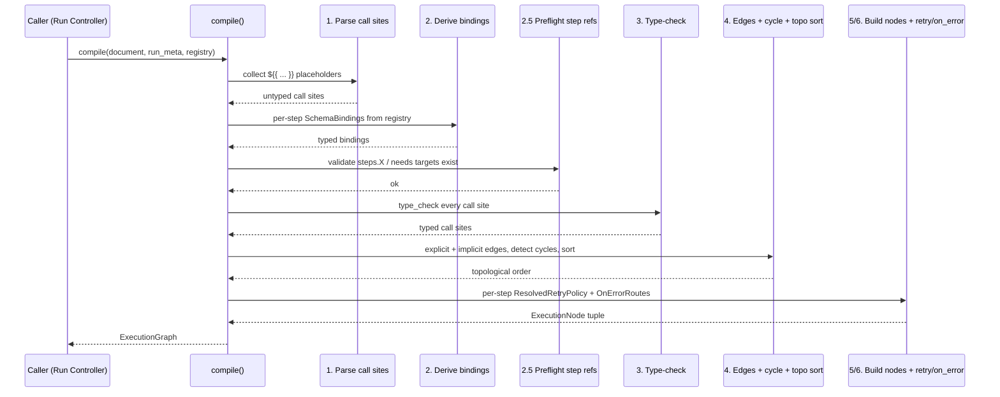

# Workflow Compilation

Last Updated: 2026-05-29

## Audience

Workflow Service contributors and Run Controller / Step Coordinator
implementers who consume an `ExecutionGraph`, plus downstream service
authors (Observability/Audit, Catalog) that key off the locked
compile-time `kind` strings. Workflow *authors* should start with
the [`CEL Expressions`](cel-expressions.md) doc — this page assumes
familiarity with the binding model documented there.

## Cross-references

- Design: [`design/components/workflow-service/design.md` § Internal
  Structure](../../design/components/workflow-service/design.md#internal-structure)
  — the canonical, locked contract for the Definition Compiler
  sub-module.
- Workflow YAML schema:
  [`design/architecture/overview.md` § Workflow and Template
  Schema](../../design/architecture/overview.md#workflow-and-template-schema).
- Retry policy: [`design/components/workflow-service/design.md` §
  Retry Policy](../../design/components/workflow-service/design.md#retry-policy).
- Error taxonomy module:
  [`src/services/workflow-service/src/custos_workflow/errors.py`](../../src/services/workflow-service/src/custos_workflow/errors.py)
  (WF-IMPL-024).
- Companion: [`CEL Expressions`](cel-expressions.md) for the
  expression-evaluator contract every CEL call site flows through.

## Overview

The Definition Compiler reads a parsed
[`WorkflowDocument`](#input-contract) and produces an
[`ExecutionGraph`](#output-contract) — a frozen, byte-stable
representation of the run plan that the Run Controller persists on
`Run.compiledGraph` and the Step Coordinator dispatches from. The
graph is the only thing the runtime needs to drive a Run; a Catalog
outage cannot pause an in-flight run because the compiled graph is
already on the `Run` row.

The compiler is a **pure function** of its inputs. The same
`(document, run_meta, registry)` triple always produces the same
graph, byte-for-byte (locked by the Hypothesis-driven determinism
property tests in WF-IMPL-026). That contract is what lets the graph
be cached, replayed under Dapr Workflow, and diff-compared in audit.

The Python entry point lives at
[`custos_workflow.compiler.compile`](../../src/services/workflow-service/src/custos_workflow/compiler.py):

```python
from custos_workflow.compiler import compile, RunMeta
from custos_workflow.document import parse_document
from custos_workflow.bindings import InMemoryActivityTypeRegistry

doc = parse_document(yaml_source)
graph = compile(doc, run_meta, registry)
```

`parse_document` runs Catalog-equivalent wire-shape validation; the
compiler does not re-validate the wire shape. Wire failures surface
as `pydantic.ValidationError`, *not* a `CompileError`.

## Pipeline

The compiler runs six stages in a fixed order. Each stage owns one
class of failure and emits one stable `compile.*` `kind` string when
it rejects the document.



Stages 1, 3, 4, and 5/6 are wrapped with OpenTelemetry spans and
record one duration histogram per stage plus a per-`kind` error
counter; see WF-IMPL-027
([`_telemetry.py`](../../src/services/workflow-service/src/custos_workflow/_telemetry.py)).

## Input contract

The compiler accepts a parsed `WorkflowDocument`:

| Field | Type | Notes |
|---|---|---|
| `apiVersion` | `"custos.dev/v1"` | Pinned by `WorkflowDocument` validator. |
| `kind` | `"Workflow"` \| `"WorkflowTemplate"` | Templates are workflows with placeholders. |
| `metadata.name` | `string` | Surfaced on the graph as `metadata.workflow_name`. |
| `metadata.workspace` | `string \| null` | Surfaced as `metadata.workflow_workspace`. |
| `spec.inputs` | `map<string, InputDecl>` | Each declaration carries a JSON-Schema `type`, optional `required`, optional `default`. |
| `spec.defaults.retry` | `RetryPolicy \| null` | Workflow-wide retry defaults. |
| `spec.steps` | `list<Step>` (ordered) | One of `ActivityStep` / `LetStep` / `WorkflowStep`. |

Every step shares `_StepCommon` modifiers: `needs:`, `if:`, `when:`,
`unless:`, `forEach:`, `where:`, `retry:`, `on_error:`. The CEL
slots are typed as `CelSource` (the bare `${{ ... }}` token) so
greps for expression sites are exhaustive.

`RunMeta` carries run-scoped metadata used at compile time:

| Field | Purpose |
|---|---|
| `workspace_id` | Tenant-scoped workspace owning the run. |
| `workflow_version_id` | The Catalog `WorkflowVersion` UUID. |
| `workflow_name` | Backs `workflow.name` in CEL. |
| `workflow_version_label` | Backs `workflow.version` in CEL. |
| `started_at_default` | Default `now()` for type-check. |

`ActivityTypeRegistry` is the read-only catalog the bindings stage
queries for activity output schemas. Tests use
`InMemoryActivityTypeRegistry`; production wires the Catalog client.

Reminder: the Catalog Service applies publish-time validation
(`expression.parse_error` is rejected before publish; workflow
schema validation is gated). The compiler defends against
documents that slipped past publish but does not duplicate the full
validator.

## Output contract

`compile()` returns an `ExecutionGraph`:

| Field | Type | Notes |
|---|---|---|
| `nodes` | `tuple[ExecutionNode, ...]` | Iteration order matches `topological_order`. |
| `edges` | `tuple[Edge, ...]` | Serialized in `(from_step, to_step, kind)` lex order. |
| `topological_order` | `tuple[str, ...]` | Defensive copy of step ids in a valid execution order. |
| `metadata` | `GraphMetadata` | `workflow_name`, `workflow_workspace`, `document_api_version`. |

Each `ExecutionNode` carries:

| Field | Type | Notes |
|---|---|---|
| `step_id` | `str` | Unique within the graph. |
| `kind` | `StepKind` | `activity` \| `let` \| `workflow` \| `wait` \| `approval`. |
| `primitive_handler` | `PrimitiveHandler` | Dispatch tag for the Step Coordinator. |
| `retry_policy` | `ResolvedRetryPolicy \| None` | Field-by-field overlay of per-match → step → `spec.defaults` → platform. |
| `on_error_routes` | `tuple[OnErrorRoute, ...]` | Empty when the implicit policy applies. |
| `call_sites` | `Mapping[str, TypedCallSite]` | Keyed by stable slot label (`"if"`, `"with.image"`, `"let.x"`). |
| `step_source` | `Step` | Original Pydantic step preserved for round-trip. |

Each `Edge` carries `(from_step, to_step, kind)` where `kind ∈
EdgeKind` (`explicit_needs` for `needs:` entries,
`implicit_data` for inferred data dependencies via
`steps.X.outputs`).

**Serialization guarantee.** `custos_workflow.graph.serialize.to_json(graph)`
produces a byte-stable JSON document. The
[`tests/test_determinism_property.py`](../../src/services/workflow-service/tests/test_determinism_property.py)
property tests lock this across 100 repeats per case and across
`spec.steps` shuffles. This is what gets persisted on
`Run.compiledGraph` so a Dapr Workflow replay sees the same plan
on every re-execution.

## Error taxonomy

Every compile-time failure raises a `CompileError` subclass with a
stable `kind` string. The five canonical kinds plus the
bindings-stage kind exhaust the catalogue:

| `kind` | When | Example trigger | Resulting status |
|---|---|---|---|
| `compile.parse_error` | A `${{ ... }}` placeholder failed to parse as CEL. | `with: { x: '${{ 1 +' }` (truncated expression) | `StartRun` rejected before a `runId` is issued. |
| `compile.bindings_error` | Schema bindings could not be derived — typically an activity ref the registry does not know. | `activity: security/unknown@99` with no matching registry entry. | `StartRun` rejected. |
| `compile.type_error` | A CEL call site is well-formed but operand/argument types do not match, or a name is unbound. | `with: { x: '${{ 1 + "two" }}' }` | `StartRun` rejected before a `runId` is issued. |
| `compile.topology_error` | Explicit `needs:` points at an unknown step, or the graph contains a cycle, or topology sort cannot order it deterministically. | `needs: [missing-step]`, or two steps that `needs:` each other. | `StartRun` rejected. |
| `compile.retry_policy_error` | The layered retry policy resolves to something invalid (malformed ISO-8601 duration, `maxDelay < initialDelay`, inline `maxAttempts:` shorthand disagreeing with structured `retry: { maxAttempts: ... }`). | `retry: { backoff: { initialDelay: NOT-AN-ISO-DURATION } }` | `StartRun` rejected. |

Every concrete class subclasses both `CompileError` *and* a
canonical built-in (`ValueError` for parse / topology / retry,
`TypeError` for type) so callers using generic
`except ValueError:` / `except TypeError:` blocks still catch
them. Every class subclasses `Exception` — never `BaseException`
— so process-control unwinds (`KeyboardInterrupt`, `SystemExit`,
`GeneratorExit`) propagate untouched and never appear in the
compiler's metrics or spans.

`CompileError.to_dict()` renders a JSON-safe, deterministic-key-order
mapping for audit emission:

```text
{"kind": "compile.type_error", "message": "...", "source_position": {...} | null, "step_id": "...", "call_site_path": "...", "cause": {"kind": "expression.type_error", "message": "..."}}
```

Audit consumers (Observability/Audit Service, Step Coordinator
emission, Catalog publish flow) dedupe failures by structural
identity — every `CompileError` is hashable and
equal-on-fields. Each `kind` is a class-level `Final` constant
on the concrete subclass.

## Retry-policy resolution

Retry policies layer field-by-field in this precedence order
(highest wins):

1. Per-match `retry:` on an `on_error[]` arm.
2. Inline `maxAttempts: N` shorthand on a `do: retry` arm (sugar
   for `retry: { maxAttempts: N }`).
3. Step-level `retry:`.
4. Workflow-wide `spec.defaults.retry:`.
5. Platform defaults
   ([`retry/defaults.py`](../../src/services/workflow-service/src/custos_workflow/retry/defaults.py)).

A field is overridden only if the higher-precedence layer sets it.
Unset fields fall through. The full normative specification lives in
[design.md § Retry Policy](../../design/components/workflow-service/design.md#retry-policy).

Worked example — same workflow exhibiting all three layers:

```yaml
apiVersion: custos.dev/v1
kind: Workflow
metadata:
  name: retry-layers
  workspace: security
spec:
  inputs:
    target:
      type: string
      required: true
  defaults:
    retry:
      maxAttempts: 3
      backoff:
        strategy: exponential
        initialDelay: PT1S
        maxDelay: PT5M
        multiplier: 2.0
      jitter: full
      respectRetryAfter: true
  steps:
    - id: scan
      activity: security/scan@1
      connector: primary
      with:
        image: ${{ inputs.target }}
      retry:
        maxAttempts: 5
      on_error:
        - match:
            codePrefix: registry.rate_limited
          do: retry
          retry:
            maxAttempts: 10
            backoff:
              strategy: exponential
              initialDelay: PT5S
              maxDelay: PT10M
        - match:
            class: retryable
          do: retry
          maxAttempts: 3
```

After compile, the `scan` node's `on_error_routes` carry one
`ResolvedRetryPolicy` per `do: retry` arm:

| Arm | `maxAttempts` | `backoff.initialDelay` | `backoff.maxDelay` | Source |
|---|---|---|---|---|
| `registry.rate_limited` | `10` | `PT5S` | `PT10M` | Per-match wins on every field it sets. |
| `class: retryable` | `3` | `PT1S` | `PT5M` | Inline shorthand overrides `maxAttempts`; `backoff` falls through to `spec.defaults.retry`. |

The step-level `retry: { maxAttempts: 5 }` is the floor for any
arm that does not set `maxAttempts` itself — neither arm above
falls back to it because both pin their own value. `jitter`,
`respectRetryAfter`, and `backoff.multiplier` are inherited from
`spec.defaults.retry` on both arms.

## Worked examples

The three workflows below are exactly the ones exercised by
[`tests/test_docs_examples.py`](../../src/services/workflow-service/tests/test_docs_examples.py),
which parses every fenced `yaml` block in this doc, compiles it, and
asserts the resulting graph shape. Copy-paste them into a workflow
YAML and they will compile.

### Example 1 — 3-step linear chain with explicit `needs:`

```yaml
apiVersion: custos.dev/v1
kind: Workflow
metadata:
  name: linear-chain
  workspace: security
spec:
  inputs:
    target:
      type: string
      required: true
  steps:
    - id: scan
      activity: security/scan@1
      connector: primary
      with:
        image: ${{ inputs.target }}
    - id: gate
      needs:
        - scan
      let:
        verdict: ${{ true }}
    - id: notify
      needs:
        - gate
      activity: ops/notify@1
      connector: primary
      with:
        channel: ${{ inputs.target }}
```

Topology: `scan → gate → notify`, each edge carries
`kind = explicit_needs`. The compiled graph's
`topological_order` is `("scan", "gate", "notify")`.

### Example 2 — implicit data dependency via `steps.X.outputs`

```yaml
apiVersion: custos.dev/v1
kind: Workflow
metadata:
  name: implicit-dep
  workspace: security
spec:
  inputs:
    target:
      type: string
      required: true
  steps:
    - id: scan
      activity: security/scan@1
      connector: primary
      with:
        image: ${{ inputs.target }}
    - id: summarize
      let:
        critical: ${{ steps.scan.outputs.critical }}
```

No `needs:` clause is required — the compiler infers
`scan → summarize` from the
`steps.scan.outputs.critical` reference and emits an
`Edge(kind = implicit_data)`. The compiled graph's
`topological_order` is `("scan", "summarize")`.

### Example 3 — `forEach:` fan-out over a list-typed input

```yaml
apiVersion: custos.dev/v1
kind: Workflow
metadata:
  name: fan-out
  workspace: security
spec:
  inputs:
    targets:
      type: array
      required: true
    image:
      type: string
      required: true
  steps:
    - id: scan-all
      forEach: ${{ inputs.targets }}
      activity: security/scan@1
      connector: primary
      with:
        image: ${{ inputs.image }}
```

The `forEach:` slot is collected as a CEL call site
(`CallSiteKind.for_each`) and type-checked against the
input schema's `targets: list<string>`. The Step Coordinator
fans out one sub-orchestration per element at execute time; the
compiled graph carries a single `ExecutionNode` whose
`primitive_handler` reflects the `forEach` modifier.

## See also

- Design: [`design/components/workflow-service/design.md`](../../design/components/workflow-service/design.md)
- Architecture: [`design/architecture/overview.md` § Workflow and
  Template Schema](../../design/architecture/overview.md#workflow-and-template-schema)
- Expression evaluator: [`CEL Expressions`](cel-expressions.md)
- Tracker: WF-IMPL-000-COMPILER
  ([#363](https://github.com/toddysm/custos/issues/363))
