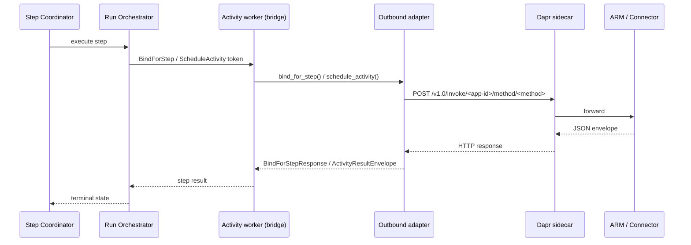

# Workflow Service Outbound RPC

Last Updated: 2026-06-04

The Workflow Service drives two downstream services over **Dapr
Service Invocation** while a run executes: the **Activity Runtime
Manager** (ARM) and the **Connector Service**. This document pins the
outbound-RPC contract those calls ship — the three RPCs, their
canonical JSON envelopes, the locked error taxonomy, the
`ActivityResultEnvelope` mapping, the Configuration knobs, and the
OpenTelemetry observability surface.

Every example and table below is mirrored by
[`tests/test_docs_examples_outbound_rpc.py`](../../src/services/workflow-service/tests/test_docs_examples_outbound_rpc.py),
which fails the build the moment the docs and the code drift.

## Overview

The Step Coordinator resolves each activity step through two outbound
calls: it first **binds** the step's connector slots (Connector
Service `BindForStep`), then **schedules** the activity with the
resolved connector contexts (ARM `ScheduleActivity`). Cancellation
flows through ARM `CancelActivity`. The adapters do not own the HTTP
client — the FastAPI lifespan builds one shared
`httpx.AsyncClient` and `aclose()`s it on shutdown.



## Endpoints

Every adapter posts `Content-Type: application/json` to the canonical
Dapr Service-Invocation URL
`http://<host>:<port>/v1.0/invoke/<app-id>/method/<method>`. The
sidecar host/port default to `127.0.0.1:3500` (overridable via
`DAPR_HTTP_HOST` / `DAPR_HTTP_PORT`); the app-id comes from the
`WF_ARM_ENDPOINT` / `WF_CONNECTOR_ENDPOINT` configuration knobs.

| Client | RPC | Method segment | Path |
|---|---|---|---|
| `arm` | Schedule an activity | `ScheduleActivity` | `/v1.0/invoke/<arm-app-id>/method/ScheduleActivity` |
| `arm` | Cancel an activity | `CancelActivity` | `/v1.0/invoke/<arm-app-id>/method/CancelActivity` |
| `connector` | Bind a step's slots | `BindForStep` | `/v1.0/invoke/<connector-app-id>/method/BindForStep` |

## ScheduleActivity (ARM)

Posted by `DaprActivityRuntimeClient.schedule_activity`. Every call
carries an `Idempotency-Key` header encoding the
`run_id|step_id|attempt` triple so ARM dedupes retries
byte-for-byte. Keys are camelCase on the wire; ISO-8601 UTC datetimes
use the `Z` suffix.

### Request envelope

```json
{
  "runId": "run-7f3a",
  "stepId": "scan",
  "attempt": 1,
  "activityRef": "security/scan@1",
  "inputs": {
    "image": "alpine:3.19"
  },
  "connectorContexts": {
    "default": {
      "slotName": "default",
      "handle": "ctx-default-handle",
      "expiresAt": "2030-01-02T03:04:05Z",
      "connectorKind": "oci-registry"
    }
  },
  "deadline": "2030-01-02T03:04:05Z"
}
```

### Success response envelope

The wire envelope mirrors `ActivityResultEnvelope` with `class_` sent
as `class`. A `success` envelope carries `outputs` and a `null`
`error`; the `attempt` echoes the request's counter.

```json
{
  "class": "success",
  "outputs": {
    "critical": 0,
    "findings": []
  },
  "error": null,
  "attempt": 1
}
```

### Error response envelope

A non-`success` envelope carries a `null` `outputs` and a populated
`error` (at minimum `code` + `message`). The `class` is one of
`retryable`, `permanent`, or `cancelled`.

```json
{
  "class": "retryable",
  "outputs": null,
  "error": {
    "code": "activity.scan.unavailable",
    "message": "scanner backend temporarily unavailable"
  },
  "attempt": 2
}
```

## CancelActivity (ARM)

Posted by `DaprActivityRuntimeClient.cancel_activity`. Cancellation is
idempotent end-to-end: ARM may return `200` / `204` (accepted), `404`
(no record), or `409` (already terminated) — the adapter treats the
latter two as no-ops. Any other `4xx` / `5xx` raises
`OutboundRpcStatusError`.

### Request envelope

```json
{
  "runId": "run-7f3a",
  "stepId": "scan"
}
```

## BindForStep (Connector Service)

Posted by `DaprConnectorClient.bind_for_step`. Slot declaration order
and per-slot capability order are preserved on the wire so the
Connector Service audit log reflects exactly what the Step Coordinator
declared. Unlike `ScheduleActivity`, this RPC **raises** on a non-2xx
response (`499` → `OutboundRpcCancelledError`, other non-2xx →
`OutboundRpcStatusError`) rather than returning an envelope.

### Request envelope

```json
{
  "stepKey": "run-7f3a/scan",
  "slots": [
    {
      "name": "default",
      "connectorRef": "primary",
      "capabilities": [
        "oci.pull",
        "oci.inspect"
      ]
    }
  ]
}
```

### Response envelope

The response is a single `contexts` mapping keyed by slot name; each
context carries `slotName` / `handle` / `expiresAt` (tz-aware
ISO-8601) / `connectorKind`. The context handles flow straight into
the subsequent `ScheduleActivity` call's `connectorContexts`.

```json
{
  "contexts": {
    "default": {
      "slotName": "default",
      "handle": "ctx-default-handle",
      "expiresAt": "2030-01-02T03:04:05Z",
      "connectorKind": "oci-registry"
    }
  }
}
```

## Locked outbound-RPC error taxonomy

Every structured outbound-RPC failure carries one of the wire-stable
`kind` values below — the complete set is pinned in
`custos_workflow.clients._errors.LOCKED_OUTBOUND_RPC_KINDS`. The
suggested status is the default the adapter logs when it has no
response in hand (`status` errors carry their own real status code on
the exception, shown as `—`).

| `kind` | Exception | Suggested status | Meaning |
|---|---|---|---|
| `workflow.client.transport` | `OutboundRpcTransportError` | 503 | No HTTP response observed (DNS / connect / TLS / read / write / timeout). |
| `workflow.client.status` | `OutboundRpcStatusError` | — | Non-2xx HTTP response from the sidecar; real status on the exception. |
| `workflow.client.decode` | `OutboundRpcDecodeError` | 502 | Response body not intelligible / failed envelope invariants. |
| `workflow.client.cancelled` | `OutboundRpcCancelledError` | 499 | Request cancelled upstream (HTTP 499 or explicit cancel). |

## Failure → `ActivityResultEnvelope.class_` decision table

`map_to_activity_envelope` renders each `OutboundRpcError` into a
shape-valid `ActivityResultEnvelope` so the retry-decision driver
always sees a consistent class. For `status` errors the HTTP status
code is bucketed: `408` / `429` / `5xx` → `retryable`; any other `4xx`
→ `permanent`.

| Failure | Resulting `class_` |
|---|---|
| `OutboundRpcTransportError` | `retryable` |
| `OutboundRpcStatusError` (408 / 429 / 5xx) | `retryable` |
| `OutboundRpcStatusError` (other 4xx) | `permanent` |
| `OutboundRpcDecodeError` | `permanent` |
| `OutboundRpcCancelledError` | `cancelled` |

## Configuration

| Env var | Default | Purpose |
|---|---|---|
| `WF_ARM_ENDPOINT` | _unset_ → Noop client | ARM Dapr app-id. When set, activates `DaprActivityRuntimeClient`. |
| `WF_CONNECTOR_ENDPOINT` | _unset_ → Noop client | Connector Service Dapr app-id. When set, activates `DaprConnectorClient`. |
| `WF_OUTBOUND_RPC_TIMEOUT_MS` | `10000` | Per-request timeout (ms) shared by both adapters; parsed once at lifespan startup. |
| `DAPR_HTTP_HOST` | `127.0.0.1` | Dapr sidecar host. |
| `DAPR_HTTP_PORT` | `3500` | Dapr sidecar HTTP port. |

Both adapters share a single lifespan-owned `httpx.AsyncClient` (one
socket pool, built only when at least one outbound consumer is
active). Sharing the client keeps the in-memory dev / test path
sidecar-free and guarantees no second pool is created once the
production paths activate.

## Observability

Each outbound call is wrapped by
`custos_workflow._telemetry.observe_outbound_rpc`, which records one
sample into each instrument below and emits one span per call.

### Instruments

| Instrument | Type | Labels |
|---|---|---|
| `custos_workflow_outbound_rpc_duration_ms` | histogram | `wf.client`, `wf.method`, `http.status_code` |
| `custos_workflow_outbound_rpc_total` | counter | `wf.client`, `wf.method`, `wf.outcome` |
| `custos_workflow_outbound_rpc_errors_total` | counter | `wf.error.kind` |

`wf.outcome` is one of the locked outcome labels
(`LOCKED_OUTBOUND_RPC_OUTCOMES`): `success`, `transport`, `retryable`,
`permanent`, `cancelled`. `wf.error.kind` is one of
`LOCKED_OUTBOUND_RPC_KINDS`. `http.status_code` is a string and is
`"0"` when no response was observed.

### Span `custos_workflow.outbound_rpc.call`

One span per call. Its attribute keys are pinned by
`LOCKED_OUTBOUND_RPC_SPAN_ATTRIBUTES`. `wf.run.id`, `wf.step.id`, and
`wf.attempt` are emitted only when supplied (Cancel has no
`wf.attempt`).

| Attribute | Meaning |
|---|---|
| `wf.client` | `arm` or `connector`. |
| `wf.method` | The Dapr method segment (`ScheduleActivity` / `CancelActivity` / `BindForStep`). |
| `wf.run.id` | Run id (when supplied). |
| `wf.step.id` | Step id (when supplied). |
| `wf.attempt` | Per-step attempt counter (when supplied). |
| `http.method` | Always `POST`. |
| `http.url` | The canonical Dapr Service-Invocation URL. |
| `http.status_code` | Observed HTTP status (`0` on transport failure). |
| `wf.outcome` | One of `LOCKED_OUTBOUND_RPC_OUTCOMES`. |
| `wf.error.kind` | One of `LOCKED_OUTBOUND_RPC_KINDS` (error path only). |
