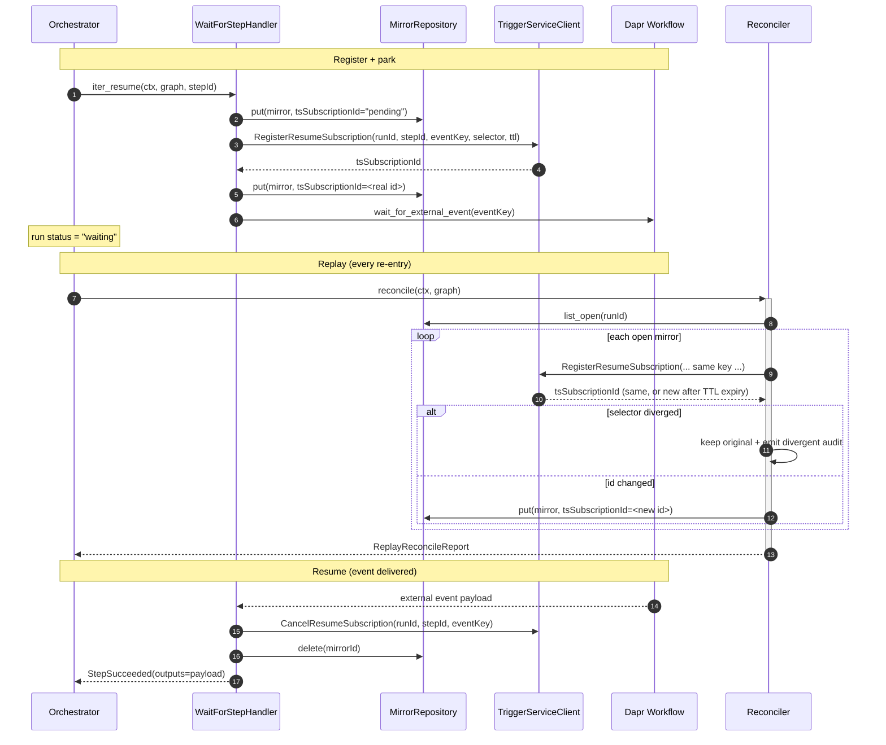

# Workflow Resume Subscriptions (`waitFor:`)

Last Updated: 2026-06-05

## Audience

Workflow Service contributors and Run Controller / Step Coordinator
implementers wiring the **Resume Subscription Manager** — the
sub-component that backs the `waitFor:` step kind (REQ-081), letting a
run park on an external event and resume when the Trigger Service
delivers it. Workflow *authors* only need the
[`waitFor:` schema](#the-waitfor-schema) and
[worked examples](#worked-examples) sections; the rest documents the
internal register / replay / cancel / sweep contract.

This page assumes familiarity with the
[CEL Expressions](cel-expressions.md) binding model (the `eventKey` and
`selector` are CEL tokens) and the
[Workflow Run Controller](workflow-run-controller.md) replay-determinism
contract.

## Cross-references

- Design: [`design/components/workflow-service/design.md` § Operation:
  Step Resume on External
  Event](../../design/components/workflow-service/design.md) — the
  canonical, locked contract, including the **Resume Subscription
  Replay Protocol**.
- Implementation plan:
  [`design/components/workflow-service/implementation-plan-resume-subscription-manager.md`](../../design/components/workflow-service/implementation-plan-resume-subscription-manager.md).
- Architecture:
  [`design/architecture/components.md`](../../design/architecture/components.md)
  — COMP-003 (Workflow Service) and COMP-004 (Trigger Service).
- Step error taxonomy:
  [Workflow Step Coordinator § error
  taxonomy](workflow-step-coordinator.md).

## Overview

A `waitFor:` step suspends its run until a named external event
arrives. The Resume Subscription Manager is the WF-side half of that
contract; the [Trigger Service](../../design/architecture/components.md)
(COMP-004) is the event broker. Because the Workflow Service runs on
Dapr Workflow — whose orchestrator code is **replayed** from an event
history on every resume — the manager is built around a durable
*mirror* row and an idempotent replay protocol so that re-entrant
execution never double-registers or loses a subscription.

The manager has four collaborators, each a separately testable unit:

| Collaborator | Role |
|---|---|
| `WaitForStepHandler` | Drives one `waitFor:` step: persist mirror → register with Trigger Service → park on the external event → on resume, cancel + delete the mirror. |
| `ResumeSubscriptionReplayReconciler` | On every orchestrator replay, re-registers each open mirror (idempotently) and reconciles divergence / TTL-expiry. |
| `ResumeSubscriptionCanceller` | On step or run terminal transition, cancels every open subscription and deletes the mirror rows. |
| `ResumeSubscriptionTtlSweeper` | Background task that garbage-collects mirror rows whose TTL has expired. |

All four share one `ResumeSubscriptionMirrorRepository` and one
`TriggerServiceClient` instance, wired together in
[`providers.py`](../../src/services/workflow-service/src/custos_workflow/providers.py).

> **Status.** The Trigger Service (COMP-004) is not yet implemented, so
> the production resume-event *delivery* path is deferred. The manager
> ships behind the `TriggerServiceClient` Protocol and is exercised
> end-to-end against in-memory fakes (see
> [`tests/integration/test_resume_subscription_end_to_end.py`](../../src/services/workflow-service/tests/integration/test_resume_subscription_end_to_end.py)).

## The `waitFor:` schema

A `waitFor:` step carries a single `waitFor:` block
(`WaitForSpec`):

```
- id: <step id>
  waitFor:
    eventKey: ${{ <CEL> }}    # required — CEL token resolving the resume event key
    selector: ${{ <CEL> }}    # optional — CEL token narrowing which events match
    ttl: <ISO-8601 duration>  # optional — constant string, e.g. PT24H; default WF_RESUME_SUB_DEFAULT_TTL
```

| Field | Wire key | Type | Required | Notes |
|---|---|---|---|---|
| `event_key` | `eventKey` | CEL token `${{ … }}` | **Yes** | Resolves the resume event key at run time (e.g. from `inputs` or earlier `steps.*.outputs`). Must be a `${{ … }}` token. |
| `selector` | `selector` | CEL token `${{ … }}` | No | Narrows which external events match. Must be a `${{ … }}` token when present; when omitted the subscription matches on `eventKey` alone. |
| `ttl` | `ttl` | ISO-8601 duration string | No | How long the subscription stays open. A **constant** string resolved at compile time — *not* a CEL expression. Must be a valid `P[nD][T[nH][nM][nS]]` / `PnW` duration with at least one non-zero component. When omitted, the manager applies `WF_RESUME_SUB_DEFAULT_TTL` (`PT24H`). |

Validation rules (enforced by `WaitForSpec`):

- `eventKey` rejected unless it matches the `${{ … }}` CEL token
  pattern.
- `selector`, when present, must match the same token pattern.
- `ttl`, when present, must be a constant ISO-8601 duration (a CEL
  token is rejected), and must specify a positive (non-zero) duration.

## Register / replay / cancel sequence



Cancellation on a *run* terminal transition (not a single step
resuming) is driven by `ResumeSubscriptionCanceller`:
`list_open(runId)` → `CancelResumeSubscription` per row → `delete` each
mirror. The `ResumeSubscriptionTtlSweeper` independently reaps any
orphaned row via `list_expired(now)` → `delete`.

## `ResumeSubscriptionMirror`

The durable mirror is a frozen, slotted value object
([`steps/resume/mirror.py`](../../src/services/workflow-service/src/custos_workflow/steps/resume/mirror.py)).
It is the WF-side record that makes replay re-registration possible —
WF persists it **before** calling the Trigger Service.

| Field | Wire key (`to_dict()`) | Type | Notes |
|---|---|---|---|
| `mirror_id` | `mirrorId` | `str` | Replay-stable primary key, derived as `rsm-<sha256(runId\|stepId\|eventKey)[:32]>` so a replay re-derives the same id and the repository upsert collapses to one row. |
| `run_id` | `runId` | `str` | Owning run. |
| `step_id` | `stepId` | `str` | Owning `waitFor:` step. |
| `event_key` | `eventKey` | `str` | Resolved resume event key. |
| `ts_subscription_id` | `tsSubscriptionId` | `str` | Id returned by the Trigger Service (the sentinel `"pending"` between the pre-register persist and the real id stamp). |
| `registered_at` | `registeredAt` | `datetime` (UTC) | Registration timestamp; serialized as an ISO-8601 string canonicalized to UTC. |
| `expires_at` | `expiresAt` | `datetime` (UTC) | TTL deadline; drives the sweeper. |
| `selector` | `selector` | `str \| None` | The resolved selector when present (else `null`). |

`to_json()` produces a byte-stable canonical encoding
(`sort_keys=True`, compact separators); `from_dict()` / `from_json()`
round-trip exactly.

Repository Protocol (`ResumeSubscriptionMirrorRepository`, all async):

| Method | Signature | Purpose |
|---|---|---|
| `put` | `put(mirror) -> ResumeSubscriptionMirror` | Upsert on `mirror_id`; re-put overwrites (used by replay to stamp a new `tsSubscriptionId`). |
| `list_open` | `list_open(run_id) -> tuple[…]` | Every open mirror for a run (drives replay + run cancel). |
| `list_open_for_step` | `list_open_for_step(run_id, step_id) -> tuple[…]` | Open mirrors for one `(run_id, step_id)` (drives step cancel). |
| `delete` | `delete(mirror_id) -> None` | Delete by id; no-op if absent. |
| `list_expired` | `list_expired(before) -> tuple[…]` | Every mirror with `expires_at <= before` (drives the TTL sweep). |

## Resume Subscription Replay Protocol

The protocol makes re-entrant orchestrator execution safe. The rules
below are the locked contract from `design.md`:

| # | Rule | Behaviour |
|---|---|---|
| 1 | **Idempotency key** | `(runId, stepId, eventKey)`. The Trigger Service treats `RegisterResumeSubscription` as idempotent on this tuple — a re-registration with the same key returns the *existing* `tsSubscriptionId` rather than minting a duplicate. |
| 2 | **Divergence policy** | If `selector` differs between the original registration and the replay, the **original wins**. Replay must be deterministic, so a divergent selector signals a bug; the manager keeps the original registration, raises `step.resume_subscription_divergent`, and emits the matching audit event so the divergence is observable. |
| 3 | **TTL expiry** | The Trigger Service garbage-collects on `expiresAt` independently of WF mirror state. A re-registration arriving after TTL expiry is a fresh registration (new `tsSubscriptionId`, fresh TTL); the manager updates the mirror to point at the new id. |
| 4 | **Mirror sequencing** | WF persists the `ResumeSubscriptionMirror` (with the `"pending"` sentinel) **before** calling the Trigger Service, so a crash between mirror-write and TS-call still leaves WF aware the registration is pending. On replay WF re-registers every open mirror and updates the row if the returned id differs. |
| 5 | **Cancellation** | On step or run terminal transition WF calls `CancelResumeSubscription(runId, stepId, eventKey)` per open mirror, then deletes the rows. The Trigger Service treats cancel as idempotent — cancelling an unknown / already-expired key is a no-op. |

## Error taxonomy

Resume-specific locked `kind` strings
([`steps/errors.py`](../../src/services/workflow-service/src/custos_workflow/steps/errors.py)):

| `kind` | Error class | Trigger | Retryable |
|---|---|---|---|
| `step.resume_registration_failed` | `ResumeRegistrationFailedError` | `RegisterResumeSubscription` stays unreachable after the bounded backoff loop (`WF_REGISTER_SUB_MAX_RETRIES`, default 5). | **Yes** — fails the step `class: retryable` so the workflow-level retry policy decides whether to give up (prevents a step that silently never resumes). |
| `step.resume_subscription_divergent` | `ResumeSubscriptionDivergentError` | Replay re-registration finds `selector` differs from the original mirror (Replay Protocol rule 2); original kept. | **No** — an observability signal, not a step failure. |
| `step.resume_mirror_persist_error` | `ResumeMirrorPersistError` | The mirror write that must precede registration cannot be issued; registration is skipped and the step fails loudly rather than risk a subscription with no recoverable mirror. | **No** (structural). |

All three serialize through the canonical Custos error envelope
(`StepFailed.envelope`). `step.resume_registration_failed` carries the
extra fields `event_key`, `max_retries`, and `cause` alongside the base
`kind` / `message` / `run_id` / `step_id` / `attempt`;
`step.resume_subscription_divergent` carries `event_key`,
`original_selector`, and `replay_selector`.

## Configuration knobs

Environment variables resolved at lifespan startup in
[`providers.py`](../../src/services/workflow-service/src/custos_workflow/providers.py):

| Env var | Default | Type | Notes |
|---|---|---|---|
| `WF_TS_ENDPOINT` | _unset_ | `str` | Dapr Service-Invocation endpoint for the Trigger Service. Required to wire the production replay reconciler; absent it the manager runs with the in-memory fake (tests) and replay re-registration is a no-op. |
| `WF_RESUME_SUB_DEFAULT_TTL` | `PT24H` | ISO-8601 duration | Applied when a `waitFor:` step omits `ttl:`. Validated as a positive ISO-8601 duration (fractional seconds rejected). |
| `WF_REGISTER_SUB_MAX_RETRIES` | `5` | `int` | Upper bound on the exponential-backoff retry loop for `RegisterResumeSubscription`; on exhaustion the step fails with `step.resume_registration_failed` (`class: retryable`). |
| `WF_RESUME_SUB_SWEEP_INTERVAL` | `300.0` | `float` (seconds) | Wall-clock interval between TTL garbage-collection sweeps run by the background `ResumeSubscriptionTtlSweeper`. Must be a positive, finite float. |

## Observability

The manager emits four OpenTelemetry counters and three spans
([`_telemetry.py`](../../src/services/workflow-service/src/custos_workflow/_telemetry.py),
WF-IMPL-110). Like the rest of the module the instrumentation imports
`opentelemetry-api` only, so a deployment without an OTel SDK gets
silent no-ops.

| Counter | Labels | Bumped when |
|---|---|---|
| `custos_workflow_resume_subscriptions_registered_total` | `outcome` = `success` \| `error` | Each `RegisterResumeSubscription` call (first registration + every replay re-registration). |
| `custos_workflow_resume_subscriptions_cancelled_total` | `outcome` = `success` \| `error` | Each `CancelResumeSubscription` call (post-resume cleanup + run cancellation sweeps). |
| `custos_workflow_resumes_total` | — | Each time a parked `waitFor:` step is resumed by a delivered event. |
| `custos_workflow_resume_subscription_divergent_total` | — | Each replay-detected selector divergence (Replay Protocol rule 2). |

| Span | Wraps |
|---|---|
| `custos_workflow.resume.register` | One `RegisterResumeSubscription` call (carries an `outcome` attribute). |
| `custos_workflow.resume.cancel` | One `CancelResumeSubscription` call (carries an `outcome` attribute). |
| `custos_workflow.resume.replay` | One per-run replay reconciliation pass. |

> The locked step-lifecycle event taxonomy
> (`StepLifecyclePublisher`) is unchanged — full Dapr Pub/Sub
> `step.resumed` lifecycle wiring is deferred until the Trigger
> Service exists.

## Worked examples

The workflows below are exactly the ones exercised by
[`tests/test_docs_resume_examples.py`](../../src/services/workflow-service/tests/test_docs_resume_examples.py),
which parses every fenced `yaml` block on this page, compiles it, and
asserts the resulting graph shape. Copy-paste them into a workflow YAML
and they will compile.

### Example 1 — minimal `waitFor:` (event key only)

```yaml
apiVersion: custos.dev/v1
kind: Workflow
metadata:
  name: resume-minimal
  workspace: example
spec:
  inputs:
    orderId:
      type: string
      required: true
  steps:
    - id: await-approval
      waitFor:
        eventKey: ${{ inputs.orderId }}
```

The single `await-approval` node compiles to a
`PrimitiveHandler.RESUME_SUBSCRIPTION` step. With no `ttl:` the manager
applies the configured default (`WF_RESUME_SUB_DEFAULT_TTL`, `PT24H`),
and with no `selector:` the subscription matches on `eventKey` alone.

### Example 2 — `selector` + explicit `ttl`

```yaml
apiVersion: custos.dev/v1
kind: Workflow
metadata:
  name: resume-full
  workspace: example
spec:
  inputs:
    orderId:
      type: string
      required: true
    region:
      type: string
      required: true
  steps:
    - id: await-payment
      waitFor:
        eventKey: ${{ inputs.orderId }}
        selector: ${{ inputs.region }}
        ttl: PT48H
```

The `selector` narrows which delivered events resume the run; both
`eventKey` and `selector` are CEL tokens type-checked against the
declared `spec.inputs` schema. The `ttl: PT48H` overrides the default
expiry.

### Example 3 — `waitFor:` after an upstream `let:` step

```yaml
apiVersion: custos.dev/v1
kind: Workflow
metadata:
  name: resume-after-let
  workspace: example
spec:
  inputs:
    orderId:
      type: string
      required: true
  steps:
    - id: prepare
      let:
        ready: ${{ true }}
    - id: await-shipment
      needs:
        - prepare
      waitFor:
        eventKey: ${{ inputs.orderId }}
        ttl: P7D
```

Topology: `prepare → await-shipment`, the edge carrying
`kind = explicit_needs`. The compiled graph's `topological_order` is
`("prepare", "await-shipment")`, and `await-shipment` resolves to a
`RESUME_SUBSCRIPTION` primitive with a 7-day (`P7D`) subscription TTL.
