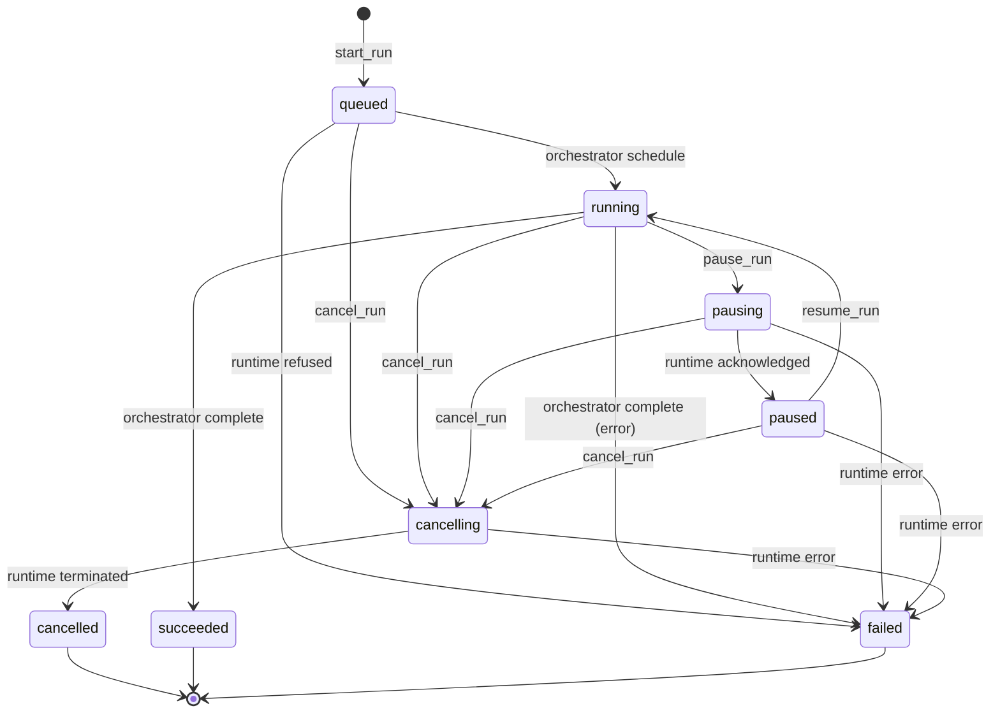

# Workflow Run Controller

Last Updated: 2026-05-30

## Audience

Workflow Service contributors and Step Coordinator authors who
consume the Run Controller via its `RunController` Python surface
(today: in-process; the Phase-B HTTP adapter wraps the same
methods), plus downstream service authors (Observability/Audit,
Trigger Service) that key off the locked `workflow.*` lifecycle
event kinds and the locked `run.*` error taxonomy. Workflow
*authors* should start with the
[`Workflow Compilation`](workflow-compilation.md) and
[`CEL Expressions`](cel-expressions.md) docs — this page assumes
familiarity with the compiled `ExecutionGraph` shape documented
there.

## Cross-references

- Design:
  [`design/components/workflow-service/design.md` § Internal
  Structure](../../design/components/workflow-service/design.md#internal-structure)
  — the canonical, locked contract for the Run Controller
  sub-module.
- Component overview:
  [`design/architecture/components.md`](../../design/architecture/components.md)
  — where the Run Controller sits relative to the Step Coordinator,
  Trigger Service, and Activity Runtime Manager.
- Companion docs:
  [`Workflow Compilation`](workflow-compilation.md) for the upstream
  `ExecutionGraph` contract;
  [`CEL Expressions`](cel-expressions.md) for the binding model the
  orchestrator drives.
- Public Python surface:
  [`custos_workflow.runs`](../../src/services/workflow-service/src/custos_workflow/runs/__init__.py).

## Overview

The Run Controller owns the **lifecycle of a Run**: starting it,
pausing / resuming it, cancelling it, and reading it. It is the
only sub-module that talks to Dapr Workflow on the orchestration
path; every other sub-module (Step Coordinator, Trigger Service
client, Audit/Observability publisher) is invoked from inside the
orchestrator function on Dapr's replay-safe execution thread.

The controller is **deterministic and idempotent on the public
edge**:

- `start_run` derives a stable
  [`RunId`](../../src/services/workflow-service/src/custos_workflow/runs/ids.py)
  from `(workspace_id, idempotency_key)` so the same client call
  always lands on the same row.
- `cancel_run` / `pause_run` / `resume_run` short-circuit when the
  persisted status is already in (or past) the target state, so
  retries cost a single store read and zero Dapr round-trips.
- The orchestrator function itself is a pure dispatch loop over
  the compiled `ExecutionGraph`'s topological order; given the
  same graph + the same `RunInput`, Dapr's replay engine and the
  controller's lifecycle event publisher produce **byte-equal**
  output (locked by the 100-replay determinism test in WF-IMPL-045).

The Python entry point lives at
[`custos_workflow.runs.RunController`](../../src/services/workflow-service/src/custos_workflow/runs/controller.py):

```python
from custos_workflow.runs import RunController

controller = RunController(
    store=store,
    catalog=catalog,
    workflow_client=workflow_client,
    publisher=publisher,
    orchestrator_factory=orchestrator_factory,
)

ref = await controller.start_run(
    workspace_id="ws-prod",
    workflow_version_id="01HZ...",
    inputs={"image_ref": "ghcr.io/example/app:1.0"},
    idempotency_key="client-deadbeef",
)
```

The controller does not own the API surface (the HTTP / RPC
adapter — WF-IMPL-047 — wraps these methods); the audit /
metrics surfaces flow through the
[`LifecycleEventPublisher`](#lifecycle-events) injection.

## Lifecycle state machine

`Run.status` is a closed enum over 8 members defined in
[`custos_workflow.runs.model.RunStatus`](../../src/services/workflow-service/src/custos_workflow/runs/model.py).
Allowed transitions are pinned in
[`STATUS_TRANSITIONS`](../../src/services/workflow-service/src/custos_workflow/runs/model.py)
and enforced by
[`InProcessRunStore.update_run_status`](../../src/services/workflow-service/src/custos_workflow/runs/store.py);
any `(from, to)` outside the table surfaces
[`RunStateConflictError`](#error-taxonomy) without touching Dapr.



The three terminal statuses — `cancelled`, `succeeded`, `failed`
— have no out-edges; once a run reaches one of them, the
controller refuses every further mutation with
`RunStateConflictError` and the runtime is never re-consulted on
the `get_run` path (terminal reads are served directly from the
persisted row, locking the cost of reading a finished run at one
store hit).

The `pausing` and `cancelling` statuses are
**persisted-only transitional**: there is no equivalent Dapr
runtime status while the controller is mid-transition, so
`get_run` deliberately skips the runtime overlay for these and
returns the persisted intent verbatim. (Overlaying would silently
regress `pausing` back to `running` because Dapr only flips to
`suspended` after `pause_workflow` lands.)

## Public API

All six methods are `async`, kw-only, and live on
[`custos_workflow.runs.RunController`](../../src/services/workflow-service/src/custos_workflow/runs/controller.py).
Every method emits at most one lifecycle event and, on its
successful active path, exactly one row mutation. Every method
rolls up the error taxonomy below.

| Method | Inputs | Returns | Mutates | Publishes | Notes |
|---|---|---|---|---|---|
| `start_run` | `workspace_id`, `workflow_version_id`, `inputs?`, `idempotency_key?` | `RunRef` | inserts row at `running`; on runtime refusal, transitions to `failed` | `workflow.started` (active path only) | Idempotent on `(workspace, idem)` → derived `run_id`. |
| `cancel_run` | `workspace_id`, `run_id`, `reason?` | `RunRef` | `{queued, running, pausing, paused} → cancelling → cancelled` | `workflow.cancelled` (active path only; `reason` on `.extra`) | Idempotent on `cancelled`; no re-publish on `cancelling`. |
| `pause_run` | `workspace_id`, `run_id` | `RunRef` | `running → pausing → paused` | `workflow.paused` (active path only) | Idempotent on `pausing` / `paused`. |
| `resume_run` | `workspace_id`, `run_id` | `RunRef` | `paused → running` | `workflow.resumed` (active path only) | Idempotent on `running`; refuses non-`paused` sources before touching Dapr. |
| `get_run` | `workspace_id`, `run_id` | `RunRecord` | none | none | Overlays the runtime status snapshot on in-flight rows; terminal & persisted-only transitional rows skip the runtime call. |
| `list_runs` | `workspace_id`, `cursor?`, `limit?` | `Page[RunRef]` | none | none | Persisted-only; never consults the runtime. |

`RunRef`, `RunRecord`, and `Page` are dataclasses re-exported from
[`custos_workflow.runs`](../../src/services/workflow-service/src/custos_workflow/runs/__init__.py).

### Idempotency model

`derive_run_id(workspace_id, idempotency_key)` returns a
UUID-v5-keyed `RunId` under
[`RUN_ID_NAMESPACE`](../../src/services/workflow-service/src/custos_workflow/runs/ids.py).
The same `(workspace, idem)` pair always derives the same id, so
`start_run` can short-circuit at gate 2 (`store.get_run`) when
the caller retries: the existing row is re-validated against the
caller's `(workflow_version_id, fingerprint(inputs))` pair, and a
matching retry returns the original `RunRef` without re-scheduling
the workflow. A divergent retry — same id, different inputs —
surfaces [`RunStateConflictError`](#error-taxonomy) on the original
`run_id` for unambiguous client diagnostics.

When the caller omits `idempotency_key`, the controller generates
a random id — every call lands on a fresh row.

## StepHandler Protocol

The Run Controller invokes the Step Coordinator (today: a built-in
`NoopStepHandler` for `let:` only; tomorrow:
`activity:` / `workflow:` dispatch) through a single Python
Protocol:

```python
from custos_workflow.runs import (
    StepExecutionContext,
    StepFailed,
    StepHandler,
    StepResult,
    StepSkipped,
    StepSucceeded,
    StepWaiting,
)


class MyStepHandler:
    def execute(
        self,
        ctx: StepExecutionContext,
        graph: ExecutionGraph,
        step_id: str,
    ) -> StepResult: ...
```

`StepResult` is the closed four-arm union
`StepSucceeded | StepFailed | StepSkipped | StepWaiting`; the
orchestrator's match arms cover every member and the
`_STEP_RESULT_VARIANTS` module-level guard fails the build on a
fifth variant. The method is **intentionally synchronous**: it
runs inside the Dapr Workflow orchestrator function, which is a
Dapr generator. Any I/O the Step Coordinator needs (calling an
activity, raising a sub-workflow, opening a timer) happens by
yielding the appropriate token through
`ctx.workflow_context` — not by awaiting inside `execute`.

The orchestrator treats the four variants as:

| Return | Effect on the run |
|---|---|
| `StepSucceeded(outputs=...)` | Outputs written to the run's `outputs` bag; orchestrator advances to the next step in topological order. |
| `StepFailed(envelope=...)` | Run terminates with `RunOutput.status = "failed"`, carrying `failed_step` and `failure_envelope`. |
| `StepSkipped(reason=...)` | Step's `if:` / `when:` / `unless:` gate excluded it; orchestrator advances. |
| `StepWaiting(reason=...)` | Orchestrator yields on the external signal; the Run Controller treats the runtime instance as `suspended` until the signal lands. |

## Dapr Workflow primitive mapping

The Run Controller wraps Dapr Workflow primitives 1:1; it does
not invent a parallel runtime. The mapping is:

| Custos concept | Dapr Workflow primitive | Why |
|---|---|---|
| `Run` (one row in the metadata store) | One workflow **instance** (instance id == `Run.run_id`) | Deterministic id derivation gives idempotent `start_run` for free. |
| `RunController.start_run` | `WorkflowRuntimeClient.schedule_new_workflow` | The single entrypoint that registers the orchestrator (first call) and schedules an instance. |
| `RunController.cancel_run` | `terminate_workflow` + poll until terminal | Poll budget (`terminate_poll_attempts`, `terminate_poll_interval_seconds`) is constructor-injected for deterministic tests. |
| `RunController.pause_run` / `resume_run` | `pause_workflow` / `resume_workflow` | The persisted-only `pausing` / `cancelling` transitionals exist *because* Dapr has no equivalent. |
| `RunController.get_run` (in-flight overlay) | `get_workflow_state(fetch_payloads=False)` | Status-only read — skips large input/output payloads to keep `get_run` cheap. |
| `wait:` step (workflow YAML) | `create_durable_timer` (orchestrator generator yield) | Replay-safe sleep; the durable timer is materialised as a `StepWaiting` return inside the run's dispatch loop. |
| Lifecycle event publication | `LifecycleEventPublisher` (Pub/Sub at production wiring; in-memory in tests) | Publication is **synchronous on the controller's request thread** so a publisher outage propagates to the caller (audit-loss-on-failure is unacceptable by design). |

The orchestrator function is registered exactly once per
process under the locked name
[`WORKFLOW_NAME = "custos.workflow.run"`](../../src/services/workflow-service/src/custos_workflow/runs/orchestrator.py).
This is the only workflow name the Run Controller schedules;
the `name=graph.metadata.workflow_name` value flows through the
orchestrator's child-activity dispatch when the Step Coordinator
ships.

## Replay determinism contract

Dapr Workflow replays the orchestrator function on every step
boundary; the run's history is rebuilt from the durable event
log, not from the previous in-memory state. This makes the
following invariants the controller / orchestrator code **must**
hold:

1. **Same compiled graph + same `RunInput` → byte-equal dispatch
   order.** No iteration of dicts whose key order is not pinned;
   no clock reads outside `ctx.clock` (`DaprWorkflowClock` in
   production, `FixedClock` in tests); no `random` calls; no
   reliance on hash-randomised set ordering.
2. **Same compiled graph + same `RunInput` → byte-equal runtime
   history.** Every `ctx.create_durable_timer` /
   `ctx.wait_for_external_event` / yield call must derive its
   arguments from the graph or the `RunInput`, never from a
   non-replayable source.
3. **Same compiled graph + same `RunInput` → byte-equal lifecycle
   event sequence.** The `LifecycleEvent` payload (kind +
   workspace + workflow_version + run_id + `extra`) is keyed off
   the inputs the controller already validated; the publisher
   must serialise events to bytes deterministically (the
   `to_dict()` round-trip below is the byte-equal contract).

These three invariants are exercised end-to-end by
[`tests/integration/test_replay_safety.py`](../../src/services/workflow-service/tests/integration/test_replay_safety.py)
(100 fresh schedules of the same `RunInput`; assert byte-equal
dispatch, history, lifecycle, and terminal `RunOutput`).

When the workflow code drifts from the persisted history during
replay (typically caused by a code change that re-orders a yield
or moves a binding evaluation), Dapr raises an
`expression.divergence`-style error and the affected run is
quarantined for operator triage. The contract above is the
"don't write code that does that" rulebook.

## Lifecycle events

The controller emits exactly four lifecycle event kinds, pinned
as module-level `Final[str]` constants:

| Constant | Kind | When emitted |
|---|---|---|
| `LIFECYCLE_KIND_WORKFLOW_STARTED` | `workflow.started` | Active path of `start_run` (skipped on the dedup short-circuit). |
| `LIFECYCLE_KIND_WORKFLOW_CANCELLED` | `workflow.cancelled` | Active path of `cancel_run` (skipped when the row is already `cancelled` or another caller owns the in-flight `cancelling` transition). |
| `LIFECYCLE_KIND_WORKFLOW_PAUSED` | `workflow.paused` | Active path of `pause_run` (skipped on `pausing` / `paused` idempotent replays). |
| `LIFECYCLE_KIND_WORKFLOW_RESUMED` | `workflow.resumed` | Active path of `resume_run` (skipped on `running` idempotent replays). |

Terminal lifecycle events (`workflow.succeeded` /
`workflow.failed`) are emitted by the **Run Reconciler**
(WF-IMPL-042), not the controller. The controller's only signal
that a run reached a terminal status is the orchestrator's return
value; the reconciler watches the runtime and emits the terminal
event from the same Pub/Sub topic. Tests asserting "only
`[STARTED]` events" in the failure / wait cases above are pinning
that boundary.

Publisher failures are **not** absorbed: a publish exception
propagates out of the controller method that raised it (after
the row mutation has already landed). Callers must treat publish
failure as "row mutated, audit pending" and rely on operator
reconciliation. This is the deliberate trade-off the design
makes for audit completeness; see
[`design/components/workflow-service/design.md` § Internal
Structure](../../design/components/workflow-service/design.md#internal-structure).

## Error taxonomy

The Run Controller surfaces exactly four exception kinds, pinned
in
[`custos_workflow.runs.LOCKED_RUN_KINDS`](../../src/services/workflow-service/src/custos_workflow/runs/errors.py)
and reflected in
[`custos_workflow.runs._telemetry`](../../src/services/workflow-service/src/custos_workflow/_telemetry.py)
as the locked `outcome` label set on the OTel error counter. The
build-time invariant
`set(RunControllerError.__subclasses__().KIND) == LOCKED_RUN_KINDS`
fails CI if a fifth subclass slips in without extending the
counter's allowed label set.

| `kind` | Python class | Trigger | Caller recovery |
|---|---|---|---|
| `run.not_found` | `RunNotFoundError` | `get_run` / `cancel_run` / `pause_run` / `resume_run` against a `(workspace, run_id)` that has no row. | The id is wrong, the workspace is wrong, or the row was archived. No retry; the API adapter maps this to HTTP `404`. |
| `run.state_conflict` | `RunStateConflictError` | (a) `start_run` retry with divergent `(workflow_version_id, inputs)`; (b) `cancel_run` / `pause_run` / `resume_run` from a status not in `STATUS_TRANSITIONS`. | Inspect the persisted status (`get_run`) and decide. No automatic retry: the caller's intent and the persisted state disagree. |
| `run.state_corrupt` | `RunStateCorruptError` | The store returned a row whose status is not a member of `RunStatus`. | Operator-only path; the store / migration is broken. The API adapter maps this to HTTP `500`. |
| `run.runtime_unavailable` | `WorkflowRuntimeUnavailableError` | Dapr's `schedule_new_workflow` / `terminate_workflow` / `pause_workflow` / `resume_workflow` / `get_workflow_state` raised, or the cancel-poll budget exhausted before the runtime reached a terminal status. | Safe to retry after the runtime recovers; persisted rows are left in a deliberately recoverable state (`start_run` failures transition to `failed`; `cancel_run` failures stay `cancelling` for operator reconciliation). |

The trailing `cause` attribute on `WorkflowRuntimeUnavailableError`
carries the original runtime exception's `str()` so the API
adapter can include it in the error envelope without leaking a
Python traceback to the wire.

## Worked examples

The three examples below are exercised end-to-end by
[`tests/test_docs_examples.py`](../../src/services/workflow-service/tests/test_docs_examples.py),
which parses each fenced ` ```yaml ` block in this file, runs it
through `custos_workflow.compiler.compile`, and drives the
resulting graph through the
[`tests/integration/_harness.py`](../../src/services/workflow-service/tests/integration/_harness.py)
in-memory harness. The asserted terminal status for each example
is in the prose under the snippet.

### Example 1 — start → succeed

A linear pipeline of three `let:` bindings. The default
`NoopStepHandler` evaluates each binding inline; the orchestrator
walks the topological order `a → b → c` and the run terminates at
`succeeded` after exactly one schedule.

```yaml
apiVersion: custos.dev/v1
kind: Workflow
metadata: {name: doc-example-succeed, workspace: ws}
spec:
  inputs:
    flag: {type: boolean, default: true}
  steps:
    - id: a
      let: {x: '${{ true }}'}
    - id: b
      needs: [a]
      let: {y: '${{ true }}'}
    - id: c
      needs: [b]
      let: {z: '${{ true }}'}
```

Expected terminal status: `succeeded`. Lifecycle events:
`[workflow.started]` (terminal `workflow.succeeded` is the
reconciler's, WF-IMPL-042).

### Example 2 — start → cancel

The same linear pipeline; the caller issues `cancel_run` after
`start_run` returns. Because the fake runtime's orchestrator
completes synchronously, the cancel-poll budget short-circuits on
the first poll (instance already terminal) and the row transitions
`queued → cancelling → cancelled`.

```yaml
apiVersion: custos.dev/v1
kind: Workflow
metadata: {name: doc-example-cancel, workspace: ws}
spec:
  inputs: {}
  steps:
    - id: only
      let: {x: '${{ true }}'}
```

Expected terminal status: `cancelled`. Lifecycle events:
`[workflow.started, workflow.cancelled]` with the
`workflow.cancelled` event's `extra` carrying
`{"reason": "operator stop"}`.

### Example 3 — start → wait → succeed

A workflow with one `wait:` step (PT5S). The fake runtime
auto-fires the durable timer on its replay-deterministic clock,
so the orchestrator's `wait` yield resolves immediately and the
follow-on `after` step runs through to completion.

```yaml
apiVersion: custos.dev/v1
kind: Workflow
metadata: {name: doc-example-wait, workspace: ws}
spec:
  inputs: {}
  steps:
    - id: hold
      wait: PT5S
    - id: after
      needs: [hold]
      let: {x: '${{ true }}'}
```

Expected terminal status: `succeeded`. Runtime history:
`["started", "timer_fired", "completed"]`. Lifecycle events:
`[workflow.started]` (terminal event from reconciler).

## See also

- [`design/components/workflow-service/design.md`](../../design/components/workflow-service/design.md)
  — full design document.
- [`design/components/workflow-service/implementation-plan.md`](../../design/components/workflow-service/implementation-plan.md)
  — task ledger.
- [`src/services/workflow-service/README.md`](../../src/services/workflow-service/README.md)
  — service-level overview.
- [`tests/integration/_harness.py`](../../src/services/workflow-service/tests/integration/_harness.py)
  — the in-memory harness backing every worked example below.
