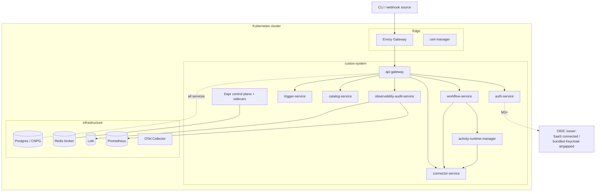

# Evaluation Overview

Last Updated: 2026-06-08

This page explains what the **evaluation (`eval`) profile** deploys, how the
**connected** and **air-gapped** topologies differ, and the limitations of the
current **M1 — Core engine** release. Read it before you pick an install path.

## What "evaluation" means

The evaluation profile stands up the full Custos control plane and its
infrastructure dependencies on a single Kubernetes cluster so you can try the
core engine end to end. It is sized for **trying it out**, not for production:

- Every component and dependency runs **single-replica**.
- Stateful dependencies are **PersistentVolume-backed** (no off-cluster
  backups, no distributed storage).
- There are **no** HorizontalPodAutoscalers, PodDisruptionBudgets, or
  cross-zone anti-affinity rules.
- Platform secrets are **Kubernetes Secrets** managed by the chart.
- Modest resource footprint (roughly **6 vCPU / 12 GiB** in total, excluding
  the cluster itself).

If you want a production-grade topology, see the `HA` profile in the
[reference deployment](../../../design/architecture/reference-deployment.md);
this guide covers `eval` only.

## What gets deployed

A single `helm install` deploys the Custos control plane plus its direct
infrastructure dependencies.

### Custos control-plane services

| Service | Role |
|---|---|
| `api-gateway` | North-south entry point; authenticates requests and routes to internal services |
| `auth-service` | Tokens, identities, permissions, and the default tenant/workspace |
| `workflow-service` | Compiles and runs workflows on Dapr Workflow |
| `trigger-service` | Schedules and webhook-driven workflow starts |
| `connector-service` | Manages connectors and connections to external systems |
| `activity-runtime-manager` | Runs workflow activities and connector sidecars |
| `catalog-service` | Stores workflow/connector definitions and the catalog |
| `observability-audit-service` | Audit log, log/metric queries over the in-cluster sinks |

Two install-time jobs run as Helm hooks: **`custos-migrate`** (pre-install,
applies database schemas) and **`custos-bootstrap`** (post-install, seeds the
default tenant, workspace, roles, and admin binding).

> The Web UI (`web-ui`) is contract-defined but **not** deployed in M1. You
> interact with the platform through its HTTP APIs.

### Bundled infrastructure

The chart also installs the dependencies the platform needs:

| Dependency | Purpose |
|---|---|
| CloudNativePG (CNPG) + a single Postgres instance | Relational storage for all services |
| Redis | Dapr pub/sub broker for event fan-out |
| Dapr control plane + sidecars | Service invocation, pub/sub, workflow runtime, secret store |
| Envoy Gateway (Gateway API) | North-south ingress |
| cert-manager | TLS material for the gateway |
| Loki | Log storage (single-binary, filesystem) |
| Prometheus | Metrics (single instance, PV-backed) |
| OpenTelemetry Collector | Telemetry ingestion pipeline |

Object storage (MinIO) and the External Secrets Operator are part of the `HA`
profile, **not** `eval`. In `eval`, artifacts and audit data are PV-backed.

### Topology diagram

## Connected vs. air-gapped

Both topologies deploy the same services and dependencies. They differ only in
where images and identity come from. Pick the one that matches your cluster.

| Dimension | `connected-eval` | `airgapped-eval` |
|---|---|---|
| Container images | Pulled from the public registry (`ghcr.io/toddysm/custos/*`) | Mirrored into your **private registry** from an offline bundle |
| Dependency charts | Pulled from upstream Helm repos | **Vendored** inside the chart / offline bundle |
| OIDC issuer (M3+) | GitHub / Azure Entra ID (SaaS) | **Bundled Keycloak** (self-hosted) |
| Outbound internet | Required (to the public registry) | **None** required |
| Install artifact | `helm install` against the chart | A `tar.gz` offline bundle (`make bundle`) |

If your cluster can reach the public container registry, use
[Install — connected](install-connected.md). If it is isolated behind an air
gap, use [Install — air-gapped](install-airgapped.md).

## M1 limitations and known issues

The evaluation build targets the **core engine** milestone. Be aware of these
constraints before evaluating:

- **Pre-provisioned tokens only.** Authentication uses API tokens seeded at
  install time. The interactive OIDC device-code flow is **disabled** in M1;
  an OIDC issuer is not required until M3.
- **No Web UI.** All interaction is through the HTTP APIs. See the
  [Developer Guide](../../developers/README.md) for the API references.
- **No high availability.** Single-replica, PV-backed dependencies; not
  intended to survive node loss or to be upgraded without downtime.
- **No off-cluster backups.** Tearing down the deployment or losing the
  PersistentVolumes loses the data.

See [Troubleshooting](troubleshooting.md) for failure modes and debugging.

## Next step

Continue to [Prerequisites](prerequisites.md) to prepare your cluster and
tooling.

## Related documentation

| Document | Description |
|---|---|
| [Reference deployment](../../../design/architecture/reference-deployment.md) | Full topology and profile matrix, component/image inventory, supply chain |
| [Architecture overview](../../../design/architecture/overview.md) | System architecture, domain model, and contracts |
| [User Guide index](../README.md) | All evaluation deployment guides |
